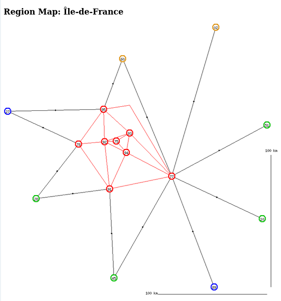
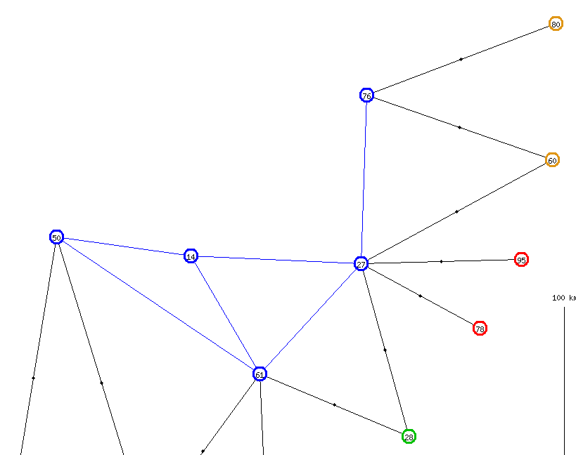
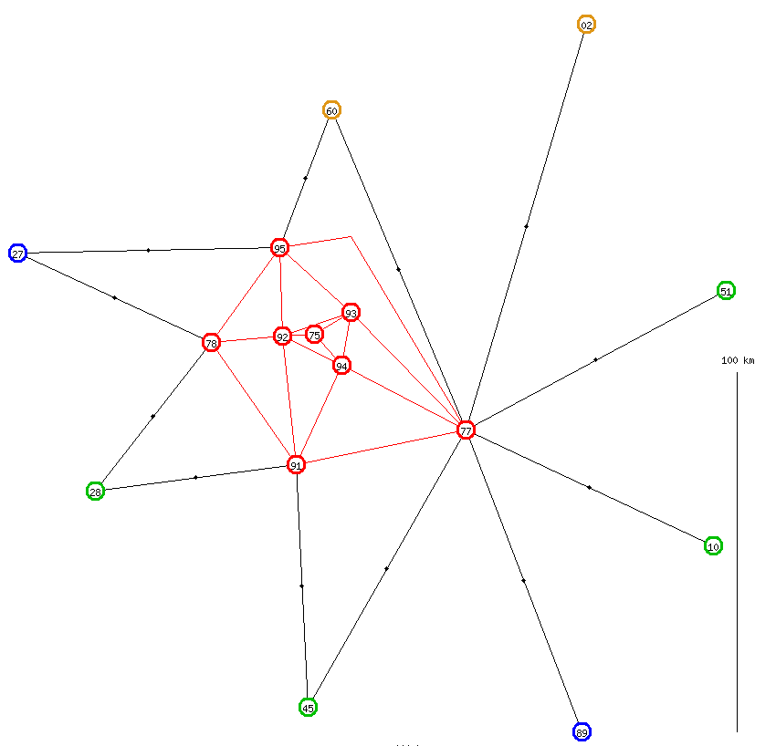
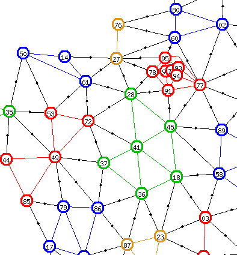
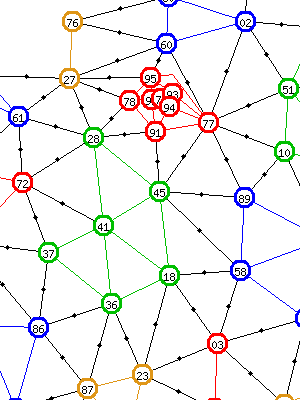

-*- encoding: utf-8; indent-tabs-mode: nil -*-

This  project  aims  at   extracting  doubly  hamiltonian  paths  from
administrative maps. In a connected unoriented graph, an
[Hamiltonian path](https://mathworld.wolfram.com/HamiltonianPath.html)
is a  path crossing each vertex  exactly once. But what  is a _doubly_
Hamiltonian path?  Let us consider  the administrative map  of France.
France  is  split  into  _régions_,  which  are  in  turn  split  into
_départements_. For the purpose of  this project, we put aside Corsica
and overseas  regions, so the  resulting graph is connected.  A doubly
Hamiltonian path  is an hamiltonian path  crossing each one of  the 94
departments, with  the additional  constraint that when  narrowing the
view on any single region, the partial path is still Hamiltonian.

Checking whether  an Eulerian path  exists in  a connected unoriented graph  is a
well-known  problem. Checking  whether an  Hamiltonian path  exists is
more  difficult,   it  is  even   an  NP-complete  problem.   With  94
departments, a brute-force  approach would exceed the  resources I may
allow to  my hobbies. By  adding the _doubly_  Hamiltonian constraint,
the  size of  the  problem is  considerably  smaller. This  constraint
allows a  "divide and conquer"  approach. I  just have to  extract all
Hamiltonian macro-paths between the  12 regions in continental France,
then for each region I extract all Hamiltonian micro-paths linking the
departments  within  this  single  region (5  to  13  departments  per
region). Lastly,  I concatenate micro-paths while  following a pattern
given by a macro-path.

I do not study  only the map of France with  the departments from 1965
and the  regions from  2015. I  will do the  same experiment  with the
regions from  1970 and the  departments, ot  even with the  regions of
2015 as the big  areas and the regions of 1970 as  the small areas. In
this case,  there are several big  areas which contain only  one small
area, so this  set of data, in  which some big areas  contain only one
small  area  each,   might  trigger  a  few  bugs   which  would  stay
undiscovered with the other sets of data.

I can even think of other maps, such as the world map for
[Risk](https://boardgamegeek.com/boardgame/181/risk)
or
[War on Terror](https://boardgamegeek.com/boardgame/24396/war-terror),
in which  the small  areas are  countries (more or  less) and  the big
areas are continents. On a more local scale, we can use the map for
[Britannia](https://boardgamegeek.com/boardgame/240/britannia),
or from
[Maharaja](https://boardgamegeek.com/image/82336/maharaja).

Note: for copyright reasons, I do  not give the Britannia and Maharaja
maps  in   this  repository.  Yet,   I  will  mention  these   in  the
documentation below. If necessary, you  can access the links above and
find the maps.

The project uses
[SQLite](https://sqlite.org/index.html)
for storage,
[Raku](https://raku.org/)
for computations and Raku /
[Bailador](https://modules.raku.org/dist/Bailador:cpan:UFOBAT)
for display with a web browser.

A Few Words about Graph Theory
==============================

Unless  explicitly  mentioned, I  will  restrict  these paragraphs  to
finite connected undirected graphs.

A graph  consists of  vertices (also  known as  nodes) and  edges, but
because of  the underlying reality,  I will  also use the  words areas
(regions and departments) and borders.

The degree of a vertex is the  number of edges coming from the vertex.
If the degree  of a vertex is 1,  I will call this vertex  a dead end.
Examples are  the Nord-Pas-de-Calais  region in  the 1970  French map,
linked only  to Picardy,  or the Pyrénées-Atlantiques  department (64)
within the Aquitaine region (in 1970) or the Nouvelle Aquitaine region
(in 2015),  this department  being linked only  to Landes  (40), since
departments 32 and 64 are irrelevant.


When reading the
[Glossary of graph theory](https://en.wikipedia.org/wiki/Glossary_of_graph_theory)
I found a convenient notion, the
[Articulation point](https://en.wikipedia.org/wiki/Articulation_point).

Within  a connected  graph, an  articulation point  is a  vertex which
ensures the  graph is  connected. In  other words,  if we  remove this
vertex and  its edges,  the graph  is no  longer connected.  Using the
examples above,  the Picady region  within the  1970 French map  is an
articulation point,  because if it is  removed, the Nord-Pas-de-Calais
region  is no  longer linked  to any  remaining region.  Likewise, the
Landes (40) department  is an articulation point,  because if removed,
the  Pyrénées-Atlantiques  department is  no  longer  linked to  other
departments within the Aquitaine / Nouvelle Aquitaine region.

Articulation points are not always  associated with dead ends. See for
example the Maine-et-Loire department  in the Pays-de-la-Loire region.
If removed,  the region  is split into  two connected  components, one
with Loire-Atlantique  (44) and  Vendée (85),  the other  with Mayenne
(53) and Sarthe (72).


You  can easily  notice that  if a  graph contains  a dead  end, every
Hamiltonian path will  either start from this dead end  or stop at it.
On  the other  hand, if  a graph  contains an  articulation point,  no
Hamiltonian  path   will  start  from  this   articulation  point,  no
Hamiltonian path will stop at it.

The  articulation  point  notion  is  interesting  for  human-to-human
discussions   (like   this   documentation    file),   but   not   for
human-to-computer discussions. In other words, the articulation points
are not implemented in the programmes from this project.

An interior border  is a border between two  departments (small areas)
belonging  to the  same region  (big area).  An exterior  border is  a
border between  two departments belonging  to different regions.  I do
not  care  about  foreign  countries such  as  Belgium  or  Luxemburg.
Likewise, an interior area is a  small area with only interior borders
and  an exterior  area is  a  small area  with at  least one  exterior
border.  Thus, in  the  `fr2015`  map, department  `60`  (Oise) is  an
exterior department, linked  to two departments from  Normandy and two
departments  from  Île-de-France  and  department `59`  (Nord)  is  an
interior department, although adjacent to Belgium.

Another  interesting  notion  is Hamiltonian  cycles.  In  Hamiltonian
cycles, the end node  is the same as the begin  node, which means that
it is visited twice.  For example, The `29 → 56 → 35  → 22 → 29` cycle
in the Bretagne region. In my  project, this cycle will be represented
by a path omitting the last step, that  is, `29 → 56 → 35 → 22`. There
will be  a boolean  column in  the `Paths`  table and  a parenthesized
mention in the web pages, nothing more.


You may consider  that the cycle `22 →  29 → 56 → 35 →  22`, the cycle
`35 → 22 →  29 → 56 → 35` and the  cycle `56 → 35 → 22 →  29 → 56` are
the same as cycle `29 → 56 → 35  → 22 → 29`. In my project, there will
be four different paths `29 → 56 → 35  → 22`, `22 → 29 → 56 → 35`, `35
→ 22  → 29 → 56`  and `56 →  35 → 22 →  29` for this cycle,  plus four
other, running along the cycle in the opposite direction.


Database
========

Maps
----

The first table is the `Maps` table. The record key is:

* `map` the key of the whole map (URL-friendly, no special characters).

Other fields are:

* `name` a user-intelligible designation,
* `nb_macro` the number of macro-paths for this map,
* `nb_full` the number of full paths for this map,
* `nb_generic` field described in the
[fourth version of the software](#user-content-fourth-attempt).

Areas
-----

The second table, `Areas`, contains both the regions and the departments.
The record key is:

* `map` the key of the wole map,
* `level` an integer with values `1` for regions and `2` for departments,
* `code` the last element of the key.

In France, departments  are associated with a  2-digit number (3-digit
for overseas departments, but they are out of the scope). This 2-digit
number will be used for `code`. For regions (the 2015 variant), I have
used the last 3 characters of ISO 3166-2, as seen
[on this page](https://en.wikipedia.org/wiki/ISO_3166-2:FR#First-level_metropolitan_subdivisions).
For regions (the 1970 variant),  I have used unofficial 3-letter codes
similar to the codes for the 2015-variant regions.

Other fields are:

* `name` the standard designation of the region / department,
* `long` and `lat`, approximate longitude and latitude of the area,
* `color` the color used when drawing the map,
* `upper` for departments, it is the code of the region it belongs to (for regions this field is unused),
* `nb_paths` for regions, the number of regional paths (zero for departments),
* `exterior` showing whether the department is linked with another region.

Two views are defined on this table, `Big_Areas` which filters `level`
equal  to `1`  for regions  and  `Small_Areas` which  filters `2`  for
departments.

The longitude and latitude will be used to draw the maps. Although the
current problem of Hamiltonian paths is strictly a math graph problem,
with no geometry  involved, the math graphs will be  displayed in such
fashion that  the geographical  map associated can  be guessed  at and
recognised.

The  `exterior`  field  is  significant only  for  departments  (small
areas). If `1`, that means that  the department shares a border with a
department  from another  region. If  `0`,  that means  that for  this
department, all neighbour departments belong to the same region.

Borders
-------

The `Borders` table  lists the pairs of neighbour  departments and the
pairs of neighbour regions. For a math graph, the proper word would be
"edges". The key contains:

* `map` the key from table `Maps`,
* `level` with `1` for neighbouring regions and `2` for neighbouring departments,
* `from_code` for the first area,
* `to_code` for the second area.

Other fields:

* `upper_from` the code of the region for departments' edges, empty for regions' edges,
* `upper_to` similar,
* `long`, an optional longitude,
* `lat`, an optional latitude,
* `color`,
* `fruitless`.

Most of the time,  the longitude and latitude will be  zero and in the
picture  of the  map, the  edge  will be  shown as  a single  straight
segment. In some  cases, the picture will be a  bit overcrowed in some
spots. A way  to unclutter the picture  is to draw a few  edges as two
straight segments,  bypassing the overcrowed  spot. In this  case, the
longitude and latitude define where the edge parts will join.

Among  France's  departments,  the  only  problem  is  the  edge  from
Seine-et-Marne (77) to  Val-d'Oise (95). If drawn as  a straight line,
this edge may be masked by the Seine-Saint-Denis department (93). So I
had to add a waypoint a little northward of the direct line.



For a  border between two departments  in the same region,  the border
will  have the  same color  as the  region. For  a border  between two
departments belonging to different regions, the color will be `Black`.
And of course, the borders with `level` 1 will be black.

For a  given edge or border,  there will be two  `Borders` records, by
switching `from_code` with `to_code`.

As  for table  `Areas`, there  will  be two  views, `Big_Borders`  and
`Small_Borders`.

The use and meaning of `fruitless` will be explained in the
[third version of the software](#user-content-third-attempt).

Paths
-----

The `Paths` table  stores all paths for the  various maps: macro-paths
linking  regions (big  areas), micro-paths  or regional  paths linking
departments (small  areas) belonging to  the same big area  and lastly
full paths linking all small areas. The key is:

* `map` the key from table `Maps`,
* `level` with `1` for macro-paths, `2` for regional paths, `3` for full paths and `4` for generic regional paths,
* `area` empty for macro-paths and full paths, the code of the big area for regional paths,
* `num` a sequential number.

Other fields are:

* `path` a char string listing all areas along the path,
* `from_code` the code of the area where the path begins,
* `to_code` the code of the area where the path ends,
* `cyclic` to show if the path is cyclic,
* `macro_num` the number of the associated macro path, if there is one,
* `fruitless`,
* `fruitless_reason`,
* `generic_num`,
* `first_num`,
* `paths_nb`,
* `num_s2g`.

The `path`  field contains the  department codes (or region  codes for
macro-paths)  separated   by  arrows  `→`.   In  the  1970   map,  the
_Languedoc-Roussillon_ region has  two regional paths. Here  is one of
them:

```
   map         'fr1970'
   level       2
   area        'LRO'
   num         1
   path        '48 → 30 → 34 → 11 → 66'
   from_code   '48'
   to_code     '66'
   cyclic      0
   macro_num   0
```

There  is  no unique  key  constraint  on  the  `map level  area  num`
quadruplet.  This allows  us  to reorder  and  renumber the  generated
paths. The  most interesting  order is to  order them  by `from_code`,
then `to_code` and lastly by `path`,  so similar paths will be grouped
together.

The `cyclic`  column contains `1`  for cyclic  paths and `0`  for open
paths. A cyclic path is a path in which the first area shares a border
with the  last area. For  example, in the  `fr1970` map and  the `PIC`
region, the `02 →  60 → 80` is cyclic, because  it could  be  extended
to `02  → 60 → 80  → 02`. But  we keep this  path with a `80`  end. By
convention, paths  with 1 region  and 0  borders are cyclic  (e.g. the
single path in  region `IDF` in map `frreg`) and  paths with 2 regions
and  1 border  are cyclic  (e.g.  the paths  for region  `NOR` of  map
`frreg`).

The use and meaning of `fruitless` and `fruitless_reason` will be explained in the
[third version of the software](#user-content-third-attempt).

Generic   regional   paths  (`level=4`)   and   the   use  of   fields
`generic_num`, `first_num`, `paths_nb` and  `num_s2g` are described in the
[fourth version of the software](#user-content-fourth-attempt).

The  relation between  macro-paths and  full paths  is a  0..n ↔  1..1
relation. A macro-path  can generate an unknown number  of full paths,
but  a full  path derives  from a  single macro-path.  The `macro_num`
field implements this relation.

On  the other  hand,  there  is no  relation  between macro-paths  and
regional paths.  On the  third hand, between  full paths  and regional
paths, the relation is 0..n ↔ 0..n. Hence:

Path\_Relations
---------------

This table  implements the  relation between  full paths  and regional
paths. It contains the following fields:

* `map` the key from table `Maps`,
* `full_num`, the `num` field of the full path,
* `area`, the `code` field of the region or the `area` field of the regional path,
* `region_num` the `num` field of the regional path,
* `range1`,
* `coef1`,
* `coef2`.

Up  to  version  3,  `full_num`   and  `region_num`  are  the  numbers
identifying specific full paths  and specific regional paths. Starting
from version 4, these columns refer  to generic full paths and generic
regional paths.

The use of fields `range1`, `coef1` et `coef2` is explained in
[fourth version of the software](#listing-all-specific-full-paths-linked-to-a-specific-regional-path).

Messages
--------

This  table  stores  some   informations  about  the  path  generation
processes. It will  remind the users why this or  that path generation
produced no paths. The record key is:

* `map` the key from table `Maps`,
* `dh` the datetime stamp of the message.

Other data are:

* `errcode` the code of the error,
* `area` the code of the area to which the error applies,
* `nb` the number associated with the error or the message, for example the number of generated paths.
* `data` some data giving further explanation on the error, for example the list of dead-end areas

Initialisation
==============

For copyright  reasons, I  do not provide  initialisation programmes
for  the  maps of  Risk,  War  on Terror  and  other  games. The  only
initialisation  programme is the  programme dealing  with French
regions and departments.

This  initialisation  programme  is  more complicated  than  a  normal
initialisation  programme, because  it deals  with three  hierarchical
levels  instead  of  just  two:   Y1970  regions,  Y2015  regions  and
departments.  It  initialises  three  maps  simultaneously:  `fr1970`,
`fr2015` and `frreg`.

In a  first phase,  the programme  reads a  sequential text  file with
different line types:

* `A` for Y2015 regions,
* `B` for Y1970 regions,
* `AB` for Y1970 regions which were not altered in 2015,
* `C` for departments.

Beyond the area code and the area name, lines `A` and `AB` contain the
color scheme for maps `fr2015` and `frreg`, lines `AB` and `B` contain
the color scheme for map `fr1970`.  Lines `C` contain the latitude and
longitude   for  the   individual  departments,   plus  the   list  of
neighbouring departments.

I have written the text file in the following fashion. I have displayed the
[Géo Portail](https://www.geoportail.gouv.fr/)
website   and  selected   only  the   _limites  administratives_   map
(administrative borders). For  each department, I have  clicked at the
approximate  center  of  the department,  right-clicked  and  selected
_adresse /  coordonnées du  lieu_ (location address  and coordinates).
Then I  have copied-pasted  the latitude and  longitude into  the text
file. When copying-pasting the values, I  have kept all 5 digits after
the decimal point. If you bother  to check, one latitude degree is 111
km and, at  latitude 45, one longitude  degree is 78 km.  So the fifth
decimal digit  means that the  values have  a precision of  one meter,
more or less.  This is excessive. I could have  truncated to 2 decimal
digits.

Also, I  have listed  all neighbouring departments.  In some  cases, I
have zoomed to know if two  departments are really neighbours. See for
example the  4-way point  between Vaucluse, Bouches-du-Rhône,  Var and
Alpes de Haute-Provence, at 43.72°N and 5.75°E.


Another  point, illustrated  by  the same  picture. Theorically,  each
border between departments  is specified twice in the  input file. For
example, the Var department (83) and the Vaucluse department (84) have
a  common   border.  Therefore,  the  `C ; 83`   line  should  mention
department 84 and the `C ; 84`  line should mention department 83. The
initialisation programme will check the symmetry.

During the first phase, the  departments records, that is records with
keys `fr1970`+`2` and `fr2015`+`2` are  created with all their fields.
On  the  other  hand,  in  the regions  records,  that  is  with  keys
`fr1970`+`1`, `fr2015`+`1`  `frreg`+`1` and `frreg`+`2`,  the latitude
and the longitude will not be filled, and no `Borders` records will be
created.

You  will have  to wait  for the  second phase  to finish  the regions
records. For each  region, the programme extracts  all the departments
within  this  region,  computes  the  average  of  the  latitudes  and
longitudes of  these departments  and updates  the region  record with
these computed values.

Likewise,  the  programme  creates  the `Borders`  records  with  keys
`fr1970`+`1`  and `frreg`+`2`  by extracting  all departments  borders
`fr1970`+`2`  lying  between  two different  regions,  discarding  all
duplicates region-wise  and store the  result in the  `Borders` table.
And  it creates  in  the  same way  the  `Borders`  records with  keys
`fr2015`+`1`  and `frreg`+`1`  by extracting  all departments  borders
`fr2015`+`2` lying between two different regions.

Extracting Hamiltonian Paths
============================

General Case
------------

The programme  is based on "partial  paths". A partial path  is a data
structure holding a string describing  the beginning of the path, plus
a set  holding the list  of departments not  yet visited by  the path.
This data structure is not stored in the database, it exists only when
the programme is running. In  the descriptions below, the curly braces
represent sets,  like I have  been taught  in mathematics a  long time
ago. In  this case, curly  braces have  nothing to do  with statements
blocks or with references to hashes.


Let us take the example of the Normandy region in the `fr2015` map. At
the beginning, the programme fills the list of partial paths with:

```
'14'   { 27 50 61 76 }
'27'   { 14 50 61 76 }
'50'   { 14 27 61 76 }
'61'   { 14 27 50 76 }
'76'   { 14 27 50 61 }
```

Then the programme extracts a partial  path from the list, selects all
the departments  contiguous with  the last  department of  the partial
path and still  present in the set of unvisited  departments. For each
selected department, the programme adds  this department to the string
and removes the department from the  set. Let us suppose the programme
has selected the Eure (27) partial path. The unvisited departments are
14,  50, 61  and 76.  But department  50 (Manche)  is not  adjacent to
department 27 (Eure). So the programme  uses the three others to build
new partial paths, which are stored into the list:

```
'14'        { 27 50 61 76 }
'27 → 14'   { 50 61 76 }
'27 → 61'   { 14 50 76 }
'27 → 76'   { 14 50 61 }
'50'        { 14 27 61 76 }
'61'        { 14 27 50 76 }
'76'        { 14 27 50 61 }
```

Then the programme extracts the `'27  → 76'` partial path. It tries to
find a  neighbour for  `76` within the  set of  unvisited departments:
`{ 14 50  61 }`. There are  none. So the  `'27 → 76'` partial  path is
removed from the list without being replaced.

Some time later,  after processing the `'50'`, `'50 →  61'` and `'50 →
61 → 14'` partial paths, the situation is:

```
'14'                  { 27 50 61 76 }
'27 → 14'             { 50 61 76 }
'27 → 61'             { 14 50 76 }
'50 → 14'             { 27 61 76 }
'50 → 61 → 14 → 27'   { 76 }
'50 → 61 → 27'        { 14 76 }
'61'                  { 14 27 50 76 }
'76'                  { 14 27 50 61 }
```

The programme  extracts the  `'50 → 61  → 14 →  27'` partial  path. It
checks  the list  of unvisited  departments  and finds  only one,  the
Seine-Maritime (76).  Fortunately, this  department is a  neighbour of
Eure (27). So `'76'` is added to  the string and removed from the set.
Since the  set of unvisited  departments is  an empty set,  that means
that the path `'50 → 61 → 14 →  27 → 76'` is no longer a _partial_ path,
but a _complete_ regional path. It is stored in the `Paths` table and it
is not inserted in the list of partial paths.

Special Case: Dead Ends
-----------------------

As we saw above, when a department is a dead-end within its region, as
Seine-Maritime (76)  is in Normandy,  you cannot find  any Hamiltonian
path  in which  this department  is  in the  middle of  the path.  The
dead-end department is always the first  or the last department in the
path.

So, to improve the speed of the path generation, instead of feeding
the list with:

```
'14'   { 27 50 61 76 }
'27'   { 14 50 61 76 }
'50'   { 14 27 61 76 }
'61'   { 14 27 50 76 }
'76'   { 14 27 50 61 }
```

the programme feeds it with only:

```
'76'   { 14 27 50 61 }
```

At the same time, the programme sets a flag to remember that each time
a regional path beginning with `'76'`  is stored into the database, it
must also store the backward path, which ends with `'76'`.

If  there are  two  dead-end  departments (in  the  `fr1970` map,  see
Languedoc-Rousillon,    but    also   Alsace,    Upper-Normandy    and
Nord-Pas-de-Calais),  the  programme takes  either  one,  it does  not
matter.

And  if  the programme  finds  three  dead-end departments,  it  stops
immediately  with  an  error  message, because  you  cannot  build  an
Hamiltonian path with three dead-ends.

So, when processing  a region, the programme  examines all departments
one after the other and counts how many neighbours this department has
in the region being processed.

Remark: the same thing applies at the upper level, when extracting the
macro-paths linking all regions.

Special Case: Isolated Departments
----------------------------------

Since the programme seeks the  departments with a single neighbour, it
can also take in account the departments with no neighbours.

If we  find a department  with no neighbours,  this can mean  that the
graph is  not connected.  It would  be the case,  for example,  with a
Britannia map where we would keep  only the ground borders and discard
the coastal links. In these  conditions, the Hebrides would not longer
be connected  with Skye and the  Orkneys would no longer  be connected
with  Caithness.  The  Scotland  10-area  graph  would  no  longer  be
connected. The programme would stop with an error message.

At the  same time, being isolated  is not automatically an  error. The
situation  arises  in   multiple  cases  in  the   `frreg`  map.  Some
Y2015-regions contain only one Y1970-region each: Britanny, Pays de la
Loire,         Centre-Val-de-Loire,          Île-de-France         and
Provence-Alpes-Côte-d'Azur. In this case, the lone Y1970-region has no
neighbours  within its  Y2015-region. Yet,  we find  a regional  path,
composed of one single node and no edge. In the picture below, you can
see that Y1970-regions  `BRE` and `IDF` are alone  in their respective
Y2015 regions, and  you guess the same applies  to Y1970-regions `PDL`
and `CEN`.


Another case, exemplified by Wales in  the Britannia map, is not dealt
with at initialisation time. For  game reasons, Cornwall and Devon are
assigned to  Wales instead of  England. If  we do discard  the coastal
links, then Wales is not a connected  graph, it has a Cornwall + Devon
connected  component,  plus  a  main connected  component  (Powys  and
others).  This   case  is   not  dealt   with  during   the  programme
initialisation. The  programme will try to  generate Hamiltonian paths
nevertheless. Since  Cornwall and Devon  are dead ends,  the programme
will generate either `COR → DEV` or  `DEV → COR`, then it will fail to
extend this partial path. The  generation programme will soon end with
a  "failed" result,  as expected,  but it  will still  have run  for a
little while.

FIFO or LIFO?
-------------

Which method do we use to extract from the to-do list the next partial
path to process? There are several possibilities:

* The pedagogical method. Each time a partial path is extracted, it is
the  path  which  leads  to   the  most  interesting  discussion,  and
preferably  in  the  shortest  time.  How  nice!  Except  that  it  is
impossible to do on a silicon-based computer. The generation programme
does not deal with AI.

* Randomised access. It is easy  to implement, with Raku's `pick`. The
problem  is  that processes  are  no  longer reproductible,  therefore
debugging is difficult.

* FIFO access.

* LIFO access.

The  real  choice  is  limited  to  the  last  two  possibilities.  In
_Mastering Algorithms with Perl_, (I do not remember the page number),
the authors write that the good point of FIFO access (or breadth-first
searching) is that  it finds the shortest path. In  a unoriented graph
with _N_ nodes  and _E_ edges, all Hamiltonian paths  are always _N-1_
edges-long and all  Eulerian paths are always _E_  edges-long. In both
cases, finding the shortest path is pointless, so we have no reason to
use FIFO access.

Let us consider  the question more closely. If using  FIFO access, the
generation programme will generate all  1-edge partial paths and store
them into the to-do list. Then the programme will generate all 2-edges
partial paths and  store them into the to-do list,  while deleting the
1-edge partial  paths. Then  all 3-edges  partial paths  are generated
while  the 2-edges  partial paths  are deleted.  Near the  end of  the
generation, the to-do  list will contain all  _N-2_-edges long partial
paths.  And only  then, the  programme will  store the  complete paths
(_N-1_ long) into  the database and delete the partial  paths from the
in-memory to-do list.  In the case of the `fr2015`  map, with 12 nodes
and 23  edges, there are  894 complete  macro-paths. So there  were at
least 894  partial macro-paths  of length _N-2_,  all together  in the
in-memory to-do list. In fact, there were even more than that, because
the programme has generated _N-2_ paths which fail to produce complete
_N-1_ paths.  For example, you  will find many _N-2_  paths containing
the subpath `HDF  → NOR → PDL  → NAQ` but none of  these partial paths
will be able  to generate a _N-1_ path reaching  `BRE` (Britanny). All
these "unsuccessful" _N-2_  paths will be stored in the  to-do list in
addition to the 894 "successful" partial paths.


On the other  hand, when using a LIFO access,  some complete paths are
built very  early during the  process and immediately stored  into the
database. By  adding a telltale, we  can notice that for  `fr2015` the
to-do list never contains more than 25 partial paths.

The theoretical max size of the  to-do list when using LIFO access can
be computed by  studying the case of a complete  graph with _N_ nodes,
that is,  a graph in which  each one of  the _N_ nodes is  adjacent to
each one  of the  _N-1_ other  nodes. Do not  confuse this  meaning of
"complete" with the meaning of "complete path".

First, the  programme stores _N_ zero-length partial
paths. Then it removes one of them and replaces it with _N-1_ 1-length
partial paths. Then it removes one  of the 1-length paths and replaces
it with _N-2_  2-length partial paths. And so on.  The maximum size of
the to-do list  is the sum of  all numbers from _N-1_ to  _1_. With 12
nodes, that means that the theoretical maximum number is 66, way below
the number  894 which is itself  less than the actual  number of _N-2_
paths that would be stored in the to-do list if using FIFO.

Final Sort
----------

Once all  paths are created  for a given map  and a given  region, the
programmes rereads the paths, ordered  by begin area (`from_code`), by
end  area (`to_code`)  and by  path (`path`).  A sequential  number is
assigned  to  each record.  While  this  step  is  run, there  may  be
duplicate  numbers,  but  this  is  completely  temporary.  After  the
renumbering process ends, there is neither holes nor duplicates in the
number sequence.

Generating the Full Paths
=========================

The general process  is as follows. The programme  takes a macro-path,
for example `NOR → HDF → GES → etc` in the `fr2015` map. The programme
substitutes the  first region with  a regional Hamiltonian  path. This
gives `14 →  50 → 61 → 27 →  76 →→ HDF → GES →  ...`. The double arrow
shows  the last  small  area and  the first  big  area. Actually,  the
programme does not use a single Hamiltonian path from region `NOR`. It
takes all `NOR` paths, store them in its `to-do` list and extracts one
of them.

Next step. The programme selects  all small areas which are neighbours
of the last small area in the partial path (`76` aka Seine-Maritime in
the example) and that belong to the first big area in the partial path
(`HDF` or  Hauts-de-France in the  example). The programme  finds `60`
and `80` (Oise  and Somme). Then it extracts  all regional Hamiltonian
paths starting  from `60` or  `80`. The programme replaces  the region
code `HDF` by  the path, while shifting the double  arrow. The example
gives:

```
Before:
14 → 50 → 61 → 27 → 76 →→ HDF → GES → ...
After :
14 → 50 → 61 → 27 → 76 → 60 → 02 → 59 → 80 → 62 →→ GES → ...
14 → 50 → 61 → 27 → 76 → 60 → 02 → 80 → 62 → 59 →→ GES → ...
14 → 50 → 61 → 27 → 76 → 60 → 80 → 62 → 59 → 02 →→ GES → ...
14 → 50 → 61 → 27 → 76 → 80 → 62 → 59 → 02 → 60 →→ GES → ...
14 → 50 → 61 → 27 → 76 → 80 → 60 → 02 → 59 → 62 →→ GES → ...
etc.
```

Each partial path is stored into  the `to-do` list. Then the programme
takes one of them and processes the next big area.


This process may encounter blocked situations. This is the case if we continue
the example above with a `... → 62  →→ GES → ...` path. We can find no
departments which are simultaneously  neighbour of the `62` department
and belong to the  `GES` region. In this case, no  new partial path is
stored into the `to-do` list after  the previous partial path has been
removed.

The blocked situations can appear a bit later. The programme may find a small
area neighbouring the currently final  small area, but this small area
is the starting point of no  regional Hamiltonian path. Let us suppose
we have a  path such as `... →  78 →→ NOR → ...`.  The programme finds
just one neighbouring department `27`  (Eure), but in the `NOR` region
(Normandy), the  `27` node  is an articulation  point, so  no regional
Hamiltonian path ever  starts from `27`. The programme  will not store
any partial path into the `to-do` list after removing the `... → 78 →→
NOR → ...` path.



In the explanation above, I have presented the extraction of neighbour
small areas and  the extraction of regional paths as  two distinct and
successive  steps. Actually,  with the  proper SQL  join, these  steps
merge into a single step.

Optimisation
------------

Among  the partial  paths generated  in  the example  above, some  are
obviously wrong,  the paths  ending in department  `62` or  `59`. Why?
Because  the full  path must  exit the  `HDF` region  and enter  a new
region, and these two departments are not linked to any other region.

There is  an exception.  If the region  currently processed  (`HDF` in
this example) is  the last region before completion of  the full path,
then any arrival  point is valid, even an interior  department such as
`59` and `62`.

So, the  programme has two  `Select` statements. One joining  only the
`Small_Borders` view with the `Region_Paths`  view, which is used upon
arrival  at the  last region  of the  macro-path. The  second `select`
statement joins the `Small_Borders`  view with the `Region_Paths` view
as above,  plus the `Small_Areas`  view to select only  regional paths
that lead to another region.

With the  example above,  the list  of potential  paths that  would be
stored into the `to-do` list without the optimisation would be:

```
14 → 50 → 61 → 27 → 76 → 60 → 80 → 62 → 59 → 02 →→ GES → ...
14 → 50 → 61 → 27 → 76 → 60 → 02 → 80 → 62 → 59 →→ GES → ...
14 → 50 → 61 → 27 → 76 → 60 → 02 → 59 → 80 → 62 →→ GES → ...
14 → 50 → 61 → 27 → 76 → 60 → 02 → 80 → 59 → 62 →→ GES → ...
14 → 50 → 61 → 27 → 76 → 60 → 80 → 02 → 59 → 62 →→ GES → ...
14 → 50 → 61 → 27 → 76 → 60 → 02 → 59 → 62 → 80 →→ GES → ...
14 → 50 → 61 → 27 → 76 → 80 → 62 → 59 → 02 → 60 →→ GES → ...
14 → 50 → 61 → 27 → 76 → 80 → 60 → 02 → 59 → 62 →→ GES → ...
```

The list of potential paths that  are actually stored into the `to-do`
list is:

```
14 → 50 → 61 → 27 → 76 → 60 → 80 → 62 → 59 → 02 →→ GES → ...
14 → 50 → 61 → 27 → 76 → 60 → 02 → 59 → 62 → 80 →→ GES → ...
14 → 50 → 61 → 27 → 76 → 80 → 62 → 59 → 02 → 60 →→ GES → ...
```

You may  have noticed that among  these three paths, two  will fail to
progress further: the path containing `... →  80 →→ GES → ...` and the
path containing `... → 60 →→ GES → ...`, because neither `80` nor `60`
is adjacent  to the  `GES` region.  Trying to  remove these  two paths
before storing them into the `to-do`  list would need a convoluted SQL
statement, a big effort for a small result.

3 paths instead of 8 does not seem  much. Let us examine the case of a
more densely linked region, `IDF` with 800 regional Hamiltonian paths.
With this region,  we will examine a macro-path containing  `... HDF →
IDF → GES ...`. The access from `HDF` (`60` or `80`) is either through
`77` (Seine-et-Marne)  or through  `95` (Val-d'Oise)  and the  exit to
`GES` (`10` or `51`) must be from `77`.



Without optimisation, there are 104  regional paths starting from `77`
and 93 regional paths from `95`.  The programme would push 197 partial
paths into the `to-do` list.

```
select max(P.from_code), max(A.exterior), count(*)
from Region_Paths P
join Small_Areas  A
  on A.map   = P.Map
  and A.code = P.to_code
where P.map  = 'fr2015'
and   P.area = 'IDF'
group by P.from_code, A.exterior
```

With the basic optimisation, there are  60 regional paths from `77` to
interior departments  (`75`, `92`,  `93` or  `94`), 44  regional paths
from  `77` to  exterior departments,  51 regional  paths from  `95` to
interior  departments and  42  regional paths  from  `95` to  exterior
departments. The programme will push 86 paths instead of 197.

With the advanced optimisation, the only useful regional paths are the
paths from  `95` to `77`. This  would result in pushing  only 13 paths
into  the  `to-do`  list.  This  seems  much  better  than  the  basic
optimisation, after  all. Yet, for  the moment,  I will use  the basic
optimisation.

```
select max(P.from_code), max(P.to_code), count(*)
from Region_Paths P
where P.map  = 'fr2015'
and   P.area = 'IDF'
and   exists (select 'x'
              from Small_Borders B
              where  B.map       = P.Map
              and    B.from_code = P.to_code
              and    B.upper_to  = 'GES')
group by P.from_code, P.to_code
```

Another point: from  reasons similar to the  generation of Hamiltonian
macro-paths  and the  generation  of Hamiltonian  regional paths,  the
`to-do` list is processed in a LIFO order, rather than FIFO.

Simplification
--------------

After splitting a SQL statement for performance purposes, I will merge
two SQL statements to simplify the programme.

Within this chapter, I will deal  with the `fr2015` map (12 big areas)
and a `NOR →  HDF → GES → etc` macro-path as  an example, plus another
case with  an unnamed map  containing a  single big area  (which means
also a single macro-path). To deal with these two cases, the programme
needs four loops:

### Step 1 for `fr2015`

A  loop selects  the  regional paths  while taking  care  of exit  and
disregarding entry:

```
select xxx
from Region_Paths        B
join with Small_Regions  C
   on  C.map      = B.map
   and C.code     = B.to_code
   and C.exterior = 1
where B.map  = ?
where B.area = ?
```

The first region  is replaced by its regional path,  a double arrow is
inserted between the first region's  path and the second region's code
and the result is stored into the `to-do` list.

### Steps 2 to 11 for `fr2015`

The loops selects  regional paths while taking care of  both entry and
exit.

```
select xxx
from Small_Borders     A
join with Region_Paths B
   on  B.map       = A.map
   and B.area      = A.upper_to
   and B.from_code = A.to_code
join with Small_Areas  C
   on  C.map      = B.map
   and C.code     = B.to_code
   and C.exterior = 1
where A.map       = ?
and   A.from_code = ?
```

The  programme slides  the double  arrow past  the current  region and
replaces this region by its regional  paths. The result is stored into
the `to-do` list.

### Step 12 for `fr2015`

The  loop  selects regional  paths  while  taking  care of  entry  and
disregarding exit.

```
select xxx
from Small_Borders        A
join with Region_Paths    B
   on  B.map       = A.map
   and B.area      = A.upper_to
   and B.from_code = A.to_code
where A.map       = ?
and   A.from_code = ?
```

The last region is replaced by  its regional path, the double arrow is
removed and the full path is written into the `Paths` table.

### Single Step for a Single-Region Map

The loop selects the regional  paths while disregarding both entry and
exit.

```
select xxx
from Region_Paths B
where B.map = ?
```

The full path is immediately written into the `Paths` table. Actually,
in the  special case of  a single-region  map, the generation  of full
paths  is just  duplicating regional  paths to  full paths  with minor
alterations, such as the value of the `level` field.

### Refactoring

The trick consists  in adding a "zero step" involving  a virtual small
area `*`, which is  linked to all small areas on  the map. And instead
of  processing  the `NOR  →  HDF  → GES  →  etc`  path, the  programme
processes the `* →→  NOR → HDF → GES → etc` path.  In this way the "do
not pay attention to the entry" clause  on step 1 is equivalent to the
"be sure to link with the `*` virtual department" clause. There is no need to
insert a double  arrow, it has already been inserted  in step zero, we
need just  to slide it  like in  steps 2 to  11. The virtual  area `*`
appears  only  in the  `Borders_With_Star`  view,  that will  be  used
instead of the `Small_Borders` in all SQL statements above.

The  `Borders_With_Star` view  also allows  us  to merge  step 12  for
`fr2015` with the  single step for a one-region map.  During this last
step, we remove the `* →` prefix that was added in step 0.

Adding a new small area `*`  does not change the generated full paths.
Since no macro-paths include the `*` virtual region which contains the
`*` virtual  small area, there is no  risks that a full  path would be
diverted to the `*` small area.

The   virtual   small   area   `*`    appears   only   in   the   view
`Borders_With_Star`. It appears in no other views and in no tables. In
addition,  the borders  between `*`  and another  area are  single-way
borders, while  all other borders  are two-way borders. The  reason is
that we do not  need to go back from a real small  area to `*`, we can
keep the `Borders_With_Star` simple.

Displaying the Results
======================

I have already explained in a
[previous project](https://github.com/jforget/Perl6-Alpha-As-des-As-Zero/blob/master/Description/description-en.md#user-content-templateanti)
that I do not like templating modules. The only templating module I like is
[`Template::Anti`](https://modules.raku.org/dist/Template::Anti:cpan:HANENKAMP),
because its templating language is vanilla HTML, without any extension
and without  any specific syntax.  So I used `Template::Anti`  in this
project.

The  project  includes also  a  graphic  component. My  preference  to
programmatically generate graphics is the
[Metapost](https://www.tug.org/metapost.html)
interpreter embedded inside the
[LuaL<sup>A</sup>T<sub>E</sub>X](http://luatex.org/)
programme. In this case, I do not see how
LuaL<sup>A</sup>T<sub>E</sub>X can integrate with a web server.

Plan B is using the
[GD](https://linux.die.net/man/3/gd)
library. Fortunately, there is a
[GD module for Raku](https://github.com/raku-community-modules/GD).
Unfortunately, this  module misses  many features, including  two that
are essential to my project: displaying some text within the graphics,
and  changing the  thickness  when drawing  lines,  features that  are
available in the
[Perl 5 version of the GD module](https://metacpan.org/pod/GD).

The final solution is to use
[Inline::Perl5](https://modules.raku.org/dist/Inline::Perl5:cpan:NINE),
which allows using Perl 5 modules in Raku programmes.

Because of  the expected number  of Hamiltonian paths,  generating all
graphic representations for all Hamiltonian  paths and storing them in
permanent files  is a big no-no.  The Hamiltonian paths are  stored as
character strings  inside the database,  that is enough.  Graphics are
generated on the fly when browsing the website. They are not stored in
temporary files, they are directly inserted in HTML source after being
encoded with
[MIME::Base64](https://modules.raku.org/dist/MIME::Base64:zef:zef:raku-community-modules).

Website Organisation
--------------------

The  website is  bilingual  and  can scale  easily  to a  multilingual
status. For  the moment,  only English and  French are  available. The
language code is the first element of the URLs.

The front page  is nothing more than the list  of all available maps.
By default, it is displayed in  English, but by typing the proper URL,
you can have the list in French.

For each map, we have:

* The full map with all its departments. URL
http://localhost:3000/en/full-map/fr2015

* The full map, showing a full path. URL
http://localhost:3000/en/full-path/fr2015/2

* The reduced map, or macro-map, with only the regions. URL
http://localhost:3000/en/macro-map/fr2015

* The reduced map, showing a macro-path. URL
http://localhost:3000/en/macro-path/fr2015/2

* A regional map, showing all departments inside a region, plus all
neighbouring departments. URL
http://localhost:3000/en/region-map/fr2015/HDF

* A regional map with a regional path. URL
http://localhost:3000/en/region-path/fr2015/HDF/1

* A regional map with a (truncated) full path. URL
http://localhost:3000/en/region-with-full-path/fr2015/HDF/3

A Few Remarks
-------------

### What is the projection used when building the maps?

According to [xkcd](https://xkcd.com/977/), this is the "plate-carrée"
(or "equirectangular")  transformation. In  a first  step, I  take the
longitude and latitude  values and I use them  directly as rectangular
coordinates.  This gives  some  shrinking at  low  latitudes and  some
stretching at  high latitudes.  One longitude degree  is 81 km  in the
South of  France and only 70 km  in the North of  France, but latitude
degrees are  not altered. This distorsion  is much less than  what you
get with the Mercator projection at high latitudes.

In  a second  step, the  geographical dimensions  are adjusted  to the
canvas  dimensions,  that  is,  1000 × 1000  pixels, later reduced to 800 × 800.  For  continental
France, which  is 950 km in the  E-W direction and 1000 km  in the N-S
direction, there is no distorsion, because  the scale is about 1 pixel
per km in both directions. This  is different with, say, Britanny. The
four  points  showing Britanny  are  separated  by  63 km in  the  N-S
direction and by 172 km  in the E-W direction (if I  had used the real
geographical maps,  showing the  full extent of  the 4  departments, I
would have found 152 km N-S and  273 km E-W). The distorsion is higher
than  previously,  because  the  scale  is 6  pixels  per  km  in  the
horizontal  direction and  about  16  pixels per  km  in the  vertical
direction.

Actually, I  have decided to  add a  vertical scale and  an horizontal
scale in the  map drawings. They were not part  of the initial design,
but I think it has some usefulness.

### Why do the region maps show the neighbouring departments?

The first  reason is  displaying a  full path in  a region.  Since the
neighbouring departments are displayed, we  can show how the full path
enters  the  region   and  how  it  exits  the   region.  Without  the
neighbouring  departments, the  graphics would  have been  exactly the
same  as displaying  a region  path  strictly within  said region.  In
addition,  with visible  neighbouring departments,  it is  possible to
specify an `imagemap` with hyperlinks to neighbouring regions.

The second reason is the coordinates  distorsion I have shown above. I
have taken the example of Britanny.  I could have taken the example of
Nord-Pas-de-Calais   or   Haute-Normandie   in   the   `fr1970`   map.
Nord-Pas-de-Calais contains only two  departments, nearly aligned on a
E-W horizontal  line. The vertical  gap is  0.21° or 23 km,  while the
horizontal gap  is 1.3°, that is,  92 km. Yet, because of  the way the
coordinates adjustment is  computed, both points would  be on opposite
corners of the canvas  and the scale would be 43 pixels  per km on the
vertical direction and  11 pixels per km on  the horizontal direction.
By adding the  neighbouring Somme and Aisne, the  vertical gap extends
to  0.82° or  91 km, which  gives  11 pixels  per km  on the  vertical
direction. In this case, the distorsion is nearly eliminated. In other
cases, it is just reduced.

For Haute-Normandie, the two departments are aligned on a N-S vertical
line. The horizontal gap is only  0.05° or 3.62 km, while the vertical
gap  is  0.59° or  65.5 km.  So  the scale  would  be  216 pixels  per
horizontal km and 15 pixels per vertical km.

There  is worse.  There is  the  `frreg` map,  with the  Y2015-regions
Britanny,  Île-de-France,  Centre-Val-de-Loire,  Pays-de-la-Loire  and
Provence-Alpes-Côte-d'Azur.   Each   of   them   contains   only   one
Y1970-region. The max  longitude and the min longitude  are equal, and
the same thing  happens with latitudes. In this  case, the coordinates
adjustment triggers two divisions zero-on-zero. By adding neighbouring
Y1970-regions, the divisions by zero are avoided.

### About the average longitude and the average latitude

Giving to a big  area a longitude and a latitude  equal to the average
longitude and latitude  of the small areas inside seems  to be a smart
thing to do. But could this produce some glitches?

In theory, yes. With the actual maps, no. At least for the French maps.

With a rigid  mathematical point of view, no area  is a convex domain.
The border  is always  zigzagging at  one point  or at  another, which
prevents the  area from being convex.  The only exceptions I  know are
Colorado and Wyoming in the USA.  Yet, we can consider that some areas
are nearly convex  and others are definitely concave.  See for example
Cantal  and Moselle.  Each  one  has an  inward  "dent"  that is  more
important than  in any other  department. If  this dent was  even more
important, it could happen that the geometric centre of the department
would be in this dent, that is, outside the department's borders.

In the picture below, which are hard-copies from
[Géoportail](https://www.geoportail.gouv.fr/),
you can see the  south-east dent on the Moselle and  the south dent on
Cantal.  For comparison  purposes,  the picture  includes  the map  of
Mayenne, a  department with a  more regular  shape and which  may seem
nearly convex when seen from some distance.


With the method I used to  initialise the longitudes and latitudes for
the departements,  a department  could not be  represented by  a point
outside the  geographical limits of  the department. Even with  a very
deep dent, I would have chosen a point within the department. But if a
region  had a  dent similar  in proportions  to Cantal's  or Moselle's
dent, the average longitude and the average latitude could have placed
the centre  of the  region inside  the dent  and outside  the region's
borders. This is not the case  with the French regions (both the Y1970
ones and the Y2015 ones).

On the other hand, it happens with
[Maharadjah](https://boardgamegeek.com/image/82336/maharaja),
if we includes the three sea areas  and the six foreign areas as a sea
region and  a foreign region.  The average latitude and  longitude for
the sea  areas could place the  sea region within South  India and the
average latitude and the average  longitude of the foreign areas could
place the foreign region within North India.

This is even worse with
[Britannia](https://boardgamegeek.com/image/5640409/britannia-classic-and-new-duel-edition),
if we decide  to keep the sea  areas and group them into  a single sea
region. Since the sea areas are all around Great Britain, the computed
centre of  the region will  most certainly be  near the centre  of the
map, well within the borders of England.

In the  programmes which  load the Maharadjah  data and  the Britannia
data into the database, I could have  coded a special case for the sea
regions. I did not do it. I  am fine with a macro-map showing a glitch
when displaying the sea region in a wrong place.

### Why the dots on the region borders?

For  most  people,  the   borders  between  departments  belonging  to
different  regions are  black, while  the borders  between departments
belonging to the same region  are coloured. Colour-blind people cannot
rely  on this  difference. So  the  dots allow  them to  differentiate
between both kinds of borders.

### Performances

While  running the  `gener1.raku` programme  on the  Britannia map,  I
faced a big problem when generating the Hamiltonian regional paths for
England (20  areas and 40  inner borders, that  is, 80 records  in the
`Borders`  table).  Usually,  the  `gener1.raku`  programme  writes  a
progress message with  a timestamp every 100 complete  paths and every
10000 partial paths. When generating paths for England, I noticed that
the delay between  two messages was increasing. At the  same time, the
task manager on my computer was  showing that the percentage of active
memory was steadily increasing. A memory leak!

After  some  checking,   I  found  the  reason.  There   is  a  `begin
transaction`  when the  programme  begins processing  a  region and  a
`commit` when this  processing ends. To keep the size  of the database
journal low, there  is also a `commit` immediately  followed by `begin
transaction` every 100 complete paths.  Because of an error, there was
also  a  `commit`  +  `begin  transaction`  each  time  the  programme
processed  a partial  path.  The English  Hamiltonian path  generation
would produce 16 182 complete paths after processing 3 562 769 partial
paths. So there were more than 3 millions commits instead of just 162.

I removed the superfluous `commit`  + `begin transaction`. The leak is
not plugged, but it happens 162 times instead of 3 millions, so it has
no visible effects.

### SQL Syntax

When we  join several tables,  it is  advised to qualify  every column
name  with the  table name,  or to  give an  alias to  each table  and
qualify each column name with this alias.

First, the wrong example:

```
select num, path, area, to_code
from Borders_With_Star A
join Region_Paths B
   on  B.map       = A.map
   and B.area      = A.upper_to
   and B.from_code = A.to_code
where A.map       = ?
and   A.from_code = ?
and   A.upper_to  = ?
```

Then the right example:

```
select B.num, B.path, B.area, B.to_code
from Borders_With_Star A
join Region_Paths B
   on  B.map       = A.map
   and B.area      = A.upper_to
   and B.from_code = A.to_code
where A.map       = ?
and   A.from_code = ?
and   A.upper_to  = ?
```

Yet, this  SQL statement has  a problem. When I  ran it on  a computer
with the parameter `:array-of-hash`, the programme gave:

```
({B.num => 1, B.area => IDF, B.path => 'xxx → yyy', B.to_code => '77'})
```

and when I ran it on  another computer, with a different Raku version,
a  different  DBIish  version  and a  different  SQLite  version,  the
programme gave:

```
({num => 1, area => IDF, path => 'xxx → yyy', to_code => '77'})
```

How can  we avoid  this problem?  By giving an  attribute also  to the
columns:

```
select B.num     as num
     , B.path    as path
     , B.area    as area
     , B.to_code as to_code
from Borders_With_Star A
join Region_Paths B
   on  B.map       = A.map
   and B.area      = A.upper_to
   and B.from_code = A.to_code
where A.map       = ?
and   A.from_code = ?
and   A.upper_to  = ?
```
On both computers, I obtained:

```
({num => 1, area => IDF, path => 'xxx → yyy', to_code => '77'})
```

First Attempt
=============

Here are  the results  of the  paths generation,  while the  full path
generation is optimised with the `exterior` field of the `Small_Areas`
view.

`frreg`, regions from 1970 within regions from 2015
---------------------------------------------------

The first  map generated was  the easiest,  `frreg`: 12 big  areas, no
more than 3  small areas per big area. The  first generation programme
ran for  12 seconds, generating  864 macro-paths (with  26 476 partial
paths) and, for each region, from 2 to 6 regional paths.

The  second generation  programme  ran  a bit  longer,  5 minutes,  to
generate 210  full paths (with  9606 partial paths, while  the maximum
size of the to-do list was 7 partial paths).

`brit0`, Britannia map without the coastal links
------------------------------------------------

To check  a programme, you should  not test only the  sucessful cases,
but also the error cases. So I  decided to deal with the Britannia map
without  the  coastal  links,  that  is, the  Britannia  map  with  an
unconnected Scotland region and an unconnected Wales region.

With only three big areas, there  are only two macro-paths, which were
generated immediately. The generation  for Scotland and the generation
for Wales were  also immediate. On the other hand,  the generation for
England  (20 nodes,  40  edges)  needed 7  minutes  to generate  16182
regional paths  (with 3 562 796 partial  paths, of which only  43 were
simultaneously in RAM).

The 7 minutes are split into 4 minutes for the generation proper and 3
minutes for the renumbering of the generated paths.

With no Hamiltonian regional paths  for Scotland and Wales, the second
generation programme stopped immediately.

`brit1`, Britannia map with the coastal links
---------------------------------------------

In the  variant taking in account  the coastal links, but  not the sea
areas, the three big areas are  connected graphs and the generation of
regional paths  succeeds. Scotland  immediately gets 6  regional paths
(with 190 partial paths, 9 of which simultaneously in the to-do list).
Wales immediately gets  8 regional paths (with 24 partial  paths, 4 of
which are simultaneously  in the to-do list). For  England, the values
are  the same  as for  `brit0`. Why  so few  partial paths  for Wales?
Because  the articulation  point in  Powys  acts as  funnel, with  the
result that partial paths are much fewer than in Scotland.

The second generation programme will fail. A human can easily see that
there  are three  dead ends:  Hebrides  and Orkneys  in Scotland,  and
Cornwall in  Wales. For the programme,  it is a bit  more complicated.
When dealing with  the macro-path `SCO →  ENG → WAL`, the  end will be
soon, because all regional paths in Scotland have Hebrides and Orkneys
at both ends, which do not allow to extend the path into England. When
dealing with the  other macro-path, `WAL → ENG →  SCO`, the processing
will be much longer. Among the 8 regional paths, the programme chooses
the two paths in Wales which ends  in an exterior region, in this case
Clwyd. Then, the programme chooses all England regional paths starting
from  Cheshire  or March  (Clwyd's  two  neighbours) and  stopping  at
another exterior  area. Then all  partial paths are  rejected, because
the two border  areas in Scotland, Strathclyde and  Dunedin, are never
the starting  points of a  regional path. This  is the reason  why the
programme has run  for 9 seconds, has pushed 786  partial paths in the
to-do list, with a maximum of  393 paths simultaneously present in the
list.

The number 393 is 392 + 1, where 392 is the number of English regional
paths starting from  Cheshire or March and stopping  at another border
area, even if this area is bordering  Wales and not Scotland, and 1 is
the other macro-path where the `WAL` region has been replaced with the
single regional  path that  reaches an  exterior region.  By selecting
only areas bordering  Scotland, this number would has  been reduced to
96 (= 1 + 95).

```
select count(*)
from Region_Paths as P
join Small_Areas  as A
  on  A.map = P.map and A.code = P.to_code
where P.map = 'brit1'
and   P.from_code in ('CHE', 'MRC')
and   A.exterior = 1
```

```
select count(*)
from Region_Paths as P
where P.map = 'brit1'
and   P.from_code in ('CHE', 'MRC')
and   P.area = 'ENG'
and   exists (select 'X'
              from  Small_Borders as B
              where B.map       = P.map
                and B.from_code = P.to_code
                and B.upper_to  = 'SCO')
```

`brit2`, Britannia map with the sea areas
-----------------------------------------

For the first programme, adding  sea areas changes nearly nothing. The
bulk of the time is still spent while processing England.

For  the  second programme,  using  the  same  ideas  as used  in  the
preceding paragraph, a human can easily  find that full paths can only
be derived from  the `SCO → OCE  → ENG → WAL`  and `WAL → ENG  → OCE →
SCO` macro-paths. On the other side, the second programme cannot think
in the same way. It tries all macro-paths, including the two fruitless
macro-paths starting from England. Among  the 16 182 regional paths in
England, 13 132 stop at a border area (remember that all coastal areas
are  now  border  areas).  So,  on both  occasions,  when  the  second
programme processes the two sterile  macro-paths, it pushes all 13 132
paths upto the `to-do` list, all of which will fail to generate a full
path.

```
select count(*)
from Region_Paths as P
join Small_Areas  as A
  on  A.map = P.map and A.code = P.to_code
where P.map  = 'brit2'
and   P.area = 'ENG'
and   A.exterior = 1
```

With the alternate  optimisation, the number of paths  stacked in vain
to the `to-do` list would drop from 13 132 to 1463.

```
select count(*)
from Region_Paths as P
where P.map = 'brit2'
and   exists (select 'X'
              from  Small_Borders as B
              where B.map       = P.map
                and B.from_code = P.to_code
                and B.upper_to  = 'SCO')
```

On  the other  hand, when  I run  this query  in `sqlitebrowser`,  the
answer  is displayed  after several  seconds.  Maybe this  is not  the
proper solution.

`mah1`, Maharaja map without the foreign lands and the seas
-----------------------------------------------------------

In the Maharaja  map, there are four big areas.  Two very simple ones:
Ceylon (2  small areas and  1 interior  small border) and  Himalaya (4
small areas  and 3 interior  borders), and two much  more complicated:
Northern India (18  small areas and 34 interior  borders) and Southern
India (12 small areas and 24 interior borders).

```
select max(upper), count(*)
from Small_Areas
where map = 'mah1'
group by upper

select max(upper_to), count(*) / 2
from Small_Borders
where map = 'mah1'
and   upper_to = upper_from
group by upper_from
```

The generation  of macro-paths  and the  generation of  regional paths
within  Himalaya and  Ceylon is,  you guess  it, very  fast. Something
curious happens  with the two  other regions. Northern India  has 1578
regional paths, but after processing 4 293 386 partial paths. Southern
India  has  nearly twice  as  many  regional  paths, 3088,  but  after
processing only 43 592 partial paths,  hardly more than one hundredth.
The max size of the `to-do` list  was 37 for Northern India and 26 for
Southern India.

The second programme ran for 7  minutes or so, to generate 13 464 full
paths,  while  generating  41 642 partial  paths  (361  simultaneously
present in the `to-do` list).

`mah2`, Maharaja map with the foreign lands and the seas
--------------------------------------------------------

The `mah2` map adds two more big areas: `ASI` for the foreign lands in
Asia (6  areas, 6 inner  borders) and `MER` for  the seas (3  areas, 2
inner borders).  Nothing changes  much when running  the `gener1.raku`
programme. The number of macro-paths raises from 2 to 56.

But the `gener2.raku` programme has run  for a very long time, about a
12-hour night  instead of 7 minutes.  And actually, I have  killed the
job in the morning. It was nearly  finished, but I could not wait. Why
did it take so long?

The  reason is  the same  as  for map  `brit2`, but  with much  larger
values.  In `brit2`,  there  was a  macro-border  between England  and
Scotland (small areas `STR` and  `DUN`), but no Scottish regional path
would  ever  start  from  `STR`  or  `DUN`.  In  `mah2`,  there  is  a
macro-border between Ceylon (`CEY`) and the sea region (`MER`), but no
regional  Hamiltonian  path within  `MER`  starts  from `OCE`  (Indian
Ocean). Therefore, the six Hamiltonian macro-paths  `SUD → CEY → MER →
etc`  will  generate no  Hamiltonian  full  paths. Unfortunately,  the
programme cannot guess it without doing the full extraction.

So on  6 occasions, the programme  pushes 2382 partial paths  into the
`to-do` list, to no avail.

```
select count(*)
from Region_Paths as P
join Small_Areas  as A
  on  A.map = P.map and A.code = P.to_code
where P.map      = 'mah2'
and   P.area     = 'SUD'
and   A.exterior = 1
```

With  the more  precise  optimisation, the  number  of Southern  India
regional paths would  be narrowed to 346. When multiplied  by 6, it is
still a  big number, but at  least much smaller than  the previous big
number 6 × 2382 = 14 292.

```
select count(*)
from Region_Paths as P
where P.map = 'mah2'
and   P.area = 'SUD'
and   exists (select 'X'
              from  Small_Borders as B
              where B.map       = P.map
                and B.from_code = P.to_code
                and B.upper_to  = 'CEY')
```

But wait, there is  more! We also have macro-paths `NOR →  SUD → CEY →
MER →  ASI → HIM` and  `NOR → SUD  → CEY → MER  → HIM → ASI`.  In both
cases, we first push 1416 partial paths to the `to-do` list: expansion
of `NOR`  with partial paths  within Northern  India and ending  at an
exterior  small area.  Of these  1416  paths, 793  cannot extend  into
Southern India and 623 can. Each of these 623 partial paths can extend
with between 192  and 423 Southern India regional  paths, depending on
whether the  end of the  Northern India  regional path is  adjacent to
`AND` only, to  `MAH` only, to both  `AND` and `GON` or  to both `MAH`
and `KHA`.  If using  the lower  value 192,  we get  2 ×  623 ×  192 =
239 232 partial paths  which will be pushed at one  time or another to
the `to-do` list to no avail.

```
select P.from_code, count(*)
from Region_Paths as P
join Small_Areas  as A
  on  A.map = P.map and A.code = P.to_code
where P.map      = 'mah2'
and   P.area     = 'SUD'
and   P.from_code in ('MAH','KHA','GON','AND')
and   A.exterior = 1
group by P.from_code

   AND  192
   GON  231
   KHA  231
   MAH  192
```

I will  not discuss further,  similar computations could give  a rough
value of the number of sterile  partial paths generated for `HIM → NOR
→ SUD → CEY → MER → ASI` or `ASI → HIM → NOR → SUD → CEY → MER`.

Maps `fr1970` and `fr2015`
--------------------------

For these  maps, the running time  of `gener1.raku` is fine:  nearly 2
minutes  for  `fr2015` and  3  minutes  for  `fr1970`. The  number  of
regional paths  is rather  low. The  biggest region  is Île-de-France,
with 8 departments,  17 interior borders and  800 Hamiltonian regional
paths (with  4014 partial  paths). On the  macro level,  the programme
generates 3982  macro-paths for  `fr1970` and  894 for  `fr2015`, with
respectively 448 223 and 26 476 partial paths.

On the other hand, I did not try to run `gener2.raku` on these maps. I
guess that  the running time would  be similar to `mah2`.  Each region
has fewer regional paths than `mah2`,  but there are 12 or 21 regions,
so the combinatorial explosion may be  as huge as for `mah2`. I prefer
waiting  for  the second  optimisation  to  generate full  Hamiltonian
paths.

Discarded Maps
--------------

There are  some maps  I have  not tried,  because they  cannot produce
doubly Hamiltonian paths,  or even regional Hamiltonian  paths. Let us
consider Africa in the
[War on Terror](https://boardgamegeek.com/image/134814/war-terror).
map. This  continent has  6 areas,  2 of which  are dead  ends: "South
Africa" and  "Madagascar", both linked to  articulation point "Sudan".
If there were  an Hamiltonian path within Africa, it  would start from
South Africa and  stop at Madagascar or the other  way. In both cases,
the Sudan articulation point would be  both in the second place and in
the next-to-last place. Awkward, isn't it?

The situation is worse in
[History of the World](https://boardgamegeek.com/image/384589/history-world),
there are  many dead ends.  As shown in  this
[partial picture  of the map](https://boardgamegeek.com/image/799290/history-world),
the  big area  "Northern Europe"  (in pink)  includes four  dead ends:
"Ireland", "Western  Gaul" and  "Danubia" visible  in the  picture and
"Scandinavia"  a bit  outside  the picture.  And  about the  "Southern
Europe" big area, how  can you move from dead end  "Crete" to dead end
"Southern  Appenines", while  crossing the  "Northern Appenines"  only
once and yet visiting the Iberic peninsula?

About
[Twilight Struggle](https://boardgamegeek.com/boardgame/12333/twilight-struggle),
both  big areas  "Central America"  and "Asia"  have three  dead ends:
"Mexico",  "Dominican  Republic"  and  "Panama"  in  the  first  case,
"Afghanistan", "North Korea" and "Australia"  in the second case (yes,
this big area should have been named "Asia-Pacific").

And there is another problem in the "Africa" big area. A simplified
version of this area is:

```
                                area A
                              /        \
dead end 1 --- articulation 1            articulation 2 --- dead end 2
                              \        /
                                area B
```

with  no  edge  between area  A  and  area  B.  How can  you  find  an
Hamiltonian path in this graph?

Lastly, I have no map of
[Risk](https://boardgamegeek.com/boardgame/181/risk)
so I  did not  study it.  But if  I can find  this map,  I may  try to
extract doubly Hamiltonian paths from it.

Conclusion
----------

The optimisation based  on the `exterior` flag is  not sufficient. The
good point  of the `where exists  (select 'x' ...)` clause  is that it
reduces drastically the  number of intermediate results.  On the other
hand,  as I  have found  on `sqlitebrowser`,  the queries  with `where
exists  (select  'x' ...)`  are  not  optimised  for SQL.  So  running
iterations  that are  fewer and  longer, I  am not  sure it  may be  a
beneficial change.

Although I am not master of the  world in an
[Arthur Clarke novel](https://tvtropes.org/pmwiki/pmwiki.php/Literature/TheSpaceOdysseySeries?from=Literature.TwoThousandOneASpaceOdyssey),
I am not quite sure what to do next. But I will think of something.

Second Attempt
==============

Let  us use  the example  of  a macro-path  `HDF  → GES  → ...`.  When
replacing the  `HDF` region with a  regional path, I try  to find only
paths  that would  connect to  the  following region  `GES`, that  is,
regional  paths for  which  the  department `Region_Paths.to_code`  is
linked with region `GES`.


"Linked with  region `GES`"  can translate to  "there exists  a border
between  department `Region_Paths.to_code`  and region  `GES`. In  SQL
syntax:

```
where exists (select 'x'
              from   Small_Borders
              where  from_code = Region_Paths.to_code
              and    upper_to  = 'GES'
```

With the current example, this  clause selects only the regional paths
ending at department `02`.

A long time ago, I learned that in SQL, the `where not exists` clauses
are  very inefficient.  When running  the SQL  statements in  the text
above within  `sqlitebrowser`, I see  that the `where  exists` clauses
too  are not  very efficient.  A  join would  be better.  Yet, in  the
present case, the join:

```
join Small_Borders
  on  from_code = Region_Paths.to_code
```

is not the  solution, because it would give  duplicate results because
of the borders `(02, 08)` and `(02,51)`. So what can we do?

* Create an index on `Small_Borders`. Yet, according to
[the SQLite documentation](https://sqlite.org/lang_createindex.html),
indexes apply only to tables, not views.

* Create an index  on `Borders`. Maybe. I will have  to alter a little
the SQL statements,  to use this table instead  of the `Small_Borders`
view.

Then  I found  the solution.  Create  a table  or a  view with  either
`select distinct` or  `group by`, to merge the two  borders `(02, 08)`
and `(02,  51)` into  a single one  `(02, GES)`. To  be sure,  I first
write a benchmark.

Benchmark
---------

The benchmark receives three parameters:

1. The map. In the example above, this would be `--map=fr2015`.

2. The current region. In the example above, this would be `--current=HDF`.

3. The next region. In the example above, this would be `--next=GES`.

The programme runs six tests:

1. unindexed `where exists`, referred to as the "reference test",

2. indexed `where exists`,

3. table filled by `select distinct`,

4. view defined as `select distinct`,

5. table filled by `select ... group by`,

6. view defined as `select ... group by`.

Each test contains the following steps:

1. Copy the database file from the first attempt into a new database file.

2. Alter the new database file: create a new index, a new table or a new view.

3. In the case of tables, feed the new table.

4. Run the SQL statement extracting the regional paths which would be substituted to the region code.

Step 2 to 4 will be timed by extracting `DateTime.now` before and after the statement.

Lest some caching would introduce a bias in the benchmark, each one of
the 6 tests will  use its own database file. In  addition, the 6 tests
are run in a random order.

Lessons learned: as  I was suspecting, index creation  applies only to
tables. On the other hand, index  creation benefits views. I can still
code  a SQL  statement with  the  view instead  of the  table and  the
statement will run fast enough.

I was right when  I decided to run the tests in  random order. Even if
the tests use different files, we  can notice that the test which runs
first is  significantly slower  that the other  tests minus the
reference test. By  running several times the series of  tests, we can
see that  all five tests are  better than the reference  test and that
they are equivalent to each other.

Within the five solutions, I discard  the two solutions based on a new
table. There is a very slight  overhead during step 3 (a few thousandths of a second), because we have
to  fill the  table. Also,  this  table contains  only redundant  data
already  present  in  table  `Borders`,  therefore  it  degrades  the
database  normalisation. We  must  admit that  these  two reasons  are
rather feeble  reasons, but since  it is easy to  fix them, let  us do
that.

As for  the three other solutions,  I have no further  criterion, so I
adopt the view defined by `select distinct`.

Result for the first programme
------------------------------

The `gener1.raku` programme  has not changed. So its  result should be
the same  as during  the first  attempt. Actually,  there is  a slight
variation in the  number of partial paths pushed to  the `to-do` list.
On  the other  hand,  the number  of complete  paths  stored into  the
database are the same, so I suppose the detailed contents is the same.

The difference  in the number of  partial paths is probably  caused by
the fact  that the `select` statements  have no `order by`  clause, so
the data are extracted in an undefined order, which can change between
a run  and the next. Also,  the programme uses a  `Set` data structure
and accessing  the elements of a  `Set` does not specify  the order in
which the elements are accessed.

Result for the second programme
-------------------------------

For the `gener2.raku` programme, the running time is divided by 3 to 4
between  the first  attempt  and the  second one.  For  the number  of
partial paths,  the ratio varies from  1.25 (`frreg`, 9606 →  7656) to
nearly 5 (`brit2`, 140278 → 27863).

For map `mah2`, since I have  killed the first attempt after 12 hours,
I base my computation on the  last message dealing with macro-path 50.
The  running time  to reach  this  point was  11h 45min  in the  first
attempt, and 4h 15min in the second  attempt, that is, a ratio of only
2.7. For partial paths, the ratio is a bit less than 2.

During the first attempt, I killed  the generation for `mah2` after 12
hours,  thinking that  all  full  paths were  generated  and that  the
programme was  nearly over.  Yet, as  the second  attemp shows,  I was
right that  all full paths were  generated, but on the  other hand the
programme  was  far from  over,  there  were still  several  fruitless
macro-paths to process. With a  proportional computation, we can guess
that the total runnning time would be a few minutes short of 17 hours.


I have run the generation of full paths for map `fr1970`. I found that
there is still room for  optimisation, by discarding macro-paths which
cannot generate full paths. When  casually looking at map `fr1970`, we
notice  there  is  one dead-end  region,  `NPC`  (Nord-Pas-de-Calais),
linked  to only  `PIC` (Picardie).  On  the other  hand, region  `PAC`
(Provence-Alpes-Côte-d'Azur)  is linked  to two  other regions,  `RAL`
(Rhône-Alpes) and `LRO`  (Languedoc-Roussillon). Looking more closely,
we notice that the border  between `PAC` and `LRO` involves department
`30`  (Gard).  This department  is  an  articulation point  in  `LRO`,
therefore, no regional path can start  from `30` nor stop at `30`. The
next  consequence is  that no  full  Hamiltonian path  will cross  the
border between `PAC` and `LRO`. Region `PAC` then appears to be a dead
end region  functionally linked  to only  `RAL`. The  only macro-paths
able to generate full Hamiltonian paths are macro-paths beginning with
`NPC → PIC`  and ending with `RAL  → PAC` or the other  way. There are
only 486 fruitful macro-paths out of 3982.

This  case  is  found in  other  maps,  but  with  a lower  impact  on
processing times. In  map `brit2`, `SCO` (Scotland) is  linked to both
`ENG` (England)  and `OCE`  (Oceanic areas),  but no  full Hamiltonian
paths  crosses the  `SCO` to  `ENG` border  and `SCO`  is therefore  a
functional dead-end linked to only  `OCE`. Likewise, in `mah2`, region
`CEY`  (Ceylon) is  linked to  `SUD` (Southern  India) and  `MER` (sea
areas), but  only the border between  `CEY` and `SUD` is  used by full
Hamiltonian paths, `CEY` is functionaly a dead-end.

I have also run the generation of full paths for `fr2015`. I killed it
when I realised the number of  generated full paths would be huge. The
generation  ran  for  more  than  11  hours  and  processed  only  two
macro-paths, the second only only partially. The first one produced no
full paths, yet it took  one-and-a-half hour to reach this conclusion.
The second one was nearly at 2 millions when I killed the process. And
there are 894  macro-paths in all. Even if we  discard the macro-paths
which will  generate no  full paths, as  suggested above,  the running
time would still be huge.

Third Attempt
=============

The third attempt  aims to reduce the number of  macro-paths that will
be  processed  in  `gener2.raku`.  This  will  deal  with  "functional
dead-ends" as `PAC` in `fr1970` or `CEY` in `mah2`, but also the cases
without dead-ends  as the `IDF →  NOR` border in map  `fr2015`. I will
take this last example to illustrate the new case.

In table `Paths` and view `Macro_Paths` we have two new columns:

* `fruitless`, a numeric  flag. 1 if the macro-path  contains a border
such as `IDF → NOR` which  prevents the generation of full Hamiltonian
paths, 0 else.

* `fruitless_reason`, a string storing  the border which triggered the
problem.  If  a macro-path  is  deemed  fruitless because  of  several
borders, all borders are stored in  this string, separated by a comma.
This column is useless in the search algorithms, but it will give fine
results in the web pages and in the log files.

The column  `fruitless` is also added  to the `Borders` table  and the
`Big_Borders` view.

Feeding the New Columns
-----------------------

By default,  column `fruitless` is  initialised with 0.  The programme
loops  over  the  `Big_Borders`  view  (max  86  iterations,  for  map
`fr1970`).  For  each processed  border,  the  programme extracts  all
"Small  Borders" corresponding  to this  macro-border. Then  it checks
whether a full  path can cross these borders. In  case of failure, the
macro-paths containing the macro-border are updated.


Example, processing the `IDF → NOR`  border in map `fr2015`. The small
borders are `78  → 27` and `95  → 27`. The programme  attempts to link
regional Hamiltonian paths from region `IDF` with either the `78 → 27`
border or  the `95 → 27`  border. Links exists, so  the programme does
not  update  the macro-paths.  Then  the  programme attempts  to  link
regional Hamiltonian paths from region `NOR` with either the `78 → 27`
border or the `95  → 27` border. No links are  found, so the programme
updates all macro-paths containing `'%IDF → NOR%'`.

Variant,  with  only one  `select`  but  two `update`.  The  programme
attempts to  link regional  Hamiltonian paths  from region  `NOR` with
either the  `78 → 27`  border or  the `95 →  27` border. No  links are
found, so  the programme updates  all macro-paths containing  `'%IDF →
NOR%'` as well as all macro-paths containing `'%NOR → IDF%'`.

Actually,  there  will be  four  `update`  statements. Any  macro-path
containing `'%IDF  → NOR%'` and  already flagged as fruitless  will be
updated by  contatenating `',  IDF →  NOR'` to  the existing  value of
`fruitless_reason`.  Any macro-path  containing  `'%IDF  → NOR%'`  and
still  flagged   as  not   fruitless  will   be  updated   by  filling
`fruitless_reason` with  `'IDF →  NOR'` and  `fruitless` with  1. Same
thing with `NOR → IDF`.

Filling the `fruitless`  column requires that all  macro-paths and all
regional paths are generated. Since the `gener1.raku` programme allows
the  progressive  generation of  paths,  step  by step,  region  after
region,  the `fruitless`  column will  be filled  at the  beginning of
`gener2.raku`, when all necessary paths are generated.

Full Path Generation
--------------------

When generating  the full paths,  of course all  fruitless macro-paths
are discarded. We will no gain much by discarding macro-paths starting
with  `IDF  →  NOR  →  ...`  but there  will  be  huge  benefits  with
macro-paths ending with `... → IDF  → NOR`. Likewise, with map `mah2`,
the processing  will be  much faster  than the 7  hours of  the second
attempt.

On the  other hand, this new  optimisation will do nothing  to fix the
huge number  of full Hamiltonian  paths generated when  processing map
`fr2015`. For  map `fr1970`, instead  of spending 24 hours  to process
1461 fruitless  macro-paths and generating  0 full paths  before being
killed,  the  programme will  spend  _nn_  hours  to process  the  486
fruitful macro-paths between dead-end  `HPC` and pseudo-dead-end `PAC`
and generate millions of full paths.

This optimisation does  not mean that the  second attempt optimisation
is obsolete.  Both optimisations  are useful  and they  are compatible
with each other. The `Exit_Borders` optimisation reduces the number of
regional  paths processed,  the `fruitless`  optimisation reduces  the
number of macro-paths processed.

Result of the third attempt
---------------------------

As seen with the second attempt, there  are a few minor changes in the
first step, nothing of any significance.

For  maps  `frreg`   and  `mah1`,  no  macro-paths   were  flagged  as
`fruitless`, so the  running time was similar between  the second step
of the  second attempt and the  second step of the  third attempt: 1.5
min for `frreg` and 4 min for `mah1`.

For `brit1`, there are only two macro-paths, both of which are flagged
as  `fruitless`. The  second  step is  quasi  instantaneous. This  was
already the case for the second step of the second attempt.

I also ran the second step for map `brit0`, to check what happens when
a  macro-path is  flagged as  `fruitless` because  of two  `fruitless`
macro-borders instead of just one `fruitless` macro-border.

Map `brit2` has  12 macro-paths, only 2 of which  generate full paths.
For  the other  10  macro-paths,  8 are  flagged  `fruitless`. So  the
generation programme runs in vain for 2 macro-paths instead of 10. The
total processing time is reduced from 7 minutes to 2 minutes.

The  same happens  on a  bigger scale  with map  `mah2`. There  are 56
macro-paths,  40  of  which  do   not  generate  any  full  paths.  32
macro-paths are flagged as  `fruitless`. The generation programme runs
in vain for 8 macro-paths and generates full paths for 16 macro-paths.
The  total processing  time  is reduced  from  7 hours  to  1 hour  40
minutes. A big win and a welcome one.

For map `fr1970`, there is also  a big win. The first 3200 macro-paths
are kind-of processed  in a mere second, while this  would have lasted
more  than 24  hours in  the previous  attempt. Then,  in the  next 20
minutes or  so, the programme  processes macro-paths numbered  3201 to
3293 (35 with `fruitless` equal to  0 and 58 with `fruitless` equal
to 1)  without any full  path generated. Then the  programme processes
macro-path 3294  and generates more  than 177000 full  paths in 2  h 9
min, before I kill the process.

On the  other hand,  there is  a bit slowdown  with map  `fr2015`. The
first macro-path, which  has `fruitless` equal to  zero, but generates
no  full path,  has  been processed  in  4 hours,  while  it has  been
processed in 1 h 30 min in the previous attempt. The second macro-path
has generated  1 037 600 full paths in  about 4 hours before  I killed
the process.  In the previous attempt,  the same number of  full paths
has been generated in 3 h 22 min only.

Fourth Attempt
==============

The fourth attempt aims at reducing the combinatory explosion, where a
single macro-path in maps `fr1970` and `fr2015` can generate more than
1 million full paths.



To explain the method, I will use map `fr1970`, while disregarding the
case of  dead-end `NPC` and  the case  of quasi-dead-end `PAC`,  and I
will  pretend to  use  a  FIFO approach  instead  of  the LIFO  method
currently implemented in `gener2.raku`. Let  us suppose we deal with a
macro-path starting with `* →→ HNO →  IDF → CEN → PDL`. The `HNO` area
is very simple, so the first generated partial path is `* → 76 → 27 →→
IDF → CEN`. Then, the programme feeds the `to-do` list with:

* 19 partial paths `* → 76 → 27 → 78 → xxx → 91 →→ CEN → PDL`
* 19 partial paths `* → 76 → 27 → 95 → xxx → 78 →→ CEN → PDL`
* 10 partial paths `* → 76 → 27 → 95 → xxx → 91 →→ CEN → PDL`

For each one of the 19 partial  paths from `78` to `91`, the programme
feeds the `to-do` list with:

* 1 partial path `* → 76 → 27 → 78 → xxx → 91 → 28 → yyy → 41 →→ PDL`
* 4 partial paths `* → 76 → 27 → 78 → xxx → 91 → 28 → yyy → 37 →→ PDL`
* 1 partial path `* → 76 → 27 → 78 → xxx → 91 → 45 → yyy → 28 →→ PDL`
* 1 partial path `* → 76 → 27 → 78 → xxx → 91 → 45 → yyy → 37 →→ PDL`

For each one of the 19 partial  paths from `95` to `78`, the programme
feeds the `to-do` list with:

* 1 partial path `* → 76 → 27 → 95 → xxx → 78 → 28 → yyy → 41 →→ PDL`
* 4 partial paths `* → 76 → 27 → 95 → xxx → 78 → 28 → yyy → 37 →→ PDL`

For each one of the 10 partial  paths from `95` to `91`, the programme
feeds the `to-do` list with:

* 1 partial path `* → 76 → 27 → 95 → xxx → 91 → 28 → yyy → 41 →→ PDL`
* 4 partial paths `* → 76 → 27 → 95 → xxx → 91 → 28 → yyy → 37 →→ PDL`
* 1 partial path `* → 76 → 27 → 95 → xxx → 91 → 45 → yyy → 28 →→ PDL`
* 1 partial path `* → 76 → 27 → 95 → xxx → 91 → 45 → yyy → 37 →→ PDL`

```
select max(area), from_code, to_code, count(*)
from Region_Paths
where map = 'fr1970'
and   from_code in ('78','95','28','45')
and   to_code   in ('78','91','28','41','37')
group by  from_code, to_code
```

This is  how the combinatory explosion  occurs. As you can  see, if we
could regroup together  all 19 regional paths  `78 → xxx →  91` into a
single  generic regional  path, if  we could  regroup all  19 regional
paths `95 → xxx → 78` into  another generic regional path, if we could
regroup all 10  regional paths `95 →  xxx → 91` into  a third regional
path and if we could regroup all 4 regional paths `28 → yyy → 37` into
a fourth regional path, the combinatory increase would no longer be an
explosive one.

So I  introduce a  new category  of paths,  generic regional  paths. A
generic regional path is the gathering  of all specific paths within a
region, sharing the same begin area and the same end area.

Likewise, there  are now  generic full  paths, built  by concatenating
generic   regional  paths,   plus  specific   full  paths,   built  by
concatenating  specific regional  paths.  The generic  full paths  are
stored in the database with `level=2`. The specific full paths are not
stored in the  database (there are millions of them  just for `fr1970`
and `fr2015`!), they are  built on demand when a web  page is about to
display this specific full path.

Relations Between The Various Paths
-----------------------------------

Since  the  regional   paths  are  created  and   then  renumbered  in
`gener1.raku`, all specific  regional paths linked to  a given generic
regional path have contiguous numbers. For exemple, in region `IDF` in
map `fr1970`, the 19 regional paths from `78` to `91` are numbered 327
to 345.

In the records for the specific regional paths, we have:

* `num` = 327 to 345
* `level` = 2
* `generic_num` = 17.

In the record for the generic regional path, we have:

* `num` = 17,
* `level` = 4
* `first_num` = 327,
* `paths_nb` = 19.

Now, the `Path_Relations`  table holds the relation  between a generic
full path and a generic regional path.

`Paths`  table  and  `Full_Paths`  view:  the  field  `path`  contains
formulas which describe  the range of specific regional  paths in this
generic  full path.  Using the  example above,  the generic  full path
including all 19  regional paths from `78` to `91`  and all 4 regional
paths from `28` to `37`, the field `path` contains:

```
(HNO,2,1) → (IDF,327,19) → (CEN,7,4)
```

Another possibility, since  the generic path for `HNO` is  linked to a
single specific  regional path, maybe  the formula can  be immediately
replaced by the specific path:

```
76 → 27 → (IDF,327,19) → (CEN,7,4)
```

Rebuilding a specific full path
-------------------------------

Specific full  paths are  not stored  in the  database. They  are just
known with  their keys:  map code  and sequential  number. How  can we
rebuild the full path when these two values are given?

Let us suppose we want path  number `2345` in map `fr1970`. First, the
programme extracts the corresponding generic full path:

```
select ...
where map = 'fr1970'
and   first_num <= 2345
and   first_num + path_nb > 2345
```

We get:

```
num         45
first_num   1800
path_nb     760
path        (HNO,2,1) → (IDF,327,19) → (CEN,7,4) → (PDL,8,2) → (PCH,20,5)
```

The programme extracts  the numbers of specific  regional paths, which
form  a list  `(1, 19,  4,  2, 5)`.  Then the  programme computes  the
numbers `x`, `y`, `z`, `t` and `u` from the equations:

```
2345 - 1800 = (((x × 19 + y) × 4 + z) × 2 + t) × 5 + u
0 ≤ x <  1
0 ≤ y < 19
0 ≤ z <  4
0 ≤ t <  2
0 ≤ u <  5
```

The results are:

* x =  0
* y = 13
* z =  2
* t =  1
* u =  0

The specific regional path numbers are:

* HNO:   2 +  0 =   2
* IDF: 327 + 13 = 340
* CEN:   7 +  2 =   9
* PDL:   8 +  1 =   9
* PCH:  20 +  0 =  20

The programme  reads these specific  regional paths. For each  one, it
loads the  field `path`,  and replaces  the formula  `(XX,YY,ZZ)` with
this  regional   path  within   the  generic   full  path.   When  all
substitutions are done, the specific full path is done.

Values 2, 237, 7,  8 and 20 can also be found  in field `first_num` of
the  records accessible  from  view `Generic_Region_Paths`.  Likewise,
values 1, 19,  4, 2 and 5  are stored in field `paths_nb`  of the same
records.

Listing All Specific Full Paths Linked to a Specific Regional Path
------------------------------------------------------------------

The specific  regional paths are stored  in the database, but  not the
specific full  paths, which are  generated only when required.  As for
table `Path_Relations`, it stores  the relation between generic paths,
not specific  paths. How  can we  generate the  list of  specific full
paths linked to a specific regional path?

Let us reuse the example above, trying to find all specific full paths
linked  to   regional  path   `(CEN,9)`.  Record  `(CEN,9)`   of  view
`Region_Paths`  gives the  key  of the  generic  regional path  (field
`generic_num`) and  the specific  path is the  third for  this generic
path (field `num_s2g` equal to 2, with a zero-based number scheme).

With the formula above, we find that the list of specific full paths is
given with this formula:

```
num =  1800 + (((x × 19 + y) × 4 + z) × 2 + t) × 5 + u
0 ≤ x <  1
0 ≤ y < 19
z = num_s2g = 2
0 ≤ t <  2
0 ≤ u <  5
```

The formula can be shortened in this way:

```
num =  1800 + coef1 × x + coef2 × y + z
0 ≤ x < range1 = 19,    coef1 = 4 × 2 × 5 = 40
    y = num_s2g = 2     coef2 =     2 × 5 = 10
0 ≤ z < range3 = 10    (coef3 = 1)
```

The way the  ranges and coefficients are defined, `coef3`  is always 1
and  `coef2` and  `range3` are  equal. So  the `Path_Relations`  table
stores the fields `range1`, `coef1` and `coef2`.

For generic path `(HNO,2,1) → (IDF,327,19) → (CEN,7,4) → (PDL,8,2) → (PCH,20,5)`,
the relations with the regional paths contain the following values:

| region | range1       | coef1    | (range2) | coef2    | (range3)     | (coef3) |
|:------:|:------------:|---------:|:--------:|---------:|:------------:|:-------:|
| HNO    | (empty)      | (empty)  | 0..^1    | 19×4×2×5 | 0..^19×4×2×5 |    1    |
| IDF    | 0..^1        | 19×4×2×5 | 0..^19   |    4×2×5 | 0..^4×2×5    |    1    |
| CEN    | 0..^1×19     |    4×2×5 | 0..^4    |      2×5 | 0..^2×5      |    1    |
| PDL    | 0..^1×19×4   |      2×5 | 0..^2    |        5 | 0..^5        |    1    |
| PCH    | 0..^1×19×4×2 |        5 | 0..^5    |        1 | (empty)      | (empty) |

The values "`(empty)`" correspond to logically unused values. To avoid
special  cases in  the formulas,  these  values will  contain a  range
`0..^1`, that is, containing a single zero, and a coefficient equal to 1.
Fields `range2`,  `range3` and  `coef3`  are not  stored in  table
`Path_Relations`, because  they can be  easily found elsewhere  in the
database or recomputed.

In the web  page "Full Path _nn_ Within Region  _XXX_", you would have
to run  this computation  for _all_  generic full  path linked  to the
displayed specific  regional path. In  the example above,  the generic
full path has 760 specific  full paths containing the "`CEN`" specific
regional  path. When  iterating over  all possible  generic full  path
containing the generic  regional path "`(CEN,7,4)`", you  may obtain a
huge list of paths.

We split the list in two parts. The first part include the list of all
specific full paths linked to the current generic full path and to the
current specific regional path (through the generic regional path).
The second part iterates over the generic full paths containing
"`(CEN,7,4)`" and each time selects a single specific full path as a
sample.

In summary, we want to display

```
https://localhost:3000/fr/egion-with-full-path/fr1970/CEN/2345
```

The generic full path (stored in the database) is `(fr1970,45)`, with:

```
num         45
first_num   1800
path_nb     760
path        (HNO,2,1) → (IDF,327,19) → (CEN,7,4) → (PDL,8,2) → (PCH,20,5)
```

The `num_s2g` numbers for the specific regional paths are:

| région | num_s2g |
|:------:|--------:|
| HNO    |  0      |
| IDF    | 13      |
| CEN    |  2      |
| PDL    |  1      |
| PCH    |  0      |

As we are interested in `CEN`, we put aside "`2`".

### First Part of the List

The first part of the list of specific full paths contains `760 / 4 = 190`
paths. This is a big list, so we build this list of shifts:

```
-200 -100 -90 -80 -70 -60 -50 -40 -30 -20 -10 -9 -8 -7 -6 -5 -4 -3 -2 -1 1 2 3 4 5 6 7 8 9 10 20 30 40 50 60 70 80 90 100 200
```

Since the `num_s2g` value for the current specific regional path is:

```
2345 - 1800 = 545 = (((x × 19 +  y) × 4 + z) × 2 + t) × 5 + u
2345 - 1800 = 545 = (((0 × 19 + 13) × 4 + 2) × 2 + 1) × 5 + 0
```

We remove the terms corresponding to `CEN`, which gives:

```
base = ((0 × 19 + 13) × 2 + 1) × 5 + 0 = 135
```

We add this base to the list of shifts, which gives:

```
-65 35 45 55 65 75 85 95 105 115 125 126 127 128 129 130 131 132 133 134 136 137 138 139 140 141 142 143 144 145 155 165 175 185 195 205 215 225 235 335
```

We restrict the  list to the `0..^190` window (the  number of specific
full paths in this part of the list), which gives:

```
35 45 55 65 75 85 95 105 115 125 126 127 128 129 130 131 132 133 134 136 137 138 139 140 141 142 143 144 145 155 165 175 185
```

For each resulting number, we recompute the split into `(x,y,t,u)` (no `z`):

```
n = ((x × 19 +  y) × 2 + t) × 5 + u
```

But is it faster with the `coef2` formula:

```
n = coef2 × x + y
```

Which gives:

```
35 = 10 × 3 + 5
45 = 10 × 4 + 5
55 = 10 × 5 + 5
...
134 = 10 × 13 + 4
136 = 10 × 13 + 6
...
185 = 10 × 18 + 5
```

We insert  back the "`2`" element  in these `(x,y)` doublets,  then we
apply the full formula "`coef1 × x + coef2 × y + z`":

```
 35 = 10 ×  3 + 5 → (3,5) → (3,2,5) → 40 × 3 + 10 × 2 + 5 = 145
 45 = 10 ×  4 + 5 → (4,5) → (4,2,5) → 40 × 4 + 10 × 2 + 5 = 185
 55 = 10 ×  5 + 5 → (5,5) → (5,2,5) → 40 × 5 + 10 × 2 + 5 = 225
...
134 = 10 × 13 + 4 → (13,4) → (13,2,4) → 40 × 13 + 10 × 2 + 4 = 544
136 = 10 × 13 + 6 → (13,6) → (13,2,6) → 40 × 13 + 10 × 2 + 6 = 546
...
185 = 10 × 18 + 5 → (18,5) → (18,2,5) → 40 × 18 + 10 × 2 + 5 = 745
```

The resulting  list is  the list  of `num_s2g`  for the  specific full
paths. We just have to add `first_num` and the final list contains the
`num` keys for specific full paths.

```
 35 = 10 ×  3 + 5 → (3,5) → (3,2,5) → 1800 + 40 × 3 + 10 × 2 + 5 = 1945
 45 = 10 ×  4 + 5 → (4,5) → (4,2,5) → 1800 + 40 × 4 + 10 × 2 + 5 = 1685
 55 = 10 ×  5 + 5 → (5,5) → (5,2,5) → 1800 + 40 × 5 + 10 × 2 + 5 = 2025
...
134 = 10 × 13 + 4 → (13,4) → (13,2,4) → 1800 + 40 × 13 + 10 × 2 + 4 = 2344
136 = 10 × 13 + 6 → (13,6) → (13,2,6) → 1800 + 40 × 13 + 10 × 2 + 6 = 2346
...
185 = 10 × 18 + 5 → (18,5) → (18,2,5) → 1800 + 40 × 18 + 10 × 2 + 5 = 2545
```

### Second Part of the List

Computing `num_s2g=2` for the specific  regional path and `num=45` for
the generic full path is the same as for the first part.

There are  10 080 generic  full paths, so we  first build the  list of
shifts:

```
-20000 -10000 -9000 -8000 ... -2 -1 1 2 ... 9 10 20 ... 90 100 200 ... 900 1000 2000 ... 9000 10000 20000
```

We add `num=45`, which gives:

```
-19955 -9955 -8955 -7955 ... 43 44 46 47 ... 54 55 65 ... 135 145 245 ... 945 1045 2045 ... 9045 10045 20045
```

The programme applies the `1..10080` window, which gives:

```
5 15 25 35 36 37 38 39 40 41 42 43 44 46 47 ... 54 55 65 ... 135 145 245 ... 945 1045 2045 ... 9045 10045
```

This gives the list of `full_num`  to look for in the `Path_Relations`
table and the list of `num` to  look for in the `Full_Paths` view. The
`Path_Relations` table provides the `coef2` number (the others are not
needed) and the `Full_Paths` view  provides the `first_num` field. For
each generic full path, we compute the formula:

```
n = first_num + coef1 × x + coef2 × y + z
x = 0
y = num_s2g
z = 0
```

That is, actually, the formula `n = first_num + coef2 × num_s2g`.

|          | Full_Paths | Path_Relations |   specific     |
|---------:|:----------:|:--------------:|:--------------:|
| full_num | first_num  |      coef2     |   full path    |
|    5     |    209     |       52       |      313       |
|   15     |    547     |       52       |      651       |
|   25     |   1223     |      104       |     1431       |
|  ...     |   ...      |      ...       |      ...       |
| 10045    |  1113361   |        1       |   1113363      |

The result of  the list of keys `num` for  the generated specific full
paths.

Conlusions for the Fourth Variant
---------------------------------

As before,  the running  time for `gener1.raku`  has not  changed much
from a variant to the next. A limited slow-down for some maps, nothing
special. So let us take a look at `gener2.raku` instead.

For maps `brit0` and `brit1`, doomed to fail, there is no change.

More  curious, there  is no  change either  for map  `frreg`. This  is
easily explained when you notice that there are 210 generic full paths
for 210  specific full paths: each  generic full path groups  a single
specific path.  This can be  explained in turn  by the fact  that each
Y2015-region contains  1, 2  or 3  Y1975-regions and  the optimisation
works only when a  big area contains at least 4  small areas (and even
then,  it is  not  always  the case).  So  in  `frreg`, each  specific
regional path  is associated with  a different generic  regional path.
The  optimisation introduced  in  version 4  gave  no improvement  for
`frreg`,  but  on  the  other  hand it  did  not  worsen  the  current
situation.

With map `fr1970`,  on the other hand, the  improvement is tremendous.
With version 3, I  killed the process after 2 hours  and a half, there
were  177 600 specific  full paths  generated up  to this  point. With
version  4, the  programme  ran  for 9  minutes  and generated  10 080
generic  full  paths, representing  1 114 960  specific  paths. If  we
compare the aborted run of version 3 with version 4, the first 179 063
specific  paths, embodied  by 1500  generic paths,  were processed  in
about 50 seconds.

For map  `mah2`, there is  also a big  improvement, even if  version 3
successfully generated  all 122 720 specific full  paths without being
interrupted.  These 122 720  paths were  generated  in 1  hour and  40
minutes. But version  4 ran for just 13 seconds  and generated all 484
generic  paths  corresponding  to  these  122 270  specific  paths.  A
460-fold improvement!

For maps  `brit2` and `mah1`,  the improvement was  also a big  one in
relative values, yet a small one in absolute values. Version 3 spent 3
minutes generating the 6840 full paths for `brit2` and spent 4 minutes
to generate the 13 646 full paths for `mah1`. Version 4 spent only 2.6
seconds to  generate the 36  generic full  paths for `brit2`  and only
0.95 second to generate the 38 generic paths for `mah1`.

On the other hand, nothing is fixed for map `fr2015`. During the third
attempt, I interrupted the process  after more than 8 hours, 1 037 600
full paths  having been  generated. For version  4, I  interrupted the
process  after  20  minutes,  when  78 400  generic  full  paths  were
generated.  These 78 400  generic paths  are equivalent  to 93 490 098
specific paths.  For map `fr2015`,  there are 894 macro-paths,  220 of
them  fruitless. When  I  killed  the process  after  20 minutes,  the
currently  processed macro-path  was the  7th macro-path  out of  894.
Doing a  rule of three,  we guess we  would end with  about 10 012 800
generic  paths. The  optimisation aiming  at reducing  the combinatory
explosion has  divided the number  of database records by  100 (78 400
instead of 93 millions), but the combinatory explosion is still there.

Fifth Attempt
=============

The  third  attempt aimed  at  avoiding  the processing  of  fruitless
macro-paths. The  optimisation with fruitless borders  was successful,
but not  completely. There are still  a few macro-paths which  fail to
generate full paths,  while not being bordered by  a fruitless border.
Why?



In map `fr1970`, let us look  at the Eastern part of Île-de-France and
its links  with Burgundy  and Champagne-Ardenne.  The single  point of
contact from `CHA` to `IDF` is department `77` (Seine-et-Marne). Also,
the single point of contact from  `BOU` to `IDF` is `77`. What happens
with a macro-path `%CHA  → IDF → BOU%` (or the  other way around)? The
full  path enters  `IDF` through  `77`, visits  all other  departments
within  `IDF` and  exits to  `BOU` through  `77`. This  cannot happen,
department `77` cannot be visited twice in an Hamiltonian path.

Being a single point of contact is not a problem. What is a problem is
being a single point  of contact for two regions or  more. This is the
case for `77` with `BOU` and `CHA`, this is the case for `03` (Allier)
with `BOU`  and `CEN` (Centre)  and this is  the case for  `27` (Eure)
with  `IDF`, `CEN`  and  `BNO` (Lower  Normandy).  Therefore, all  the
following macro-paths will be flagged as fruitless:

* `%BOU → IDF → CHA%`
* `%CHA → IDF → BOU%`
* `%CEN → AUV → BOU%`
* `%BOU → AUV → CEN%`
* `%BNO → HNO → CEN%`
* `%BNO → HNO → IDF%`
* `%CEN → HNO → BNO%`
* `%CEN → HNO → IDF%`
* `%IDF → HNO → BNO%`
* `%IDF → HNO → CEN%`

A special case, which happens many times in map `frreg`: if a big area
contains  only one  small area,  this  small area  is automatically  a
single point of  contact for all neighbour regions, yet  this is not a
problem. For example, the `BRE` small  area is single point of contact
for both  `NOR` (Normandy) and `PDL`  (Pays de la Loire),  but it does
not prevent the  macro-paths `%NOR → BRE → PDL%`  from generating full
paths `%HNO → BNO → BRE → PDL%`


License
=======

This  text is  licensed  under  the terms  of  Creative Commons,  with
attribution and share-alike (CC-BY-SA).

