-*- encoding: utf-8; indent-tabs-mode: nil -*-

Le but de ce projet est de trouver des chemins doublement hamiltoniens
dans une carte administrative. Dans un graphe connexe non orienté, un
[chemin hamiltonien](https://mathworld.wolfram.com/HamiltonianPath.html)
est un chemin qui passe une fois  et une seule par chacun des sommets.
Mais  qu'est-ce  un  chemin  _doublement_ hamiltonien  ?  Prenons  par
exemple  la  France  continentale.  Nous  enlevons  la  Corse  et  les
départements /  territoires / collectivités d'outre-mer  pour avoir un
graphe connexe.  La France se  divise en  régions et chaque  région se
divise en départements. Un chemin doublement hamiltonien est un chemin
hamiltonien  entre les  94 départements  continentaux, tel  que chaque
fois  que   le  chemin  traverse   une  région,  le  bout   de  chemin
correspondant est lui aussi hamiltonien.

La question  de déterminer  s'il existe des  chemins eulériens  sur un
graphe connexe non orienté est simple et  bien connue. La question  de déterminer
s'il existe des chemins hamiltoniens est plus délicate, il s'agit même
d'un problème  NP-complet. Avec  94 départements, la  combinatoire est
bien  au-delà des  ressources que  j'accepte d'allouer  à un  problème
occupant  mes   loisirs.  En   imposant  la  contrainte   d'un  chemin
_doublement_ hamiltonien, la  combinatoire se réduit considérablement.
En appliquant  la technique de  « diviser pour régner », il  suffit de
déterminer les macro-chemins  hamiltoniens entre les 12  régions de la
France  continentale,  puis  pour  chaque  région  de  déterminer  les
micro-chemins  entre  les  départements  de   cette  région  (5  à  13
départements  par région,  ce  n'est  pas la  mer  à  boire), puis  de
construire un chemin complet par  la concaténation de micro-chemins en
se basant sur le canevas d'un macro-chemin.

Je ne me limite  pas à la carte de la France  avec les départements de
1965 et  les régions de  2015. J'envisage de  faire le même  calcul en
adoptant  le découpage  des régions  de  1970. Et  même le  cas où  je
remplace le découpage en départements  par le découpage des régions de
1970 au sein des régions de 2015. Ce cas  de figure, avec des régions groupes  ne contenant qu'une
seule région  élémentaire, pourrait  mettre en  évidence des  bugs qui
seraient restés invisibles avec des cartes plus peuplées.

On peut envisager d'autres cartes, comme la carte mondiale de
[Risk](https://boardgamegeek.com/boardgame/181/risk)
ou celle de
[War on Terror](https://boardgamegeek.com/boardgame/24396/war-terror),
où  les régions  élémentaires  correspondent  à des  États  et où  les
régions  groupes correspondent  à des  continents. Ou  alors, sur  une
échelle plus régionale, on peut envisager la carte de
[Britannia](https://boardgamegeek.com/boardgame/240/britannia),
ou celle de
[Maharadjah](https://boardgamegeek.com/image/82336/maharaja).

Remarque : pour des raisons de copyright, je ne fournis pas les cartes
de Britannia et de Maharadjah. Néanmoins, je mentionne ces cartes dans
la documentation ci-dessous. Si  nécessaire, vous pouvez consulter les
cartes dans les liens donnés ci-dessus.

Le projet se base sur une base de données
[SQLite](https://sqlite.org/index.html),
des programmes
[Raku](https://raku.org/)
lancés en ligne de commande pour alimenter cette base de données et un
affichage en mode web avec des programmes Raku /
[Bailador](https://modules.raku.org/dist/Bailador:cpan:UFOBAT).

Quelques rappels sur la théorie des graphes
===========================================

Sauf  mention explicite  du  contraire,  dans tout  ce  texte il  sera
question uniquement de graphes finis connexes non orientés.

Un graphe est constitué de sommets et d'arêtes, mais compte tenu de la
réalité  sous-jacente,  il  m'arrivera  souvent  de  parler  de  zones
(régions et départements) et de frontières.

Le degré d'un sommet est le nombre d'arêtes issues de ce sommet. Si un
sommet a un degré 1, ce  sommet sera appelé « impasse ». Exemples : la
région Nord-Pas-de-Calais  dans la  carte de France  de 1970,  qui est
reliée uniquement à la Picardie ; ou alors dans l'Aquitaine de 1970 ou
la Nouvelle Aquitaine de 2015, le département des Pyrénées-Atlantiques
(64),   relié  uniquement   au  département   des  Landes   (40),  les
départements 32 et 65 ne comptant pas.

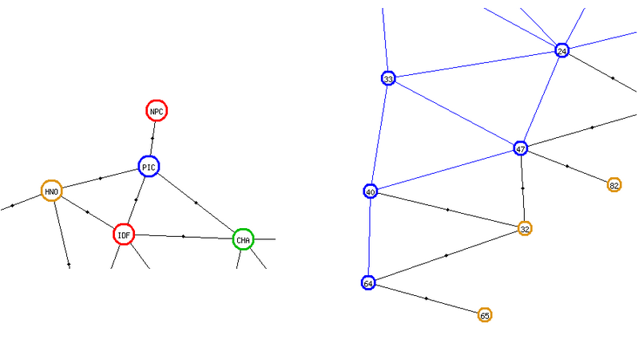

En consultant le
[lexique de la théorie des graphes](https://fr.wikipedia.org/wiki/Lexique_de_la_th%C3%A9orie_des_graphes),
j'ai trouvé la notion de
[point d'articulation](https://fr.wikipedia.org/wiki/Point_d%27articulation_(th%C3%A9orie_des_graphes)).

Dans le cas d'un graphe connexe, un point d'articulation est un sommet
qui assure  la connexité  du graphe. C'est-à-dire,  si on  supprime ce
sommet et les  arêtes associées, alors le graphe  restant cesse d'être
connexe. En reprenant les exemples ci-dessus, la Picardie est un point
d'articulation dans  la carte  des régions  de 1970,  car si  elle est
supprimée, alors la région  Nord-Pas-de-Calais n'est plus connectée au
reste de la  carte. De même, si on supprime  le département des Landes
de  la  région  Aquitaine  ou   de  la  Nouvelle-Aquitaine,  alors  le
département des  Pyrénées-Atlantiques n'est plus connecté  au reste de
la région.

Les  points  d'articulation  ne  sont  pas  toujours  associés  à  des
impasses. Ainsi,  dans la région  Pays de la Loire,  le Maine-et-Loire
(49) est  un point d'articulation  entre le groupe  Loire-Atlantique +
Vendée (44 et 85) et le groupe Mayenne + Sarthe (53 et 72).

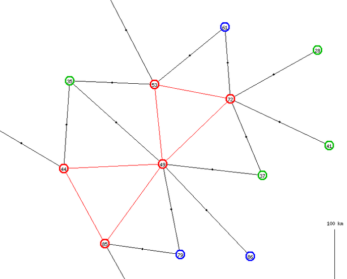

Il  est facile  de voir  que si  un graphe  contient une  impasse, les
chemins  hamiltoniens auront  tous cette  impasse comme  extrémité, au
début ou à  la fin. Il est  facile de voir également que  si un graphe
contient un  point d'articulation,  ce point d'articulation  ne pourra
pas être à une extrémité d'un chemin hamiltonien.

Le  concept   de  point   d'articulation  est  intéressant   pour  les
discussions d'humain à humain (cette documentation), mais pas pour les
discussions  d'humain à  ordinateur.  En d'autres  termes, ce  concept
n'est pas implémenté dans les programmes traitant les graphes.

Une  frontière intérieure  est une  frontière entre  deux départements
appartenant  à  la  même  région. Une  frontière  extérieure  est  une
frontière  entre   deux  départements   appartenant  à   deux  régions
différentes.  Ne vous  imaginez  pas  que cela  fasse  référence à  la
Belgique, au Luxembourg  et aux autres pays limitrophes  de la France.
Par extension,  un département  extérieur est  un département  avec au
moins  une frontière  extérieure et  un département  intérieur est  un
département qui  n'a que  des frontières  intérieures. Ainsi,  dans la
carte  `fr2015`, le  département  du Nord  (`59`)  est un  département
intérieur, car  toutes ses frontières  sont avec des  départements des
Hauts-de-France,  tandis   que  l'Oise   (`60`)  est   un  département
extérieur,   connecté  avec   deux  départements   normands  et   deux
départements d'Île-de-France.

Une  autre notion  est celle  de  cycles hamiltoniens.  Dans un  cycle
hamiltonien, le sommet d'arrivée est le  même que le sommet de départ,
ce qui veut dire que ce sommet est visité deux fois, contrairement aux
autres. Voici par  exemple le cycle `29 →  56 → 35 → 22 →  29` dans la
région  Bretagne. Dans  mon projet,  ce cycle  sera représenté  par un
chemin sans  l'étape finale, c'est-à-dire  `29 → 56 →  35 → 22`.  Il y
aura également  un champ booléen  dans la  table `Paths` et  une brève
mention entre parenthèses dans les pages web, rien de plus.

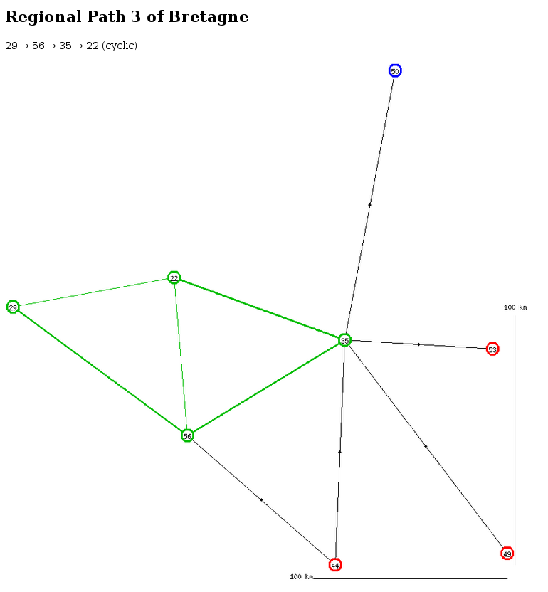

Il est possible de considérer que le cycle `22 → 29 → 56 → 35 → 22`,
le cycle `35 → 22 → 29 → 56  → 35` et
le cycle `56 → 35 → 22 → 29  → 56` sont la même chose que le cycle `29
→ 56 →  35 → 22 → 29`, représenté  d'une façon légèrement différente.
Dans mon projet,  il y aura quatre enregistrements  différents pour ce
cycle dans la table des chemins, `29 → 56  → 35 → 22`, `22 → 29 → 56 →
35`, `35 → 22 → 29 → 56` et `56 → 35 → 22 → 29`.

Base de données
===============

Maps
----

La  première  table  est  la   table  `Maps`  (Cartes).  La  clé  d'un
enregistrement est :

* `map` le code de la carte (sans caractère spécial, pour faciliter la constitution et l'analyse des URL).

Les autres informations sont :

* `name` une désignation compréhensible pour cette carte,
* `nb_macro` le nombre de macro-chemins pour cette carte,
* `nb_full` le nombre de chemins complets pour cette carte.

Areas
-----

La deuxième table, `Areas` (Zones), contient à la fois les régions
et les départements. La clé d'un enregistrement est :

* `map` le code de la carte (table `Maps`),
* `level` valant `1` pour les régions et `2` pour les départements,
* `code` permettant d'identifier la zone.

Pour un département, le code est le numéro à deux chiffres (pas trois,
parce que  les DOM ne  sont pas repris). Pour  une région de  2015, il
s'agit des trois dernières lettres du  code ISO 3166-2, tel qu'on peut
le voir
[dans cette page](https://fr.wikipedia.org/wiki/R%C3%A9gion_fran%C3%A7aise#Liste_et_codification_ISO_3166-2_des_r%C3%A9gions_actuelles).
Pour les régions de 1970, il  s'agit de codes à trois lettres inspirés
de ceux des régions de 2015. Ces codes de 1970 n'ont rien d'officiel.

Les autres informations sont :

* `name`, la désignation standard de la région ou du département,
* `long` et `lat`, une longitude et une latitude approximatives,
* `color`, la couleur qui sera utilisée pour l'affichage des cartes,
* `upper`, pour les départements, le code de la région d'appartenance,
* `nb_paths` pour les régions, le nombre de chemins régionaux (micro-chemins).
* `exterior` montrant si le département est relié à une autre région

Il  est prévu  deux  vues  sur cette  table,  la  vue `Big_Areas`  qui
sélectionne  le niveau  1  des  régions et  la  vue `Small_Areas`  qui
sélectionne le niveau 2 des départements.

La latitude et la longitude servent à l'affichage des cartes. Bien que
le  problème  des chemins  doublement  hamiltoniens  soit purement  un
problème de graphe  sans aucun rapport avec la  géométrie, les graphes
seront  visualisés de  telle  façon que  l'on  puisse reconnaître  les
cartes géographiques.

Le champ `exterior` n'a de signification que pour les départements. Il
vaut `1`  si le département a  au moins une frontière  commune avec un
département d'une autre  région et il vaut `0` si  tous les voisins du
département appartiennent à la même région.

Borders
-------

La  table `Borders`  (Frontières) énumère  les paires  de départements
limitrophes  ou les  paires  de régions  limitrophes.  Pour un  graphe
mathématique, cela correspond aux arêtes. La clé est constituée de :

* `map` le code de la carte (table `Maps`),
* `level` valant `1` pour les régions et `2` pour les départements,
* `from_code` le code de la première zone,
* `to_code` le code de la deuxième zone.

Autres champs :

* `upper_from` le code du supérieur hiérarchique de `from`,
* `upper_to`  le code du supérieur hiérarchique de `to`,
* `long`, une longitude facultative,
* `lat`, une latitude facultative,
* `color`.

La plupart du  temps, la longitude et la latitude  resteront à zéro et
dans  la représentation  graphique,  l'arête sera  représentée par  un
unique  segment de  droite. Dans  certains  cas, le  dessin peut  être
encombré par endroits.  Un moyen pour l'éclaircir peut  être de tracer
les arêtes avec deux segments de droite  au lieu d'un. Dans ce cas, la
longitude et  la latitude repèrent  l'endroit où les deux  segments se
joignent.

Dans  le cas  des départements  français, le  seul cas  de figure  est
l'arête  entre  la Seine-et-Marne  (77)  et  le Val-d'Oise  (95),  qui
risquait de se faire masquer  par la Seine-Saint-Denis (93). J'ai donc
prévu un point intermédiaire un peu au nord de la ligne droite.

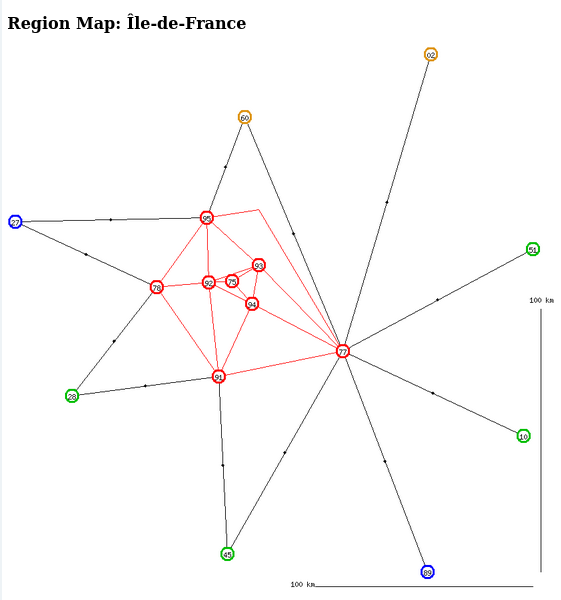

Pour  une frontière  entre  deux départements  d'une  même région,  la
couleur  sera  celle de  la  région.  Pour  une frontière  entre  deux
départements  de   régions  différentes,  la  couleur   sera  le  noir
(`Black`).  Et pour  les frontières  de  niveau 1,  entre régions,  la
couleur sera forcément le noir.

Pour  une  frontière  donnée,  il  y  aura  deux  enregistrements,  en
intervertissant `from_code` et `to_code`.

Comme pour  la table  `Areas`, il  y aura  deux vues  `Big_Borders` et
`Small_Borders` en fonction du niveau.

Paths
-----

La table  `Paths` (Chemins)  liste tous les  chemins pour  une carte :
macro-chemins entre régions, micro-chemins (ou chemins régionaux) pour
les départements  au sein  d'une région et  chemins complets  pour les
départements dans la carte complète. La clé est constituée de :

* `map` le code de la carte (table `Maps`),
* `level` valant `1` pour les macro-chemins, `2` pour les chemins régionaux et `3` pour les chemins complets,
* `area`, champ vide pour les macro-chemins et les chemins complets, le code de la région concernée pour les chemins régionaux.
* `num`, un numéro séquentiel.

Les autres champs sont :

* `path`, une chaîne de caractères listant les zones traversées par le chemin
* `from_code`, code de la zone de départ du chemin,
* `to_code`, code de la zone d'arrivée du chemin,
* `cyclic`, indiquant si le chemin est cyclique,
* `macro_num`, numéro éventuel du macro-chemin associé.

Le champ  `path` contient les  codes des départements (ou  des régions
pour les macro-chemins)  séparés par une flèche `→`. Dans  la carte de
1970, la  région Languedoc-Roussillon possède deux  chemins régionaux.
Voici l'un d'eux comme exemple :

```
   map         'fr1970'
   level       2
   area        'LRO'
   num         1
   path        '48 → 30 → 34 → 11 → 66'
   from_code   '48'
   to_code     '66'
   cyclic      0
   macro_num   0
```

Il n'y a pas de contrainte de  clé unique sur le quadruplet `map level
area num`.  Cela nous permet  de trier  et de renuméroter  les chemins
générés. L'ordre le  plus intéressant consiste à  grouper ensemble les
chemins partant de la même zone  (`from_code`), puis au sein de chaque
groupe de  les grouper  par zone d'arrivée  (`to_code`) et  enfin dans
l'ordre alphabétique des chemins `path`.

Le champ `cyclic` contient `1` pour  les chemins cycliques et `0` pour
les chemins ouverts.  Un chemin cyclique est un chemin  dans lequel la
zone de  départ et la  zone d'arrivée  ont une frontière  commune. Par
exemple, dans la région `PIC` de la carte `fr1970`, le chemin `02 → 60
→ 80` est cyclique.  On pourrait le compléter en `02 → 60  → 80 → 02`,
mais on ne le  fait pas. Par convention, les chemins  à une seule zone
et zéro  frontière sont cycliques (chemin  pour la région `IDF`  de la
carte `frreg`), tout  comme les chemins à deux zones  et une frontière
(chemins pour la région `NOR` de la carte `frreg`).

La relation  entre les macro-chemins  et les chemins complets  est une
relation 0..n ↔  1..1. Un macro-chemin permet de générer  un nombre _a
priori_ indéterminé de chemins complets, mais un chemin complet dérive
d'un seul macro-chemin. Le champ `macro_num` matérialise ce lien.

En revanche, il  n'y a aucune relation entre les  macro-chemins et les
chemins  régionaux.  D'autre  part,  la  relation  entre  les  chemins
complets et les chemins régionaux est une relation 0..n ↔ 0..n. D'où :

Path\_Relations
---------------

Cette table matérialise la relation  entre les chemins complets et les
chemins régionaux. Elle contient les champs suivants :

* `map` le code de la carte (table `Maps`),
* `full_num` le numéro `num` du chemin complet,
* `area` le code de la région,
* `region_num` le numéro `num` du chemin régional.

Messages
--------

Cette table permet de conserver la trace de la génération des chemins.
Elle  permettra   notamment  de  rappeler  pourquoi   telle  ou  telle
génération de chemin a échoué. La clé d'un enregistrements est :

* `map` le code de la carte (table `Maps`),
* `dh` la date et l'heure de génération du message.

Les autres informations sont :

* `errcode` code du message ou de l'erreur,
* `area` code de la zone concernée par l'erreur,
* `nb` nombre associé à l'erreur ou au message, par exemple le nombre de chemins générés.
* `data` des données fournissant un complément d'information au message, par exemple la liste des zones en impasse.

Initialisation
==============

Pour  des  raisons  de  copyright,   je  ne  livre  pas  de  programme
d'initialisation pour  les jeux comme Risk  ou War on Terror.  Le seul
programme  d'initialisation concerne  les  régions  françaises et  les
départements français.

Ce  programme  est  plus compliqué  qu'un  programme  d'initialisation
standard, car il est prévu pour traiter trois niveaux hiérarchiques au
lieu de deux : les régions de 2015, puis les régions de 1970, puis les
départements. Il charge à la  fois les trois cartes `fr1970`, `fr2015`
et `frreg`.

Dans un premier temps, le programme lit un fichier séquentiel avec des
lignes de différents types :

* lignes `A` pour les régions de 2015,
* lignes `B` pour les régions de 1970,
* lignes `AB` pour les régions de 1970 qui ont été reprises telles quelles dans le découpage de 2015,
* lignes `C` pour les départements.

Outre le code et le nom en clair  de la région, les lignes `A` et `AB`
contiennent  le  schéma  de  coloriage pour  les  cartes  `fr2015`  et
`frreg`. Les  lignes `AB`  et `B` contiennent  le schéma  de coloriage
pour la carte  `fr1970`. Les lignes `C` contiennent la  latitude et la
longitude  des  départements,  pour  les positionner  sur  les  cartes
générées, ainsi que la liste des départements limitrophes.

J'ai constitué  le fichier texte  de la façon suivante.  J'ai consulté
[Géo Portail](https://www.geoportail.gouv.fr/)
en n'affichant que le fond  de carte « limites administratives ». Pour
chaque département,  j'ai cliqué  en plein milieu,  j'ai fait  un clic
droit et j'ai sélectionné « adresse / coordonnées du lieu ». Puis j'ai
copié-collé la latitude et la longitude dans le fichier. J'ai pris les
valeurs telles quelles, avec cinq  décimales. Or, un degré de latitude
fait  111 km et,  à la  latitude de  45°, un  degré de  longitude fait
78 km.  La  cinquième  décimale  sur   la  longitude  et  la  latitude
représente  donc une  précision de  l'ordre du  mètre. J'aurais  pu me
contenter de deux décimales. Tant pis.

Par  moment,  j'ai  zoomé  au voisinage  des  points  quadruples  pour
vérifier   quels  départements   sont  contigus   avec  quels   autres
départements.  Voir  par exemple  la  limite  entre le  Vaucluse,  les
Bouches-du-Rhône, le  Var et  les Alpes  de Haute-Provence,  par 43,72
degrés de latitude nord et 5,75 degrés de longitude est.

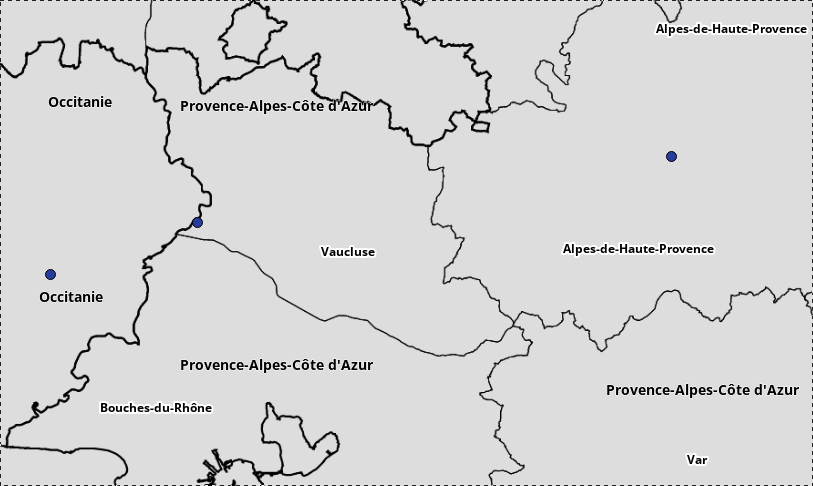

Autre  sujet,  illustré par  le  même  dessin ci-dessus.  Normalement,
chaque frontière entre deux départements  est spécifiée deux fois dans
le fichier en entrée. Par exemple,  il y a une frontière commune entre
le Var (83)
et le Vaucluse (84). La  ligne `C ; 83` doit mentionner le département
84  et  la  ligne  `C ; 84`  doit mentionner  le  département  83.  Le
programme  d'initialisation testera  que  les  déclarations sont  bien
symétriques.

Lors  de  la première  étape,  les  enregistrements des  départements,
c'est-à-dire  avec des  clés `fr1970`+`2`  et `fr2015`+`2`  sont créés
avec toutes les valeurs renseignées, mais pour les enregistrements des
régions,  avec  des  clés `fr1970`+`1`,  `fr2015`+`1`  `frreg`+`1`  et
`frreg`+`2`, la latitude et la  longitude seront laissées vides et les
enregistrements   de  la   table   `Borders`  ne   seront  pas   créés
immédiatement.

C'est seulement lors  d'une seconde étape que  les enregistrements des
régions sont complétés. Le programme calcule la moyenne des longitudes
et des  latitudes des départements  appartenant à chaque  région, puis
stocke  ces   deux  moyennes   dans  l'enregistrement  de   la  région
correspondante.

De même,  le programme  alimente les enregistrements  `fr1970`+`1`, et
`frreg`+`2` de la table `Borders` en  faisant une synthèse de tous les
enregistrements `fr1970`+`2` de `Borders` qui se trouvent à cheval sur
deux régions.  Il alimente également les  enregistrements `fr2015`+`1`
et `frreg`+`1` à partir des enregistrements `fr2015`+`2` de `Borders`.

Extraction des chemins hamiltoniens
===================================

Cas général
-----------

Le programme  se base  sur une  liste de  chemins partiels.  Un chemin
partiel  est  une structure  de  données  constituée d'une  chaîne  de
caractères,  le  début  du  chemin,  plus  un  ensemble  groupant  les
départements qui  n'ont pas  encore été visités  par le  chemin. Cette
structure n'a pas vocation à être stockée en base de données. Dans les
descriptions  ci-dessous,   je  représente  les  ensembles   avec  des
accolades ainsi que je l'ai appris  il y a longtemps en mathématiques.
Les  accolades   n'ont  pas  de   rapport  avec  la  notion   de  bloc
d'instructions ni avec la notion de référence à une table de hachage.

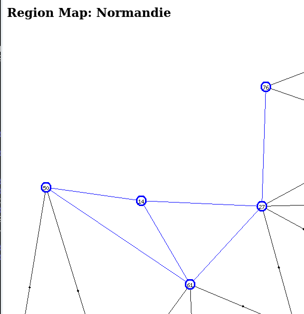

Prenons comme exemple l'extraction des  chemins régionaux de la région
Normandie dans la  carte `fr2015`. Au début, le  programme alimente la
liste avec les chemins partiels suivants :

```
'14'   { 27 50 61 76 }
'27'   { 14 50 61 76 }
'50'   { 14 27 61 76 }
'61'   { 14 27 50 76 }
'76'   { 14 27 50 61 }
```

Le programme extrait  un chemin partiel de la  liste, sélectionne tous
les départements  voisins du premier  et figurant dans  l'ensemble des
départements inutilisés. Pour chaque département ainsi sélectionné, le
programme complète la chaine de  caractères et supprime le département
de  l'ensemble. Ainsi,  en supposant  que  le programme  a extrait  le
chemin partiel commençant par l'Eure (27), les départements inutilisés
sont  14, 50,  61 et  76, mais  le département  50 (Manche)  n'est pas
voisin de 27. Donc le  programme construit trois chemins partiels avec
les trois autres  départements. la liste des  chemins partiels devient
donc :

```
'14'        { 27 50 61 76 }
'27 → 14'   { 50 61 76 }
'27 → 61'   { 14 50 76 }
'27 → 76'   { 14 50 61 }
'50'        { 14 27 61 76 }
'61'        { 14 27 50 76 }
'76'        { 14 27 50 61 }
```

Ensuite,  le  programme  extrait  le  chemin `'27  →  76'`.  Il  tente
d'extraire  les  voisins de  `76`  qui  figurent dans  l'ensemble  des
départements inutilisés,  `{ 14  50 61 }`.  Il n'y en  a pas.  Donc le
chemin `'27 → 76'` disparaît de la liste sans compensation.

Un  peu  plus tard,  après  avoir  traité successivement  les  chemins
`'50'`, `'50 → 61'` et `'50 → 61 → 14'`, la situation est :

```
'14'                  { 27 50 61 76 }
'27 → 14'             { 50 61 76 }
'27 → 61'             { 14 50 76 }
'50 → 14'             { 27 61 76 }
'50 → 61 → 14 → 27'   { 76 }
'50 → 61 → 27'        { 14 76 }
'61'                  { 14 27 50 76 }
'76'                  { 14 27 50 61 }
```

Le programme extrait  le chemin `'50 →  61 → 14 → 27'`.  Il déroule la
liste des départements à visiter, réduite à la Seine Maritime (76). La
Seine Maritime  est bien voisine  de l'Eure  (27), donc le  `'76'` est
enlevé  de l'ensemble  et  ajouté  à la  chaîne  de caractères.  Comme
l'ensemble  des départements  restant à  visiter est  vide, le  chemin
partiel `'50  → 61 → 14  → 27 →  76'` n'est plus un  chemin _partiel_,
c'est un  chemin régional _entier_. Il  est donc stocké dans  la table
`Paths` et il n'est pas réinjecté dans la liste des chemins partiels.

Cas particulier des impasses
----------------------------

Ainsi  qu'on l'a  vu  ci-dessus, lorsqu'un  département constitue  une
impasse dans sa région d'appartenance, il est impossible de trouver un
chemin hamiltonien où ce département  figure au milieu. Le département
en impasse est toujours au début ou à la fin du chemin régional.

Pour accélérer la génération des chemins régionaux, au lieu d'alimenter
la liste avec tous les départements :

```
'14'   { 27 50 61 76 }
'27'   { 14 50 61 76 }
'50'   { 14 27 61 76 }
'61'   { 14 27 50 76 }
'76'   { 14 27 50 61 }
```

on alimente  cette liste avec  uniquement le chemin commençant  par le
département en impasse, c'est-à-dire avec

```
'76'   { 14 27 50 61 }
```

Et on positionne un indicateur pour  rappeler que chaque fois que l'on
stocke dans la base de données un chemin régional commençant par `76`,
il faut aussi stocker le chemin inverse, se terminant par `76`.

S'il y  a deux départements en  impasse (cf dans la  carte `fr1970` le
Languedoc-Roussillon, mais  aussi l'Alsace,  la Haute-Normandie  et le
Nord-Pas-de-Calais), on prend l'un des deux, peu importe.

Et s'il y en a trois, on  arrête tout, on sait qu'il est impossible de
construire un chemin hamiltonien dans cette région.

Le  programme commence  donc par  compter pour  chaque département  le
nombre de  frontières qu'il partage  avec des départements de  la même
région.

Remarque : le même raisonnement peut se faire au niveau des régions.

Cas des départements isolés
---------------------------

Puisque le programme cherche les  départements avec un seul voisin, il
fait attention également aux départements avec aucun voisin.

Si l'on  trouve un  département sans aucun  voisin, cela  peut vouloir
dire que le  graphe de la région  n'est pas connexe. Ce  serait le cas
dans  une  carte  de  Britannia  en  ne  prenant  que  les  frontières
terrestres et en  ignorant les liaisons côtières.  Ainsi, les Hébrides
ne  seraient plus  reliées  à Skye  et les  Orcades  ne seraient  plus
reliées à Caithness, le graphe de  l'Écosse, qui comporte 10 zones, ne
serait plus  connexe. Dans ce  cas, le programme arrête  la génération
des chemins avec un message d'erreur.

Cela dit, il y a un cas de figure où cela ne constitue pas une erreur.
Ce  cas de  figure  est présent  à plusieurs  reprises  dans la  carte
`frreg`. Certaines régions de 2015  ne contiennent qu'une seule région
de   1970 :  Bretagne,   Pays   de   la  Loire,   Centre-Val-de-Loire,
Île-de-France et Provence-Alpes-Côte-d'Azur. Dans ce cas il est normal
que l'unique région-1970 de la région-2015 n'ait aucun voisin. Dans le
dessin ci-dessous,  on voit clairement  que les régions-1970  `IDF` et
`BRE` sont isolées dans les  régions-2015 correspondantes et on devine
qu'il en est de même pour les régions-1970 `PDL` et `CEN`.

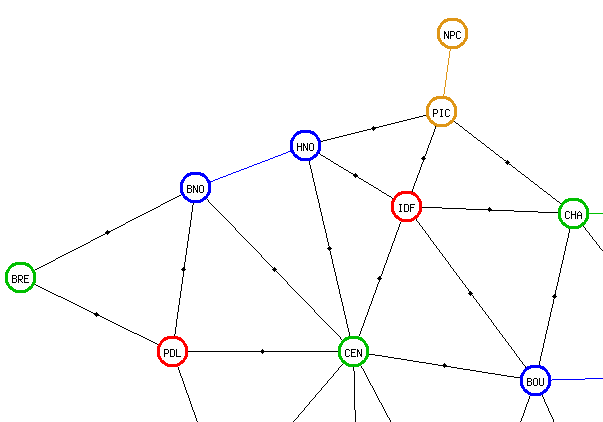

Un autre  cas de  figure, la région  Pays de Galles  dans la  carte de
Britannia,  n'est pas  traité dès  l'initialisation. Pour  des raisons
ludiques, la  zone Cornouailles  et la zone  Devon sont  rattachées au
Pays de  Galles. Si l'on  ne tient  pas compte des  liaisons maritimes
côtières,  alors il  n'y a  pas  d'arête entre  la composante  connexe
Cornouailles +  Devon et la  composante connexe principale du  Pays de
Galles (Powys et les autres). Ce cas  de figure ne sera pas détecté au
début du  traitement. Le  programme commencera  à générer  les chemins
hamiltoniens. Comme les Cornouailles et le Devon sont des impasses, le
programme  générera soit  `COR  →  DEV`, soit  `DEV  →  COR`, puis  se
retrouvera  bloqué.  Le  traitement   de  génération  s'arrêtera  donc
rapidement avec  un constat  d'échec comme  attendu, mais  il tournera
quand même.

File FIFO ou pile LIFO ?
------------------------

Comment  choisit-on le  chemin partiel  à  traiter dans  la liste  des
chemins partiels ? Nous avons plusieurs possibilités :

* L'accès pédagogique, utilisé ci-dessus. Chaque fois que l'on extrait
un chemin partiel de la liste,  comme par hasard c'est celui qui donne
le  résultat le  plus intéressant  et,  autant que  possible, le  plus
rapidement. Impossible à  mettre en œuvre dans  un véritable programme
fonctionnant sur du silicium, le  programme de génération n'est pas un
programme d'intelligence artificielle.

* L'accès aléatoire.  Cela existe en Raku,  avec l'instruction `pick`.
Pas commode pour la reproductibilité, donc pour le débugage.

* L'accès en file, avec le sigle anglais _FIFO_.

* L'accès en pile, avec le sigle anglais _LIFO_.

Il va de soi que le choix se réduit aux deux derniers. Dans _Mastering
Algorithms with Perl_, à une page que je ne retrouve plus, les auteurs
écrivent que l'intérêt  de l'accès en file est  qu'il permet d'obtenir
les  chemins les  plus courts.  Dans  un graphe  non-orienté avec  _S_
sommets et _A_ arêtes, tous  les chemins hamiltoniens ont une longueur
de _S-1_ et  tous les chemins eulériens ont une  longueur de _A_. Dans
un cas  comme dans l'autre, la  recherche du chemin le  plus court n'a
pas de sens et il n'y a aucun intérêt à utiliser un accès en file.

Reprenons la question plus précisément. Utiliser un accès en file fait
que l'on génère d'abord tous les  chemins de longueur 1, puis tous les
chemins de longueur  2 en purgeant les chemins de  longueur 1, puis on
génère  tous les  chemins de  longueur 3  en purgeant  les chemins  de
longueur  2. Et  ainsi de  suite.  Arrive un  moment où  la liste  des
chemins partiels contient tous les  chemins de longueur _S-2_. C'est à
ce moment-là  seulement que  l'on génère les  chemins entiers   et que
l'on alimente la base de données  tout en purgeant la liste en mémoire
vive. Dans le cas de la carte `fr2015` (12 sommets, 23 arêtes), il y a
894 chemins  entiers. Donc il a  eu au moins 894  chemins partiels de
longueur _S-2_,  tous stockés en mémoire  vive. En fait, la  liste des
chemins partiels contient un nombre supérieur de chemins partiels, car
il y  a également des  chemins _S-2_ qui ne  donneront pas lieu  à des
chemins  entiers  _S-1_.  Par  exemple, vous  trouverez  des  chemins
partiels contenant le sous-chemin `HDF →  NOR → PDL → NAQ`, mais aucun
de  ces chemins  ne pourra  engendrer  un chemin  _S-1_ atteignant  la
Bretagne (`BRE`).  Tous ces chemins partiels  infructueux sont stockés
dans la liste avec les 894 chemins partiels fructueux.

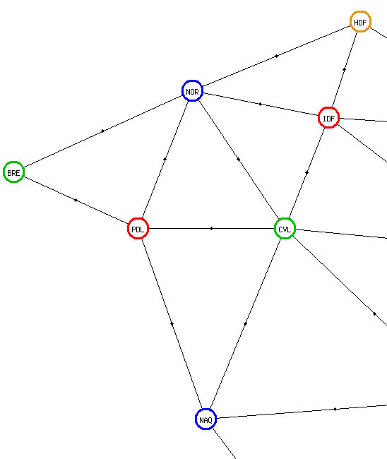

À  l'inverse, avec  un accès  en pile,  certains chemins  entiers sont
générés  et stockés  en  base  de données  très  tôt.  En ajoutant  un
mouchard dans la génération des chemins, on peut constater que pour la
carte `fr2015`,  le nombre de chemins  partiels simultanément présents
dans la liste ne dépasse jamais 25.

La taille  maximale théorique  de la  liste utilisée  en LIFO  peut se
calculer  en  se   basant  sur  un  graphe  complet   à  _S_  sommets,
c'est-à-dire un graphe dans lequel chacun des _S_ sommets est adjacent
aux _S-1_ autres sommets (ne pas confondre ce sens de « complet » avec
celui de « chemin complet »).

Au début, le programme stocke _S_ chemins partiels avec un seul
sommet et  aucune arête.  Puis il  extrait l'un de  ces chemins  et le
remplace par _S-1_ chemins partiels de  longueur 1. Puis il extrait un
chemin  partiel de  longueur 1  et le  remplace par  _S-2_ chemins  de
longueur 2. Et ainsi de suite. La  taille maximale est donc égale à la
somme des  nombres de  _S-1_ à _1_.  Pour les 12  sommets de  la carte
`fr2015`, cela donne  une taille maximale de 66, ce  qui est largement
en-deçà de  la taille 894, qui  est elle-même inférieure au  nombre de
chemins _S-2_ qui  auraient été stockés dans la  liste fonctionnant en
FIFO.

Tri final
---------

Une  fois tous  les chemins  créés pour  une carte  et une  région, le
programme  relit   les  chemins,  triés  par   département  de  départ
(`from_code`),  par département  d'arrivée (`to_code`)  et par  chemin
(`path`). Un numéro séquentiel est attribué à chaque enregistrement de
la  table  `Paths`  ainsi  lu.  Certes,  pendant  cette  opération  de
renumérotation, il pourra  y avoir des doublons  dans la numérotation,
mais c'est  purement temporaire. Une fois  la renumérotation terminée,
il n'y a plus de doublons ni de trous.

Construction des chemins complets
=================================

Le  principe général  est le  suivant. On  prend un  macro-chemin, par
exemple `NOR → HDF  → GES → etc` dans la  carte `fr2015`. Le programme
remplace la  première région par  un chemin hamitonien  régional. Cela
donne `14 →  50 → 61 → 27 →  76 →→ HDF → GES →  ...`. La double flèche
sert à  identifier le point  où les  départements cèdent la  place aux
régions. En fait,  on ne choisit pas un seul  chemin hamiltonien de la
région `NOR`. On les  prend tous, on les met dans  la liste `to-do` et
on en extrait un.

Étape suivante. Le programme cherche  tous les départements voisins du
dernier département  `76` (Seine-Maritime)  et qui appartiennent  à la
région `HDF`.  Il s'agit  dans ce  cas des  départements `60`  et `80`
(Oise et Somme).  Puis il cherche tous les chemins  hamiltoniens de la
région `HDF` qui commencent en `60`  ou en `80`. Le programme remplace
le code de la région par chaque chemin, ce qui donne cet exemple :

```
Avant :
14 → 50 → 61 → 27 → 76 →→ HDF → GES → ...
Après :
14 → 50 → 61 → 27 → 76 → 60 → 02 → 59 → 80 → 62 →→ GES → ...
14 → 50 → 61 → 27 → 76 → 60 → 02 → 80 → 62 → 59 →→ GES → ...
14 → 50 → 61 → 27 → 76 → 60 → 80 → 62 → 59 → 02 →→ GES → ...
14 → 50 → 61 → 27 → 76 → 80 → 62 → 59 → 02 → 60 →→ GES → ...
14 → 50 → 61 → 27 → 76 → 80 → 60 → 02 → 59 → 62 →→ GES → ...
etc.
```

Chaque  chemin partiel  est  stocké  dans la  liste  `to-do`. Puis  on
continue en prenant l'un de ces chemins partiels et en s'intéressant à
la région suivante.

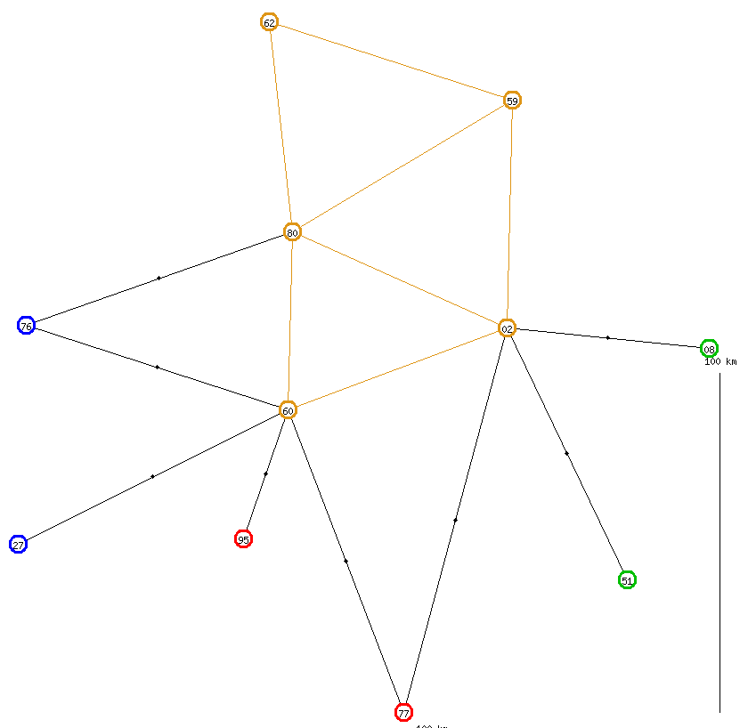

Il  est  possible  que  l'on  soit   coincé.  C'est  le  cas  dans  la
continuation de l'exemple ci-dessus avec l'un des chemins `... → 62 →→
GES → ...`. En effet, il n'existe aucun département qui soit à la fois
voisin du  dernier département `62`  et qui appartienne à  la nouvelle
région `GES`. Dans ce cas, la  liste `to-do` ne reçoit aucun chemin en
remplacement du chemin partiel infructueux.

Le  blocage peut  se  faire  en listant  les  départements voisins  du
dernier département du chemin et appartenant à la prochaine région. Il
peut aussi  se produire  après avoir trouvé  ces départements  mais en
cherchant  les chemins  hamiltoniens régionaux.  Ainsi, supposons  que
l'on ait  un chemin `... →  78 →→ NOR  → ...`. Le programme  trouve un
département qui convient, `27` mais  comme ce département est un point
d'articulation dans la région `NOR`, aucun chemin hamiltonien régional
ne  commence en  `27`.  Le  programme ne  stockera  donc aucun  chemin
partiel en remplacement du chemin `... → 78 →→ NOR → ...`.

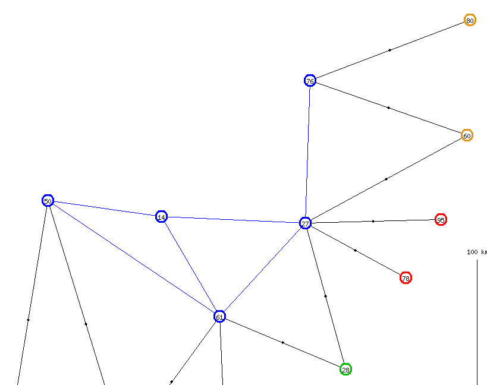

Ci-dessus, la recherche  des départements voisins et  la recherche des
chemins  régionaux  sont présentées  comme  des  processus séparés  et
successifs. En fait,  avec la jointure SQL qui va  bien, ces processus
sont rassemblés en un seul.

Optimisation
------------

Parmi les chemins incomplets générés ci-dessus, certains sont de toute
évidence stériles, les chemins dont le dernier département est `59` ou
`62`. Pourquoi ? Parce que le  chemin doit poursuivre à l'extérieur de
la  région  `HDF` et  ces  deux  départements n'ont  aucune  frontière
commune avec une autre région.

Il y a une  exception à cette considération. Si la  région en cours de
traitement  (`HDF` dans  l'exemple) est  la dernière  du macro-chemin,
alors n'importe quelle arrivée est  valide, y compris les départements
« intérieurs » comme `59` et `62`.

En conséquence, le programme dispose de deux instructions `select`. La
première contient une  seule jointure entre la  vue `Small_Borders` et
la vue `Region_Paths` et est  utilisée lorsque la génération du chemin
complet  est sur  le point  d'aboutir.  Le deuxième  `select` est  une
jointure  entre `Small_Borders`  et  `Region_Paths`,  mais aussi  avec
`Small_Areas`, pour s'assurer que le  département final permet bien de
quitter la région.

En  reprenant l'exemple  ci-dessus,  la  génération sans  optimisation
aurait alimenté la liste `to-do` avec les chemins suivants :

```
14 → 50 → 61 → 27 → 76 → 60 → 80 → 62 → 59 → 02 →→ GES → ...
14 → 50 → 61 → 27 → 76 → 60 → 02 → 80 → 62 → 59 →→ GES → ...
14 → 50 → 61 → 27 → 76 → 60 → 02 → 59 → 80 → 62 →→ GES → ...
14 → 50 → 61 → 27 → 76 → 60 → 02 → 80 → 59 → 62 →→ GES → ...
14 → 50 → 61 → 27 → 76 → 60 → 80 → 02 → 59 → 62 →→ GES → ...
14 → 50 → 61 → 27 → 76 → 60 → 02 → 59 → 62 → 80 →→ GES → ...
14 → 50 → 61 → 27 → 76 → 80 → 62 → 59 → 02 → 60 →→ GES → ...
14 → 50 → 61 → 27 → 76 → 80 → 60 → 02 → 59 → 62 →→ GES → ...
```

Avec  l'optimisation  la liste  de  chemins  mémorisés dans  la  liste
`to-do` se limitera à :

```
14 → 50 → 61 → 27 → 76 → 60 → 80 → 62 → 59 → 02 →→ GES → ...
14 → 50 → 61 → 27 → 76 → 60 → 02 → 59 → 62 → 80 →→ GES → ...
14 → 50 → 61 → 27 → 76 → 80 → 62 → 59 → 02 → 60 →→ GES → ...
```

Comme vous  l'avez sans  doute remarqué, sur  ces trois  chemins, deux
échoueront malgré tout, le chemin contenant `... → 80 →→ GES → ...` et
le chemin contenant `... → 60 →→ GES → ...`, parce que ni `80` ni `60`
ne  sont voisins  de la  région `GES`.  Vouloir ajuster  l'instruction
`select`  pour s'assurer  que ces  chemins sont  invalides et  pour ne
stocker  que des  chemins  pour lesquels  le  dernier département  est
réellement voisin de la région suivante conduirait à un ordre `select`
alambiqué, un effort démesuré par rapport au gain obtenu.

3 chemins au  lieu de 8, cela ne semble  pas grand-chose. Examinons le
cas de  la région `IDF`  qui a  800 chemins hamiltoniens  régionaux et
d'un macro  chemin `...  HDF →  IDF → GES  ...`. L'accès  depuis `HDF`
(`60` ou `80`) se fait  soit par le département `77` (Seine-et-Marne),
soit  par le  département `95`  (Val-d'Oise) et  la sortie  vers `GES`
(`10` or `51`) se fait obligatoirement par le département `77`.

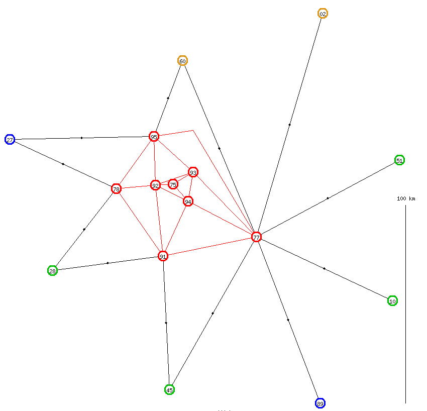

Sans optimisation, il y a 104  chemins régionaux commençant en `77` et
93 chemins  régionaux commençant en  `95`. Le programme  aurait empilé
197 chemins dans la liste `to-do`.

```
select max(P.from_code), max(A.exterior), count(*)
from Region_Paths P
join Small_Areas  A
  on A.map   = P.Map
  and A.code = P.to_code
where P.map  = 'fr2015'
and   P.area = 'IDF'
group by P.from_code, A.exterior
```

Avec l'optimisation retenue, il y a 60 chemins régionaux commençant en
`77` et aboutissant dans un département intérieur (`75`, `92`, `93` ou
`94`), 44 chemins régionaux commençant  en `77` et aboutissant dans un
autre département  extérieur, 51 chemins régionaux  commençant en `95`
et aboutissant dans un département  intérieur et 42 chemins commençant
en `95`  et aboutissant  dans un  département extérieur.  Le programme
empilera 86 chemins au lieu de 197.

Avec l'optimisation plus fine, les seuls chemins régionaux utiles sont
les chemins  commençant en  `95` et aboutissant  en `77`.  Cela ferait
juste 13  chemins empilés dans la  liste `to-do`. C'est vrai  que cela
semble intéressant, finalement. Cela dit, pour l'instant, je ne prends
en compte que la première optimisation.

```
select max(P.from_code), max(P.to_code), count(*)
from Region_Paths P
where P.map  = 'fr2015'
and   P.area = 'IDF'
and   exists (select 'x'
              from Small_Borders B
              where  B.map       = P.Map
              and    B.from_code = P.to_code
              and    B.upper_to  = 'GES')
group by P.from_code, P.to_code
```

Un  autre   point :  comme   pour  la  génération   des  macro-chemins
hamiltoniens et  des chemins hamiltoniens régionaux,  la liste `to-do`
du présent programme sera utilisée en mode LIFO.

Simplification
--------------

Après avoir dédoublé un ordre SQL pour des besoins de performances, je
vais rassembler deux ordres SQL pour des besoins de simplification.

Dans le cadre de ce chapitre, je vais m'intéresser à la carte `fr2015`
(12 régions) et à un macro-chemin `NOR  → HDF → GES → etc`, ainsi qu'à
une  carte  ne  comportant  qu'une  seule  région  (et  donc  un  seul
macro-chemin  réduit à  cette région).  Pour traiter  ces deux  cas de
figure, il faut quatre boucles différentes.

### Étape 1 pour `fr2015`

Une boucle sélectionnant les chemins  régionaux en faisant attention à
la sortie, mais sans se préoccuper de l'entrée.

```
select xxx
from Region_Paths        B
join with Small_Regions  C
   on  C.map      = B.map
   and C.code     = B.to_code
   and C.exterior = 1
where B.map  = ?
where B.area = ?
```

On remplace la  première région par le  chemin régional correspondant,
on insére  une double flèche entre  le chemin régional de  la première
région  et le  code de  la deuxième  région, et  on alimente  la liste
`to-do` avec le résultat.

### Étapes 2 à 11 pour `fr2015`

Une boucle sélectionnant les chemins  régionaux en faisant attention à
la fois à l'entrée et à la sortie.

```
select xxx
from Small_Borders        A
join with Region_Paths    B
   on  B.map       = A.map
   and B.area      = A.upper_to
   and B.from_code = A.to_code
join with Small_Areas  C
   on  C.map      = B.map
   and C.code     = B.to_code
   and C.exterior = 1
where A.map       = ?
and   A.from_code = ?
```

On  fait  glisser  la  double  flèche après  la  région  en  cours  de
traitement,  on remplace  cette région  par le  chemin régional  et on
alimente la liste `to-do`.

### Étape 12 pour `fr2015`

Une boucle sélectionnant les chemins  régionaux en faisant attention à
l'entrée mais sans se préoccuper de la sortie.

```
select xxx
from Small_Borders        A
join with Region_Paths    B
   on  B.map       = A.map
   and B.area      = A.upper_to
   and B.from_code = A.to_code
where A.map       = ?
and   A.from_code = ?
```

On remplace la  dernière région par son chemin régional,  on enlève la
double flèche et on écrit le chemin complet dans la table `Paths`

### Étape unique pour la carte à une seule région

Une boucle sélectionnant  les chemins régionaux sans  se préoccuper de
l'entrée ni de la sortie.

```
select xxx
from Region_Paths B
where B.map = ?
```

et on écrit le chemin complet dans  la table `Paths`. En fait, dans ce
cas particulier, c'est  une simple recopie des  chemins régionaux vers
les chemins complets, avec juste quelques changements, comme la valeur
de `level`.

### Factorisation

L'idée est  d'ajouter une « étape  zéro » avec un  département virtuel
`*` relié à tous  les départements de la carte et  à traiter le chemin
`* →→  NOR → HDF →  GES → etc`  au lieu du chemin  `NOR → HDF →  GES →
etc`.  De la  sorte, lors  de l'étape  1, « ne  pas faire  attention à
l'entrée  du  chemin  régional »  est  équivalent  à  « s'assurer  que
l'entrée du chemin régional colle bien au département `*` » . Il n'y a
pas  besoin  d'insérer une  double  flèche,  elle existe  déjà  depuis
l'« étape zéro » et il suffit juste de la faire glisser comme dans les
étapes  2 à  11.  Le département  virtuel `*`  apparaît  dans une  vue
`Borders_With_Star`, destinée à remplacer  la vue `Small_Borders` dans
les ordres SQL ci-dessus.

La vue  `Borders_With_Star` sert également  à fusionner l'étape  12 de
`fr2015`  avec l'étape  unique  de  la carte  à  une  seule région.  À
l'occasion de cette étape, on supprime le préfixe `* →` ajouté lors de
l'étape zéro.

L'ajout d'un  nouveau département  ne perturbe  pas la  génération des
chemins complets.  En effet, comme  aucun macro-chemin ne  contient la
région virtuelle `*` à laquelle appartient le département virtuel `*`,
il n'y  a aucun  risque qu'un  chemin complet fasse  un détour  par le
département `*`.

Le   département  virtuel   `*`  apparaît   uniquement  dans   la  vue
`Borders_With_Star`.  Il n'apparaît  dans aucune  autre vue  ni aucune
table.  D'autre  part, les  frontières  virtuelles  entre `*`  et  les
départements réels sont à sens  unique, alors que les frontières entre
deux départements réels sont à double sens. La raison est que l'on n'a
pas besoin d'aller  d'un département réel vers le  département `*`, il
n'y a pas besoin de compliquer la vue `Borders_With_Star` pour assurer
le sens inverse.

Affichage du résultat
=====================

Pour des raisons exposées dans un
[projet précédent](https://github.com/jforget/Perl6-Alpha-As-des-As-Zero/blob/master/Description/description-fr.md#user-content-templateanti),
le seul module de _templating_ qui trouve grâce à mes yeux est
[`Template::Anti`](https://modules.raku.org/dist/Template::Anti:cpan:HANENKAMP),
car le  langage de _templating_  est tout simplement HTML  sans aucune
extension  et  sans  syntaxe  bizarre. Je  dirais  même  « sans  sucre
syntaxique  rajouté ».  J'ai  donc utilisé  `Template::Anti`  dans  ce
projet.

Le projet  comporte également  un aspect  graphique. Pour  générer des
graphiques par programme, j'utilise de préférence l'interpréteur
[Metapost](https://www.gutenberg-asso.fr/MetaPost)
inclus dans le programme
[LuaL<sup>A</sup>T<sub>E</sub>X](https://lataix-sebastien.developpez.com/tutoriels/latex/un-guide-pour-lualatex/).
Dans le cas présent, je vois mal comment intégrer
LuaL<sup>A</sup>T<sub>E</sub>X  avec le  fonctionnement d'un  serveur
web.

Le plan B, c'est d'utiliser
[GD](https://linux.die.net/man/3/gd).
Ça tombe bien, il existe un
[module GD pour Raku](https://github.com/raku-community-modules/GD).
Hélas,   ce  module   est   embryonnaire  et   il   lui  manque   deux
fonctionnalités  essentielles, l'affichage  de  chaînes de  caractères
dans le  graphique et le  choix de  l'épaisseur des traits,  alors que
c'est disponible avec la
[version Perl 5 du module GD](https://metacpan.org/pod/GD).

La solution adoptée est de passer par
[Inline::Perl5](https://modules.raku.org/dist/Inline::Perl5:cpan:NINE),
qui permet d'appeler des modules Perl 5 dans des programmes Raku.

Compte  tenu de  la  combinatoire  du problème,  il  est illusoire  de
conserver  les graphiques  dans des  fichiers permanents.  Les chemins
sont stockés en  format caractères dans la base de  données, cela fait
déjà beaucoup.  Les graphiques sont  générés à  la demande lors  de la
consultation du  site web. Ils ne  sont pas stockés dans  des fichiers
temporaires, ils sont  insérés directement dans le  source HTML, après
encodage en
[MIME::Base64](https://modules.raku.org/dist/MIME::Base64:zef:zef:raku-community-modules).

Organisation du site web
------------------------

Le  site est  prévu  pour  être multilingue.  Pour  l'instant, il  est
bilingue, disponible en anglais et  en français. Le code langue figure
en première position de l'URL.

La  page  d'accueil  est  juste   une  liste  en  anglais  des  cartes
disponibles  (liste  disponible  en  français, à  condition  de  taper
l'URL complet).

Pour chaque carte, nous avons :

* L'affichage détaillé de la carte complète, avec tous
les départements. URL :
http://localhost:3000/fr/full-map/fr2015

* L'affichage détaillé avec un chemin complet. URL :
http://localhost:3000/fr/full-path/fr2015/2

* L'affichage réduit, qui affiche seulement les régions. URL :
http://localhost:3000/fr/macro-map/fr2015

* L'affichage réduit avec un macro-chemin. URL :
http://localhost:3000/fr/macro-path/fr2015/2

* L'affichage d'une région, avec les départements limitrophes. URL :
http://localhost:3000/fr/region-map/fr2015/HDF

* L'affichage d'une région, avec un micro-chemin. URL :
http://localhost:3000/fr/region-path/fr2015/HDF/3

* L'affichage d'une région, avec la partie correspondante du chemin complet. URL :
http://localhost:3000/fr/region-with-full-path/fr2015/HDF/3

Quelques remarques
------------------

### Quelle est la projection utilisée pour les cartes ?

D'après [xkcd](https://xkcd.com/977/), il  s'agit de la transformation
« plate-carrée » (ou  _equirectangular_ en  anglais). Dans  un premier
temps, je prends la longitude et  la latitude et je les utilise telles
quelles  en tant  que coordonnées  rectangulaires. Cela  conduit à  un
rétrécissement au niveau  des basses latitudes et à  une dilatation du
côté des hautes latitudes. Un degré de longitude représente 81 km dans
le sud de la  France, mais seulement 70 km dans le  nord de la France.
En  revanche,  les  degrés  de  latitude  ne  sont  pas  affectés.  La
distorsion est donc moindre qu'avec la projection de Mercator.

Ensuite, les dimensions sont ajustées  pour occuper au mieux la taille
du  graphique  de  1000 × 1000  pixels.  Dans  le  cas  de  la  France
continentale, qui  fait 950 km d'ouest  en est  et 1000 km du  nord au
sud, cet ajustement  ne provoque pas de distorsion. Dans  le cas de la
Bretagne, par exemple, les quatre points  représentant les quatre départements sont
séparés  de 63 km  dans la  direction nord-sud  et de  172 km dans  la
direction est-ouest (si j'avais pris  la carte réelle et déterminé les
points extrêmes, cela aurait donné 273 km  d'ouest en est et 152 km du
nord au sud). La distorsion est plus sensible, car cela fait presque 6
pixels par km  dans la direction horizontale et presque  16 pixels par
km dans la direction verticale.

Finalement, j'ai décidé d'ajouter une échelle verticale et une échelle
horizontale  sur le  dessin  des cartes.  Ces  échelles n'étaient  pas
prévues dans ma vision initiale du projet. Je pense néanmoins qu'elles
ont une certaine utilité.

### Pourquoi les cartes régionales montrent les départements voisins ?

La  première  raison  est  l'affichage d'une  région  avec  un  chemin
complet.  En affichant  les départements  voisins, on  voit par  où le
chemin arrive dans la région et par  où il en sort. S'il n'y avait pas
les  départements  voisins,  l'affichage   du  chemin  complet  serait
identique à l'affichage du chemin régional (ou micro-chemin). De plus,
la  présence des  départements voisins  permet d'avoir  une `imagemap`
avec des liens hypertextes vers les régions voisines.

La seconde raison est la distorsion due à l'ajustement des coordonnées
telle  que  je l'ai  décrite  ci-dessus.  J'ai  pris l'exemple  de  la
Bretagne.    J'aurais   pu    prendre   l'exemple    de   la    région
Nord-Pas-de-Calais  ou  de la  région  Haute-Normandie  dans la  carte
`fr1970`. Le Nord-Pas-de-Calais  comporte seulement deux départements,
quasiment alignés sur une ligne  horizontale E-O. L'écart vertical est
de 0,21°, soit 23 km, tandis que  l'écart horizontal est de 1,3°, soit
92 km. Mais de  la façon dont les coordonnées sont  ajustées, les deux
points se seraient retrouvés dans  des coins diamétralement opposés du
graphique, avec  une échelle  de 43  pixels par  km dans  la direction
verticale et  de 11 pixels  par km  dans la direction  horizontale. En
ajoutant  les  voisins,  c'est-à-dire  la Somme  et  l'Aisne,  l'écart
vertical passe à 0,82°, soit 91 km, ce qui donne une échelle verticale
de  11  pixels par  km.  Dans  ce  cas,  la distorsion  est  quasiment
éliminée. Dans d'autres cas elle est simplement réduite.

Dans le cas de la  Haute-Normandie, les deux départements sont alignés
sur  une  ligne verticale  N-S.  L'écart  horizontal est  0,05°,  soit
3,62 km  et l'écart  vertical est  0,59° soit  65,5 km, ce  qui aurait
donné une échelle de 216 pixels par  km horizontal et 15 pixels par km
vertical.

Il y a pis.  Il y a la carte `frreg`,  avec les régions-2015 Bretagne,
Île-de-France,      Centre-Val-de-Loire,      Pays-de-la-Loire      et
Provence-Alpes-Côte-d'Azur,   qui   contiennent  chacune   une   seule
région-1970.  Dans  ce cas,  la  longitude  maximale  est égale  à  la
longitude minimale,  ce qui  est le  cas aussi  pour les  latitudes et
l'ajustement des  coordonnées se traduit  par deux divisions  zéro par
zéro. En faisant  intervenir les voisins, les divisions  zéro par zéro
sont évitées.

### Faire la moyenne des longitudes et latitudes pour situer une région

Attribuer  à une  région une  latitude et  une longitude  égales à  la
moyenne  des  coordonnées  des  départements de  cette  région,  c'est
séduisant. Mais ne risque-t-il pas d'y avoir des effets curieux ?

Dans  l'absolu, oui.  En  pratique,  non, au  moins  pour les  régions
françaises.

En  toute  rigueur  mathématique, aucun  département,  aucune  région,
aucune  zone  n'est  mathématiquement  convexe (à  part  peut-être  le
Colorado  et le  Wyoming aux  États-Unis). Il  y a  toujours un  léger
zig-zag sur les frontières, ce qui rend la zone concave. Néanmoins, il
y  a des  zones concaves presque  convexes  et il  y a  des zones concaves franchement
concaves. Ainsi,  la Moselle et le  Cantal ont un creux  beaucoup plus
prononcé que  les autres départements.  Si le creux était  encore plus
prononcé, il se pourrait que le centre géométrique du département soit
à  l'extérieur des limites du  département.

Dans les cartes ci-dessous, des copies d'écran de
[Géoportail](https://www.geoportail.gouv.fr/),
vous pouvez voir le creux au sud-est  de la Moselle et le creux au sud
du Cantal.  À titre de  comparaison, le dessin comporte  également une
carte de  la Mayenne,  un département  qui, vu  d'assez loin,  a l'air
d'être à peu près convexe.

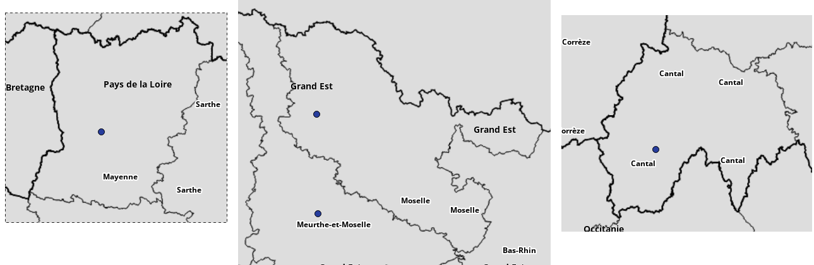

Compte tenu  de la façon  dont j'ai constitué le  fichier initialisant
les coordonnées  des départements,  les départements ne  pouvaient pas
être représentés  par un point  à l'extérieur. Même si  un département
avait eu  un creux encore plus  prononcé que le Cantal  ou la Moselle,
j'aurais choisi  un point  à l'intérieur des  frontières. Mais  s'il y
avait eu une  région avec un creux  proportionnellement aussi prononcé
que le Cantal ou la Moselle, le calcul de la moyenne des longitudes et
des latitudes des départements aurait pu aboutir à un centre dans le creux, donc à
l'extérieur de la frontière de la  région. Ce n'est pas le cas, aucune
région française n'a un creux bien prononcé.

En revanche, c'est le cas pour
[Maharadjah](https://boardgamegeek.com/image/82336/maharaja),
si  l'on inclut  les trois  zones maritimes  dans le  graphe pour  une
« région maritime » et les six  zones extérieures pour une « région de
l'étranger ». Le  calcul de  moyenne pour ces  deux régions  risque de
placer la  région maritime au  sein de l'Inde du  Sud et la  région de
l'étranger à l'intérieur de l'Inde du Nord.

C'est pis avec
[Britannia](https://boardgamegeek.com/image/5640409/britannia-classic-and-new-duel-edition),
si l'on tient compte des six  zones maritimes. Les six zones maritimes
forment un  cercle autour  des zones  terrestres, donc il  y a  fort à
parier que la latitude et la longitude attribuées à la région maritime
placeront cette région au centre  de la carte, nettement à l'intérieur
des frontières de l'Angleterre.

Dans  le  programme  d'initialisation  de  la  base  de  données  pour
Maharadjah et  dans celui pour  Britannia, j'aurais pu prévoir  un cas
particulier pour la  région maritime. Je ne l'ai pas  fait. Cela ne me
dérange  pas de  voir  une  macro-carte (ou  carte  réduite) avec  une
bizarrerie d'affichage.

### Pourquoi y a-t-il des points sur les frontières entre régions ?

Pour  la plupart  des  gens, les  frontières  entre deux  départements
appartenant  à deux  régions différentes  sont noires,  alors que  les
frontières entre deux départements de  la même région sont en couleur.
Les daltoniens ne peuvent pas  toujours percevoir cette différence. La
présence d'un point sur les frontières inter-régionales leur permet de
faire la différence entre les deux types de frontières.

### Performances

En essayant le programme `gener1.raku` sur la carte de Britannia, j'ai
recontré un gros problème avec  la génération des chemins hamiltoniens
régionaux  de  l'Angleterre  (20  « départements »  et  40  frontières
intérieures,  c'est-à-dire  80  enregistrements `Borders`).  En  règle
générale,  le programme  `gener1.raku` émet  un message  tous les  100
chemins entiers et un autre tous les 10000 chemins incomplets. Dans le
cas de  l'Angleterre, j'ai  observé que le  délai entre  deux messages
avait tendance  à s'allonger  au fil de  l'exécution du  programme. De
plus,  le gestionnaire  de  tâches  montrait que  sur  ma machine,  le
pourcentage   de   mémoire   utilisée   croissait   régulièrement   et
inexorablement. Il y a une fuite de mémoire quelque part !

Finalement,  j'ai compris.  J'avais  prévu un  `begin transaction`  au
début  du  traitement  et  un  `commit`  à  la  fin.  Pour  éviter  un
engorgement   du  journal,   j'avais  prévu   également  un   `commit`
immédiatement  suivi d'un  `begin  transaction` tous  les 100  chemins
entiers. Suite  à une erreur,  il y avait  aussi un `commit`  + `begin
transaction`  pour chaque  chemin partiel  individuellement. Comme  la
génération des  chemins hamiltoniens  pour l'Angleterre  génère 16 182
chemins entiers et 3 562 796 chemins partiels, cela faisait 3 millions
et demi de `commit` au lieu de simplement 162.

J'ai donc  enlevé le couple  `commit` + `begin  transaction` superflu.
Certes, la fuite mémoire existe  toujours, mais c'est plus supportable
lorsqu'elle se produit 162 fois  que lorsqu'elle se produit 3 millions
de fois.

### Syntaxe SQL

Lorsque l'on effectue  une jointure entre plusieurs tables,  il est de
bon ton  de qualifier chaque  nom de colonne avec  le nom de  la table
correspondante, ou d'attribuer un alias à chaque table et de qualifier
chaque nom de colonne avec l'alias de la table associée.

Exemple à ne pas suivre :

```
select num, path, area, to_code
from Borders_With_Star A
join Region_Paths B
   on  B.map       = A.map
   and B.area      = A.upper_to
   and B.from_code = A.to_code
where A.map       = ?
and   A.from_code = ?
and   A.upper_to  = ?
```

Exemple correct :

```
select B.num, B.path, B.area, B.to_code
from Borders_With_Star A
join Region_Paths B
   on  B.map       = A.map
   and B.area      = A.upper_to
   and B.from_code = A.to_code
where A.map       = ?
and   A.from_code = ?
and   A.upper_to  = ?
```

Mais cet  ordre SQL présente  un défaut. Sur une  machine, l'exécution
avec le paramètre `:array-of-hash` m'a renvoyé :

```
({B.num => 1, B.area => IDF, B.path => 'xxx → yyy', B.to_code => '77'})
```

et sur une autre machine, avec une autre version de Raku, de DBIish et
de SQLite, j'ai obtenu :

```
({num => 1, area => IDF, path => 'xxx → yyy', to_code => '77'})
```

Comment  s'affranchir de  cette alternative ?  En attribuant  un alias
également aux colonnes :

```
select B.num     as num
     , B.path    as path
     , B.area    as area
     , B.to_code as to_code
from Borders_With_Star A
join Region_Paths B
   on  B.map       = A.map
   and B.area      = A.upper_to
   and B.from_code = A.to_code
where A.map       = ?
and   A.from_code = ?
and   A.upper_to  = ?
```

Et le programme sur les deux machines m'a donné :

```
({num => 1, area => IDF, path => 'xxx → yyy', to_code => '77'})
```

Première Tentative
==================

Voici les  résultats obtenus,  sachant que  la génération  des chemins
complets se base sur l'optimisation par  le champ `exterior` de la vue
`Small_Areas`.

`frreg`, régions de 1970 dans les régions de 2015
-------------------------------------------------

La première carte générée a été  la plus facile, la carte `frreg` : 12
grandes régions, pas  plus de 3 petites régions par  grande région. Le
premier  programme  a   pris  un  total  de  12   secondes,  pour  894
macro-chemins  (avec 26 476  macro-chemins partiels)  et, pour  chaque
grande région, 2 à 6 chemins régionaux.

Le second  programme a tourné un  peu plus longtemps, 5  minutes, pour
trouver  210 chemins  complets  (avec 9606  chemins  partiels, dont  7
simultanément en mémoire).

`brit0`, Britannia sans les liaisons côtières
---------------------------------------------

Pour bien tester un programme, il ne faut pas seulement tester les cas
qui fonctionnent  bien, mais  aussi les  cas d'erreur.  C'est pourquoi
j'ai  quand même  fait  fonctionner  mes programmes  sur  la carte  de
Britannia sans les liaisons côtières,  donc avec le graphe de l'Écosse
et le graphe du Pays de Galles qui ne sont pas connexes.

Avec seulement trois  grandes zones, il n'y a  que deux macro-chemins,
qui ont été générés instantanément.  La génération pour l'Écosse et la
génération pour le  Pays de Galles ont été  également instantanées. En
revanche, la  génération pour l'Angleterre  (20 sommets, 40  arêtes) a
pris  7 minutes  pour  générer   16 182  chemins  régionaux  (avec  la
génération   de  3 562 796   chemins  partiels,   dont  seulement   43
simultanément en mémoire).

Sur  les 7  minutes  nécessaires  pour la  génération  des chemins  de
l'Angleterre, il y a 4 minutes  pour la génération à proprement parler
et 3 minutes pour la renumérotation des chemins.

Faute d'avoir  des chemins hamiltoniens dans  le Pays de Galles  et en
Écosse, le second programme de génération s'est arrêté instantanément.

`brit1`, Britannia avec les liaisons côtières
---------------------------------------------

Dans la  version avec les  liaisons côtières,  mais sans les  zones de
mer,  les trois  régions sont  connexes et  la génération  des chemins
régionaux réussit. L'Écosse obtient instantanément 6 chemins régionaux
(avec 190  chemins partiels, dont  9 simultanéments en mémoire)  et le
Pays de  Galles obtient  instantanément 8  chemins régionaux  (avec 24
chemins partiels, dont  4 simultanément en mémoire).  Les valeurs pour
l'Angleterre sont similaires à celles de la carte `brit0`. Pourquoi le
Pays  de  Galles nécessite  beaucoup  moins  de chemins  partiels  que
l'Écosse ?  Parce  que le  point  d'articulation  en Powys  permet  de
« canaliser » les chemins partiels.

Le second programme échouera. C'est facile  pour un humain de le voir,
car la carte comporte trois impasses :  les Hébrides et les Orcades en
Écosse et les Cornouailles au Pays de Galles. Pour un programme, c'est
plus compliqué. Pour le macro-chemin `SCO  → ENG → WAL`, cela ira très
vite car tous les chemins régionaux  en Écosse ont pour extrémités les
Hébrides  et  les Orcades,  qui  ne  permettent  pas de  continuer  en
Angleterre. En revanche, pour le macro-chemin  `WAL → ENG → SCO`, cela
prendra  un peu  plus  de  temps. Le  programme  choisira les  chemins
régionaux du Pays de Galles aboutissant à une petite zone frontalière.
Il y a deux chemins régionaux qui conviennent, tous deux aboutissant à
Clwyd.  Ensuite, le  programme  déroulera tous  les chemins  régionaux
d'Angleterre  commençant  en Cheshire  ou  en  March (les  voisins  de
Clwyd). Finalement, il constatera que parmi les chemins partiels ainsi
générés, aucun  ne peut entrer  en Écosse, car les  zones frontalières
d'Écosse, Strathclyde  et Dunedin,  ne sont  jamais des  extrémités de
chemins régionaux écossais. C'est ainsi  que le programme a quand même
pris 9 secondes et a généré 786 chemins partiels, dont la moitié, 393,
simultanément en mémoire.

Le  nombre  393  correspond  aux 392  chemins  régionaux  d'Angleterre
commençant  en  Cheshire  ou  en  March  et  aboutissant  à  une  zone
frontalière,  même si  cette  zone  est frontalière  avec  le Pays  de
Galles,  plus l'un  des deux  chemins partiels  où le  chemin régional
gallois  est développé,  mais pas  le chemin  régional anglais.  En se
restreignant  aux zones  frontalières  avec l'Écosse,  cela aurait  pu
descendre à 96 (= 1 + 95).

```
select count(*)
from Region_Paths as P
join Small_Areas  as A
  on  A.map = P.map and A.code = P.to_code
where P.map = 'brit1'
and   P.from_code in ('CHE', 'MRC')
and   A.exterior = 1
```

```
select count(*)
from Region_Paths as P
where P.map = 'brit1'
and   P.from_code in ('CHE', 'MRC')
and   exists (select 'X'
              from  Small_Borders as B
              where B.map       = P.map
                and B.from_code = P.to_code
                and B.upper_to  = 'SCO')
```

`brit2`, Britannia avec les zones maritimes
-------------------------------------------

Pour le premier programme, l'ajout des zones maritimes ne change rien.
C'est l'Angleterre qui prend la quasi-totalité du temps.

Pour le  second programme,  avec des  considérations sur  les impasses
similaires à  celles du paragraphe  précédent, un humain  peut deviner
que les seuls  macro-chemins qui produiront des  chemins complets sont
`SCO → OCE  → ENG → WAL` et en  sens inverse `WAL → ENG →  OCE → SCO`.
Néanmoins,  le  second programme  n'est  pas  en  mesure de  faire  ce
raisonnement. Il  essaie tous  les macro-chemins,  y compris  les deux
macro-chemins stériles  qui commencent  en Angleterre. Sur  les 16 182
chemins régionaux d'Angleterre, il y en a 13 132 qui aboutissent à une
petite zone  extérieure (rappelez-vous  que toutes les  zones côtières
sont maintenant  des zones  extérieures) et  donc le  second programme
empile à deux occasions 13 132 chemins partiels dans la liste `to-do`,
pour un résultat nul.

```
select count(*)
from Region_Paths as P
join Small_Areas  as A
  on  A.map = P.map and A.code = P.to_code
where P.map  = 'brit2'
and   P.area = 'ENG'
and   A.exterior = 1
```

Avec la  seconde optimisation,  le nombre de  chemins empilés  en vain
aurait été limité à 1463 au lieu de 13 132.

```
select count(*)
from Region_Paths as P
where P.map = 'brit2'
and   P.area = 'ENG'
and   exists (select 'X'
              from  Small_Borders as B
              where B.map       = P.map
                and B.from_code = P.to_code
                and B.upper_to  = 'SCO')
```

D'un autre côté, lorsque je  lance cette requête dans `sqlitebrowser`,
elle met  plusieurs secondes à  s'exécuter. Ce n'est peut-être  pas la
solution à retenir.

`mah1`, la carte de Maharadjah, sans les pays étrangers ni les mers
-------------------------------------------------------------------

Dans la  carte de Maharadjah,  il y a quatre  grandes régions. Il  y a
deux régions très  simples, Ceylan (2 zones et  une frontière interne)
et  l'Himalaya (4  zones et  3 frontières  internes). Et  il y  a deux
régions plus compliquées :  l'Inde du Nord (18 zones  et 34 frontières
internes) et l'Inde du Sud (12 régions et 24 frontières internes).

```
select max(upper), count(*)
from Small_Areas
where map = 'mah1'
group by upper

select max(upper_to), count(*) / 2
from Small_Borders
where map = 'mah1'
and   upper_to = upper_from
group by upper_from
```

La génération des  macro-chemins, ainsi que la  génération des chemins
régionaux de  Ceylan et de  l'Himalaya ont  été, vous vous  en doutez,
très rapides.  Pour les  deux autres régions,  j'ai noté  un phénomène
inattendu. L'Inde du Nord a 1578 chemins régionaux, ce qui a nécessité
4 293 386 chemins  partiels. L'Inde du Sud  a en a presque  le double,
3088, mais après avoir utilisé seulement 43 592 chemins partiels, soit
à peu  près cent fois  moins. La taille  maximale de la  liste `to-do`
était de 37 pour le Nord et 26 pour le Sud.

Le second programme a fonctionné pendant 7 minutes pour générer 13 464
chemins   complets,  en   utilisant  41 642   chemins  partiels   (361
simultanément dans la liste `to-do`).

`mah2`, la carte de Maharadjah, avec les pays étrangers et les mers
-------------------------------------------------------------------

La  carte `mah2`  ajoute deux  grandes régions :  la région  `ASI` des
zones  asiatiques (6  zones, 6  frontières intérieures)  et la  région
maritime `MER` (3 zones, 2 frontières intérieures). Cela ne change pas
grand chose  à l'exécution de  `gener1.raku`. Remarquons juste  que le
nombre de macro-chemins passe de 2 à 56.

En  revanche,  le  programme  `gener2.raku`  a  tourné  beaucoup  plus
longtemps :  une nuit  complète de  presque 12  heures, au  lieu de  7
minutes. Et encore, j'ai dû arrêter l'exécution au bout des 12 heures,
même si la fin était relativement proche. Pourquoi ce programme a-t-il
pris autant de temps ?

C'est la même  raison que pour la carte `brit2`,  mais avec des ordres
de grandeur différents. Dans `brit2`, il y a une macro-frontière entre
l'Angleterre et  l'Écosse avec  les zones  écossaises `STR`  et `DUN`,
mais aucun chemin  hamiltonien régional en Écosse ne part  de ces deux
zones. Dans la  carte `mah2`, il y a une  macro-frontière entre Ceylan
(`CEY`)  et  la  macro-région  maritime  (`MER`),  mais  aucun  chemin
hamiltonien régional  de `MER`  ne part de  la zone  élémentaire `OCE`
(Océan Indien). Donc les six macro-chemins `SUD  → CEY → MER → etc` ne
donneront lieu à aucun chemin complet,  mais le programme n'est pas en
mesure de le deviner par lui-même.

Donc par  6 fois, le  programme empile  2382 chemins partiels  dans la
liste `to-do`, en pure perte.

```
select count(*)
from Region_Paths as P
join Small_Areas  as A
  on  A.map = P.map and A.code = P.to_code
where P.map      = 'mah2'
and   P.area     = 'SUD'
and   A.exterior = 1
```

Avec  l'optimisation  plus poussée,  le  nombre  de chemins  régionaux
d'Inde du Sud  aurait été réduit à 346. Avec  la multiplication par 6,
cela  fait encore  beaucoup, mais  on y  aurait quand  même gagné,  ce
nombre  aurait  été quand  même  beaucoup  plus  petit que  le  nombre
précédent, 6 × 2382 = 14 292.

```
select count(*)
from Region_Paths as P
where P.map = 'mah2'
and   P.area = 'SUD'
and   exists (select 'X'
              from  Small_Borders as B
              where B.map       = P.map
                and B.from_code = P.to_code
                and B.upper_to  = 'CEY')
```

Et ce n'est pas tout ! Il y  a aussi les deux macro-chemins `NOR → SUD
→ CEY → MER → ASI → HIM` et `NOR  → SUD → CEY → MER → HIM → ASI`. Dans
ces deux cas,  on commence par empiler 1416  chemins partiels couvrant
l'Inde du Nord et arrivant à une zone extérieure. 793 chemins partiels
ne peuvent pas s'étendre à l'Inde  du Sud, mais les 623 autres peuvent
se raccorder à  un certain nombre de chemins régionaux  d'Inde du Sud,
192 à 423 selon que la région nord finale est reliée seulement à `AND`
ou à  `MAH`, ou bien  à `AND` et  `GON` ou bien  à `MAH` et  `KHA`. En
prenant la  limite basse de 192,  cela donne 2  × 623 × 192  = 239 232
chemins partiels qui seront empilés dans  la liste `to-do` à un moment
ou à un autre et ne donneront pas lieu à un chemin complet.

```
select P.from_code, count(*)
from Region_Paths as P
join Small_Areas  as A
  on  A.map = P.map and A.code = P.to_code
where P.map      = 'mah2'
and   P.area     = 'SUD'
and   P.from_code in ('MAH','KHA','GON','AND')
and   A.exterior = 1
group by P.from_code

   AND  192
   GON  231
   KHA  231
   MAH  192
```

Et je m'arrête  là pour le décompte, sans chercher  à calculer combien
de chemins partiels seraient générés pour `HIM → NOR → SUD → CEY → MER
→ ASI` ou pour `ASI → HIM → NOR → SUD → CEY → MER`.

Cartes `fr1970` et `fr2015`
---------------------------

Pour ces  deux cartes, le  temps d'exécution du premier  programme est
très  correct : à  peine 2  minutes pour  `fr2015` et  3 minutes  pour
`fr1970`. Le nombre de chemins  est assez réduit également. Le maximum
est  la  région  Île-de-France,  avec 8  départements,  17  frontières
intérieures pour 800 chemins hamiltoniens régionaux (avec 4014 chemins
partiels).  Au niveau  macro, le  programme génère  3982 macro-chemins
pour  la  carte   `fr1970`  et  894  pour  la   carte  `fr2015`,  avec
respectivement 448 223 et 26 476 chemins partiels.

En revanche, je  n'ai pas osé lancer le second  programme sur ces deux
cartes. Je pense que le temps aurait été similaire à celui de la carte
`mah2`. Il y a moins de  chemins régionaux pour chaque région, mais il
y  a 12  ou  21  régions, donc  l'explosion  combinatoire pourrait  se
révéler aussi lourde que pour `mah2` qui ne comporte que 6 régions. Je
préfère attendre la deuxième tentative, avec l'optimisation plus fine,
pour générer les chemins hamiltoniens complets.

Cartes abandonnées
------------------

Il y a un certain nombre de cartes que je n'ai pas essayées, car elles
ne pourront donner aucun chemin  doublement hamiltonien. Le blocage se
produit en fait dès la  génération des chemins hamiltoniens régionaux.
Par exemple, prenons l'Afrique dans la carte de
[War on Terror](https://boardgamegeek.com/image/134814/war-terror).
Ce  continent a  6  zones,  dont deux  impasses,  «_South Africa_»  et
«_Madagascar_», toutes deux reliées au point d'articulation «_Sudan_».
S'il existait  un chemin  hamiltonien régional  dans ce  continent, il
commencerait  en Afrique  du Sud  et se  terminerait à  Madagascar, ou
l'inverse. Donc  le point d'articulation  du Soudan devrait être  à la
fois en deuxième position et en avant-dernière position. Gênant, non ?

Dans
[History of the World](https://boardgamegeek.com/image/384589/history-world),
la situation est pire, les impasses sont légions. Comme le montre cette reproduction d'une
[partie de la carte](https://boardgamegeek.com/image/799290/history-world),
la  zone « Europe  du  Nord »  (en rose)  a  pour  impasses les  zones
« Ireland »,    « Western   Gaul »    et   « Danubia »,    ainsi   que
« Scandinavia »  légèrement  en  dehors  du cadre.  Et  dans  la  zone
« Europe du Sud », comment voulez-vous aller de la zone « Crete » à la
zone « Southern Appenines » en passant par la péninsule ibérique, mais
sans traverser deux fois la zone « Northern Appenines » ?

Quant à
[Twilight Struggle](https://boardgamegeek.com/boardgame/12333/twilight-struggle),
les  zones Amérique  Centrale  et Asie  ont  chacune trois  impasses :
Mexique,  République  Dominicaine  et  Panama  dans  le  premier  cas,
Afghanistan, Corée  du Nord et Australie  dans le second cas  (oui, en
fait le nom de la région devrait être « Asie-Pacifique »).

Il y a un autre problème dans la région Afrique de Twilight Struggle.
En simplifiant, la structure de cette région est la suivante :

```
                               zone A
                             /        \
impasse 1 --- articulation 1            articulation 2 --- impasse 2
                             \        /
                               zone B
```

sans  frontière entre  la zone  A et  la zone  B. Comment  voulez-vous
générer un chemin hamiltonien avec cela ?

Finalement, je n'ai pas fait la carte de
[Risk](https://boardgamegeek.com/boardgame/181/risk)
parce que je ne l'avais pas à ma disposition. Mais je n'exclus
pas de m'y intéresser à l'avenir.

Conclusion
----------

L'optimisation basée sur l'indicateur `exterior` n'est pas suffisante.
L'intérêt  de  l'optimisation  `where  exists (select  'x'  ...)`  est
qu'elle   réduit   considérablement    le   nombre   de   possibilités
intermédiaires. D'un  autre côté,  ainsi que j'ai  pu le  constater en
lançant  les  ordres  avec  `where   exists  (select  'x'  ...)`  dans
`sqlitebrowser`, ces  ordres ne  sont pas  optimisés pour  SQL, chacun
prend plusieurs secondes à s'exécuter. Diminuer le nombre d'itérations
pour augmenter la  durée de chaque itération n'a aucun  intérêt. Il va
falloir trouver autre chose.

Deuxième tentative
==================

Prenons l'exemple d'un macro-chemin `HDF → GES → ...`. Pour développer
la région `HDF`, je cherche les  chemins régionaux de cette région qui
permettent de continuer vers `GES`. C'est-à-dire des chemins régionaux
tels que le département `Region_Paths.to_code`  soit relié à la région
`GES`.


« Relié  à la  région `GES` »  peut se  traduire par  « il existe  une
frontière  entre `Region_Paths.to_code`  et un  département de  `GES`.
Soit en SQL :

```
where exists (select 'x'
              from   Small_Borders
              where  from_code = Region_Paths.to_code
              and    upper_to  = 'GES'
```

Dans le cas présent, la clause permet de sélectionner uniquement
les chemins régionaux aboutissant en `02`.

Il  y a  longtemps, j'ai  appris qu'en  SQL, la  sélection `where  not
exists`  est très  pénalisante. Comme  j'ai pu  le constater  avec mes
tentatives  sur `sqlitebrowser`,  la clause  `where exists`  n'est pas
franchement meilleure. Une jointure est  plus efficace. Hélas, ici, la
jointure :

```
join Small_Borders
  on  from_code = Region_Paths.to_code
```

ne donnerait pas le résultat attendu, car elle générerait des doublons
à  cause des  deux  frontières `(02,  08)` et  `(02,  51)`. Alors  que
faire ?

* Créer un index sur `Small_Borders`. Cela dit, d'après
[la doc de SQLite](https://sqlite.org/lang_createindex.html),
les index concernent les tables, pas les vues.

* Créer un  index sur `Borders`.  Peut-être. Mais il faut  adapter les
instructions  SQL  pour  utiliser  cette  table  au  lieu  de  la  vue
`Small_Borders`.

Puis j'ai eu la solution. Créer une table ou une vue avec soit `select
distinct`, soit `group by`, pour réunir les deux frontières `(02, 08)`
et `(02,  51)` en une  seule frontière `(02,  GES)`. Pour en  avoir le
cœur net, je commence par un programme de _benchmark_.

Programme `benchmark`
---------------------

Le programme `benchmark` reçoit trois paramètres :

1. Le code de la carte. Dans l'exemple ci-dessus, ce serait `--map=fr2015`.

2. La région en cours de traitement. Dans l'exemple ci-dessus, ce serait `--current=HDF`.

3. La région suivante.  Dans l'exemple ci-dessus, ce serait `--next=GES`.

Le programme effectue six tests :

1. avec la clause `where exists` et sans index, appelé « test de référence »,

2. avec la clause `where exists` et avec index,

3. avec une table alimentée par `select distinct`,

4. avec une vue définie par `select distinct`,

5. avec une table alimentée par `select ... group by`,

6. avec une vue définie par `select ... group by`,

Chaque test comporte les quatre étapes suivantes :

1. Copie le fichier base de données de la première tentative dans un fichier temporaire.

2. Modifier la base de données du fichier temporaire pour y ajouter la table, la vue ou l'index concerné.

3. Dans le cas d'un test avec une nouvelle table, alimenter cette table.

4. Lancer l'instruction SQL qui extrait les chemins régionaux pour construire la première étape du chemin complet.

Les étapes 2 à 4 sont chronométrées avec les valeurs de `DateTime.now` avant et après l'instruction.

Pour éviter  qu'un phénomène de  mise en cache favorise  ou défavorise
tel ou tel  test, chacun des 6  tests a son propre fichier  de base de
données. De plus, ils sont effectués dans un ordre aléatoire.

Leçons tirées : comme je m'en doutais,  la création d'index ne peut se
faire que  sur une table.  En revanche, elle  profite aux vues  sur la
table.  Donc c'est  une  solution possible,  il n'y  a  pas besoin  de
changer le SQL pour remplacer la vue par la table.

J'ai bien  fait de lancer les  tests dans un ordre  aléatoire. Même si
les tests utilisent des fichiers  différents, on peut remarquer que le
premier test, quel  qu'il soit, est toujours plus lent  que les autres
tests, à l'exception  du test de référence `where  exists` sans index.
En lançant la série de tests  plusieurs fois, le test lancé en premier
change d'un coup  à l'autre et on  peut se rendre compte  que les cinq
tests sont  meilleurs que  le test de  référence et  équivalents entre
eux.

Parmi les cinq  solutions, je laisse tomber les  deux solutions basées
sur une nouvelle table. En effet,  il y a un très léger ralentissement
à l'étape 3 (quelques millièmes de secondes),  puisqu'il faut remplir la table.  Également, cette table
est  constituée  entièrement  de  données redondantes  avec  la  table
`Borders`, donc elle  diminue la normalisation de la  base de données.
Reconnaissons que ces deux inconvénients  sont très bénins, mais comme
il est facile de les corriger, faisons-le.

Finalement,   entre   les    trois   solutions   restantes,   j'adopte
arbitrairement la vue basée sur un `select distinct`.

Résultat de la première étape
-----------------------------

Le programme `gener1.raku` n'ayant pas changé, on peut s'attendre à un
résultat identique  à la première  étape de la première  tentative. Le
résultat  n'est pas  tout-à-fait  identique, parce  que  le nombre  de
chemins partiels  dans la liste  `to-do` est légèrement  différent. En
revanche,  le  nombre  de  chemins  stockés en  base  de  données  est
identique, donc je suppose que le contenu est identique.

La différence dans le nombre de chemins partiels est vraisemblablement
due au fait  que les instructions `select` extraient  les données dans
un ordre  arbitraire, qui peut  changer d'une exécution à  l'autre. De
même, pour un `set`, les éléments  de l'ensemble sont extraits dans un
ordre aléatoire.

Résultat de la seconde étape
----------------------------

Pour le programme `gener2.raku`, le  temps entre la première tentative
et  la deuxième  est divisé  par 3  ou 4.  Pour le  nombre de  chemins
partiels, le rapport  varie entre 1,25 seulement pour  `frreg` (9606 →
7656) et 5 pour `brit2` (140278 → 27863).

Dans le  cas de  la carte  `mah2`, comme la  première tentative  a été
interrompue au  bout de 12 heures,  j'ai pris en compte  le passage du
macro-chemin 50 au  macro-chemin 51. Cela a pris 11h  45min lors de la
première tentative et 4h 15min lors  de la deuxième tentative, soit un
rapport  de 2,7  seulement. Pour  le  nombre de  chemins partiels,  le
rapport est légèrement en-deçà de 2.

J'ai interrompu la première tentative  pour `mah2` après 12 heures, en
croyant  que tous  les  chemins  complets étaient  générés  et que  le
traitement  était  quasiment  terminé.  En  fait,  comme  la  deuxième
tentative  le  montre,  les  chemins complets  étaient  tous  générés,
certes,  mais  il restait  encore  quelques  macro-chemins stériles  à
traiter. Si l'on  fait une règle de trois pour  estimer le temps total
de la  première tentative, le temps  total aurait été un  peu moins de
17h.

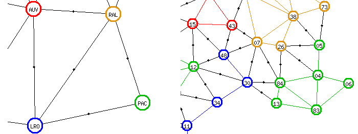

J'ai lancé la génération des  chemins complets pour la carte `fr1970`.
Je me  suis rendu compte  qu'il y  aurait encore moyen  d'optimiser la
recherche en éliminant les macro-chemins  qui ne peuvent pas engendrer
de chemins  complets. Lorsque  l'on regarde rapidement  la macro-carte
`fr1970`, on  voit qu'il  existe une région  impasse, la  région `NPC`
(Nord-Pas-de-Calais) reliée  uniquement à la région  `PIC` (Picardie).
En revanche,  la région  `PAC` (Provence-Alpes-Côte-d'Azur)  n'est pas
une impasse,  car elle  est reliée  à `RAL`  (Rhône-Alpes) et  à `LRO`
(Languedoc-Rousillon). En regardant  de plus près, on  constate que la
frontière  entre   `PAC`  et   `LRO`  passe  obligatoirement   par  le
département `30` (Gard). Ce département est un point d'articulation de
la région  `LRO`, donc aucun  chemin hamiltonien régional de  `LRO` ne
peut  commencer en  `30` ni  y  aboutir. La  conséquence est  qu'aucun
chemin hamiltonien complet  ne traversera la frontière  entre `PAC` et
`LRO`. Ou encore, tout se passe comme si la région `PAC` était devenue
une impasse, liée uniquement à  `RAL`. Les seuls macro-chemins pouvant
conduire à des chemins complets  sont les macro-chemins commençant par
`NPC → PIC` et finissant par `RAL → PAC` ou l'inverse. Il y a donc 486
macro-chemins à traiter au lieu de 3982.

Ce  cas  de  figure  existe  dans  d'autres  cartes,  où  il  a  moins
d'influence sur  la durée des  traitements. Dans la carte  `brit2`, la
région `SCO` (Écosse)  est reliée à la fois à  `ENG` (Angleterre) et à
`OCE`  (zones maritimes),  mais  aucun chemin  hamiltonien complet  ne
traverse la  frontière entre `SCO`  et `ENG`.  Tout se passe  comme si
`SCO` est une impasse reliée uniquement à `OCE`. De même, dans `mah2`,
la région `CEY` (Ceylan) est reliée à la fois à `SUD` (Inde du Sud) et
à  `MER` (zones  maritimes), mais  seule la  frontière entre  `CEY` et
`SUD` est utilisée par les chemins hamiltoniens complets. Donc tout se
passe comme si `CEY` était une impasse.

J'ai également lancé la génération des chemins complets pour `fr2015`.
Je l'ai arrêtée au bout de 11 heures et demie lorsque je me suis rendu
compte que le nombre de chemins générés serait énorme. La génération a
eu le  temps de  traiter seulement deux  macro-chemins. Et  encore, le
traitement du  deuxième macro-chemin  n'était pas terminé.  Le premier
n'a donné lieu  à aucun chemin complet,  mais il a fallu  une heure et
demie  pour  obtenir  ce  résultat.  Après  dix  heures,  le  deuxième
macro-chemin  en était  à presque  deux millions  de chemins  complets
lorsque  j'ai  interrompu la  génération.  Et  il  y  a au  total  894
macro-chemins à  traiter. Même en  éliminant les macro-chemins  qui ne
peuvent pas donner lieu à des chemins complets, le temps de traitement
restera énorme pour `fr2015`.

Troisième tentative
===================

La  troisième tentative  sert à  diminuer le  nombre de  macro-chemins
sélectionnés  dans  le  programme  `gener2.raku`.  Cela  traitera  les
« quasi-impasses »  comme `PAC`  dans `fr1970`  ou `CEY`  dans `mah2`,
mais aussi les  cas de figure comme  la frontière `IDF →  NOR` dans la
carte `fr2015`. Je prends ce dernier exemple pour l'explication.

Dans la table `Paths` et la vue `Macro_Paths`, on ajoute les colonnes
suivantes :

* `fruitless` indicateur numérique, 1  si le macro-chemin contient une
frontière  comme  `IDF →  NOR`  qui  l'empêche  de générer  un  chemin
complet, 0 sinon.

* `fruitless_reason` chaîne de caractère rappelant la frontière posant
problème. Si le programme trouve plusieurs frontières posant problème,
elles  sont  concaténées dans  ce  champ,  séparées par  une  virgule.
Inutile pour  les algorithmes de  recherche, mais cela fait  beau dans
les pages web et dans les fichiers log.

Dans la table `Borders` et la vue `Big_Borders`, on ajoute une colonne
`fruitless` semblable à celle de `Paths`.

Alimentation des nouvelles colonnes
-----------------------------------

Par défaut la colonne `fruitless` est initialisée à zéro. Le programme
effectue une boucle sur chaque  ligne de la vue `Big_Borders` (maximum
86  itérations pour  la carte  `fr1970`). Pour  chaque macro-frontière
trouvée,   on   extrait   les  frontières   entre   départements   qui
correspondent, puis on  vérifie si un chemin  complet pourra traverser
chacune de  ces frontières départementale. En  cas d'impossibilité, on
met à jour les macro-chemins contenant cette macro-frontière.


Exemple, lorsque  l'on traite la  frontière `IDF →  NOR`. Il y  a deux
frontières départementales, de `78` à `27` et de `95` à `27`. On tente
de joindre les chemins régionaux de  la région `IDF` avec la frontière
passant de  `78` à `27`  et avec  la frontière de  `95` à `27`.  Il en
existe, donc pas  de mise à jour des macro-chemins.  Ensuite, on tente
de joindre les chemins régionaux de `NOR` avec la frontière passant de
`78` à  `27` et avec  la frontière  de `95` à  `27`. Là, on  ne trouve
rien. Donc  on met à jour  les macro-chemins qui contiennent  `'%IDF →
NOR%'`.

Variante : on ne  fait qu'une recherche, mais avec deux  mises à jour.
On tente de  joindre les chemins régionaux de `NOR`  avec la frontière
passant de  `78` à `27`  et avec  la frontière de  `95` à `27`.  On ne
trouve  rien, donc  on met  à jour  les macro-chemins  qui contiennent
`'%IDF  →  NOR%'`, ainsi  que  les  macro-chemins contenant  `'%NOR  →
IDF%'`.

En fait, il  y aura quatre mises  à jour. Si un  macro-chemin est déjà
marqué  comme  stérile  (`fruitless`),  le  programme  mettra  à  jour
`fruitless_reason`  en concaténant  la chaîne  `',  IDF →  NOR'` à  la
valeur courante de cette colonne.  Si un macro-chemin n'est pas marqué
comme stérile, le  programme mettra à jour  `fruitless_reason` avec la
chaîne `'IDF → NOR'`  et la colonne `fruitless` à 1.  Idem pour `NOR →
IDF`.

Pour  alimenter le  champ `fruitless`  dans la  table `Borders`  et la
table `Paths`, il  est nécessaire d'avoir créé  tous les macro-chemins
et tous les chemins régionaux. Comme le programme `gener1.raku` permet
de générer ces  divers chemins en plusieurs  étapes, l'alimentation de
`fruitless` se fera  au début de `gener2.raku`, au moment  où tous les
chemins nécessaires auront été générés.

Génération des chemins complets
-------------------------------

Lors  de   la  génération  des   chemins  complets,  on   évitera  les
macro-chemins stériles. On ne gagnera pas grand-chose avec les chemins
commençant par  `IDF → NOR  → ...` mais  on gagnera beaucoup  avec les
chemins finissant  par `...  → IDF  → NOR`.  Dans le  cas de  la carte
`mah2`, on  peut espérer que  la génération  durera moins de  7 heures
comme c'était le cas pour la deuxième tentative.

En  revanche, cela  ne réglera  pas le  problème du  nombre énorme  de
chemins complets pour `fr2015`. Et pour  la carte `fr1970`, au lieu de
passer  24 heures  à traiter  2461 chemins  stériles et  générer aucun
chemin complet avant interruption, le  programme passera _nn_ heures à
traiter les  486 macro-chemins avec  les extrémités `NPC` et  `PAC` et
générer des millions de chemins complets.

Cette optimisation ne  rend pas caduque l'optimisation  de la deuxième
tentative.  Les   deux  optimisations   sont  utiles  et   elles  sont
compatibles entre elles. L'optimisation  `Exit_Borders` sert à réduire
le  nombre de  chemins régionaux  traités, l'optimisation  `fruitless`
sert à réduire le nombre de macro-chemins traités.

LICENCE
=======

Texte diffusé sous la licence CC-BY-SA : Creative Commons, Attribution
- Partage dans les Mêmes Conditions (CC BY-SA).

