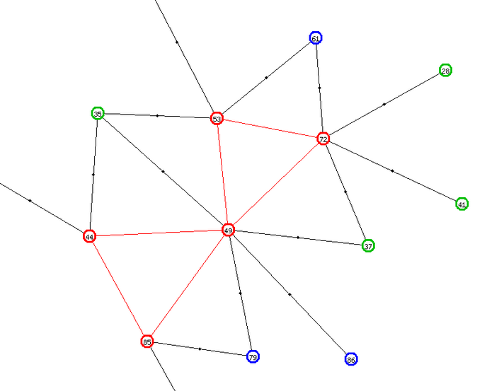
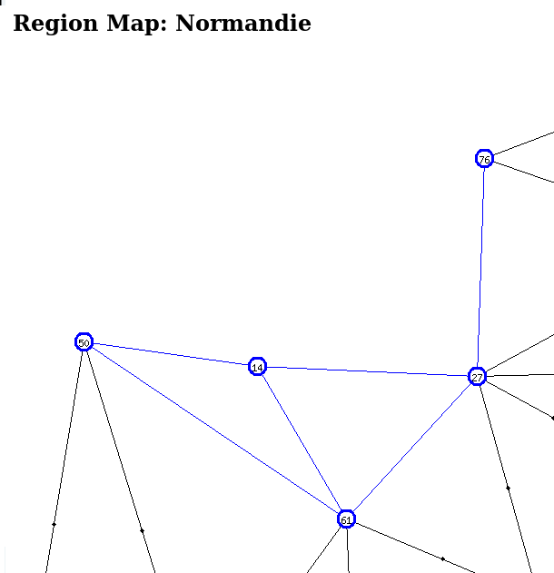
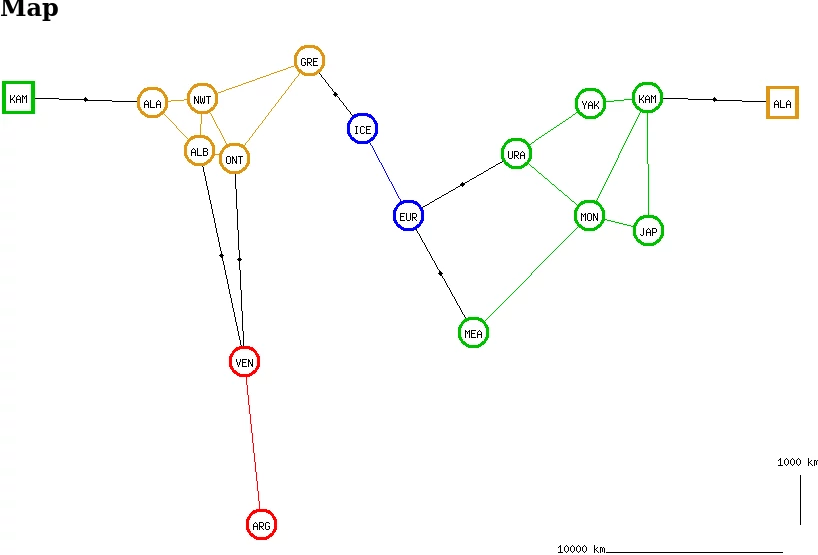

-*- encoding: utf-8; indent-tabs-mode: nil -*-

Le but de ce projet est de trouver des chemins doublement hamiltoniens
dans une carte administrative. Dans un graphe connexe non orienté, un
[chemin hamiltonien](https://mathworld.wolfram.com/HamiltonianPath.html)
est un chemin qui passe une fois  et une seule par chacun des sommets.
Mais  qu'est-ce  un  chemin  _doublement_ hamiltonien  ?  Prenons  par
exemple  la  France  continentale.  Nous  enlevons  la  Corse  et  les
départements /  territoires / collectivités d'outre-mer  pour avoir un
graphe connexe.  La France se  divise en  régions et chaque  région se
divise en départements. Un chemin doublement hamiltonien est un chemin
hamiltonien  entre les  94 départements  continentaux, tel  que chaque
fois  que   le  chemin  traverse   une  région,  le  bout   de  chemin
correspondant est lui aussi hamiltonien.

(À droite, zoom sur l'Île-de-France, qui est un peu trop confuse sur la partie gauche du dessin)


La question  de déterminer  s'il existe des  chemins eulériens  sur un
graphe connexe non orienté est simple et  bien connue. La question  de déterminer
s'il existe des chemins hamiltoniens est plus délicate, il s'agit même
d'un problème  NP-complet. Avec  94 départements, la  combinatoire est
bien  au-delà des  ressources que  j'accepte d'allouer  à un  problème
occupant  mes   loisirs.  En   imposant  la  contrainte   d'un  chemin
_doublement_ hamiltonien, la  combinatoire se réduit considérablement.
En appliquant  la technique de  « diviser pour régner », il  suffit de
déterminer les macro-chemins  hamiltoniens entre les 12  régions de la
France  continentale,  puis  pour  chaque  région  de  déterminer  les
micro-chemins  entre  les  départements  de   cette  région  (5  à  13
départements  par région,  ce  n'est  pas la  mer  à  boire), puis  de
construire un chemin complet par  la concaténation de micro-chemins en
se basant sur le canevas d'un macro-chemin.

Je ne me limite  pas à la carte de la France  avec les départements de
1965 et  les régions de  2015. J'envisage de  faire le même  calcul en
adoptant  le découpage  des régions  de  1970. Et  même le  cas où  je
remplace le découpage en départements  par le découpage des régions de
1970 au sein des régions de 2015. Ce cas  de figure, avec des régions groupes  ne contenant qu'une
seule région  élémentaire, pourrait  mettre en  évidence des  bugs qui
seraient restés invisibles avec des cartes plus peuplées.

On peut envisager d'autres cartes, comme la carte mondiale de
[Risk](https://boardgamegeek.com/boardgame/181/risk)
ou celle de
[War on Terror](https://boardgamegeek.com/boardgame/24396/war-terror),
où  les régions  élémentaires  correspondent  à des  États  et où  les
régions  groupes correspondent  à des  continents. Ou  alors, sur  une
échelle plus régionale, on peut envisager la carte de
[Britannia](https://boardgamegeek.com/boardgame/240/britannia),
ou celle de
[Maharadjah](https://boardgamegeek.com/image/82336/maharaja).

Remarque : pour des raisons de copyright, je ne fournis pas les cartes
de Britannia et de Maharadjah. Néanmoins, je mentionne ces cartes dans
la documentation ci-dessous. Si  nécessaire, vous pouvez consulter les
cartes dans les liens donnés ci-dessus.

Le projet se base sur une base de données
[SQLite](https://sqlite.org/index.html),
des programmes
[Raku](https://raku.org/)
lancés en ligne de commande pour alimenter cette base de données et un
affichage en mode web avec des programmes Raku /
[Bailador](https://modules.raku.org/dist/Bailador:cpan:UFOBAT).

Quelques rappels sur la théorie des graphes
===========================================

Sauf  mention explicite  du  contraire,  dans tout  ce  texte il  sera
question uniquement de graphes finis connexes non orientés.

Un graphe est constitué de sommets et d'arêtes, mais compte tenu de la
réalité  sous-jacente,  il  m'arrivera  souvent  de  parler  de  zones
(régions et départements) et de frontières.

Le degré d'un sommet est le nombre d'arêtes issues de ce sommet. Si un
sommet a un degré 1, ce  sommet sera appelé « impasse ». Exemples : la
région Nord-Pas-de-Calais  dans la  carte de France  de 1970,  qui est
reliée uniquement à la Picardie ; ou alors dans l'Aquitaine de 1970 ou
la Nouvelle Aquitaine de 2015, le département des Pyrénées-Atlantiques
(64),   relié  uniquement   au  département   des  Landes   (40),  les
départements 32 et 65 ne comptant pas.


D'après le
[lexique de la théorie des graphes](https://fr.wikipedia.org/wiki/Lexique_de_la_th%C3%A9orie_des_graphes),
le terme « impasse » n'est pas un terme officiel. En revanche, j'ai trouvé la notion de
[point d'articulation](https://fr.wikipedia.org/wiki/Point_d%27articulation_(th%C3%A9orie_des_graphes)).

Dans le cas d'un graphe connexe, un point d'articulation est un sommet
qui assure  la connexité  du graphe. C'est-à-dire,  si on  supprime ce
sommet et les  arêtes associées, alors le graphe  restant cesse d'être
connexe. En reprenant les exemples ci-dessus, la Picardie est un point
d'articulation dans  la carte  des régions  de 1970,  car si  elle est
supprimée, alors la région  Nord-Pas-de-Calais n'est plus connectée au
reste de la  carte. De même, si on supprime  le département des Landes
de  la  région  Aquitaine  ou   de  la  Nouvelle-Aquitaine,  alors  le
département des  Pyrénées-Atlantiques n'est plus connecté  au reste de
la région.

Les  points  d'articulation  ne  sont  pas  toujours  associés  à  des
impasses. Ainsi,  dans la région  Pays de la Loire,  le Maine-et-Loire
(49) est  un point d'articulation  entre le groupe  Loire-Atlantique +
Vendée (44 et 85) et le groupe Mayenne + Sarthe (53 et 72).



Il  est facile  de voir  que si  un graphe  contient une  impasse, les
chemins  hamiltoniens auront  tous cette  impasse comme  extrémité, au
début ou à  la fin. Il est  facile de voir également que  si un graphe
contient un  point d'articulation,  ce point d'articulation  ne pourra
pas être à une extrémité d'un chemin hamiltonien.

Le  concept   de  point   d'articulation  est  intéressant   pour  les
discussions d'humain à humain (cette documentation), mais pas pour les
discussions  d'humain à  ordinateur.  En d'autres  termes, ce  concept
n'est pas implémenté dans les programmes traitant les graphes.

Le concept associé pour les arêtes  a pour nom « isthme » ou « pont ».
Dans les exemples  ci-dessus, l'arête de `NPC` à `PIC`  est un isthme,
tout comme l'arête de  `64` à `40`. Il n'y en a pas  dans le graphe de
la région Pays  de la Loire. Je mentionne ce  concept pour mémoire, je
n'ai pas eu l'occasion de l'utiliser ni dans la programmation, ni dans
la documentation.

Dans ce même
[lexique](https://fr.wikipedia.org/wiki/Lexique_de_la_th%C3%A9orie_des_graphes),
je constate que pour un graphe non orientés, une suite de sommets tels
que  chacun est  relié  au  suivant par  une  arête devrait  s'appeler
_chaîne_,  alors   que  j'utilise   le  terme  _chemin_   qui  devrait
s'appliquer  aux graphes  orientés.  Néanmoins, je  conserve le  terme
_chemin_, à cause de l'omniprésence en programmation du terme _chaîne_
pour désigner autre chose, et un  peu aussi parce que les chemins tels
que je les  implémente sont orientés, même s'ils  sont construits dans
des graphes non orientés.

Une  frontière intérieure  est une  frontière entre  deux départements
appartenant  à  la  même  région. Une  frontière  extérieure  est  une
frontière  entre   deux  départements   appartenant  à   deux  régions
différentes.  Ne vous  imaginez  pas  que cela  fasse  référence à  la
Belgique, au Luxembourg  et aux autres pays limitrophes  de la France.
Par extension,  un département  extérieur est  un département  avec au
moins  une frontière  extérieure et  un département  intérieur est  un
département qui  n'a que  des frontières  intérieures. Ainsi,  dans la
carte  `fr2015`, le  département  du Nord  (`59`)  est un  département
intérieur, car  toutes ses frontières  sont avec des  départements des
Hauts-de-France,  tandis   que  l'Oise   (`60`)  est   un  département
extérieur,   connecté  avec   deux  départements   normands  et   deux
départements d'Île-de-France.

Une  autre notion  est celle  de  cycles hamiltoniens.  Dans un  cycle
hamiltonien, le sommet d'arrivée est le  même que le sommet de départ,
ce qui veut dire que ce sommet est visité deux fois, contrairement aux
autres. Voici par  exemple le cycle `29 →  56 → 35 → 22 →  29` dans la
région  Bretagne. Dans  mon projet,  ce cycle  sera représenté  par un
chemin sans  l'étape finale, c'est-à-dire  `29 → 56 →  35 → 22`.  Il y
aura également  un champ booléen  dans la  table `Paths` et  une brève
mention entre parenthèses dans les pages web, rien de plus.


Il est possible de  considérer que le cycle `22 → 29 →  56 → 35 → 22`,
le cycle `35 → 22 → 29 → 56 → 35` et le cycle `56 → 35 → 22 → 29 → 56`
sont la même chose  que le cycle `29 → 56 → 35  → 22 → 29`, représenté
d'une façon légèrement  différente. Dans mon projet, il  y aura quatre
enregistrements différents  pour ce cycle  dans la table  des chemins,
`29 → 56 → 35 → 22`, `22 → 29 → 56 → 35`, `35 → 22 → 29 → 56` et `56 →
35 → 22 → 29`, plus  quatre autres enregistrements pour le parcours en
sens inverse.

Lorsque je  lis des textes  sur les  graphes, je remarque  que presque
toujours,  ils   s'intéressent  aux  cycles  hamiltoniens   et  qu'ils
délaissent les chemins hamiltoniens (ou chaînes hamiltoniennes). C'est
l'inverse  ici, je  m'intéresse aux  chemins hamiltoniens  et j'ignore
presque totalement les cycles hamiltoniens.

Base de données
===============

Maps
----

La  première  table  est  la   table  `Maps`  (Cartes).  La  clé  d'un
enregistrement est :

* `map` le code de la carte (sans caractère spécial, pour faciliter la constitution et l'analyse des URL).

Les autres informations sont :

* `name` une désignation compréhensible pour cette carte,
* `nb_macro` le nombre de macro-chemins pour cette carte,
* `nb_full` le nombre de chemins complets pour cette carte,
* `nb_generic` champ décrit dans la
[quatrième version du logiciel](#user-content-quatrième-tentative),
* `fruitless_reason` champ décrit dans la
[cinquième version du logiciel](#user-content-cinquième-version)
* `with_scale`  indicateur spécifiant  si le  graphe correspond  à des
points situés à la surface de la Terre, auquel cas les dessins devront
afficher une échelle,
* `with_isom` indicateur  spécifiant si  l'on a défini  des isométries
pour ce graphe et si elles ont été calculées,
* `full_diameter`,
* `full_radius`,
* `macro_diameter`,
* `macro_radius`.

Les  champs   `macro_diameter`,  `macro_radius`,   `full_diameter`  et
`full_radius` sont décrits dans le
[chapitre](#user-content-statistiques-sur-les-chemins-les-plus-courts-dun-point-à-un-autre)
sur les statistiques associées aux « plus courts chemins ».

Areas
-----

La deuxième table, `Areas` (Zones), contient à la fois les régions
et les départements. La clé d'un enregistrement est :

* `map` le code de la carte (table `Maps`),
* `level` valant `1` pour les régions et `2` pour les départements,
* `code` permettant d'identifier la zone.

Pour un département, le code est le numéro à deux chiffres (pas trois,
parce que  les DOM ne  sont pas repris). Pour  une région de  2015, il
s'agit des trois dernières lettres du  code ISO 3166-2, tel qu'on peut
le voir
[dans cette page](https://fr.wikipedia.org/wiki/R%C3%A9gion_fran%C3%A7aise#Liste_et_codification_ISO_3166-2_des_r%C3%A9gions_actuelles).
Pour les régions de 1970, il  s'agit de codes à trois lettres inspirés
de ceux des régions de 2015. Ces codes de 1970 n'ont rien d'officiel.

Les autres informations sont :

* `name`, la désignation standard de la région ou du département,
* `long` et `lat`, une longitude et une latitude approximatives,
* `color`, la couleur qui sera utilisée pour l'affichage des cartes,
* `upper`, pour les départements, le code de la région d'appartenance,
* `nb_macro_paths`,
* `nb_macro_paths_1`,
* `nb_region_paths`,
* `exterior` montrant si le département est relié à une autre région,
* `diameter`,
* `radius`,
* `full_eccentricity`,
* `region_eccentricity`.

Il  est prévu  deux  vues  sur cette  table,  la  vue `Big_Areas`  qui
sélectionne  le niveau  1  des  régions et  la  vue `Small_Areas`  qui
sélectionne le niveau 2 des départements.

La latitude et la longitude servent à l'affichage des cartes. Bien que
le  problème  des chemins  doublement  hamiltoniens  soit purement  un
problème de graphe  sans aucun rapport avec la  géométrie, les graphes
seront  visualisés de  telle  façon que  l'on  puisse reconnaître  les
cartes géographiques. Si `Maps.with_scale` est faux, cela signifie que
la   latitude  et   la  longitude   sont  seulement   des  coordonnées
cartésiennes pour dessiner le graphe et rien de plus.

Le champ `nb_region_paths` a  deux significations différentes pour les
régions et pour  les départements. Pour les  régions, c'est simplement
le nombre  de chemins  régionaux générés dans  cette région.  Pour les
départements,  c'est  le nombre  de  chemins  régionaux commençant  ou
aboutissant à ce département.

Le champ `nb_macro_paths`  a, pour les régions,  la même signification
que  `nb_region_paths`  pour  les  départements. C'est  le  nombre  de
macro-chemins commençant ou aboutissant à cette région. Le champ reste
à zéro pour les départements.

Le  champ   `nb_macro_paths_1`  compte  également   les  macro-chemins
commençant ou aboutissant à cette  région, mais en comptant uniquement
les macro-chemins qui ont permis la génération de chemins complets. Le
champ reste à zéro pour les départements.

Le champ `exterior` n'a de signification que pour les départements. Il
vaut `1`  si le département a  au moins une frontière  commune avec un
département d'une autre  région et il vaut `0` si  tous les voisins du
département appartiennent à la même région.

Les champs  `full_eccentricity`, `region_eccentricity`,  `diameter` et
`radius` sont décrits dans le
[chapitre](#user-content-statistiques-sur-les-chemins-les-plus-courts-dun-point-à-un-autre)
sur les statistiques associées aux « plus courts chemins ».

Borders
-------

La  table `Borders`  (Frontières) énumère  les paires  de départements
limitrophes  ou les  paires  de régions  limitrophes.  Pour un  graphe
mathématique, cela correspond aux arêtes. La clé est constituée de :

* `map` le code de la carte (table `Maps`),
* `level` valant `1` pour les régions et `2` pour les départements,
* `from_code` le code de la première zone,
* `to_code` le code de la deuxième zone.

Autres champs :

* `upper_from` le code du supérieur hiérarchique de `from`,
* `upper_to`  le code du supérieur hiérarchique de `to`,
* `long`, une longitude facultative,
* `lat`, une latitude facultative,
* `color`,
* `fruitless`,
* `nb_paths`,
* `nb_paths_1`
* `cross_idl`

Dans certains cas, un enregistrement ne représente pas une frontière à
proprement parler,  mais une liaison  maritime d'une zone à  une autre
zone  située sur  une autre  île ou  un autre  continent. On  conserve
néanmoins le terme géographique « frontière » ou le terme mathématique
« arête ».

Dans le cas où  la carte couvre la totalité du  globe terrestre, il se
peut que certaines  arêtes joignent une zone  extrême-orientale sur le
côté droit de  la carte avec une zone extrême-occidentale  sur le côté
gauche  de la  carte. Pour  permettre  un affichage  correct de  cette
arête,  le champ  `cross_idl`  est alimenté  à  `1`. « Idl »  signifie
_International Date  Line_ ou  « ligne de  changement de  date », même
s'il peut arriver que  la carte ne soit pas découpée  le long de cette
ligne, comme dans
[cet exemple](https://boardgamegeek.com/image/476132/risk).

La plupart du  temps, la longitude et la latitude  resteront à zéro et
dans  la représentation  graphique,  l'arête sera  représentée par  un
unique  segment de  droite. Dans  certains  cas, le  dessin peut  être
encombré par endroits.  Un moyen pour l'éclaircir peut  être de tracer
les arêtes avec deux segments de droite  au lieu d'un. Dans ce cas, la
longitude et  la latitude repèrent  l'endroit où les deux  segments se
joignent.

Dans  le cas  des départements  français, le  seul cas  de figure  est
l'arête  entre  la Seine-et-Marne  (77)  et  le Val-d'Oise  (95),  qui
risquait de se faire masquer  par la Seine-Saint-Denis (93). J'ai donc
prévu un point intermédiaire un peu au nord de la ligne droite.


Pour  une frontière  entre  deux départements  d'une  même région,  la
couleur  sera  celle de  la  région.  Pour  une frontière  entre  deux
départements  de   régions  différentes,  la  couleur   sera  le  noir
(`Black`).  Et pour  les frontières  de  niveau 1,  entre régions,  la
couleur sera forcément le noir.

Pour  une  frontière  donnée,  il  y  aura  deux  enregistrements,  en
intervertissant `from_code` et `to_code`.

Pour une frontière de niveau 1, le champ `nb_paths` contient le nombre
de  macro-chemins  qui  utilisent  cette frontière  (ou  la  frontière
inverse). Pour une  frontière de niveau 2, c'est le  nombre de chemins
régionaux contenant cette  frontière ou son inverse. Le  champ reste à
zéro  si  la  frontière  relie   deux  départements  de  deux  régions
différentes.

Le  champ `nb_paths_1`  compte  également le  nombre de  macro-chemins
utilisant cette frontière,  mais en se limitant  aux macro-chemins qui
ont  généré des  chemins  complets. Ce  champ reste  à  zéro pour  les
frontières de niveau 2.

Comme pour  la table  `Areas`, il  y aura  deux vues  `Big_Borders` et
`Small_Borders` en fonction du niveau.

L'utilité du champ `fruitless` sera expliquée dans la
[troisième version du logiciel](#user-content-troisième-tentative).

Paths
-----

La table  `Paths` (Chemins)  liste tous les  chemins pour  une carte :
macro-chemins entre régions, micro-chemins (ou chemins régionaux) pour
les départements  au sein  d'une région et  chemins complets  pour les
départements dans la carte complète. La clé est constituée de :

* `map` le code de la carte (table `Maps`),
* `level` valant `1` pour les macro-chemins, `2` pour les chemins régionaux, `3` pour les chemins complets et `4` pour les chemins régionaux génériques,
* `area`, champ vide pour les macro-chemins et les chemins complets, le code de la région concernée pour les chemins régionaux.
* `num`, un numéro séquentiel.

Les autres champs sont :

* `path`, une chaîne de caractères listant les zones traversées par le chemin
* `from_code`, code de la zone de départ du chemin,
* `to_code`, code de la zone d'arrivée du chemin,
* `cyclic`, indiquant si le chemin est cyclique,
* `macro_num`, numéro éventuel du macro-chemin associé,
* `fruitless`,
* `fruitless_reason`,
* `nb_full_paths`,
* `generic_num`,
* `first_num`,
* `paths_nb`,
* `num_s2g`.

Le champ  `path` contient les  codes des départements (ou  des régions
pour les macro-chemins)  séparés par une flèche `→`. Dans  la carte de
1970, la  région Languedoc-Roussillon possède deux  chemins régionaux.
Voici l'un d'eux comme exemple :

```
   map         'fr1970'
   level       2
   area        'LRO'
   num         1
   path        '48 → 30 → 34 → 11 → 66'
   from_code   '48'
   to_code     '66'
   cyclic      0
   macro_num   0
```

Il n'y a pas de contrainte de  clé unique sur le quadruplet `map level
area num`.  Cela nous permet  de trier  et de renuméroter  les chemins
générés. L'ordre le  plus intéressant consiste à  grouper ensemble les
chemins partant de la même zone  (`from_code`), puis au sein de chaque
groupe de  les grouper  par zone d'arrivée  (`to_code`) et  enfin dans
l'ordre alphabétique des chemins `path`.

Le champ `cyclic` contient `1` pour  les chemins cycliques et `0` pour
les chemins ouverts.  Un chemin cyclique est un chemin  dans lequel la
zone de  départ et la  zone d'arrivée  ont une frontière  commune. Par
exemple, dans la région `PIC` de la carte `fr1970`, le chemin `02 → 60
→ 80` est cyclique.  On pourrait le compléter en `02 → 60  → 80 → 02`,
mais on ne le  fait pas. Par convention, les chemins  à une seule zone
et zéro  frontière sont cycliques (chemin  pour la région `IDF`  de la
carte `frreg`), tout  comme les chemins à deux zones  et une frontière
(chemins pour la région `NOR` de la carte `frreg`).

L'utilité des champs `fruitless` et `fruitless_reason` sera expliquée dans la
[troisième version du logiciel](#user-content-troisième-tentative).

Le  champ  `nb_full_paths` est  alimenté  pour  les macro-chemins.  Il
contient le nombre de chemins complets dérivant de ce macro-chemin. Ce
champ aurait  pu contenir  une valeur  significative pour  les chemins
régionaux. Hélas, il n'y a pas de façon efficace de calculer la valeur
à  stocker dans  ce champ.  Il restera  donc à  zéro pour  les chemins
régionaux.

Les   chemins  régionaux   génériques   (`level=4`)   et  les   champs
`macro_num`, `first_num`, `paths_nb` et `num_s2g` sont décrits dans la
[quatrième version du logiciel](#user-content-quatrième-tentative).

La relation  entre les macro-chemins  et les chemins complets  est une
relation 0..n ↔  1..1. Un macro-chemin permet de générer  un nombre _a
priori_ indéterminé de chemins complets, mais un chemin complet dérive
d'un seul macro-chemin. Le champ `macro_num` matérialise ce lien.

En revanche, il  n'y a aucune relation entre les  macro-chemins et les
chemins  régionaux.  D'autre  part,  la  relation  entre  les  chemins
complets et les chemins régionaux est une relation 0..n ↔ 0..n. D'où :

Path\_Relations
---------------

Cette table matérialise la relation  entre les chemins complets et les
chemins régionaux. Elle contient les champs suivants :

* `map` le code de la carte (table `Maps`),
* `full_num` le numéro `num` du chemin complet,
* `area` le code de la région,
* `region_num` le numéro `num` du chemin régional,
* `range1`,
* `coef1`,
* `coef2`.

Jusqu'à la  version 3,  les champs  `full_num` et  `regional_num` font
référence  à  des  chemins  complets  spécifiques  et  à  des  chemins
régionaux spécifiques. À partir de la  version 4, ils font référence à
des chemins complets génériques et à des chemins régionaux génériques.

L'utilisation des champs `range1`, `coef1` et `coef2` est expliquée dans la
[quatrième version du logiciel](#lister-les-chemins-complets-sp%C3%A9cifiques-pour-un-chemin-r%C3%A9gional-sp%C3%A9cifique).

Messages
--------

Cette table permet de conserver la trace de la génération des chemins.
Elle  permettra   notamment  de  rappeler  pourquoi   telle  ou  telle
génération de chemin a échoué. La clé d'un enregistrements est :

* `map` le code de la carte (table `Maps`),
* `dh` la date et l'heure de génération du message.

Les autres informations sont :

* `errcode` code du message ou de l'erreur,
* `area` code de la zone concernée par l'erreur,
* `nb` nombre associé à l'erreur ou au message, par exemple le nombre de chemins générés.
* `data` des données fournissant un complément d'information au message, par exemple la liste des zones en impasse.

Initialisation
==============

Départements français
---------------------

Pour  des  raisons  de  copyright,   je  ne  livre  pas  de  programme
d'initialisation pour  les jeux comme Risk  ou War on Terror.  Le seul
programme  d'initialisation concerne  les  régions  françaises et  les
départements français.

Ce  programme  est  plus compliqué  qu'un  programme  d'initialisation
standard, car il est prévu pour traiter trois niveaux hiérarchiques au
lieu de deux : les régions de 2015, puis les régions de 1970, puis les
départements. Il charge à la  fois les trois cartes `fr1970`, `fr2015`
et `frreg`.

Dans un premier temps, le programme lit un fichier séquentiel avec des
lignes de différents types :

* lignes `A` pour les régions de 2015,
* lignes `B` pour les régions de 1970,
* lignes `AB` pour les régions de 1970 qui ont été reprises telles quelles dans le découpage de 2015,
* lignes `C` pour les départements.

Outre le code et le nom en clair  de la région, les lignes `A` et `AB`
contiennent  le  schéma  de  coloriage pour  les  cartes  `fr2015`  et
`frreg`. Les  lignes `AB`  et `B` contiennent  le schéma  de coloriage
pour la carte  `fr1970`. Les lignes `C` contiennent la  latitude et la
longitude  des  départements,  pour  les positionner  sur  les  cartes
générées, ainsi que la liste des départements limitrophes.

J'ai constitué  le fichier texte  de la façon suivante.  J'ai consulté
[Géo Portail](https://www.geoportail.gouv.fr/)
en n'affichant que le fond  de carte « limites administratives ». Pour
chaque département,  j'ai cliqué  en plein milieu,  j'ai fait  un clic
droit et j'ai sélectionné « adresse / coordonnées du lieu ». Puis j'ai
copié-collé la latitude et la longitude dans le fichier. J'ai pris les
valeurs telles quelles, avec cinq  décimales. Or, un degré de latitude
fait  111 km et,  à la  latitude de  45°, un  degré de  longitude fait
78 km.  La  cinquième  décimale  sur   la  longitude  et  la  latitude
représente  donc une  précision de  l'ordre du  mètre. J'aurais  pu me
contenter de deux décimales. Tant pis.

Par  moment,  j'ai  zoomé  au voisinage  des  points  quadruples  pour
vérifier   quels  départements   sont  contigus   avec  quels   autres
départements.  Voir  par exemple  la  limite  entre le  Vaucluse,  les
Bouches-du-Rhône, le  Var et  les Alpes  de Haute-Provence,  par 43,72
degrés de latitude nord et 5,75 degrés de longitude est.


Autre  sujet,  illustré par  le  même  dessin ci-dessus.  Normalement,
chaque frontière entre deux départements  est spécifiée deux fois dans
le fichier en entrée. Par exemple,  il y a une frontière commune entre
le Var (83)
et le Vaucluse (84). La  ligne `C ; 83` doit mentionner le département
84  et  la  ligne  `C ; 84`  doit mentionner  le  département  83.  Le
programme  d'initialisation testera  que  les  déclarations sont  bien
symétriques.

Lors  de  la première  étape,  les  enregistrements des  départements,
c'est-à-dire  avec des  clés `fr1970`+`2`  et `fr2015`+`2`  sont créés
avec toutes les valeurs renseignées, mais pour les enregistrements des
régions,  avec  des  clés `fr1970`+`1`,  `fr2015`+`1`  `frreg`+`1`  et
`frreg`+`2`, la latitude et la  longitude seront laissées vides et les
enregistrements   de  la   table   `Borders`  ne   seront  pas   créés
immédiatement.

C'est seulement lors  d'une seconde étape que  les enregistrements des
régions sont complétés. Le programme calcule la moyenne des longitudes
et des  latitudes des départements  appartenant à chaque  région, puis
stocke  ces   deux  moyennes   dans  l'enregistrement  de   la  région
correspondante.

De même,  le programme  alimente les enregistrements  `fr1970`+`1`, et
`frreg`+`2` de la table `Borders` en  faisant une synthèse de tous les
enregistrements `fr1970`+`2` de `Borders` qui se trouvent à cheval sur
deux régions.  Il alimente également les  enregistrements `fr2015`+`1`
et `frreg`+`1` à partir des enregistrements `fr2015`+`2` de `Borders`.

Autres cartes
-------------

Pour  les jeux  que je  possède, j'utilise  un triple-décimètre  et je
repère  chaque zone  avec  ses  coordonnées X-Y  par  rapport au  coin
inférieur gauche  de la carte.  Pour les jeux  que je ne  possède pas,
mais qui  sont décrits dans Internet,  je charge une copie  d'écran de
cette carte,  je l'affiche avec  the Gimp,  je promène mon  curseur de
zone en  zone et  je note  pour chacune  les coordonnées  pixels. Pour
calculer  la  longitude réelle,  je  choisis  deux points  écartés  en
largeur et je  cherche dans Internet la longitude de  ces deux points.
Par exemple,  pour Britannia, je  choisis le  point le plus  à l'ouest
pour les  Cornouailles, près de Penzance  et le point le  plus à l'est
pour le  Kent, près de Margate.  Avec les deux longitudes  et les deux
coordonnées X, je compose une fonction de conversion.

```
my $lon-Cor = -5.68;  # Cornwall 5°40' W
my $x-Cor   = 13;
my $lon-Ken =  1.41;  # Kent  1°25' E
my $x-Ken   = 41;
my $a-lon   = ($lon-Cor - $lon-Ken) / ($x-Cor - $x-Ken);
my $b-lon   = $lon-Ken - $a-lon × $x-Ken;
sub conv-lon(Num $x --> Num) { return $a-lon × $x + $b-lon }
```

Je fais de  même avec les coordonnées  Y et les latitudes.  Je ne suis
pas  obligé  de  prendre  les  mêmes  points.  En  l'occurrence,  j'ai
réutilisé la zone `COR` (Cornouailles)  mais j'ai remplacé le Kent par
la zone `ORK` (Orcades) tout au nord.

Le résultat est très approximatif. Prenons par exemple la carte de
[War on Terror](https://boardgamegeek.com/image/134814/war-terror).
J'ai adopté le  Cap Horn et le Cap Nord  pour étalonner les latitudes.
Malgré cela, les zones du continent antarctique se retrouvent avec une
latitude entre 53°S  et 62°S. Certes, il y a  déjà une distorsion dans
le  dessin de  la carte.  Mais si  l'on suppose  que la  carte est  en
projection de Mercator, l'utilisation d'une fonction telle que  :

```
sub conv-lat(Num $y --> Num) { return $a-lat × $y + $b-lat }
```

ne  respecte  pas  la  distribution des  latitudes  en  projection  de
Mercator.

Cas particuliers
----------------

Pour la [carte d'opération navale](https://boardgamegeek.com/image/308459/operation-mercury-german-airborne-assault-crete-19)
de  _Operation Mercury_, et pour la
[carte de _Raid on St. Nazaire_](https://boardgamegeek.com/geeklist/154538/wargaming-maps-context?itemid=2555472#2555472),
les bords  ne respectent pas  l'orientation habituelle ouest →  est et
nord  →  sud. Dans  le  cas  de _Raid  on  St.  Nazaire_, je  conserve
l'orientation de la  carte de jeu, avec  le sud à gauche et  le nord à
droite, pour permettre l'affichage de  cette carte en mode « paysage »
sur mon  écran en  mode « paysage ». Les  longitudes et  les latitudes
n'auront aucune signification réelle, tant pis.

En revanche, pour _Operation Mercury_, je fusionne la carte navale (en
biais)  avec  la  carte  des   zones  terrestres  de  l'île  de  Crète
(orientation  traditionnelle). Les  fonctions  de  conversion pour  la
carte navale prennent alors la forme :

```
sub conv-lon(Num $x, Num $y --> Num) { return $lon0 + $x-lon × $x + $y-lon × $y }
sub conv-lat(Num $x, Num $y --> Num) { return $lat0 + $x-lat × $x + $y-lat × $y }
```

Le calcul  des coefficients  `$lon0`, `$x-lon`,  `$y-lon` et  de leurs
équivalents pour  la latitude n'est  pas beaucoup plus  mystérieux que
dans le  cas des cartes  orientées correctement ouest  → est +  nord →
sud. Il  faut prendre  trois points  de référence au  lieu de  deux et
résoudre ainsi trois  équations à trois inconnues  pour les longitudes
puis pour  les latitudes. Ce  n'est pas mystérieux, mais  les formules
sont nettement plus compliquées.

Dans  certains  cas,  la  notion  de  longitude  et  de  latitude  est
inappropriée. Dans  ce cas, le  champ `with_scale` de la  table `Maps`
est positionné à  zéro (faux). C'est le cas avec  le dodécaèdre du jeu
icosien, c'est le cas également pour certains jeux comme
[_The Awful Green Things From Outer Space_](https://boardgamegeek.com/image/6788404/awful-green-things-outer-space)
où la  carte représente un vaisseau  spatial en plein vol  et long de,
disons, une centaine  de mètres (à mois  que ce soit 50  mètres ou 200
mètres, je n'ai pas moyen de  me rendre compte). Dans ce deuxième cas,
je prends les coordonnées X-Y en  centimètres et je les utilise telles
quelles dans les  champs longitude et latitude.  Enfin, presque telles
quelles.  En effet,  si l'on  stocke dans  une base  SQLite un  nombre
flottant dont  la partie  fractionnaire est  nulle, lors  des lectures
ultérieures SQLite  fournira des valeurs entières,  donc incompatibles
avec le type `Num` de  Raku. Donc le programme d'initialisation ajoute
une  partie  fractionnaire  artificielle  pour  que  SQLite  fournisse
effectivement  du `Num`.  L'affichage  des graphes  ne comportera  pas
d'échelle  contrairement aux  cartes  géographiques terrestres.  Cette
échelle n'aurait pas de signification  pour le dodécaèdre, elle serait
fallacieuse pour le
[vaisseau _Znutar_](https://boardgamegeek.com/image/1153757/awful-green-things-outer-space)
de _The Awful Green Things From Outer Space_.

Extraction des chemins hamiltoniens
===================================

Cas général
-----------

Le programme  se base  sur une  liste de  chemins partiels.  Un chemin
partiel  est  une structure  de  données  constituée d'une  chaîne  de
caractères,  le  début  du  chemin,  plus  un  ensemble  groupant  les
départements qui  n'ont pas  encore été visités  par le  chemin. Cette
structure n'a pas vocation à être stockée en base de données. Dans les
descriptions  ci-dessous,   je  représente  les  ensembles   avec  des
accolades ainsi que je l'ai appris  il y a longtemps en mathématiques.
Les  accolades   n'ont  pas  de   rapport  avec  la  notion   de  bloc
d'instructions ni avec la notion de référence à une table de hachage.



Prenons comme exemple l'extraction des  chemins régionaux de la région
Normandie dans la  carte `fr2015`. Au début, le  programme alimente la
liste avec les chemins partiels suivants :

```
'14'   { 27 50 61 76 }
'27'   { 14 50 61 76 }
'50'   { 14 27 61 76 }
'61'   { 14 27 50 76 }
'76'   { 14 27 50 61 }
```

Le programme extrait  un chemin partiel de la  liste, sélectionne tous
les départements  voisins du premier  et figurant dans  l'ensemble des
départements inutilisés. Pour chaque département ainsi sélectionné, le
programme complète la chaine de  caractères et supprime le département
de  l'ensemble. Ainsi,  en supposant  que  le programme  a extrait  le
chemin partiel commençant par l'Eure (27), les départements inutilisés
sont  14, 50,  61 et  76, mais  le département  50 (Manche)  n'est pas
voisin de 27. Donc le  programme construit trois chemins partiels avec
les trois autres  départements. la liste des  chemins partiels devient
donc :

```
'14'        { 27 50 61 76 }
'27 → 14'   { 50 61 76 }
'27 → 61'   { 14 50 76 }
'27 → 76'   { 14 50 61 }
'50'        { 14 27 61 76 }
'61'        { 14 27 50 76 }
'76'        { 14 27 50 61 }
```

Ensuite,  le  programme  extrait  le  chemin `'27  →  76'`.  Il  tente
d'extraire  les  voisins de  `76`  qui  figurent dans  l'ensemble  des
départements inutilisés,  `{ 14  50 61 }`.  Il n'y en  a pas.  Donc le
chemin `'27 → 76'` disparaît de la liste sans compensation.

Un  peu  plus tard,  après  avoir  traité successivement  les  chemins
`'50'`, `'50 → 61'` et `'50 → 61 → 14'`, la situation est :

```
'14'                  { 27 50 61 76 }
'27 → 14'             { 50 61 76 }
'27 → 61'             { 14 50 76 }
'50 → 14'             { 27 61 76 }
'50 → 61 → 14 → 27'   { 76 }
'50 → 61 → 27'        { 14 76 }
'61'                  { 14 27 50 76 }
'76'                  { 14 27 50 61 }
```

Le programme extrait  le chemin `'50 →  61 → 14 → 27'`.  Il déroule la
liste des départements à visiter, réduite à la Seine Maritime (76). La
Seine Maritime  est bien voisine  de l'Eure  (27), donc le  `'76'` est
enlevé  de l'ensemble  et  ajouté  à la  chaîne  de caractères.  Comme
l'ensemble  des départements  restant à  visiter est  vide, le  chemin
partiel `'50  → 61 → 14  → 27 →  76'` n'est plus un  chemin _partiel_,
c'est un  chemin régional _entier_. Il  est donc stocké dans  la table
`Paths` et il n'est pas réinjecté dans la liste des chemins partiels.

Cas particulier des impasses
----------------------------

Ainsi  qu'on l'a  vu  ci-dessus, lorsqu'un  département constitue  une
impasse dans sa région d'appartenance, il est impossible de trouver un
chemin hamiltonien où ce département  figure au milieu. Le département
en impasse est toujours au début ou à la fin du chemin régional.

Pour accélérer la génération des chemins régionaux, au lieu d'alimenter
la liste avec tous les départements :

```
'14'   { 27 50 61 76 }
'27'   { 14 50 61 76 }
'50'   { 14 27 61 76 }
'61'   { 14 27 50 76 }
'76'   { 14 27 50 61 }
```

on alimente  cette liste avec  uniquement le chemin commençant  par le
département en impasse, c'est-à-dire avec

```
'76'   { 14 27 50 61 }
```

Et on positionne un indicateur pour  rappeler que chaque fois que l'on
stocke dans la base de données un chemin régional commençant par `76`,
il faut aussi stocker le chemin inverse, se terminant par `76`.

S'il y  a deux départements en  impasse (cf dans la  carte `fr1970` le
Languedoc-Roussillon, mais  aussi l'Alsace,  la Haute-Normandie  et le
Nord-Pas-de-Calais), on prend l'un des deux, peu importe.

Et s'il y en a trois, on  arrête tout, on sait qu'il est impossible de
construire un chemin hamiltonien dans cette région.

Le  programme commence  donc par  compter pour  chaque département  le
nombre de  frontières qu'il partage  avec des départements de  la même
région.

Remarque : le même raisonnement peut se faire au niveau des régions.

Cas des départements isolés
---------------------------

Puisque le programme cherche les  départements avec un seul voisin, il
fait attention également aux départements avec aucun voisin.

Si l'on  trouve un  département sans aucun  voisin, cela  peut vouloir
dire que le  graphe de la région  n'est pas connexe. Ce  serait le cas
dans  une  carte  de  Britannia  en  ne  prenant  que  les  frontières
terrestres et en  ignorant les liaisons côtières.  Ainsi, les Hébrides
ne  seraient plus  reliées  à Skye  et les  Orcades  ne seraient  plus
reliées à Caithness, le graphe de  l'Écosse, qui comporte 10 zones, ne
serait plus  connexe. Dans ce  cas, le programme arrête  la génération
des chemins avec un message d'erreur.

Cela dit, il y a un cas de figure où cela ne constitue pas une erreur.
Ce  cas de  figure  est présent  à plusieurs  reprises  dans la  carte
`frreg`. Certaines régions de 2015  ne contiennent qu'une seule région
de   1970 :  Bretagne,   Pays   de   la  Loire,   Centre-Val-de-Loire,
Île-de-France et Provence-Alpes-Côte-d'Azur. Dans ce cas il est normal
que l'unique région-1970 de la région-2015 n'ait aucun voisin. Dans le
dessin ci-dessous,  on voit clairement  que les régions-1970  `IDF` et
`BRE` sont isolées dans les  régions-2015 correspondantes et on devine
qu'il en est de même pour les régions-1970 `PDL` et `CEN`.


Un autre  cas de  figure, la région  Pays de Galles  dans la  carte de
Britannia,  n'est pas  traité dès  l'initialisation. Pour  des raisons
ludiques, la  zone Cornouailles  et la zone  Devon sont  rattachées au
Pays de  Galles. Si l'on  ne tient  pas compte des  liaisons maritimes
côtières,  alors il  n'y a  pas  d'arête entre  la composante  connexe
Cornouailles +  Devon et la  composante connexe principale du  Pays de
Galles (Powys et les autres). Ce cas  de figure ne sera pas détecté au
début du  traitement. Le  programme commencera  à générer  les chemins
hamiltoniens. Comme les Cornouailles et le Devon sont des impasses, le
programme  générera soit  `COR  →  DEV`, soit  `DEV  →  COR`, puis  se
retrouvera  bloqué.  Le  traitement   de  génération  s'arrêtera  donc
rapidement avec  un constat  d'échec comme  attendu, mais  il tournera
quand même.

File FIFO ou pile LIFO ?
------------------------

Comment  choisit-on le  chemin partiel  à  traiter dans  la liste  des
chemins partiels ? Nous avons plusieurs possibilités :

* L'accès pédagogique, utilisé ci-dessus. Chaque fois que l'on extrait
un chemin partiel de la liste,  comme par hasard c'est celui qui donne
le  résultat le  plus intéressant  et,  autant que  possible, le  plus
rapidement. Impossible à  mettre en œuvre dans  un véritable programme
fonctionnant sur du silicium, le  programme de génération n'est pas un
programme d'intelligence artificielle.

* L'accès aléatoire.  Cela existe en Raku,  avec l'instruction `pick`.
Pas commode pour la reproductibilité, donc pour le débugage.

* L'accès en file, avec le sigle anglais _FIFO_.

* L'accès en pile, avec le sigle anglais _LIFO_.

Il va de soi que le choix se réduit aux deux derniers. Dans _Mastering
Algorithms with Perl_, à une page que je ne retrouve plus, les auteurs
écrivent que l'intérêt  de l'accès en file est  qu'il permet d'obtenir
les  chemins les  plus courts.  Dans  un graphe  non-orienté avec  _S_
sommets et _A_ arêtes, tous  les chemins hamiltoniens ont une longueur
de _S-1_ et  tous les chemins eulériens ont une  longueur de _A_. Dans
un cas  comme dans l'autre, la  recherche du chemin le  plus court n'a
pas de sens et il n'y a aucun intérêt à utiliser un accès en file.

Reprenons la question plus précisément. Utiliser un accès en file fait
que l'on génère d'abord tous les  chemins de longueur 1, puis tous les
chemins de longueur  2 en purgeant les chemins de  longueur 1, puis on
génère  tous les  chemins de  longueur 3  en purgeant  les chemins  de
longueur  2. Et  ainsi de  suite.  Arrive un  moment où  la liste  des
chemins partiels contient tous les  chemins de longueur _S-2_. C'est à
ce moment-là  seulement que  l'on génère les  chemins entiers   et que
l'on alimente la base de données  tout en purgeant la liste en mémoire
vive. Dans le cas de la carte `fr2015` (12 sommets, 23 arêtes), il y a
894 chemins  entiers. Donc il a  eu au moins 894  chemins partiels de
longueur _S-2_,  tous stockés en mémoire  vive. En fait, la  liste des
chemins partiels contient un nombre supérieur de chemins partiels, car
il y  a également des  chemins _S-2_ qui ne  donneront pas lieu  à des
chemins  entiers  _S-1_.  Par  exemple, vous  trouverez  des  chemins
partiels contenant le sous-chemin `HDF →  NOR → PDL → NAQ`, mais aucun
de  ces chemins  ne pourra  engendrer  un chemin  _S-1_ atteignant  la
Bretagne (`BRE`).  Tous ces chemins partiels  infructueux sont stockés
dans la liste avec les 894 chemins partiels fructueux.


À  l'inverse, avec  un accès  en pile,  certains chemins  entiers sont
générés  et stockés  en  base  de données  très  tôt.  En ajoutant  un
mouchard dans la génération des chemins, on peut constater que pour la
carte `fr2015`,  le nombre de chemins  partiels simultanément présents
dans la liste ne dépasse jamais 25.

La taille  maximale théorique  de la  liste utilisée  en LIFO  peut se
calculer  en  se   basant  sur  un  graphe  complet   à  _S_  sommets,
c'est-à-dire un graphe dans lequel chacun des _S_ sommets est adjacent
aux _S-1_ autres sommets (ne pas confondre ce sens de « complet » avec
celui de « chemin complet »).

Au début, le programme stocke _S_ chemins partiels avec un seul
sommet et  aucune arête.  Puis il  extrait l'un de  ces chemins  et le
remplace par _S-1_ chemins partiels de  longueur 1. Puis il extrait un
chemin  partiel de  longueur 1  et le  remplace par  _S-2_ chemins  de
longueur 2. Et ainsi de suite. La  taille maximale est donc égale à la
somme des  nombres de  _S-1_ à _1_.  Pour les 12  sommets de  la carte
`fr2015`, cela donne  une taille maximale de 66, ce  qui est largement
en-deçà de  la taille 894, qui  est elle-même inférieure au  nombre de
chemins _S-2_ qui  auraient été stockés dans la  liste fonctionnant en
FIFO.

Tri final
---------

Une  fois tous  les chemins  créés pour  une carte  et une  région, le
programme  relit   les  chemins,  triés  par   département  de  départ
(`from_code`),  par département  d'arrivée (`to_code`)  et par  chemin
(`path`). Un numéro séquentiel est attribué à chaque enregistrement de
la  table  `Paths`  ainsi  lu.  Certes,  pendant  cette  opération  de
renumérotation, il pourra  y avoir des doublons  dans la numérotation,
mais c'est  purement temporaire. Une fois  la renumérotation terminée,
il n'y a plus de doublons ni de trous.

Construction des chemins complets
=================================

Le  principe général  est le  suivant. On  prend un  macro-chemin, par
exemple `NOR → HDF  → GES → etc` dans la  carte `fr2015`. Le programme
remplace la  première région par  un chemin hamitonien  régional. Cela
donne `14 →  50 → 61 → 27 →  76 →→ HDF → GES →  ...`. La double flèche
sert à  identifier le point  où les  départements cèdent la  place aux
régions. En fait,  on ne choisit pas un seul  chemin hamiltonien de la
région `NOR`. On les  prend tous, on les met dans  la liste `to-do` et
on en extrait un.

Étape suivante. Le programme cherche  tous les départements voisins du
dernier département  `76` (Seine-Maritime)  et qui appartiennent  à la
région `HDF`.  Il s'agit  dans ce  cas des  départements `60`  et `80`
(Oise et Somme).  Puis il cherche tous les chemins  hamiltoniens de la
région `HDF` qui commencent en `60`  ou en `80`. Le programme remplace
le code de la région par chaque chemin, ce qui donne cet exemple :

```
Avant :
14 → 50 → 61 → 27 → 76 →→ HDF → GES → ...
Après :
14 → 50 → 61 → 27 → 76 → 60 → 02 → 59 → 80 → 62 →→ GES → ...
14 → 50 → 61 → 27 → 76 → 60 → 02 → 80 → 62 → 59 →→ GES → ...
14 → 50 → 61 → 27 → 76 → 60 → 80 → 62 → 59 → 02 →→ GES → ...
14 → 50 → 61 → 27 → 76 → 80 → 62 → 59 → 02 → 60 →→ GES → ...
14 → 50 → 61 → 27 → 76 → 80 → 60 → 02 → 59 → 62 →→ GES → ...
etc.
```

Chaque  chemin partiel  est  stocké  dans la  liste  `to-do`. Puis  on
continue en prenant l'un de ces chemins partiels et en s'intéressant à
la région suivante.


Il  est  possible  que  l'on  soit   coincé.  C'est  le  cas  dans  la
continuation de l'exemple ci-dessus avec l'un des chemins `... → 62 →→
GES → ...`. En effet, il n'existe aucun département qui soit à la fois
voisin du  dernier département `62`  et qui appartienne à  la nouvelle
région `GES`. Dans ce cas, la  liste `to-do` ne reçoit aucun chemin en
remplacement du chemin partiel infructueux.

Le  blocage peut  se  faire  en listant  les  départements voisins  du
dernier département du chemin et appartenant à la prochaine région. Il
peut aussi  se produire  après avoir trouvé  ces départements  mais en
cherchant  les chemins  hamiltoniens régionaux.  Ainsi, supposons  que
l'on ait  un chemin `... →  78 →→ NOR  → ...`. Le programme  trouve un
département qui convient, `27` mais  comme ce département est un point
d'articulation dans la région `NOR`, aucun chemin hamiltonien régional
ne  commence en  `27`.  Le  programme ne  stockera  donc aucun  chemin
partiel en remplacement du chemin `... → 78 →→ NOR → ...`.


Ci-dessus, la recherche  des départements voisins et  la recherche des
chemins  régionaux  sont présentées  comme  des  processus séparés  et
successifs. En fait,  avec la jointure SQL qui va  bien, ces processus
sont rassemblés en un seul.

Optimisation
------------

Parmi les chemins incomplets générés ci-dessus, certains sont de toute
évidence stériles, les chemins dont le dernier département est `59` ou
`62`. Pourquoi ? Parce que le  chemin doit poursuivre à l'extérieur de
la  région  `HDF` et  ces  deux  départements n'ont  aucune  frontière
commune avec une autre région.

Il y a une  exception à cette considération. Si la  région en cours de
traitement  (`HDF` dans  l'exemple) est  la dernière  du macro-chemin,
alors n'importe quelle arrivée est  valide, y compris les départements
« intérieurs » comme `59` et `62`.

En conséquence, le programme dispose de deux instructions `select`. La
première contient une  seule jointure entre la  vue `Small_Borders` et
la vue `Region_Paths` et est  utilisée lorsque la génération du chemin
complet  est sur  le point  d'aboutir.  Le deuxième  `select` est  une
jointure  entre `Small_Borders`  et  `Region_Paths`,  mais aussi  avec
`Small_Areas`, pour s'assurer que le  département final permet bien de
quitter la région.

En  reprenant l'exemple  ci-dessus,  la  génération sans  optimisation
aurait alimenté la liste `to-do` avec les chemins suivants :

```
14 → 50 → 61 → 27 → 76 → 60 → 80 → 62 → 59 → 02 →→ GES → ...
14 → 50 → 61 → 27 → 76 → 60 → 02 → 80 → 62 → 59 →→ GES → ...
14 → 50 → 61 → 27 → 76 → 60 → 02 → 59 → 80 → 62 →→ GES → ...
14 → 50 → 61 → 27 → 76 → 60 → 02 → 80 → 59 → 62 →→ GES → ...
14 → 50 → 61 → 27 → 76 → 60 → 80 → 02 → 59 → 62 →→ GES → ...
14 → 50 → 61 → 27 → 76 → 60 → 02 → 59 → 62 → 80 →→ GES → ...
14 → 50 → 61 → 27 → 76 → 80 → 62 → 59 → 02 → 60 →→ GES → ...
14 → 50 → 61 → 27 → 76 → 80 → 60 → 02 → 59 → 62 →→ GES → ...
```

Avec  l'optimisation  la liste  de  chemins  mémorisés dans  la  liste
`to-do` se limitera à :

```
14 → 50 → 61 → 27 → 76 → 60 → 80 → 62 → 59 → 02 →→ GES → ...
14 → 50 → 61 → 27 → 76 → 60 → 02 → 59 → 62 → 80 →→ GES → ...
14 → 50 → 61 → 27 → 76 → 80 → 62 → 59 → 02 → 60 →→ GES → ...
```

Comme vous  l'avez sans  doute remarqué, sur  ces trois  chemins, deux
échoueront malgré tout, le chemin contenant `... → 80 →→ GES → ...` et
le chemin contenant `... → 60 →→ GES → ...`, parce que ni `80` ni `60`
ne  sont voisins  de la  région `GES`.  Vouloir ajuster  l'instruction
`select`  pour s'assurer  que ces  chemins sont  invalides et  pour ne
stocker  que des  chemins  pour lesquels  le  dernier département  est
réellement voisin de la région suivante conduirait à un ordre `select`
alambiqué, un effort démesuré par rapport au gain obtenu.

3 chemins au  lieu de 8, cela ne semble  pas grand-chose. Examinons le
cas de  la région `IDF`  qui a  800 chemins hamiltoniens  régionaux et
d'un macro  chemin `...  HDF →  IDF → GES  ...`. L'accès  depuis `HDF`
(`60` ou `80`) se fait  soit par le département `77` (Seine-et-Marne),
soit  par le  département `95`  (Val-d'Oise) et  la sortie  vers `GES`
(`10` or `51`) se fait obligatoirement par le département `77`.


Sans optimisation, il y a 104  chemins régionaux commençant en `77` et
93 chemins  régionaux commençant en  `95`. Le programme  aurait empilé
197 chemins dans la liste `to-do`.

```
select max(P.from_code), max(A.exterior), count(*)
from Region_Paths P
join Small_Areas  A
  on A.map   = P.Map
  and A.code = P.to_code
where P.map  = 'fr2015'
and   P.area = 'IDF'
group by P.from_code, A.exterior
```

Avec l'optimisation retenue, il y a 60 chemins régionaux commençant en
`77` et aboutissant dans un département intérieur (`75`, `92`, `93` ou
`94`), 44 chemins régionaux commençant  en `77` et aboutissant dans un
autre département  extérieur, 51 chemins régionaux  commençant en `95`
et aboutissant dans un département  intérieur et 42 chemins commençant
en `95`  et aboutissant  dans un  département extérieur.  Le programme
empilera 86 chemins au lieu de 197.

Avec l'optimisation plus fine, les seuls chemins régionaux utiles sont
les chemins  commençant en  `95` et aboutissant  en `77`.  Cela ferait
juste 13  chemins empilés dans la  liste `to-do`. C'est vrai  que cela
semble intéressant, finalement. Cela dit, pour l'instant, je ne prends
en compte que la première optimisation.

```
select max(P.from_code), max(P.to_code), count(*)
from Region_Paths P
where P.map  = 'fr2015'
and   P.area = 'IDF'
and   exists (select 'x'
              from Small_Borders B
              where  B.map       = P.Map
              and    B.from_code = P.to_code
              and    B.upper_to  = 'GES')
group by P.from_code, P.to_code
```

Un  autre   point :  comme   pour  la  génération   des  macro-chemins
hamiltoniens et  des chemins hamiltoniens régionaux,  la liste `to-do`
du  présent  programme  sera  utilisée  en  mode  LIFO.  Pour  que  la
numérotation  des  chemins  complets  soit cohérente  avec  celle  des
chemins  régionaux  qu'ils  contiennent,  les  chemins  partiels  sont
empilés  par numéro  de chemin  décroissant et  dépilés par  numéro de
chemin  croissant. C'est  la  raison pour  laquelle  la recherche  des
chemins régionaux prévoit  un tri décroissant sur le  numéro de chemin
régional. La  seule exception est  la recherche des  chemins régionaux
pour la  dernière étape, car il  ne s'agit plus d'empiler  des chemins
partiels, mais de stocker en base de données des chemins complets.

Simplification
--------------

Après avoir dédoublé un ordre SQL pour des besoins de performances, je
vais rassembler deux ordres SQL pour des besoins de simplification.

Dans le cadre de ce chapitre, je vais m'intéresser à la carte `fr2015`
(12 régions) et à un macro-chemin `NOR  → HDF → GES → etc`, ainsi qu'à
une  carte  ne  comportant  qu'une  seule  région  (et  donc  un  seul
macro-chemin  réduit à  cette région).  Pour traiter  ces deux  cas de
figure, il faut quatre boucles différentes.

### Étape 1 pour `fr2015`

Une boucle sélectionnant les chemins  régionaux en faisant attention à
la sortie, mais sans se préoccuper de l'entrée.

```
select xxx
from Region_Paths        B
join with Small_Regions  C
   on  C.map      = B.map
   and C.code     = B.to_code
   and C.exterior = 1
where B.map  = ?
where B.area = ?
```

On remplace la  première région par le  chemin régional correspondant,
on insére  une double flèche entre  le chemin régional de  la première
région  et le  code de  la deuxième  région, et  on alimente  la liste
`to-do` avec le résultat.

### Étapes 2 à 11 pour `fr2015`

Une boucle sélectionnant les chemins  régionaux en faisant attention à
la fois à l'entrée et à la sortie.

```
select xxx
from Small_Borders        A
join with Region_Paths    B
   on  B.map       = A.map
   and B.area      = A.upper_to
   and B.from_code = A.to_code
join with Small_Areas  C
   on  C.map      = B.map
   and C.code     = B.to_code
   and C.exterior = 1
where A.map       = ?
and   A.from_code = ?
```

On  fait  glisser  la  double  flèche après  la  région  en  cours  de
traitement,  on remplace  cette région  par le  chemin régional  et on
alimente la liste `to-do`.

### Étape 12 pour `fr2015`

Une boucle sélectionnant les chemins  régionaux en faisant attention à
l'entrée mais sans se préoccuper de la sortie.

```
select xxx
from Small_Borders        A
join with Region_Paths    B
   on  B.map       = A.map
   and B.area      = A.upper_to
   and B.from_code = A.to_code
where A.map       = ?
and   A.from_code = ?
```

On remplace la  dernière région par son chemin régional,  on enlève la
double flèche et on écrit le chemin complet dans la table `Paths`

### Étape unique pour la carte à une seule région

Une boucle sélectionnant  les chemins régionaux sans  se préoccuper de
l'entrée ni de la sortie.

```
select xxx
from Region_Paths B
where B.map = ?
```

et on écrit le chemin complet dans  la table `Paths`. En fait, dans ce
cas particulier, c'est  une simple recopie des  chemins régionaux vers
les chemins complets, avec juste quelques changements, comme la valeur
de `level`.

### Factorisation

L'idée est  d'ajouter une « étape  zéro » avec un  département virtuel
`*` relié à tous  les départements de la carte et  à traiter le chemin
`* →→  NOR → HDF →  GES → etc`  au lieu du chemin  `NOR → HDF →  GES →
etc`.  De la  sorte, lors  de l'étape  1, « ne  pas faire  attention à
l'entrée  du  chemin  régional »  est  équivalent  à  « s'assurer  que
l'entrée du chemin régional colle bien au département `*` » . Il n'y a
pas  besoin  d'insérer une  double  flèche,  elle existe  déjà  depuis
l'« étape zéro » et il suffit juste de la faire glisser comme dans les
étapes  2 à  11.  Le département  virtuel `*`  apparaît  dans une  vue
`Borders_With_Star`, destinée à remplacer  la vue `Small_Borders` dans
les ordres SQL ci-dessus.

La vue  `Borders_With_Star` sert également  à fusionner l'étape  12 de
`fr2015`  avec l'étape  unique  de  la carte  à  une  seule région.  À
l'occasion de cette étape, on supprime le préfixe `* →` ajouté lors de
l'étape zéro.

L'ajout d'un  nouveau département  ne perturbe  pas la  génération des
chemins complets.  En effet, comme  aucun macro-chemin ne  contient la
région virtuelle `*` à laquelle appartient le département virtuel `*`,
il n'y  a aucun  risque qu'un  chemin complet fasse  un détour  par le
département `*`.

Le   département  virtuel   `*`  apparaît   uniquement  dans   la  vue
`Borders_With_Star`.  Il n'apparaît  dans aucune  autre vue  ni aucune
table.  D'autre  part, les  frontières  virtuelles  entre `*`  et  les
départements réels sont à sens  unique, alors que les frontières entre
deux départements réels sont à double sens. La raison est que l'on n'a
pas besoin d'aller  d'un département réel vers le  département `*`, il
n'y a pas besoin de compliquer la vue `Borders_With_Star` pour assurer
le sens inverse.

Affichage du résultat
=====================

Pour des raisons exposées dans un
[projet précédent](https://github.com/jforget/Perl6-Alpha-As-des-As-Zero/blob/master/Description/description-fr.md#user-content-templateanti),
le seul module de _templating_ qui trouve grâce à mes yeux est
[`Template::Anti`](https://modules.raku.org/dist/Template::Anti:cpan:HANENKAMP),
car le  langage de _templating_  est tout simplement HTML  sans aucune
extension  et  sans  syntaxe  bizarre. Je  dirais  même  « sans  sucre
syntaxique  rajouté ».  J'ai  donc utilisé  `Template::Anti`  dans  ce
projet.

Le projet  comporte également  un aspect  graphique. Pour  générer des
graphiques par programme, j'utilise de préférence l'interpréteur
[Metapost](https://www.gutenberg-asso.fr/MetaPost)
inclus dans le programme
[LuaL<sup>A</sup>T<sub>E</sub>X](https://lataix-sebastien.developpez.com/tutoriels/latex/un-guide-pour-lualatex/).
Dans le cas présent, je vois mal comment intégrer
LuaL<sup>A</sup>T<sub>E</sub>X  avec le  fonctionnement d'un  serveur
web.

Le plan B, c'est d'utiliser
[GD](https://linux.die.net/man/3/gd).
Ça tombe bien, il existe un
[module GD pour Raku](https://github.com/raku-community-modules/GD).
Hélas,   ce  module   est   embryonnaire  et   il   lui  manque   deux
fonctionnalités  essentielles, l'affichage  de  chaînes de  caractères
dans le  graphique et le  choix de  l'épaisseur des traits,  alors que
c'est disponible avec la
[version Perl 5 du module GD](https://metacpan.org/pod/GD).

La solution adoptée est de passer par
[Inline::Perl5](https://modules.raku.org/dist/Inline::Perl5:cpan:NINE),
qui permet d'appeler des modules Perl 5 dans des programmes Raku.

Compte  tenu de  la  combinatoire  du problème,  il  est illusoire  de
conserver  les graphiques  dans des  fichiers permanents.  Les chemins
sont stockés en  format caractères dans la base de  données, cela fait
déjà beaucoup.  Les graphiques sont  générés à  la demande lors  de la
consultation du  site web. Ils ne  sont pas stockés dans  des fichiers
temporaires, ils sont  insérés directement dans le  source HTML, après
encodage en
[MIME::Base64](https://modules.raku.org/dist/MIME::Base64:zef:zef:raku-community-modules).

Organisation du site web
------------------------

Le  site est  prévu  pour  être multilingue.  Pour  l'instant, il  est
bilingue, disponible en anglais et  en français. Le code langue figure
en première position de l'URL.

La  page  d'accueil  est  juste   une  liste  en  anglais  des  cartes
disponibles  (liste  disponible  en  français, à  condition  de  taper
l'URL complet).

Pour chaque carte, nous avons :

* L'affichage détaillé de la carte complète, avec tous
les départements. URL :
http://localhost:3000/fr/full-map/fr2015

* L'affichage détaillé avec un chemin complet. URL :
http://localhost:3000/fr/full-path/fr2015/2

* L'affichage réduit, qui affiche seulement les régions. URL :
http://localhost:3000/fr/macro-map/fr2015

* L'affichage réduit avec un macro-chemin. URL :
http://localhost:3000/fr/macro-path/fr2015/2

* L'affichage d'une région, avec les départements limitrophes. URL :
http://localhost:3000/fr/region-map/fr2015/HDF

* L'affichage d'une région, avec un chemin régional. URL :
http://localhost:3000/fr/region-path/fr2015/HDF/3

* L'affichage d'une région, avec la partie correspondante du chemin complet. URL :
http://localhost:3000/fr/region-with-full-path/fr2015/HDF/3

### Paramètres de taille de l'image

Pour chacune  de ces pages,  il est possible d'ajouter  des paramètres
`h` et  `w` pour ajuster les  dimensions des graphiques : `h`  pour la
hauteur et  `w` pour  la largeur (_width_  en anglais).  Exemple, pour
avoir un rectangle de 500 pixels sur 700 :

  http://localhost:3000/fr/full-map/fr2015?w=500&h=700

C'est  l'idée  de  base.  Une  première exception  est  le  cas  d'une
macro-carte  avec  une  seule  région. Pour  éviter  une  grande  page
blanche,  le dessin  de  la  carte est  réduit  à  la taille  minimale
permettant  d'afficher  l'unique zone.  On  ne  tient pas  compte  des
paramètres fournis par une éventuelle chaîne `?h=700&w=500`.

Un autre cas de  figure est que l'on peut être  gêné par la distorsion
de  la  carte,  avec  les  échelles  nettement  différentes  entre  la
direction horizontale et la direction verticale. Aussi est-il prévu un
troisième paramètre, `adj` pour  « ajustement ». Les valeurs possibles
sont :

* `adj=h`, l'échelle  horizontale `w` est ajustée  pour coïncider avec
l'échelle verticale, exprimée en pixels par kilomètre.

* `adj=w`  le symétrique  du  précédent, l'échelle  verticale `h`  est
ajustée pour coïncider avec  l'échelle horizontale, exprimée en pixels
par kilomètre.

* `adj=max`,  le  programme compare  les  deux  échelles verticale  et
horizontale ; la plus petite des deux est ajustée à la plus grande.

* `adj=min`, le symétrique du précédent, le programme compare les deux
échelles  verticale  et horizontale ;  la  plus  grande des  deux  est
ajustée à la plus petite.

Évidemment, c'est valable uniquement  pour les cartes représentant une
portion   de  la   surface   terrestre   en  projection   cylindrique,
c'est-à-dire  les  cartes  avec l'attribut  `with_scale=1`.  Lorsqu'il
s'agit d'une carte  abstraite, l'ajustement se fait  simplement sur la
valeur des paramètres `h` et `w` exprimés en pixels par « pseudo-degré ».

Prenons l'exemple de la Bretagne et des départements voisins.


La plage de valeurs des latitudes s'étend de 47,36°N (Loire-Atlantique
44) à 49,15°N (Manche  50), soit 1,79° ou 200 km.  La plage de valeurs
des  longitudes  s'étend  de   0,95°W  (Maine-et-Loire  49)  à  4,01°W
(Finistère 29), soit 257 km.

Avec la  chaîne paramètre  `?h=700&w=500`, on aura  3,5 pixels  par km
dans le sens vertical et 1,94 pixel par km dans le sens horizontal.

Avec la chaîne `?h=700&w=500&adj=h`, la hauteur de l'image prime, donc
on aura 3,5 pixels par km et la largeur sera étendue à 900 pixels.

Avec la chaîne `?h=700&w=500&adj=w`, la largeur de l'image prime, donc
on aura 1,94 pixel par km et la hauteur sera réduite à 388 pixels.

Pour   la  chaîne   paramètre  `?h=700&w=500&adj=min`,   le  programme
comparera les  deux échelles  3,5 pixels /  km et 1,94  pixel /  km et
choisira la seconde, ce qui donne dans ce cas un résultat équivalent à
`?h=700&w=500&adj=w`. À l'inverse, le paramètre `?h=700&w=500&adj=max`
fera que le programme choisira l'échelle  la plus grande, 3,5 pixels /
km et ajustera la largeur à 900 pixels.

Autres possibilités
-------------------

Un  programme `export.raku`  permet d'exporter  des graphes  au format
`.dot`. Il est ainsi possible de créer des fichiers graphiques avec
[Graphviz](https://graphviz.org/)
(`neato`) ou de visualiser les graphes en interactif avec
[`tulip`](https://tulip.labri.fr/site/).

Le programme d'export permet de  choisir le répertoire de destination.
Il  permet  également  de  choisir  si l'on  veut  exporter  la  carte
complète, la macro-carte ou les cartes régionales (toutes ou seulement
celles qui sont spécifiées).

Les sommets et les arcs sont  exportés avec leur couleur et avec leurs
longitude et latitude.  L'affichage par Graphviz et  par Tulip devrait
assez bien ressembler aux dessins générés par `website.raku`.

Quelques remarques
------------------

### Quelle est la projection utilisée pour les cartes ?

D'après [xkcd](https://xkcd.com/977/), il  s'agit de la transformation
« plate-carrée » (ou  _equirectangular_ en  anglais). Dans  un premier
temps, je prends la longitude et  la latitude et je les utilise telles
quelles  en tant  que coordonnées  rectangulaires. Cela  conduit à  un
rétrécissement au niveau  des basses latitudes et à  une dilatation du
côté des hautes latitudes. Un degré de longitude représente 81 km dans
le sud de la  France, mais seulement 70 km dans le  nord de la France.
En  revanche,  les  degrés  de  latitude  ne  sont  pas  affectés.  La
distorsion est donc moindre qu'avec la projection de Mercator.

Ensuite, les dimensions sont ajustées  pour occuper au mieux la taille
du  graphique  de  1000 × 1000  pixels, réduite ultérieurement à 800 × 800.  Dans  le  cas  de  la  France
continentale, qui  fait 950 km d'ouest  en est  et 1000 km du  nord au
sud, cet ajustement  ne provoque pas de distorsion. Dans  le cas de la
Bretagne, par exemple, les quatre points  représentant les quatre départements sont
séparés  de 63 km  dans la  direction nord-sud  et de  172 km dans  la
direction est-ouest (si j'avais pris  la carte réelle et déterminé les
points extrêmes, cela aurait donné 273 km  d'ouest en est et 152 km du
nord au sud). La distorsion est plus sensible, car cela fait presque 6
pixels par km  dans la direction horizontale et presque  16 pixels par
km dans la direction verticale.

Finalement, j'ai décidé d'ajouter une échelle verticale et une échelle
horizontale  sur le  dessin  des cartes.  Ces  échelles n'étaient  pas
prévues dans ma vision initiale du projet. Je pense néanmoins qu'elles
ont une certaine utilité.

### Pourquoi les cartes régionales montrent les départements voisins ?

La  première  raison  est  l'affichage d'une  région  avec  un  chemin
complet.  En affichant  les départements  voisins, on  voit par  où le
chemin arrive dans la région et par  où il en sort. S'il n'y avait pas
les  départements  voisins,  l'affichage   du  chemin  complet  serait
identique à l'affichage du chemin régional (ou micro-chemin). De plus,
la  présence des  départements voisins  permet d'avoir  une `imagemap`
avec des liens hypertextes vers les régions voisines.

La seconde raison est la distorsion due à l'ajustement des coordonnées
telle  que  je l'ai  décrite  ci-dessus.  J'ai  pris l'exemple  de  la
Bretagne.    J'aurais   pu    prendre   l'exemple    de   la    région
Nord-Pas-de-Calais  ou  de la  région  Haute-Normandie  dans la  carte
`fr1970`. Le Nord-Pas-de-Calais  comporte seulement deux départements,
quasiment alignés sur une ligne  horizontale E-O. L'écart vertical est
de 0,21°, soit 23 km, tandis que  l'écart horizontal est de 1,3°, soit
92 km. Mais de  la façon dont les coordonnées sont  ajustées, les deux
points se seraient retrouvés dans  des coins diamétralement opposés du
graphique, avec  une échelle  de 43  pixels par  km dans  la direction
verticale et  de 11 pixels  par km  dans la direction  horizontale. En
ajoutant  les  voisins,  c'est-à-dire  la Somme  et  l'Aisne,  l'écart
vertical passe à 0,82°, soit 91 km, ce qui donne une échelle verticale
de  11  pixels par  km.  Dans  ce  cas,  la distorsion  est  quasiment
éliminée. Dans d'autres cas elle est simplement réduite.

Dans le cas de la  Haute-Normandie, les deux départements sont alignés
sur  une  ligne verticale  N-S.  L'écart  horizontal est  0,05°,  soit
3,62 km  et l'écart  vertical est  0,59° soit  65,5 km, ce  qui aurait
donné une échelle de 216 pixels par  km horizontal et 15 pixels par km
vertical.

Il y a pis.  Il y a la carte `frreg`,  avec les régions-2015 Bretagne,
Île-de-France,      Centre-Val-de-Loire,      Pays-de-la-Loire      et
Provence-Alpes-Côte-d'Azur,   qui   contiennent  chacune   une   seule
région-1970.  Dans  ce cas,  la  longitude  maximale  est égale  à  la
longitude minimale,  ce qui  est le  cas aussi  pour les  latitudes et
l'ajustement des  coordonnées se traduit  par deux divisions  zéro par
zéro. En faisant  intervenir les voisins, les divisions  zéro par zéro
sont évitées.

En fait, il  y a un cas de  figure où j'ai quand même  eu une division
par zéro. Lorsque j'ai ajouté le jeu  icosien à la liste des graphes à
tester, à l'occasion de la cinquième version, la macro-carte contenait
une seule région,  donc l'écart min-max sur les longitudes  et sur les
latitudes était égal  à zéro. J'ai donc été obligé  d'ajouter un terme
positif, néanmoins très bas, pour éviter cette division par zéro.

### Le stockage des longitudes et des latitudes dans SQLite

Dans  les programmes  Raku, les  longitudes et  les latitudes  sont de
nombres  à virgule,  c'est-à-dire des  `Num`. Il  peut arriver  que la
[partie fractionnaire de la valeur soit nulle](https://confluence.org/).
Notamment,  cela se  produit  fréquemment avec  les graphes  abstraits
comme le jeu icosien ou les  graphes des solides platoniciens. Dans ce
cas, même si vous utilisez un  `Num` dans votre programme Raku, SQLite
stocke cette longitude  ou cette latitude en  tant qu'entier. Ensuite,
lorsqu'un  autre  programme lit  cette  longitude  ou cette  latitude,
SQLite lui transmet une valeur entière et Raku refuse de stocker cette
valeur dans un `Num`.

La solution  de contournement consiste à  systématiquement additionner
une  très  faible valeur,  genre  `1e-8`.  Ainsi,  la latitude  et  la
longitude sont stockées  dans SQLite en tant que  nombres flottants et
lors des lectures ultérieures, les valeurs pourront être stockées dans
des `Num`. Étant donné qu'un degré  fait 111 km (en latitude) ou moins
(en longitude), l'erreur systématique est de l'ordre du millimètre sur
le terrain, donc invisible sur la carte.

### Faire la moyenne des longitudes et latitudes pour situer une région

Attribuer  à une  région une  latitude et  une longitude  égales à  la
moyenne  des  coordonnées  des  départements de  cette  région,  c'est
séduisant. Mais ne risque-t-il pas d'y avoir des effets curieux ?

Dans  l'absolu, oui.  En  pratique,  non, au  moins  pour les  régions
françaises.

En  toute  rigueur  mathématique, aucun  département,  aucune  région,
aucune  zone  n'est  mathématiquement  convexe (à  part  peut-être  le
Colorado  et le  Wyoming aux  États-Unis). Il  y a  toujours un  léger
zig-zag sur les frontières, ce qui rend la zone concave. Néanmoins, il
y  a des  zones concaves presque  convexes  et il  y a  des zones concaves franchement
concaves. Ainsi,  la Moselle et le  Cantal ont un creux  beaucoup plus
prononcé que  les autres départements.  Si le creux était  encore plus
prononcé, il se pourrait que le centre géométrique du département soit
à  l'extérieur des limites du  département.

Dans les cartes ci-dessous, des copies d'écran de
[Géoportail](https://www.geoportail.gouv.fr/),
vous pouvez voir le creux au sud-est  de la Moselle et le creux au sud
du Cantal.  À titre de  comparaison, le dessin comporte  également une
carte de  la Mayenne,  un département  qui, vu  d'assez loin,  a l'air
d'être à peu près convexe.


Compte tenu  de la façon  dont j'ai constitué le  fichier initialisant
les coordonnées  des départements,  les départements ne  pouvaient pas
être représentés  par un point  à l'extérieur. Même si  un département
avait eu  un creux encore plus  prononcé que le Cantal  ou la Moselle,
j'aurais choisi  un point  à l'intérieur des  frontières. Mais  s'il y
avait eu une  région avec un creux  proportionnellement aussi prononcé
que le Cantal ou la Moselle, le calcul de la moyenne des longitudes et
des latitudes des départements aurait pu aboutir à un centre dans le creux, donc à
l'extérieur de la frontière de la  région. Ce n'est pas le cas, aucune
région française n'a un creux bien prononcé.

En revanche, c'est le cas pour
[Maharadjah](https://boardgamegeek.com/image/82336/maharaja),
si  l'on inclut  les trois  zones maritimes  dans le  graphe pour  une
« région maritime » et les six  zones extérieures pour une « région de
l'étranger ». Le  calcul de  moyenne pour ces  deux régions  risque de
placer la  région maritime au  sein de l'Inde du  Sud et la  région de
l'étranger à l'intérieur de l'Inde du Nord.

C'est pis avec
[Britannia](https://boardgamegeek.com/image/5640409/britannia-classic-and-new-duel-edition),
si l'on tient compte des six  zones maritimes. Les six zones maritimes
forment un  cercle autour  des zones  terrestres, donc il  y a  fort à
parier que la latitude et la longitude attribuées à la région maritime
placeront cette région au centre  de la carte, nettement à l'intérieur
des frontières de l'Angleterre.


Dans  le  programme  d'initialisation  de  la  base  de  données  pour
Maharadjah et  dans celui pour  Britannia, j'aurais pu prévoir  un cas
particulier pour la  région maritime. Je ne l'ai pas  fait. Cela ne me
dérange  pas de  voir  une  macro-carte (ou  carte  réduite) avec  une
bizarrerie d'affichage.

### Pourquoi y a-t-il des points sur les frontières entre régions ?

Pour  la plupart  des  gens, les  frontières  entre deux  départements
appartenant  à deux  régions différentes  sont noires,  alors que  les
frontières entre deux départements de  la même région sont en couleur.
Les daltoniens ne peuvent pas  toujours percevoir cette différence. La
présence d'un point sur les frontières inter-régionales leur permet de
faire la différence entre les deux types de frontières.

### La traversée de la ligne de changement de date

#### Première version

Certaines  cartes montrent  la totalité  du globe  terrestre et  elles
comportent  des liens  entre une  zone extrême-orientale  et une  zone
extrême-occidentale. Par exemple, Alaska → Kamtchatka dans la
[carte de Risk](https://boardgamegeek.com/image/79615/risk)
ou Alaska → Northern Russia dans
[War on Terror](https://boardgamegeek.com/image/134814/war-terror).
Dans ce  cas, les zones  devraient être affichées deux  fois chacune :
l'Alaska basique à  la longitude 152 W et l'Alaska  bis à la longitude
208 E, le Kamtchatka basique à la longitude 130 E et le Kamtchatka bis
à la longitude 230 W. De même, l'arête reliant ces zones sera affichée
deux fois, une première  fois entre les longitudes 152 W  et 230 W, la
seconde fois entre les longitudes 130 E et 208 E.

Je pensais que ce serait facile à  réaliser. Ce n'était pas le cas. Ce
n'était pas  difficile non  plus, c'était  entre les  deux. Néanmoins,
cela  mérite une  description,  que vous  trouverez ci-dessous.  Cette
description  s'appuie   sur  une  carte  de   Risk  épurée,  présentée
ci-dessous.



Les   besoins  sont   différents   pour  les   cartes  complètes   (et
macro-cartes) d'une part et pour les cartes régionales d'autre part.

Sur les cartes complètes, les zones doivent apparaître deux fois chacune :

* Alaska basique à la longitude 152 W

* Alaska bis à la longitude 208 E (208 = -152 + 360)

* Kamtchatka basique à la longitude 130 E

* Kamtchatka bis à la longitude 230 W (-230 = 130 - 360)

et le calcul de l'échelle horizontale doit prendre en compte l'intervalle total 230 W → 208 E.

Sur une carte régionale de l'Amérique du Nord, les zones doivent apparaître une seule fois :

* Alaska basique à la longitude 152 W

* Kamtchatka bis à la longitude 230 W

et le calcul de l'échelle horizontale doit prendre en compte un intervalle réduit à 230 W → 32 W (Iceland).

Sur une carte régionale de l'Asie, les zones doivent apparaître une seule fois :

* Alaska bis à la longitude 208 E

* Kamtchatka basique à la longitude 130 E

et le calcul de l'échelle horizontale doit prendre en compte un intervalle réduit à 5 W (Europe) → 208 E.

Les cartes régionales,  les cartes complètes et  les cartes régionales
sont converties  en images  PNG par  le même  module `map-gd.rakumod`.
Comment  ce  module peut-il  différencier  les  cartes régionales  des
cartes  complètes et  macro ? La  réponse est  donnée par  la variable
`@borders`. Les frontières intérieures  apparaissent deux fois dans la
variable,  dans un  sens puis  dans l'autre.  Par exemple,  `@borders`
contient  à la  fois `ALB  → NWT`  et `NWT  → ALB`.  À l'inverse,  les
frontières menant à  l'extérieur apparaissent une seule  fois. Donc si
vous dessinez la carte de l'Amérique  du Nord, vous aurez `ALA → KAM`,
mais pas `KAM  → ALA`. Si vous dessinez la  carte régionale de l'Asie,
vous aurez  `KAM →  ALA`, mais pas  `ALA → KAM`.  Si vous  dessinez la
carte complète, cette frontière est  une frontière intérieure, donc la
liste contient à la fois `ALA → KAM` et `KAM → ALA`.

Prenons les questions séparément.

Dans quelles circonstances faut-il dessiner une « zone bis » ?

Une zone  bis est dessinée  quand elle  apparaît dans une  frontière à
cheval sur  la ligne  de changement  de date (IDL),  en tant  que zone
d'arrivée `to_code`. Cette information  est mémorisée dans la variable
`%long-of-shadow-area`  où  elle sert  à  la  fois  de booléen  et  de
numérique  (la  valeur  de  la  longitude  calculée).  Ainsi,  si  les
frontières `ALA  → KAM` et `KAM  → ALA` apparaissent toutes  deux dans
`@borders`, cela signifie que l'on est  en train de dessiner une carte
complète et  les deux zones  « KAM bis »  et « ALA bis »  devront être
dessinées. Si seule la frontière `ALA → KAM` apparaît dans `@borders`,
cela signifie que l'on est en  train de dessiner la carte régionale de
l'Amérique du Nord et qu'il faut  dessiner « KAM bis », mais pas « ALA
bis ». À propos,  cette convention d'interpréter un `Num`  en tant que
`Bool` signifie que l'on s'interdit de  stocker en base de données une
longitude exactement égale à zéro. Si  le cas se présente, il faudrait
remplacer cette longitude par `1e-8` ou similaire.

Dans quelles circonstances faut-il dessiner une « zone basique » ?

Il y  a trois  critères. Le  critère le plus  fréquent est  qu'il faut
dessiner une zone basique si  elle apparaît dans une frontière normale
c'est-à-dire avec  `cross_idl == 0`,  aussi bien  en tant que  zone de
départ  `from_code`  qu'en  tant  que  zone  d'arrivée  `to_code`.  Le
deuxième  critère est  qu'il faut  dessiner  la zone  basique si  elle
apparaît  dans une  frontière trans-IDL,  en tant  que zone  de départ
`from_code`. Avec  l'exemple ci-dessus,  si la  frontière `ALA  → KAM`
apparaît, cela  signifie que l'on  est en  train de dessiner  soit une
carte complète, soit  la carte régionale d'Amérique du  Nord. Dans les
deux cas, il faudra dessiner « ALA basique ». Un dernier cas est si la
zone est isolée (carte à une seule région, comme la région `ICO` de la
carte `ico`, ou bien  les îles `HEB` et `ORK` de  la carte `brit0` qui
utilise  uniquement  les  frontières   terrestres).  Alors  il  faudra
dessiner cette  zone. Cette information  est stockée dans  la variable
`%must-display-main` : si la valeur est  `False`, alors il ne faut pas
dessiner la  zone basique ; si  la valeur est  `True` _ou si  elle est
absente_, alors il faut dessiner  la zone basique. C'est pourquoi j'ai
utilisé le code  `//= True`. Si la valeur n'existe  pas, cela signifie
que  la zone  n'apparaît dans  aucune frontière  et qu'il  s'agit d'un
sommet isolé (île, région unique), auquel  cas il faut faire passer la
valeur à `True`. Si la valeur existe déjà, cela signifie qu'elle a été
initialisée lors du traitement d'une frontière et alors elle n'est pas
touchée. `True` reste `True` et `False` reste `False`.

Comment  calcule-t-on  l'intervalle  de  longitudes,  pour  déterminer
l'échelle horizontale ?

Au fur et à mesure que l'on examine les frontières et les zones et que
l'on décide  que telle  ou telle  zone sera  affichée, on  mémorise sa
longitude dans une liste `@longitudes`.  Bien sûr, si l'on a déterminé
qu'il faudra dessiner à la fois  « ALA basique » et « ALA bis », alors
on stockera les deux longitudes  `-152` (basique) et `+208` (bis). Une
fois que l'on a examiné toutes  les frontières et toutes les zones, on
extrait le minimum  et le maximum de la liste  pour avoir l'intervalle
de longitudes.

Il reste quelques problèmes.

Pour les frontières, il y a deux  cas particuliers qui ne font pas bon
ménage. Si une frontière est à  la fois une frontière trans-IDL et une
frontière avec point intermédiaire (dessinée en ligne brisée), alors à
mon avis  il y aura un  problème, genre comportement absurde.  Je n'ai
pas testé.

Le  programme de  dessin  est basé  sur le  fait  que toute  frontière
cross-IDL est  une frontière entre  deux régions (`Big_Areas`).  Il ne
peut pas  y avoir  de région à  cheval sur la  ligne de  changement de
date. Pensez  par exemple à  l'Alaska avant  1867, à l'époque  où elle
appartenait  à la  Russie.  Si le  cas devait  se  produire, alors  il
faudrait  découper artificiellement  la  région en  deux,  de part  et
d'autre de la ligne de changement de  date. Il y a fort à parier qu'il
y   aura  une   seule   frontière  entre   les   deux  petites   zones
(`Small_Areas`) et que  cela ne changera pas  les chemins hamiltoniens
obtenus. En  effet, comme il  y a  une seule frontière  trans-IDL, ses
deux extrémités sont  des points d'articulation (ou  des impasses), ce
qui canalise  les chemins  hamiltoniens. Le véritable  problème serait
qu'il y ait deux frontières  trans-IDL, par exemple une frontière `KAM
→ ALA` et  une frontière `JAP →  ALA`. Dans ce cas, la  scission de la
`Big_Area` « Russie  pré-1867 » pourrait changer la  liste des chemins
hamiltoniens générés. Mais reconnaissons-le, cela  a peu de chances de
se produire.

Voici la macro-carte pour
[Twilight Struggle](https://boardgamegeek.com/boardgame/12333/twilight-struggle),
L'échelle sur les longitudes et l'échelle sur les latitudes sont les mêmes.


Comme vous pouvez le voir, le lien des USA vers la région `ASI` (Asie)
occupe le tiers de  la largeur de la carte et comme  il est en double,
il occupe en fait  les deux tiers. C'est parce que  la longitude de la
région  `USA`  est 84°O  (aux  environs  d'Albany  en Georgie)  et  la
longitude de la  région `ASI` est 103°E (frontière  entre la Thaïlande
et le Cambodge). Donc les régions bis sont en 276°E et 257°O, pour une
largeur totale de 533°, qui se décompose  en 2 fois 173° pour les deux
exemplaires  de  la  frontière  `USA  → ASI`  et  187°  pour  l'espace
intérieur de la carte. D'où la deuxième version.

#### Deuxième version

On abandonne  le concept  de « zone  bis » et on  la remplace  par une
nouvelle utilisation du concept  déjà existant de point intermédiaire.
Lorsqu'une  frontière traverse  la  ligne de  changement  de date,  le
programme d'initialisation alimente  les champs `long` et  `lat` de la
table  `Borders`, pour  définir  le point  intermédiaire  où la  ligne
représentant la  frontière traverse  la ligne  de changement  de date.
Cela  peut  faire   l'objet  d'un  calcul  comme   dans  le  programme
`init-risk-extract.raku`  ou cela  peut se  faire par  l'intermédiaire
d'une ligne  « `X` » dans le  fichier d'initialisation comme  pour les
autres points intermédiaires,  par exemple la frontière `93  → 95` des
cartes `fr1970` et `fr2015`, ou  bien plusieurs tronçons dans la carte
`ratp`. La longitude du point  intermédiaire est 180°E ou 180°O, selon
l'hémisphère où se trouve le point de départ. Ainsi, pour la frontière
`ASI →  USA` la  longitude sera  +180 (ou 180°E),  tandis que  pour la
frontière `USA → ASI`, la longitude  sera -180 (ou 180°O). Avec, comme
signalé plus haut, une partie fractionnaire.

D'autre  part, le  programme  de  dessin trace  la  frontière en  deux
tronçons,  l'un aboutissant  à  la  longitude 180°O  et  l'autre à  la
longitude 180°E.

Comme vous pouvez  le voir, le résultat est moins  déséquilibré que la
version précédente :


Seuls les programmes d'initialisation et  le module générant le dessin
PNG sont concernés. Les  programmes calculant les chemins hamiltoniens
(macro, régional,  complet) ou  les statistiques  sur les  chemins les
plus courts ne sont pas affectés.

#### Exemples de programmes d'initialisation

Le  dépôt Git  contient deux  exemples de  programmes initialisant  la
carte  Risk épurée.  Dans le  premier exemple,  le fichier  de données
indique uniquement que telle ou telle frontière entre régions traverse
la ligne de  changement de date. Et le  programme reporte l'indicateur
`cross_idl`  vers les  frontières  entre  départements. Également,  il
détermine  la  latitude  où  cette  frontière  traverse  la  ligne  de
changement de date (variation linéaire en fonction de la longitude) et
met à  jour les  enregistrements `Borders` avec  cette latitude  et la
longitude.

Dans le deuxième exemple, toutes les frontières traversant la ligne de
changement de date doivent être  déclarées dans le fichier de données,
qu'il  s'agisse de  frontières entre  régions ou  de frontières  entre
départements. De plus, chaque frontière  est déclarée sur deux lignes,
l'une  contenant le  point intermédiaire  ouest, l'autre  contenant le
point intermédiaire est.

On n'est  pas tenu d'utiliser les  longitudes 180°O et 180°E,  on peut
diminuer la  plage de longitudes  pour avoir un dessin  plus détaillé.
Dans le  cas de  la carte de  Risk, cela ne  se remarque  pas. Prenons
l'exemple de
[Labyrinth: The War on Terror, 2001 -- ?](https://boardgamegeek.com/boardgame/62227/labyrinth-the-war-on-terror-2001).
Dans le sens ouest → est,
[la carte](https://boardgamegeek.com/image/766726/labyrinth-the-war-on-terror-2001)
s'étend du Sénégal (15°O) jusqu'aux Philippines (120°E).
La position du Canada et celle des États-Unis sont
[ajustées](https://tvtropes.org/pmwiki/pmwiki.php/Main/ArtisticLicenseGeography)
pour rentrer  dans la  carte, ce  qui donne des  longitudes de  9°O et
17°O. Pour la frontière entre les USA et les Philippines, cela n'a pas
de sens de placer le point  intermédiaire à la longitude 180°O, ce qui
créerait un  écart de  153°. Il  est donc placé  à la  longitude 22°O,
c'est  largement   suffisant.  Dans  la  même   veine,  l'autre  point
intermédiaire a été placé à la longitude 130°E au lieu de 180°E.

Pour revenir au deuxième programme traitant la carte extraite de Risk,
les  points intermédiaires  pour la  frontière  `ALA →  KAM` sont  aux
longitudes 158°E et 170°O.

### Performances

En essayant le programme `gener1.raku` sur la carte de Britannia, j'ai
recontré un gros problème avec  la génération des chemins hamiltoniens
régionaux  de  l'Angleterre  (20  « départements »  et  40  frontières
intérieures,  c'est-à-dire  80  enregistrements `Borders`).  En  règle
générale,  le programme  `gener1.raku` émet  un message  tous les  100
chemins entiers et un autre tous les 10000 chemins incomplets. Dans le
cas de  l'Angleterre, j'ai  observé que le  délai entre  deux messages
avait tendance  à s'allonger  au fil de  l'exécution du  programme. De
plus,  le gestionnaire  de  tâches  montrait que  sur  ma machine,  le
pourcentage   de   mémoire   utilisée   croissait   régulièrement   et
inexorablement. Il y a une fuite de mémoire quelque part !

Finalement,  j'ai compris.  J'avais  prévu un  `begin transaction`  au
début  du  traitement  et  un  `commit`  à  la  fin.  Pour  éviter  un
engorgement   du  journal,   j'avais  prévu   également  un   `commit`
immédiatement  suivi d'un  `begin  transaction` tous  les 100  chemins
entiers. Suite  à une erreur,  il y avait  aussi un `commit`  + `begin
transaction`  pour chaque  chemin partiel  individuellement. Comme  la
génération des  chemins hamiltoniens  pour l'Angleterre  génère 16 182
chemins entiers et 3 562 796 chemins partiels, cela faisait 3 millions
et demi de `commit` au lieu de simplement 162.

J'ai donc  enlevé le couple  `commit` + `begin  transaction` superflu.
Certes, la fuite mémoire existe  toujours, mais c'est plus supportable
lorsqu'elle se produit 162 fois  que lorsqu'elle se produit 3 millions
de fois.

### Syntaxe SQL

Lorsque l'on effectue  une jointure entre plusieurs tables,  il est de
bon ton  de qualifier chaque  nom de colonne avec  le nom de  la table
correspondante, ou d'attribuer un alias à chaque table et de qualifier
chaque nom de colonne avec l'alias de la table associée.

Exemple à ne pas suivre :

```
select num, path, area, to_code
from Borders_With_Star A
join Region_Paths B
   on  B.map       = A.map
   and B.area      = A.upper_to
   and B.from_code = A.to_code
where A.map       = ?
and   A.from_code = ?
and   A.upper_to  = ?
```

Exemple correct :

```
select B.num, B.path, B.area, B.to_code
from Borders_With_Star A
join Region_Paths B
   on  B.map       = A.map
   and B.area      = A.upper_to
   and B.from_code = A.to_code
where A.map       = ?
and   A.from_code = ?
and   A.upper_to  = ?
```

Mais cet  ordre SQL présente  un défaut. Sur une  machine, l'exécution
avec le paramètre `:array-of-hash` m'a renvoyé :

```
({B.num => 1, B.area => IDF, B.path => 'xxx → yyy', B.to_code => '77'})
```

et sur une autre machine, avec une autre version de Raku, de DBIish et
de SQLite, j'ai obtenu :

```
({num => 1, area => IDF, path => 'xxx → yyy', to_code => '77'})
```

Comment  s'affranchir de  cette alternative ?  En attribuant  un alias
également aux colonnes :

```
select B.num     as num
     , B.path    as path
     , B.area    as area
     , B.to_code as to_code
from Borders_With_Star A
join Region_Paths B
   on  B.map       = A.map
   and B.area      = A.upper_to
   and B.from_code = A.to_code
where A.map       = ?
and   A.from_code = ?
and   A.upper_to  = ?
```

Et le programme sur les deux machines m'a donné :

```
({num => 1, area => IDF, path => 'xxx → yyy', to_code => '77'})
```

Première Tentative
==================

Voici les  résultats obtenus,  sachant que  la génération  des chemins
complets se base sur l'optimisation par  le champ `exterior` de la vue
`Small_Areas`.

`frreg`, régions de 1970 dans les régions de 2015
-------------------------------------------------

La première carte générée a été  la plus facile, la carte `frreg` : 12
grandes régions, pas  plus de 3 petites régions par  grande région. Le
premier  programme  a   pris  un  total  de  12   secondes,  pour  894
macro-chemins  (avec 26 476  macro-chemins partiels)  et, pour  chaque
grande région, 2 à 6 chemins régionaux.

Le second  programme a tourné un  peu plus longtemps, 5  minutes, pour
trouver  210 chemins  complets  (avec 9606  chemins  partiels, dont  7
simultanément en mémoire).

`brit0`, Britannia sans les liaisons côtières
---------------------------------------------

Pour bien tester un programme, il ne faut pas seulement tester les cas
qui fonctionnent  bien, mais  aussi les  cas d'erreur.  C'est pourquoi
j'ai  quand même  fait  fonctionner  mes programmes  sur  la carte  de
Britannia sans les liaisons côtières,  donc avec le graphe de l'Écosse
et le graphe du Pays de Galles qui ne sont pas connexes.

Avec seulement trois  grandes zones, il n'y a  que deux macro-chemins,
qui ont été générés instantanément.  La génération pour l'Écosse et la
génération pour le  Pays de Galles ont été  également instantanées. En
revanche, la  génération pour l'Angleterre  (20 sommets, 40  arêtes) a
pris  7 minutes  pour  générer   16 182  chemins  régionaux  (avec  la
génération   de  3 562 796   chemins  partiels,   dont  seulement   43
simultanément en mémoire).

Sur  les 7  minutes  nécessaires  pour la  génération  des chemins  de
l'Angleterre, il y a 4 minutes  pour la génération à proprement parler
et 3 minutes pour la renumérotation des chemins.

Faute d'avoir  des chemins hamiltoniens dans  le Pays de Galles  et en
Écosse, le second programme de génération s'est arrêté instantanément.

`brit1`, Britannia avec les liaisons côtières
---------------------------------------------

Dans la  version avec les  liaisons côtières,  mais sans les  zones de
mer,  les trois  régions sont  connexes et  la génération  des chemins
régionaux réussit. L'Écosse obtient instantanément 6 chemins régionaux
(avec 190  chemins partiels, dont  9 simultanéments en mémoire)  et le
Pays de  Galles obtient  instantanément 8  chemins régionaux  (avec 24
chemins partiels, dont  4 simultanément en mémoire).  Les valeurs pour
l'Angleterre sont similaires à celles de la carte `brit0`. Pourquoi le
Pays  de  Galles nécessite  beaucoup  moins  de chemins  partiels  que
l'Écosse ?  Parce  que le  point  d'articulation  en Powys  permet  de
« canaliser » les chemins partiels.

Le second programme échouera. C'est facile  pour un humain de le voir,
car la carte comporte trois impasses :  les Hébrides et les Orcades en
Écosse et les Cornouailles au Pays de Galles. Pour un programme, c'est
plus compliqué. Pour le macro-chemin `SCO  → ENG → WAL`, cela ira très
vite car tous les chemins régionaux  en Écosse ont pour extrémités les
Hébrides  et  les Orcades,  qui  ne  permettent  pas de  continuer  en
Angleterre. En revanche, pour le macro-chemin  `WAL → ENG → SCO`, cela
prendra  un peu  plus  de  temps. Le  programme  choisira les  chemins
régionaux du Pays de Galles aboutissant à une petite zone frontalière.
Il y a deux chemins régionaux qui conviennent, tous deux aboutissant à
Clwyd.  Ensuite, le  programme  déroulera tous  les chemins  régionaux
d'Angleterre  commençant  en Cheshire  ou  en  March (les  voisins  de
Clwyd). Finalement, il constatera que parmi les chemins partiels ainsi
générés, aucun  ne peut entrer  en Écosse, car les  zones frontalières
d'Écosse, Strathclyde  et Dunedin,  ne sont  jamais des  extrémités de
chemins régionaux écossais. C'est ainsi  que le programme a quand même
pris 9 secondes et a généré 786 chemins partiels, dont la moitié, 393,
simultanément en mémoire.

Le  nombre  393  correspond  aux 392  chemins  régionaux  d'Angleterre
commençant  en  Cheshire  ou  en  March  et  aboutissant  à  une  zone
frontalière,  même si  cette  zone  est frontalière  avec  le Pays  de
Galles,  plus l'un  des deux  chemins partiels  où le  chemin régional
gallois  est développé,  mais pas  le chemin  régional anglais.  En se
restreignant  aux zones  frontalières  avec l'Écosse,  cela aurait  pu
descendre à 96 (= 1 + 95).

```
select count(*)
from Region_Paths as P
join Small_Areas  as A
  on  A.map = P.map and A.code = P.to_code
where P.map = 'brit1'
and   P.from_code in ('CHE', 'MRC')
and   A.exterior = 1
```

```
select count(*)
from Region_Paths as P
where P.map = 'brit1'
and   P.from_code in ('CHE', 'MRC')
and   exists (select 'X'
              from  Small_Borders as B
              where B.map       = P.map
                and B.from_code = P.to_code
                and B.upper_to  = 'SCO')
```

`brit2`, Britannia avec les zones maritimes
-------------------------------------------

Pour le premier programme, l'ajout des zones maritimes ne change rien.
C'est l'Angleterre qui prend la quasi-totalité du temps.

Pour le  second programme,  avec des  considérations sur  les impasses
similaires à  celles du paragraphe  précédent, un humain  peut deviner
que les seuls  macro-chemins qui produiront des  chemins complets sont
`SCO → OCE  → ENG → WAL` et en  sens inverse `WAL → ENG →  OCE → SCO`.
Néanmoins,  le  second programme  n'est  pas  en  mesure de  faire  ce
raisonnement. Il  essaie tous  les macro-chemins,  y compris  les deux
macro-chemins stériles  qui commencent  en Angleterre. Sur  les 16 182
chemins régionaux d'Angleterre, il y en a 13 132 qui aboutissent à une
petite zone  extérieure (rappelez-vous  que toutes les  zones côtières
sont maintenant  des zones  extérieures) et  donc le  second programme
empile à deux occasions 13 132 chemins partiels dans la liste `to-do`,
pour un résultat nul.

```
select count(*)
from Region_Paths as P
join Small_Areas  as A
  on  A.map = P.map and A.code = P.to_code
where P.map  = 'brit2'
and   P.area = 'ENG'
and   A.exterior = 1
```

Avec la  seconde optimisation,  le nombre de  chemins empilés  en vain
aurait été limité à 1463 au lieu de 13 132.

```
select count(*)
from Region_Paths as P
where P.map = 'brit2'
and   P.area = 'ENG'
and   exists (select 'X'
              from  Small_Borders as B
              where B.map       = P.map
                and B.from_code = P.to_code
                and B.upper_to  = 'SCO')
```

D'un autre côté, lorsque je  lance cette requête dans `sqlitebrowser`,
elle met  plusieurs secondes à  s'exécuter. Ce n'est peut-être  pas la
solution à retenir.

`mah1`, la carte de Maharadjah, sans les pays étrangers ni les mers
-------------------------------------------------------------------

Dans la  carte de Maharadjah,  il y a quatre  grandes régions. Il  y a
deux régions très  simples, Ceylan (2 zones et  une frontière interne)
et  l'Himalaya (4  zones et  3 frontières  internes). Et  il y  a deux
régions plus compliquées :  l'Inde du Nord (18 zones  et 34 frontières
internes) et l'Inde du Sud (12 régions et 24 frontières internes).

```
select max(upper), count(*)
from Small_Areas
where map = 'mah1'
group by upper

select max(upper_to), count(*) / 2
from Small_Borders
where map = 'mah1'
and   upper_to = upper_from
group by upper_from
```

La génération des  macro-chemins, ainsi que la  génération des chemins
régionaux de  Ceylan et de  l'Himalaya ont  été, vous vous  en doutez,
très rapides.  Pour les  deux autres régions,  j'ai noté  un phénomène
inattendu. L'Inde du Nord a 1578 chemins régionaux, ce qui a nécessité
4 293 386 chemins  partiels. L'Inde du Sud  a en a presque  le double,
3088, mais après avoir utilisé seulement 43 592 chemins partiels, soit
à peu  près cent fois  moins. La taille  maximale de la  liste `to-do`
était de 37 pour le Nord et 26 pour le Sud.

Le second programme a fonctionné pendant 7 minutes pour générer 13 464
chemins   complets,  en   utilisant  41 642   chemins  partiels   (361
simultanément dans la liste `to-do`).

`mah2`, la carte de Maharadjah, avec les pays étrangers et les mers
-------------------------------------------------------------------

La  carte `mah2`  ajoute deux  grandes régions :  la région  `ASI` des
zones  asiatiques (6  zones, 6  frontières intérieures)  et la  région
maritime `MER` (3 zones, 2 frontières intérieures). Cela ne change pas
grand chose  à l'exécution de  `gener1.raku`. Remarquons juste  que le
nombre de macro-chemins passe de 2 à 56.

En  revanche,  le  programme  `gener2.raku`  a  tourné  beaucoup  plus
longtemps :  une nuit  complète de  presque 12  heures, au  lieu de  7
minutes. Et encore, j'ai dû arrêter l'exécution au bout des 12 heures,
même si la fin était relativement proche. Pourquoi ce programme a-t-il
pris autant de temps ?

C'est la même  raison que pour la carte `brit2`,  mais avec des ordres
de grandeur différents. Dans `brit2`, il y a une macro-frontière entre
l'Angleterre et  l'Écosse avec  les zones  écossaises `STR`  et `DUN`,
mais aucun chemin  hamiltonien régional en Écosse ne part  de ces deux
zones. Dans la  carte `mah2`, il y a une  macro-frontière entre Ceylan
(`CEY`)  et  la  macro-région  maritime  (`MER`),  mais  aucun  chemin
hamiltonien régional  de `MER`  ne part de  la zone  élémentaire `OCE`
(Océan Indien). Donc les six macro-chemins `SUD  → CEY → MER → etc` ne
donneront lieu à aucun chemin complet,  mais le programme n'est pas en
mesure de le deviner par lui-même.

Donc par  6 fois, le  programme empile  2382 chemins partiels  dans la
liste `to-do`, en pure perte.

```
select count(*)
from Region_Paths as P
join Small_Areas  as A
  on  A.map = P.map and A.code = P.to_code
where P.map      = 'mah2'
and   P.area     = 'SUD'
and   A.exterior = 1
```

Avec  l'optimisation  plus poussée,  le  nombre  de chemins  régionaux
d'Inde du Sud  aurait été réduit à 346. Avec  la multiplication par 6,
cela  fait encore  beaucoup, mais  on y  aurait quand  même gagné,  ce
nombre  aurait  été quand  même  beaucoup  plus  petit que  le  nombre
précédent, 6 × 2382 = 14 292.

```
select count(*)
from Region_Paths as P
where P.map = 'mah2'
and   P.area = 'SUD'
and   exists (select 'X'
              from  Small_Borders as B
              where B.map       = P.map
                and B.from_code = P.to_code
                and B.upper_to  = 'CEY')
```

Et ce n'est pas tout ! Il y  a aussi les deux macro-chemins `NOR → SUD
→ CEY → MER → ASI → HIM` et `NOR  → SUD → CEY → MER → HIM → ASI`. Dans
ces deux cas,  on commence par empiler 1416  chemins partiels couvrant
l'Inde du Nord et arrivant à une zone extérieure. 793 chemins partiels
ne peuvent pas s'étendre à l'Inde  du Sud, mais les 623 autres peuvent
se raccorder à  un certain nombre de chemins régionaux  d'Inde du Sud,
192 à 423 selon que la région nord finale est reliée seulement à `AND`
ou à  `MAH`, ou bien  à `AND` et  `GON` ou bien  à `MAH` et  `KHA`. En
prenant la  limite basse de 192,  cela donne 2  × 623 × 192  = 239 232
chemins partiels qui seront empilés dans  la liste `to-do` à un moment
ou à un autre et ne donneront pas lieu à un chemin complet.

```
select P.from_code, count(*)
from Region_Paths as P
join Small_Areas  as A
  on  A.map = P.map and A.code = P.to_code
where P.map      = 'mah2'
and   P.area     = 'SUD'
and   P.from_code in ('MAH','KHA','GON','AND')
and   A.exterior = 1
group by P.from_code

   AND  192
   GON  231
   KHA  231
   MAH  192
```

Et je m'arrête  là pour le décompte, sans chercher  à calculer combien
de chemins partiels seraient générés pour `HIM → NOR → SUD → CEY → MER
→ ASI` ou pour `ASI → HIM → NOR → SUD → CEY → MER`.

Cartes `fr1970` et `fr2015`
---------------------------

Pour ces  deux cartes, le  temps d'exécution du premier  programme est
très  correct : à  peine 2  minutes pour  `fr2015` et  3 minutes  pour
`fr1970`. Le nombre de chemins  est assez réduit également. Le maximum
est  la  région  Île-de-France,  avec 8  départements,  17  frontières
intérieures pour 800 chemins hamiltoniens régionaux (avec 4014 chemins
partiels).  Au niveau  macro, le  programme génère  3982 macro-chemins
pour  la  carte   `fr1970`  et  894  pour  la   carte  `fr2015`,  avec
respectivement 448 223 et 26 476 chemins partiels.

En revanche, je  n'ai pas osé lancer le second  programme sur ces deux
cartes. Je pense que le temps aurait été similaire à celui de la carte
`mah2`. Il y a moins de  chemins régionaux pour chaque région, mais il
y  a 12  ou  21  régions, donc  l'explosion  combinatoire pourrait  se
révéler aussi lourde que pour `mah2` qui ne comporte que 6 régions. Je
préfère attendre la deuxième tentative, avec l'optimisation plus fine,
pour générer les chemins hamiltoniens complets.

Cartes abandonnées
------------------

Il y a un certain nombre de cartes que je n'ai pas essayées, car elles
ne pourront donner aucun chemin  doublement hamiltonien. Le blocage se
produit en fait dès la  génération des chemins hamiltoniens régionaux.
Par exemple, prenons l'Afrique dans la carte de
[War on Terror](https://boardgamegeek.com/image/134814/war-terror).
Ce  continent a  6  zones,  dont deux  impasses,  « South Africa »  et
« Madagascar », toutes deux reliées au point d'articulation « Sudan ».
S'il existait  un chemin  hamiltonien régional  dans ce  continent, il
commencerait  en Afrique  du Sud  et se  terminerait à  Madagascar, ou
l'inverse. Donc  le point d'articulation  du Soudan devrait être  à la
fois en deuxième position et en avant-dernière position. Gênant, non ?
En fait,  ultérieurement, j'ai quand même  ajouté la carte de  _War on
Terror_ à la base de données,  avec une variante sans l'Afrique du Sud
et  un  autre  variante  sans  Madagascar.  Dans  les  deux  cas,  mes
programmes ont trouvé des chemins doublement hamiltoniens.


Dans
[History of the World](https://boardgamegeek.com/image/384589/history-world),
la situation est pire, les impasses sont légions. Comme le montre cette reproduction d'une
[partie de la carte](https://boardgamegeek.com/image/799290/history-world),
la  zone « Europe  du  Nord »  (en rose)  a  pour  impasses les  zones
« Ireland »,    « Western   Gaul »    et   « Danubia »,    ainsi   que
« Scandinavia »  légèrement  en  dehors  du cadre.  Et  dans  la  zone
« Europe du Sud », comment voulez-vous aller de la zone « Crete » à la
zone « Southern Appenines » en passant par la péninsule ibérique, mais
sans traverser deux fois la zone « Northern Appenines » ?

Quant à
[Twilight Struggle](https://boardgamegeek.com/boardgame/12333/twilight-struggle),
les  zones Amérique  Centrale  et Asie  ont  chacune trois  impasses :
Mexique,  République  Dominicaine  et  Panama  dans  le  premier  cas,
Afghanistan, Corée  du Nord et Australie  dans le second cas  (oui, en
fait le nom de la région devrait être « Asie-Pacifique »).

Il y a un autre problème dans la région Afrique de Twilight Struggle.
En simplifiant, la structure de cette région est la suivante :

```
                               zone A
                             /        \
impasse 1 --- articulation 1            articulation 2 --- impasse 2
                             \        /
                               zone B
```

sans  frontière entre  la zone  A et  la zone  B. Comment  voulez-vous
générer un chemin hamiltonien avec cela ?

En fait,  ces cartes ne  sont pas totalement abandonnées.  Étant donné
que j'ai ajouté l'affichage des chemins les plus courts et des notions
associées, il est possible de trouver un intérêt à inclure _History of
the World_,  _Twilight Struggle_,  _War on Terror_  et autres  dans la
base de données.

Conclusion
----------

L'optimisation basée sur l'indicateur `exterior` n'est pas suffisante.
L'intérêt  de  l'optimisation  `where  exists (select  'x'  ...)`  est
qu'elle   réduit   considérablement    le   nombre   de   possibilités
intermédiaires. D'un  autre côté,  ainsi que j'ai  pu le  constater en
lançant  les  ordres  avec  `where   exists  (select  'x'  ...)`  dans
`sqlitebrowser`, ces  ordres ne  sont pas  optimisés pour  SQL, chacun
prend plusieurs secondes à s'exécuter. Diminuer le nombre d'itérations
pour augmenter la  durée de chaque itération n'a aucun  intérêt. Il va
falloir trouver autre chose.

Deuxième tentative
==================

Prenons l'exemple d'un macro-chemin `HDF → GES → ...`. Pour développer
la région `HDF`, je cherche les  chemins régionaux de cette région qui
permettent de continuer vers `GES`. C'est-à-dire des chemins régionaux
tels que le département `Region_Paths.to_code`  soit relié à la région
`GES`.


« Relié  à la  région `GES` »  peut se  traduire par  « il existe  une
frontière  entre `Region_Paths.to_code`  et un  département de  `GES`.
Soit en SQL :

```
where exists (select 'x'
              from   Small_Borders
              where  from_code = Region_Paths.to_code
              and    upper_to  = 'GES'
```

Dans le cas présent, la clause permet de sélectionner uniquement
les chemins régionaux aboutissant en `02`.

Il  y a  longtemps, j'ai  appris qu'en  SQL, la  sélection `where  not
exists`  est très  pénalisante. Comme  j'ai pu  le constater  avec mes
tentatives  sur `sqlitebrowser`,  la clause  `where exists`  n'est pas
franchement meilleure. Une jointure est  plus efficace. Hélas, ici, la
jointure :

```
join Small_Borders
  on  from_code = Region_Paths.to_code
```

ne donnerait pas le résultat attendu, car elle générerait des doublons
à  cause des  deux  frontières `(02,  08)` et  `(02,  51)`. Alors  que
faire ?

* Créer un index sur `Small_Borders`. Cela dit, d'après
[la doc de SQLite](https://sqlite.org/lang_createindex.html),
les index concernent les tables, pas les vues.

* Créer un  index sur `Borders`.  Peut-être. Mais il faut  adapter les
instructions  SQL  pour  utiliser  cette  table  au  lieu  de  la  vue
`Small_Borders`.

Puis j'ai eu la solution. Créer une table ou une vue avec soit `select
distinct`, soit `group by`, pour réunir les deux frontières `(02, 08)`
et `(02,  51)` en une  seule frontière `(02,  GES)`. Pour en  avoir le
cœur net, je commence par un programme de _benchmark_.

Programme `benchmark`
---------------------

Le programme `benchmark` reçoit trois paramètres :

1. Le code de la carte. Dans l'exemple ci-dessus, ce serait `--map=fr2015`.

2. La région en cours de traitement. Dans l'exemple ci-dessus, ce serait `--current=HDF`.

3. La région suivante.  Dans l'exemple ci-dessus, ce serait `--next=GES`.

Le programme effectue six tests :

1. avec la clause `where exists` et sans index, appelé « test de référence »,

2. avec la clause `where exists` et avec index,

3. avec une table alimentée par `select distinct`,

4. avec une vue définie par `select distinct`,

5. avec une table alimentée par `select ... group by`,

6. avec une vue définie par `select ... group by`,

Chaque test comporte les quatre étapes suivantes :

1. Copie le fichier base de données de la première tentative dans un fichier temporaire.

2. Modifier la base de données du fichier temporaire pour y ajouter la table, la vue ou l'index concerné.

3. Dans le cas d'un test avec une nouvelle table, alimenter cette table.

4. Lancer l'instruction SQL qui extrait les chemins régionaux pour construire la première étape du chemin complet.

Les étapes 2 à 4 sont chronométrées avec les valeurs de `DateTime.now` avant et après l'instruction.

Pour éviter  qu'un phénomène de  mise en cache favorise  ou défavorise
tel ou tel  test, chacun des 6  tests a son propre fichier  de base de
données. De plus, ils sont effectués dans un ordre aléatoire.

Leçons tirées : comme je m'en doutais,  la création d'index ne peut se
faire que  sur une table.  En revanche, elle  profite aux vues  sur la
table.  Donc c'est  une  solution possible,  il n'y  a  pas besoin  de
changer le SQL pour remplacer la vue par la table.

J'ai bien  fait de lancer les  tests dans un ordre  aléatoire. Même si
les tests utilisent des fichiers  différents, on peut remarquer que le
premier test, quel  qu'il soit, est toujours plus lent  que les autres
tests (sauf le test de référence `where  exists` sans index).
En lançant la série de tests  plusieurs fois, le test lancé en premier
change d'un coup  à l'autre et on  peut se rendre compte  que les cinq
tests sont  meilleurs que  le test de  référence et  équivalents entre
eux.

Parmi les cinq  solutions, je laisse tomber les  deux solutions basées
sur une nouvelle table. En effet,  il y a un très léger ralentissement
à l'étape 3 (quelques millièmes de secondes),  puisqu'il faut remplir la table.  Également, cette table
est  constituée  entièrement  de  données redondantes  avec  la  table
`Borders`, donc elle  diminue la normalisation de la  base de données.
Reconnaissons que ces deux inconvénients  sont très bénins, mais comme
il est facile de les corriger, faisons-le.

Finalement,   entre   les    trois   solutions   restantes,   j'adopte
arbitrairement la vue basée sur un `select distinct`. Et avec la
[cinquième version du logiciel](#user-content-cinquième-version)
du projet,  je reviens sur  ma décision  et j'utilise une  vraie table
contenant un nouveau champ dont j'ai besoin.

Résultat de la première étape
-----------------------------

Le programme `gener1.raku` n'ayant pas changé, on peut s'attendre à un
résultat identique  à la première  étape de la première  tentative. Le
résultat  n'est pas  tout-à-fait  identique, parce  que  le nombre  de
chemins partiels  dans la liste  `to-do` est légèrement  différent. En
revanche,  le  nombre  de  chemins  stockés en  base  de  données  est
identique, donc je suppose que le contenu est identique.

La différence dans le nombre de chemins partiels est vraisemblablement
due au fait  que les instructions `select` extraient  les données dans
un ordre  arbitraire, qui peut  changer d'une exécution à  l'autre. De
même, pour un `set`, les éléments  de l'ensemble sont extraits dans un
ordre aléatoire.

Résultat de la seconde étape
----------------------------

Pour le programme `gener2.raku`, le  temps entre la première tentative
et  la deuxième  est divisé  par 3  ou 4.  Pour le  nombre de  chemins
partiels, le rapport  varie entre 1,25 seulement pour  `frreg` (9606 →
7656) et 5 pour `brit2` (140278 → 27863).

Dans le  cas de  la carte  `mah2`, comme la  première tentative  a été
interrompue au  bout de 12 heures,  j'ai pris en compte  le passage du
macro-chemin 50 au  macro-chemin 51. Cela a pris 11h  45min lors de la
première tentative et 4h 15min lors  de la deuxième tentative, soit un
rapport  de 2,7  seulement. Pour  le  nombre de  chemins partiels,  le
rapport est légèrement en-deçà de 2.

J'ai interrompu la première tentative  pour `mah2` après 12 heures, en
croyant  que tous  les  chemins  complets étaient  générés  et que  le
traitement  était  quasiment  terminé.  En  fait,  comme  la  deuxième
tentative  le  montre,  les  chemins complets  étaient  tous  générés,
certes,  mais  il restait  encore  quelques  macro-chemins stériles  à
traiter. Si l'on  fait une règle de trois pour  estimer le temps total
de la  première tentative, le temps  total aurait été un  peu moins de
17h.


J'ai lancé la génération des  chemins complets pour la carte `fr1970`.
Je me  suis rendu compte  qu'il y  aurait encore moyen  d'optimiser la
recherche en éliminant les macro-chemins  qui ne peuvent pas engendrer
de chemins  complets. Lorsque  l'on regarde rapidement  la macro-carte
`fr1970`, on  voit qu'il  existe une région  impasse, la  région `NPC`
(Nord-Pas-de-Calais) reliée  uniquement à la région  `PIC` (Picardie).
En revanche,  la région  `PAC` (Provence-Alpes-Côte-d'Azur)  n'est pas
une impasse,  car elle  est reliée  à `RAL`  (Rhône-Alpes) et  à `LRO`
(Languedoc-Rousillon). En regardant  de plus près, on  constate que la
frontière  entre   `PAC`  et   `LRO`  passe  obligatoirement   par  le
département `30` (Gard). Ce département est un point d'articulation de
la région  `LRO`, donc aucun  chemin hamiltonien régional de  `LRO` ne
peut  commencer en  `30` ni  y  aboutir. La  conséquence est  qu'aucun
chemin hamiltonien complet  ne traversera la frontière  entre `PAC` et
`LRO`. Ou encore, tout se passe comme si la région `PAC` était devenue
une impasse, liée uniquement à  `RAL`. Les seuls macro-chemins pouvant
conduire à des chemins complets  sont les macro-chemins commençant par
`NPC → PIC` et finissant par `RAL → PAC` ou l'inverse. Il y a donc 486
macro-chemins à traiter au lieu de 3982.

Ce  cas  de  figure  existe  dans  d'autres  cartes,  où  il  a  moins
d'influence sur  la durée des  traitements. Dans la carte  `brit2`, la
région `SCO` (Écosse)  est reliée à la fois à  `ENG` (Angleterre) et à
`OCE`  (zones maritimes),  mais  aucun chemin  hamiltonien complet  ne
traverse la  frontière entre `SCO`  et `ENG`.  Tout se passe  comme si
`SCO` est une impasse reliée uniquement à `OCE`. De même, dans `mah2`,
la région `CEY` (Ceylan) est reliée à la fois à `SUD` (Inde du Sud) et
à  `MER` (zones  maritimes), mais  seule la  frontière entre  `CEY` et
`SUD` est utilisée par les chemins hamiltoniens complets. Donc tout se
passe comme si `CEY` était une impasse.

J'ai également lancé la génération des chemins complets pour `fr2015`.
Je l'ai arrêtée au bout de 11 heures et demie lorsque je me suis rendu
compte que le nombre de chemins générés serait énorme. La génération a
eu le  temps de  traiter seulement deux  macro-chemins. Et  encore, le
traitement du  deuxième macro-chemin  n'était pas terminé.  Le premier
n'a donné lieu  à aucun chemin complet,  mais il a fallu  une heure et
demie  pour  obtenir  ce  résultat.  Après  dix  heures,  le  deuxième
macro-chemin  en était  à presque  deux millions  de chemins  complets
lorsque  j'ai  interrompu la  génération.  Et  il  y  a au  total  894
macro-chemins à  traiter. Même en  éliminant les macro-chemins  qui ne
peuvent pas donner lieu à des chemins complets, le temps de traitement
restera énorme pour `fr2015`.

Troisième tentative
===================

La  troisième tentative  sert à  diminuer le  nombre de  macro-chemins
sélectionnés  dans  le  programme  `gener2.raku`.  Cela  traitera  les
« quasi-impasses »  comme `PAC`  dans `fr1970`  ou `CEY`  dans `mah2`,
mais aussi les  cas de figure comme  la frontière `IDF →  NOR` dans la
carte `fr2015`. Je prends ce dernier exemple pour l'explication.

Dans la table `Paths` et la vue `Macro_Paths`, on ajoute les colonnes
suivantes :

* `fruitless` indicateur numérique, 1  si le macro-chemin contient une
frontière  comme  `IDF →  NOR`  qui  l'empêche  de générer  un  chemin
complet, 0 sinon.

* `fruitless_reason` chaîne de caractère rappelant la frontière posant
problème. Si le programme trouve plusieurs frontières posant problème,
elles  sont  concaténées dans  ce  champ,  séparées par  une  virgule.
Inutile pour  les algorithmes de  recherche, mais cela fait  beau dans
les pages web et dans les fichiers log.

Dans la table `Borders` et la vue `Big_Borders`, on ajoute une colonne
`fruitless` semblable à  celle de `Paths`. La  colonne `fruitless` est
également  ajoutée  à la  vue  `Small_Borders`,  les frontières  entre
départements héritant du  champ `fruitless` de la  frontière entre les
régions correspondantes.

Alimentation des nouvelles colonnes
-----------------------------------

Par défaut la colonne `fruitless` est initialisée à zéro. Le programme
effectue une boucle sur chaque  ligne de la vue `Big_Borders` (maximum
86  itérations pour  la carte  `fr1970`). Pour  chaque macro-frontière
trouvée,   on   extrait   les  frontières   entre   départements   qui
correspondent, puis on  vérifie si un chemin  complet pourra traverser
chacune de ces frontières  départementales. En cas d'impossibilité, on
met à jour les macro-chemins contenant cette macro-frontière.


Exemple, lorsque  l'on traite la  frontière `IDF →  NOR`. Il y  a deux
frontières départementales, de `78` à `27` et de `95` à `27`. On tente
de joindre les chemins régionaux de  la région `IDF` avec la frontière
passant de  `78` à `27`  et avec  la frontière de  `95` à `27`.  Il en
existe, donc pas  de mise à jour des macro-chemins.  Ensuite, on tente
de joindre les chemins régionaux de `NOR` avec la frontière passant de
`78` à  `27` et avec  la frontière  de `95` à  `27`. Là, on  ne trouve
rien. Donc  on met à jour  les macro-chemins qui contiennent  `'%IDF →
NOR%'`.

Variante : on ne  fait qu'une recherche, mais avec deux  mises à jour.
On tente de  joindre les chemins régionaux de `NOR`  avec la frontière
passant de  `78` à `27`  et avec  la frontière de  `95` à `27`.  On ne
trouve  rien, donc  on met  à jour  les macro-chemins  qui contiennent
`'%IDF  →  NOR%'`, ainsi  que  les  macro-chemins contenant  `'%NOR  →
IDF%'`.

En fait, il  y aura quatre mises  à jour. Si un  macro-chemin est déjà
marqué  comme  stérile  (`fruitless`),  le  programme  mettra  à  jour
`fruitless_reason`  en concaténant  la chaîne  `',  IDF →  NOR'` à  la
valeur courante de cette colonne.  Si un macro-chemin n'est pas marqué
comme stérile, le  programme mettra à jour  `fruitless_reason` avec la
chaîne `'IDF → NOR'`  et la colonne `fruitless` à 1.  Idem pour `NOR →
IDF`.

Et à l'issue de  la boucle contenant ces quatres mises à  jour, il y a
une cinquième mise  à jour, reportant la valeur  de `fruitless` depuis
les frontières entre régions vers les frontières entre départements.

Pour  alimenter le  champ `fruitless`  dans la  table `Borders`  et la
table `Paths`, il  est nécessaire d'avoir créé  tous les macro-chemins
et tous les chemins régionaux. Comme le programme `gener1.raku` permet
de générer ces  divers chemins en plusieurs  étapes, l'alimentation de
`fruitless` se fera  au début de `gener2.raku`, au moment  où tous les
chemins nécessaires auront été générés.

Génération des chemins complets
-------------------------------

Lors  de   la  génération  des   chemins  complets,  on   évitera  les
macro-chemins stériles. On ne gagnera pas grand-chose avec les chemins
commençant par  `IDF → NOR  → ...` mais  on gagnera beaucoup  avec les
chemins finissant  par `...  → IDF  → NOR`.  Dans le  cas de  la carte
`mah2`, on  peut espérer que  la génération  durera moins de  7 heures
comme c'était le cas pour la deuxième tentative.

En  revanche, cela  ne réglera  pas le  problème du  nombre énorme  de
chemins complets pour `fr2015`. Et pour  la carte `fr1970`, au lieu de
passer  24 heures  à traiter  2461 chemins  stériles et  générer aucun
chemin complet avant interruption, le  programme passera _nn_ heures à
traiter   les  486   macro-chemins   entre  l'impasse   `NPC`  et   la
quasi-impasse `PAC` et générer des millions de chemins complets.

Cette optimisation ne  rend pas caduque l'optimisation  de la deuxième
tentative.  Les   deux  optimisations   sont  utiles  et   elles  sont
compatibles entre elles. L'optimisation  `Exit_Borders` sert à réduire
le  nombre de  chemins régionaux  traités, l'optimisation  `fruitless`
sert à réduire le nombre de macro-chemins traités.

Résultat de la troisième tentative
----------------------------------

Comme  cela a  été vu  pour  la deuxième  tentative, il  y a  quelques
changements pour la première étape, mais rien de significatif.

Pour les  cartes `frreg` et  `mah1`, aucun macro-chemin n'a  été coché
`fruitless`, donc la  seconde étape a duré à peu  près le même temps :
1,5 min pour `frreg` et 3,5 à 4 min pour `mah1`.

Pour la carte `brit1`, il n'y a que deux macro-chemins en tout et tous
deux sont stériles.  La seconde étape est donc  instantanée pour cette
carte,  tout  comme  la  seconde   étape  de  la  deuxième  tentative,
d'ailleurs.

J'ai également  lancé la  seconde étape pour  la carte  `brit0`, juste
pour  vérifier  ce qui  arrive  à  un  macro-chemin pour  lequel  deux
macro-frontières  et  non  pas   une  seule  sont  déclarées  stériles
(`fruitless`).

Pour  la carte  `brit2`, il  y a  12 macro-chemins,  dont seulement  2
permettent de générer des chemins  complets. Pour les 10 macro-chemins
restants,  8  ont  été  cochés   `fruitless`,  donc  le  programme  de
génération  a   quand  même   « tourné  dans   le  vide »   pour  deux
macro-chemins. Le  temps de traitement a  été réduit de 7  minutes à 2
minutes.

C'est la même chose, à une autre échelle, pour la carte `mah2`. Il y a
56  macro-chemins, dont  40 ne  donnent pas  lieu à  la génération  de
chemins complets. 32 macro-chemins ont été cochés `fruitless`. Donc le
programme de génération a « tourné dans le vide » pour 8 macro-chemins
et il  a généré des chemins  complets pour 16 macro-chemins.  Le temps
d'exécution  est de  1  h 40  min  au lieu  de 7  h  pour la  deuxième
tentative. Le gain est appréciable.

Pour la  carte `fr1970`,  le gain est  appréciable. Les  3200 premiers
macro-chemins  sont « traités »  en  une seconde,  alors qu'il  aurait
fallu plus de  24 heures avec la précédente version.  Puis il faut une
vingtaine de  minutes pour traiter  les macro-chemins 3201 à  3293 (35
avec `fruitless`  à zéro,  58 avec  `fruitless` à  1) sans  générer de
chemin complet. Enfin,  le programme traite le  macro-chemin 3294 pour
lequel il génère plus  de 177000 chemins complets en 2  h 9 min, avant
que je l'interrompe.

Pour  la  carte  `fr2015`,  on  note  un  ralentissement.  Le  premier
macro-chemin, qui ne génère aucun chemin  complet, a été traité en 4 h
lors de cette tentative,  alors qu'il a été traité en 1  h 30 min lors
de la  tentative précédente.  Également, au moment  où j'ai  arrêté le
programme, le programme  avait généré 1 037 600 chemins  complets en 4
heures, alors que lors de la  tentative précédente il avait suffi de 3
h 22 min pour générer le même nombre de chemins complets.

Quatrième tentative
===================

Le but de la quatrième tentative est d'éviter l'explosion combinatoire
qui fait  que pour un  macro-chemin de `fr1970`  ou de `fr2015`,  on a
plus d'un million de chemins complets.


Pour  illustrer la  méthode,  je  vais prendre  la  carte `fr1970`  en
ignorant le problème  de l'impasse `NPC` et de  la quasi-impasse `PAC`
et  en  adoptant  une  démarche  FIFO au  lieu  de  la  démarche  LIFO
implémentée   dans  `gener2.raku`.   Nous  traitons   un  macro-chemin
commençant par `* →→ HNO → IDF → CEN → PDL`. La région Haute-Normandie
étant très simple, le programme convertit ce chemin partiel en `* → 76
→ 27  →→ IDF → CEN`.  Ensuite, le programme alimente  la liste `to-do`
avec :

* 19 chemins partiels `* → 76 → 27 → 78 → xxx → 91 →→ CEN → PDL`
* 19 chemins partiels `* → 76 → 27 → 95 → xxx → 78 →→ CEN → PDL`
* 10 chemins partiels `* → 76 → 27 → 95 → xxx → 91 →→ CEN → PDL`

Pour chacun des  19 chemins partiels venant de `78`  et aboutissant en
`91`, le programme insère dans la liste `to-do` :

* 1 chemin partiel `* → 76 → 27 → 78 → xxx → 91 → 28 → yyy → 41 →→ PDL`
* 4 chemins partiels `* → 76 → 27 → 78 → xxx → 91 → 28 → yyy → 37 →→ PDL`
* 1 chemin partiel `* → 76 → 27 → 78 → xxx → 91 → 45 → yyy → 28 →→ PDL`
* 1 chemin partiel `* → 76 → 27 → 78 → xxx → 91 → 45 → yyy → 37 →→ PDL`

Pour chacun des  19 chemins partiels venant de `95`  et aboutissant en
`78`, le programme insère dans la liste `to-do` :

* 1 chemin partiel `* → 76 → 27 → 95 → xxx → 78 → 28 → yyy → 41 →→ PDL`
* 4 chemins partiels `* → 76 → 27 → 95 → xxx → 78 → 28 → yyy → 37 →→ PDL`

Pour chacun des  10 chemins partiels venant de `95`  et aboutissant en
`91`, le programme insère dans la liste `to-do` :

* 1 chemin partiel `* → 76 → 27 → 95 → xxx → 91 → 28 → yyy → 41 →→ PDL`
* 4 chemins partiels `* → 76 → 27 → 95 → xxx → 91 → 28 → yyy → 37 →→ PDL`
* 1 chemin partiel `* → 76 → 27 → 95 → xxx → 91 → 45 → yyy → 28 →→ PDL`
* 1 chemin partiel `* → 76 → 27 → 95 → xxx → 91 → 45 → yyy → 37 →→ PDL`

```
select max(area), from_code, to_code, count(*)
from Region_Paths
where map = 'fr1970'
and   from_code in ('78','95','28','45')
and   to_code   in ('78','91','28','41','37')
group by  from_code, to_code
```

On voit  ainsi comment  se produit  l'explosion combinatoire.  On voit
également que si l'on assimilait ensemble les 19 chemins régionaux `78
→ xxx → 91` dans un premier chemin générique, les 19 chemins régionaux
`95 →  xxx → 78`  dans un deuxième  chemin régional générique,  les 10
chemins régionaux  `95 → xxx →  91` dans un troisième  chemin régional
générique et les 4 chemins régionaux `28 → yyy → 37` dans un quatrième
chemin régional  générique, la croissance combinatoire  ne serait plus
explosive.

On  introduit donc  une  nouvelle catégorie  de  chemins, les  chemins
régionaux génériques.  Un chemin régional générique  regroupe tous les
chemins régionaux spécifiques qui ont le même département de départ et
le même département d'arrivée.

De la même manière, il y a maintenant les chemins complets génériques,
constitués de la concaténation de chemins régionaux génériques, et les
chemins  complets  spécifiques,  concaténations de  chemins  régionaux
spécifiques. Les chemins  complets génériques sont stockés  en base de
données avec `level=2`.  Les chemins complets spécifiques  ne sont pas
stockés en base  de données (il y  en a des millions  pour `fr1970` et
pour `fr2015`), ils  sont reconstitués lors de l'affichage  de la page
web correspondante.

Relations entre les différents chemins
--------------------------------------

Compte tenu de la renumérotation  des chemins dans `gener1.raku`, tous
les chemins régionaux  spécifiques associés à un  même chemin régional
générique  possèdent des  numéros  consécutifs. Par  exemple, dans  la
région `IDF` de la carte `fr1970`, les 19 chemins régionaux partant de
`78` et arrivant en `91` sont numérotés 327 à 345.

Dans les enregistrements des chemins régionaux spécifiques, on aura donc :

* `num` = 327 à 345
* `level` = 2
* `generic_num` = 17.

Et dans l'enregistrement du chemin régional générique, on aura :

* `num` = 17,
* `level` = 4
* `first_num` = 327,
* `paths_nb` = 19.

Dorénavant, la table `Path_Relations`  sert à matérialiser la relation
entre un chemin complet générique et un chemin régional générique.

Table  `Paths` et  vue  `Full_Paths` : le  champ  `path` contient  des
formules  permettant  de  rappeler  l'éventail  de  chemins  régionaux
spécifiques à  chaque étape. Ainsi, en  reprenant l'exemple ci-dessus,
pour le  chemin complet générique  contenant les 19  chemins régionaux
spécifiques de `78`  à `91` et les 4 chemins  régionaux spécifiques de
`28` à `37`, le champ `path` contient :

```
(HNO,2,1) → (IDF,327,19) → (CEN,7,4)
```

Ou alors, compte tenu du fait que le chemin générique de `HNO` est
associé à un seul chemin spécifique, peut-être pourrait-on remplacer
la formule correspondante par le chemin spécifique :

```
76 → 27 → (IDF,327,19) → (CEN,7,4)
```

Reconstitution d'un chemin complet spécifique
---------------------------------------------

Les  chemins complets  spécifiques  ne  sont pas  stockés  en base  de
données. Ils sont  juste connus par leur clé, c'est-à-dire  le code de
la carte  et le numéro  séquentiel. Comment fait-on pour  retrouver le
chemin complet spécifique en fonction de ces deux éléments ?

Supposons que l'on  cherche le chemin `2345` de la  carte `fr1970`. Le
programme   commence  par   chercher  le   chemin  complet   générique
correspondant au numéro spécifique 2345 :

```
select ...
where map = 'fr1970'
and   first_num <= 2345
and   first_num + path_nb > 2345
```

On obtient :

```
num         45
first_num   1800
path_nb     760
path        (HNO,2,1) → (IDF,327,19) → (CEN,7,4) → (PDL,8,2) → (PCH,20,5)
```

Le programme  rassemble les  nombres de chemins  régionaux spécifiques
pour en  faire une liste  `(1, 19, 4, 2,  5)`. Il cherche  ensuite les
nombres `x`, `y`, `z`, `t` et `u` tels que :

```
2345 - 1800 = (((x × 19 + y) × 4 + z) × 2 + t) × 5 + u
0 ≤ x <  1
0 ≤ y < 19
0 ≤ z <  4
0 ≤ t <  2
0 ≤ u <  5
```

Ce qui donne :

* x =  0
* y = 13
* z =  2
* t =  1
* u =  0

Les numéros des chemins régionaux spécifiques sont :

* HNO :   2 +  0 =   2
* IDF : 327 + 13 = 340
* CEN :   7 +  2 =   9
* PDL :   8 +  1 =   9
* PCH :  20 +  0 =  20

Le programme accède alors à  ces divers chemins régionaux spécifiques,
récupère  le   champ  `path`  de   chacun,  et  remplace   la  formule
`(XX,YY,ZZ)` par  ce chemin  dans le  champ `path`  générique. Lorsque
toutes  les substitutions  sont  effectuées, on  a  le chemin  complet
spécifique.

On retrouve les valeurs  2, 327, 7, 8 et 20  dans le champ `first_num`
des  enregistrements de  la vue  `Generic_Region_Paths`. De  même, les
valeurs 1, 19, 4, 2 et 5  sont stockées dans le champ `paths_nb` de la
vue `Generic_Region_Paths`.

Lister les chemins complets spécifiques pour un chemin régional spécifique
--------------------------------------------------------------------------

Remarque :  il y  a un  bug dans  l'implémentation de  cette fonction.
Donc, si vous ne souhaitez pas débuguer  à ma place mon code, ce n'est
peut-être pas la peine de vous  casser la tête à comprendre comment je
pense que cela devrait fonctionner. Vous pouvez aller directement
[à la conclusion](#user-content-conclusions-pour-la-quatrième-variante).
Si vous souhaitez débuguer _mon_ code en revanche, je ne vais pas vous
décourager. J'irai même jusqu'à vous remercier pour vos patchs.

Les chemins  régionaux spécifiques sont  conservés en table,  mais pas
les chemins complets spécifiques, qui sont générés à la demande. Quant
à  la table  `Path_Relations`,  elle concerne  uniquement les  chemins
génériques, pas les chemins  spécifiques. Comment fait-on pour générer
la  liste  des  chemins  complets spécifiques  associés  à  un  chemin
régional spécifique ?

Reprenons  l'exemple  ci-dessus, en  cherchant  la  liste des  chemins
complets  associés  au  chemin  régional  `(CEN,9)`.  L'enregistrement
`(CEN,9)` de la vue `Region_Paths`  donne le numéro du chemin régional
générique correspondant (champ `generic_num`) et on sait que le chemin
régional spécifique est  le troisième pour ce  chemin générique (champ
`num_s2g` égal à 2, les valeurs de ce champ commençant à 0).

En reprenant  la formule ci-dessus, on  voit que la liste  des chemins
complets spécifiques associés est donnée par la formule :

```
num =  1800 + (((x × 19 + y) × 4 + z) × 2 + t) × 5 + u
0 ≤ x <  1
0 ≤ y < 19
z = num_s2g = 2
0 ≤ t <  2
0 ≤ u <  5
```

On peut compacter cette formule ainsi :

```
num =  1800 + coef1 × x + coef2 × y + z
0 ≤ x < range1 = 19,    coef1 = 4 × 2 × 5 = 40
    y = num_s2g = 2     coef2 =     2 × 5 = 10
0 ≤ z < range3 = 10    (coef3 = 1)
```

Par construction, `coef3`  est toujours 1 et `coef2`  et `range3` sont
égaux.  La table  `Path_Relations`  stocke donc  les champs  `range1`,
`coef1` et `coef2`.

Pour le chemin générique `(HNO,2,1) → (IDF,327,19) → (CEN,7,4) → (PDL,8,2) → (PCH,20,5)`,
les relations avec les chemins régionaux utilisent les valeurs suivantes :

| région | range1       | coef1    | (range2) | coef2    | (range3)     | (coef3) |
|:------:|:------------:|---------:|:--------:|---------:|:------------:|:-------:|
| HNO    | (vide)       | (vide)   | 0..^1    | 19×4×2×5 | 0..^19×4×2×5 |    1    |
| IDF    | 0..^1        | 19×4×2×5 | 0..^19   |    4×2×5 | 0..^4×2×5    |    1    |
| CEN    | 0..^1×19     |    4×2×5 | 0..^4    |      2×5 | 0..^2×5      |    1    |
| PDL    | 0..^1×19×4   |      2×5 | 0..^2    |        5 | 0..^5        |    1    |
| PCH    | 0..^1×19×4×2 |        5 | 0..^5    |        1 | (vide)       | (vide)  |

Les champs  « `(vide)` » correspondent à des  valeurs conceptuellement
inutilisées. Pour  éviter des cas  particuliers dans les  formules, on
prendra un intervalle  `0..^1` (donc réduit à une  seule valeur, zéro)
et un coefficient 1. Les champs  `range2`, `range3` et `coef3` ne sont
pas stockés dans la table `Path_Relations`,  car il est très facile de
les recalculer à partir des autres champs.

Dans la page « chemin complet _nn_ dans la région _xxx_ », il faudrait
faire ce calcul  pour _chaque_ chemin complet générique  relié avec le
chemin  régional  générique  associé  au  chemin  régional  spécifique
affiché. Dans  le cas ci-dessus,  on voit  que pour un  chemin complet
générique, il y a 760 chemins complets spécifiques contenant le chemin
spécifique  de  `CEN`.  En  bouclant sur  tous  les  chemins  complets
génériques possibles  contenant le chemin  spécifique « `(CEN,7,4)` »,
on   risque  d'avoir   une  importante   liste  de   chemins  complets
spécifiques.

On découpe la  liste en deux morceaux. Le premier  morceau contient la
liste  de tous  les chemins  complets spécifiques  associés au  chemin
complet   générique   et   au    chemin   régional   spécifique   (par
l'intermédiaire du chemin régional  générique). Le deuxième morceau de
la liste  contient boucle  sur tous  les chemins  complets génériques,
mais en prenant un seul chemin complet spécifique à chaque fois.

Résumé. On affiche

```
https://localhost:3000/fr/egion-with-full-path/fr1970/CEN/2345
```

Le chemin complet générique (stocké en table) est `(fr1970,45)`
avec :

```
num         45
first_num   1800
path_nb     760
path        (HNO,2,1) → (IDF,327,19) → (CEN,7,4) → (PDL,8,2) → (PCH,20,5)
```

Les identifiants `num_s2g` des chemins régionaux spécifiques sont :

| région | num_s2g |
|:------:|--------:|
| HNO    |  0      |
| IDF    | 13      |
| CEN    |  2      |
| PDL    |  1      |
| PCH    |  0      |

Comme c'est `CEN` qui nous intéresse, nous conservons « 2 ».

### Premier morceau de la liste

Le premier morceau de la liste des chemins complets contient `760 / 4 = 190` chemins
complets. Comme c'est un peu gros, on construit une liste de décalages :

```
-200 -100 -90 -80 -70 -60 -50 -40 -30 -20 -10 -9 -8 -7 -6 -5 -4 -3 -2 -1 1 2 3 4 5 6 7 8 9 10 20 30 40 50 60 70 80 90 100 200
```

Sachant que le `num_s2g` du chemin régional spécifique est :

```
2345 - 1800 = 545 = (((x × 19 +  y) × 4 + z) × 2 + t) × 5 + u
2345 - 1800 = 545 = (((0 × 19 + 13) × 4 + 2) × 2 + 1) × 5 + 0
```

On enlève le terme correspondant à `CEN`, ce qui donne :

```
base = ((0 × 19 + 13) × 2 + 1) × 5 + 0 = 135
```

On additionne cette base à la liste de décalages ce qui donne :

```
-65 35 45 55 65 75 85 95 105 115 125 126 127 128 129 130 131 132 133 134 136 137 138 139 140 141 142 143 144 145 155 165 175 185 195 205 215 225 235 335
```

On restreint à l'intervalle `0..^190` (nombre de chemins complets spécifiques dans ce premier morceau de liste), ce qui donne :

```
35 45 55 65 75 85 95 105 115 125 126 127 128 129 130 131 132 133 134 136 137 138 139 140 141 142 143 144 145 155 165 175 185
```

Pour chaque numéro ainsi obtenu, on reprend théoriquement le découpage en `(x,y,t,u)` :

```
n = ((x × 19 +  y) × 2 + t) × 5 + u
```

Mais cela va plus vite de faire le découpage avec `coef2` :

```
n = coef2 × x + y
```

Cela donne :

```
35 = 10 × 3 + 5
45 = 10 × 4 + 5
55 = 10 × 5 + 5
...
134 = 10 × 13 + 4
136 = 10 × 13 + 6
...
185 = 10 × 18 + 5
```

Et on réinjecte la composante « `2` » dans ces couples `(x,y)` puis on
applique la formule « `coef1 × x + coef2 × y + z` » :

```
 35 = 10 ×  3 + 5 → (3,5) → (3,2,5) → 40 × 3 + 10 × 2 + 5 = 145
 45 = 10 ×  4 + 5 → (4,5) → (4,2,5) → 40 × 4 + 10 × 2 + 5 = 185
 55 = 10 ×  5 + 5 → (5,5) → (5,2,5) → 40 × 5 + 10 × 2 + 5 = 225
...
134 = 10 × 13 + 4 → (13,4) → (13,2,4) → 40 × 13 + 10 × 2 + 4 = 544
136 = 10 × 13 + 6 → (13,6) → (13,2,6) → 40 × 13 + 10 × 2 + 6 = 546
...
185 = 10 × 18 + 5 → (18,5) → (18,2,5) → 40 × 18 + 10 × 2 + 5 = 745
```

La liste  ainsi obtenue  est la  liste des  champs `num_s2g`  pour les
chemins  complets  spécifiques.  Il  ne reste  plus  qu'à  additionner
`first_num` et l'on  obtient la liste des clés `num`  pour les chemins
complets spécifiques.

```
 35 = 10 ×  3 + 5 → (3,5) → (3,2,5) → 1800 + 40 × 3 + 10 × 2 + 5 = 1945
 45 = 10 ×  4 + 5 → (4,5) → (4,2,5) → 1800 + 40 × 4 + 10 × 2 + 5 = 1685
 55 = 10 ×  5 + 5 → (5,5) → (5,2,5) → 1800 + 40 × 5 + 10 × 2 + 5 = 2025
...
134 = 10 × 13 + 4 → (13,4) → (13,2,4) → 1800 + 40 × 13 + 10 × 2 + 4 = 2344
136 = 10 × 13 + 6 → (13,6) → (13,2,6) → 1800 + 40 × 13 + 10 × 2 + 6 = 2346
...
185 = 10 × 18 + 5 → (18,5) → (18,2,5) → 1800 + 40 × 18 + 10 × 2 + 5 = 2545
```

### Deuxième morceau de la liste

Le  calcul de  `num_s2g=2` pour  le chemin  régional spécifique  et de
`num=45` pour  le chemin  complet générique est  identique à  celui du
premier morceau.

Il y a 10 080 chemins complets génériques, donc on compose la liste

```
-20000 -10000 -9000 -8000 ... -2 -1 1 2 ... 9 10 20 ... 90 100 200 ... 900 1000 2000 ... 9000 10000 20000
```

On additionne `num=45` ce qui donne :

```
-19955 -9955 -8955 -7955 ... 43 44 46 47 ... 54 55 65 ... 135 145 245 ... 945 1045 2045 ... 9045 10045 20045
```

Le programme applique la fenêtre `1..10080`, ce qui donne :

```
5 15 25 35 36 37 38 39 40 41 42 43 44 46 47 ... 54 55 65 ... 135 145 245 ... 945 1045 2045 ... 9045 10045
```

Cela  donne  la  liste  des   `full_num`  à  chercher  dans  la  table
`Path_Relations` et des `num` à  chercher dans la vue `Full_Paths`. La
table `Path_Relations`  donne le champ  `coef2` (on n'aura  pas besoin
des autres) et la table  `Full_Paths` donne le champ `first_num`. Pour
chaque chemin complet générique, on applique la formule

```
n = first_num + coef1 × x + coef2 × y + z
x = 0
y = num_s2g
z = 0
```

C'est-à-dire en fait la formule `n = first_num + coef2 × num_s2g`.

|          | Full_Paths | Path_Relations | chemin complet |
|---------:|:----------:|:--------------:|:--------------:|
| full_num | first_num  |      coef2     |   spécifique   |
|    5     |    209     |       52       |      313       |
|   15     |    547     |       52       |      651       |
|   25     |   1223     |      104       |     1431       |
|  ...     |   ...      |      ...       |      ...       |
| 10045    |  1113361   |        1       |   1113363      |

Le résultat  est la  liste des  clés `num`  pour les  chemins complets
spécifiques.

Conclusions pour la quatrième variante
--------------------------------------

Comme précédemment,  le temps de  `gener1.raku` a très peu  changé. Un
léger ralentissement pour certaines cartes, rien de notable. Examinons
plutôt `gener2.raku`.

Pour les cartes `brit0` et `brit1`,  qui sont vouées à l'échec, il n'y
a pas de changement.

Plus curieux,  pour la carte  `frreg` il n'y  a pas de  changement non
plus, on reste à un temps  voisin d'une minute. Cela s'explique par le
fait qu'il  y a 210  chemins génériques pour 210  chemins spécifiques,
c'est-à-dire que chaque  chemin générique ne groupe  qu'un seul chemin
spécifique.  Cela  s'explique  à  son  tour par  le  fait  que  chaque
région-2015 contient seulement une, deux  ou trois régions-1970 et que
le regroupement de chemins  régionaux spécifiques en chemins régionaux
génériques ne peut avoir d'effets que si la région comporte au moins 4
départements  (et encore,  ce n'est  pas toujours  le cas).  Donc dans
`frreg`, chaque  chemin régional spécifique  est associé à  son propre
chemin  régional  générique.  L'optimisation  de  la  variante  4  n'a
absolument rien apporté à la carte  `frreg`, mais elle n'a rien enlevé
non plus.

Pour la carte `fr1970`, en revanche,  le gain est appréciable. Lors de
la  troisième tentative,  j'ai interrompu  le processus  au bout  de 2
heures   et  demie,   le  programme   avait  généré   177 600  chemins
spécifiques. Lors de la quatrième  tentative, le programme a tourné en
9  minutes, pour  générer 10 080  chemins génériques,  correspondant à
1 114 960  chemins  spécifiques.  Si l'on  veut  comparer  l'exécution
interrompue de  la version 3 avec  la version 4, les  179 063 premiers
chemins spécifiques, matérialisés par 1500 chemins génériques, ont été
traités en une cinquantaine de secondes.

Pour la  carte `mah2`, le gain  est lui aussi appréciable,  même si la
génération était allée à son terme  lors de la troisième tentative. Il
avait  fallu  1 heure  et  40  minutes  pour générer  122 720  chemins
spécifiques lors de la troisième tentative,  il a suffi de 13 secondes
lors de la quatrième tentative pour générer les 484 chemins génériques
correspondant à ces 122 720 chemins  spécifiques. Un gain d'un facteur
460 !

Pour  les cartes  `brit2`  et `mah1`,  le temps  de  génération de  la
troisième variante était  déjà très correct : 3 minutes  pour les 6840
chemins spécifiques  de `brit2` et  4 minutes pour les  13 646 chemins
spécifiques de `mah1`. La quatrième variante  a réduit ces temps à 2,6
secondes pour les  36 chemins génériques de `brit2` et  à 0,95 seconde
pour les 38 chemins génériques de `mah1`.

En revanche,  pour la carte  `fr2015`, rien  n'est résolu. Lors  de la
troisième tentative,  j'ai interrompu  le traitement  après plus  de 8
heures,  alors qu'il  y avait  1 037 600 chemins  spécifiques générés.
Lors de la quatrième tentative,  j'ai interrompu le processus après 20
minutes, alors  qu'il avait traité  78 400 chemins génériques,  ce qui
correspond à 93 490 098 chemins spécifiques.  Pour cette carte, il y a
894 macro-chemins,  dont 220 stériles.  Et lorsque j'ai  interrompu le
traitement au bout de 20 minutes, on en était au macro-chemin numéro 7
sur 894. En faisant faute de mieux une règle de trois, on aboutirait à
un nombre de chemins génériques de 10 012 800. L'optimisation destinée
à  limiter l'explosion  combinatoire  a permis  de  réduire le  nombre
d'enregistrements d'un  facteur 100 (78 400  au lieu de  93 millions),
mais l'explosion combinatoire est toujours là.

Cinquième version
=================

La  troisième tentative  avait  pour but  d'éviter  le traitement  des
macro-chemins stériles.  L'optimisation par les frontières  stériles a
porté ses  fruits, mais elle  n'était pas suffisante. Il  reste encore
des  macro-chemins  qui  ne  donnent  lieu  à  aucun  chemin  complet.
Pourquoi ?


Dans la carte `fr1970`, regardons  la partie est de l'Île-de-France et
les liens avec  la Bourgogne et la Champagne-Ardenne. Le  seul accès à
`IDF` depuis `CHA`  se fait par le  département `77` (Seine-et-Marne).
De même, le seul accès à `IDF` depuis `BOU` se fait par le département
`77`. Que se passe-t-il si le macro-chemin contient `CHA → IDF → BOU`,
ou l'inverse ? Le chemin complet pénètre dans `IDF` par le département
`77`, fait  un tour dans  l'Île-de-France, puis ressort par  `77` pour
gagner la Bourgogne. Hélas, ce n'est  pas possible de passer deux fois
par le même département dans un chemin hamiltonien.

En soi, ce n'est  pas un problème si un département  est le seul point
de contact pour passer d'une région  à une autre. C'est un problème si
le  même département  est  le  seul point  de  contact pour  plusieurs
régions. C'est le cas  de `77` pour `BOU` et pour  `CHA`, c'est le cas
de `03`  (Allier) pour `CEN` et  `BOU`, c'est le cas  pour `27` (Eure)
pour  `IDF`, `CEN`  et `BNO`.  Il  faudra donc  déclarer stériles  les
macro-chemins suivants :

* `%BOU → IDF → CHA%`
* `%CHA → IDF → BOU%`
* `%CEN → AUV → BOU%`
* `%BOU → AUV → CEN%`
* `%BNO → HNO → CEN%`
* `%BNO → HNO → IDF%`
* `%CEN → HNO → BNO%`
* `%CEN → HNO → IDF%`
* `%IDF → HNO → BNO%`
* `%IDF → HNO → CEN%`

Un cas  particulier, qui se produit  à maintes reprises dans  la carte
`frreg` :  si une  région ne  contient qu'une  seule sous-zone,  cette
sous-zone  est forcément  le seul  point  de contact  pour toutes  les
régions  voisines,   mais  ce  n'est   pas  un  problème.   Ainsi,  le
« département » `BRE` de la région  `BRE` (Bretagne) est le seul point
de contact  pour la région `NOR`  (Normandie) et pour la  région `PDL`
(Pays-de-la-Loire),  mais  cela  ne  pose pas  de  problème  pour  les
macro-chemins `%NOR →  BRE → PDL%` qui donneront  des chemins complets
`%HNO → BNO  → BRE → PDL%`. Ces « points  de contact unique triviaux »
ne provoqueront pas de rejet.


Je  sais  bien que  cette  nouvelle  optimisation  ne réglera  pas  le
problème de l'explosion combinatoire de `fr2015`, mais je l'implémente
quand même.

Implémentation
--------------

Pour implémenter cette optimisation,  je prends la vue `Exit_Borders`,
je la  convertis en  table et  je lui ajoute  un nouveau  champ `spoc`
(pour _single  point of contact_  ou « point de contact  unique »). En
fait, c'est  plutôt « point de  contact unique non trivial ».  Dans la
carte  `fr1970`,  ce  champ  sera  alimenté  à  `1`  pour  `(77,BOU)`,
`(77,CHA)`, `(27,IDF)`,  `(27,CEN)`, `(27,BNO)` et ainsi  de suite. En
revanche, dans  la carte `frreg`,  il restera à `0`  pour `(BRE,NOR)`,
`(BRE,PDL)`,  `(IDF,NOR)`, `(IDF,HDF)`  et  ainsi de  suite, car  dans
cette carte il s'agit de points de contact uniques _triviaux_. Il sera
quand  même alimenté  dans  `frreg` pour  `(PIC,NOR)`, `(PIC,IDF)`  et
`(PIC,GES)`, car pour la Picardie, il  s'agit bel et bien de points de
contact uniques non triviaux.

Pour rester simple  et clair dans le code, la  table sera alimentée en
trois temps.

1. Un `select disctinct` comme c'était prévu à l'origine (voir dans le
programme de _benchmark_), le champ `spoc` étant initialisé à `0`,

2. Un  `update` avec  une sous-requête  `select count(*)`,  pour faire
passer `spoc`  à `1` pour tous  les points de contact  uniques, qu'ils
soient triviaux ou pas,

3. Un `update`  pour remettre `spoc` à `0` pour  les points de contact
uniques triviaux.

L'identification  des   macro-chemins  stériles   se  fait   avec  une
auto-jointure sur  la table  `Exit_Borders`. Jusqu'à présent,  le sens
« naturel »  d'un enregistrement  `Exit_Borders` était  du département
`from_code`   vers  la   région  `upper_to`.   Pour  les   besoins  de
l'auto-jointure, on prend l'un des deux enregistrements `Exit_Borders`
« à  rebrousse-poil »,  en  partant  de la  région  `upper_to`  et  en
arrivant  au  département  `from_code`, pour  continuer  avec  l'autre
enregistrement de la jointure, dans le sens habituel.

Et à la réflexion, j'estime qu'il  n'y a pas lieu de dissocier l'ordre
`update`  de  l'étape  2  et  celui de  l'étape  3.  En  ajoutant  les
commentaires qui vont  bien, la lisibilité du  programme de génération
est conservée.

Je  profite   de  cette  nouvelle   version  pour  ajouter   le  champ
`fruitless_reason` à la  table `Maps`, pour faire la  synthèse de tous
les champs `fruitless_reason` des  macro-chemins associés à une carte.
Ce champ  contient à la fois  les frontières stériles de  la troisième
version et les triplets stériles de  la cinquième version. Ce champ ne
sert  pas pour  les  programmes  de calcul,  il  sert uniquement  pour
l'affichage  des pages  des  cartes. Les  frontières  stériles et  les
triplets stériles sont affichés dans un seul sens, c'est-à-dire que si
l'on affiche `A → B`, on n'affichera pas `B → A`.

Conclusions pour la cinquième variante
--------------------------------------

Il y a quelques changements  de durée pour le programme `gener1.raku`,
certains dans  le sens du ralentissement,  les autres dans le  sens de
l'accélération,  mais  je  pense  que  ces  changements  ne  sont  pas
significatifs.

De même, les changements pour `gener2.raku` ne sont pas significatifs
pour la plupart des cartes. Il n'y a que pour `frreg` et `fr1970` que
ces différences méritent d'être examinées.

La  cinquième  variante  avait  pour  but de  diminuer  le  nombre  de
macro-chemins traités pour  `fr1970`. Cela a été le cas,  le nombre de
chemins avec  `fruitless` à `0` est  passé de 174 à  42. Néanmoins, le
temps de traitement est resté le même, 8 minutes et demie environ.

Pour la carte `frreg`, le gain  est très net (en valeur relative, mais
assez peu notable en valeur absolue). Dans la quatrième version, aucun
macro-chemin  n'avait  été  déclaré  `fruitless`.  Dans  la  cinquième
version, 790  macro-chemins sur  894 sont  déclarés `fruitless`  et le
temps de traitement est ainsi passé de 57 secondes à 18 secondes.

En  revanche, pour  la  carte `fr2015`,  l'explosion combinatoire  est
toujours là, mais on le savait déjà.

Revenons à la carte `fr1970`.  Il reste 42 macro-chemins pour lesquels
`fruitless` est à `0` et  pourtant, seuls 2 macro-chemins donnent lieu
à un chemin complet. Pourquoi ?


On sait  que les deux  extrémités d'un chemin complet  sont forcément
dans    les    régions    `NPC`    (Nord-Pas-de-Calais)    et    `PAC`
(Provence-Alpes-Côte-d'Azur). Une conséquence est  que la région `BRE`
(Bretagne)  est une  région de  passage,  pas une  extrémité. Donc  le
macro-chemin contient soit `BNO → BRE →  PDL`, soit `PDL → BRE → BNO`.
Pour simplifier la discussion, nous considérons seulement le sens `BNO
→ BRE →  PDL`. Nous avonc donc 21 macro-chemins  avec `fruitless = 0`,
dont un  seul a donné  lieu à des chemins  complets. En étendant  à la
région suivante, les macro-chemins contiennent soit `BNO → BRE → PDL →
CEN` soit `BNO → BRE → PDL → PCH`.

Maintenant, examinons  comment remplacer  les régions par  des chemins
régionaux.  La  région `BNO`  peut  être  remplacée par  deux  chemins
régionaux, tous deux aboutissant en `50`. Le morceau `BNO → BRE → PDL`
donne donc  `xxx → yyy →  50 →→ BRE →  PDL`. Ensuite, il n'y  a pas le
choix, la substitution de `BRE` donne `xxx → yyy → 50 → 35 → 22 → 29 →
56 →→ PDL`. Partant de `56`,  les seuls chemins régionaux possibles de
`PDL` sont `44 →  85 → 49 → 72 → 53`  et `44 → 85 → 49 →  53 → 72`. Le
premier ne permet pas d'enchaîner vers  `PCH` ni vers `CEN`. Le second
permet  d'enchaîner   vers  `CEN`  mais   pas  vers  `PCH`.   Donc  un
macro-chemin contenant  `%BNO → BRE →  PDL → CEN%` pourra  générer des
chemins complets, mais  un macro-chemin contenant `%BNO → BRE  → PDL →
PCH%` ne pourra pas. Or il y a 370 macro-chemins contenant `%BNO → BRE
→  PDL  →  CEN%`,  dont  un   seul  avec  `fruitless  =  0`,  et  1380
macro-chemins  contenant `%BNO  →  BRE  → PDL  →  PCH%`  dont 20  avec
`fruitless = 0`.

Est-il possible  d'éliminer ces macro-chemins reliant  `PDL` à `PCH` ?
Pour ce  faire, il faudrait  écrire une première requête  listant tous
les extraits possibles avec 4 régions  et 3 flèches, avec une jointure :

   Big_Borders ⟗ Big_Borders ⟗ Big_Borders

une seconde  requête listant  tous les  extraits avec  4 régions  et 3
flèches  pouvant, éventuellement,  donner  lieu à  un chemin  complet.
Cette seconde requête serait basée sur une jointure :

  Exit_Borders (sens inverse) ⟗ Region_Paths ⟗ Small_Borders ⟗ Region_Paths ⟗ Exit_Borders

Et finalement, il faudrait faire la  différence (en SQLite : `except`).  Cela paraît bien
compliqué pour le résultat obtenu.  Néanmoins, cela fait remarquer que
la  cinquième version,  basée  sur  la notion  de  « point de  contact
unique », aurait pu s'affranchir de  ce concept et simplement comparer
les  extraits de  macro-chemins avec  trois régions  et deux  flèches,
obtenus par une jointure :

   Big_Borders ⟗ Big_Borders

avec les extraits obtenus par la jointure :

  Exit_Borders (sens inverse) ⟗ Region_Paths ⟗ Exit_Borders

Mais pour  l'instant, je ne mets  pas en œuvre cette  adaptation. Elle
n'apporte pas  grand-chose et il  serait plus bénéfique de  trouver un
nouveau  moyen pour  réduire l'explosion  combinatoire qui  continue à
sévir sur `fr2015`.

Le Jeu icosien d'Hamilton
=========================

On sait que les chemins passant par toutes les arêtes d'un graphe sont
appelés « eulériens » et que cela  fait référence à l'anecdote d'Euler
cherchant s'il  était possible  de visiter la  ville de  Königsberg en
passant une  seule fois sur  chacun des  sept ponts principaux  sur le
fleuve Pregel.

Mais  pourquoi  les graphes  passant  par  tous les  sommets  sont-ils
appelés « hamiltoniens » ? Il  est possible de trouver  la réponse sur
Internet.  Je  l'ai trouvée  ailleurs,  dans  un  livre dont  j'ai  un
exemplaire papier. Ce livre, c'est le
[tome 2 des Récréations mathématiques d'Édouard Lucas](https://gallica.bnf.fr/ark:/12148/bpt6k39443/)
disponible en version électronique sur le site Internet de la
[Bibliothèque nationale de France](https://www.bnf.fr/).
Tout ce qui suit est tiré du
[chapitre sur le jeu icosien](https://gallica.bnf.fr/ark:/12148/bpt6k39443/f206.item)
et des
[notes de fin de volume](https://gallica.bnf.fr/ark:/12148/bpt6k39443/f243.item).

Sir William Rowan Hamilton est l'inventeur  des quaternions, une extension  de la notion
de nombre complexe. En partant des nombres complexes _a + bi_ avec _i²
= -1_, il a inventé de nouveaux nombres _a  + bi + cj + dk_ avec _i² =
-1_, _j²  = -1_ et _k²  = -1_. D'après les  notes de fin de  volume de
Lucas,  il  aurait  ensuite   essayé  d'autres  façons  d'étendre  les
complexes, dont  une qui repose  sur les isométries du  dodécaèdre. Un
effet  secondaire de  cette étude  est  un jeu,  qui se  joue sur  les
sommets d'un dodécaèdre  en bois. Sur chacun des sommets,  un clou est
planté. Le  jeu consiste à  attacher une  ficelle sur l'un  des clous,
puis à la tendre  le long d'une arête, à faire une  boucle sur le clou
d'arrivée, puis à la tendre le  long d'une nouvelle arête, à faire une
nouvelle boucle  et ainsi de suite,  en visitant tous les  clous et en
revenant au clou de départ. Vous avez ainsi reconnu la notion de cycle
hamiltonien, qui peut s'étendre à la notion de chemin hamiltonien.

Il s'agit d'un jeu purement topologique. On peut donc le jouer sur une
[figure plane](https://gallica.bnf.fr/ark:/12148/bpt6k39443/f218.item)
qui donne un graphe équivalent à  celui des sommets et des arêtes d'un
dodécaèdre.  Comme  un  dodécaèdre  possède 20  sommets  et  que  dans
l'alphabet latin, il y a 20 consonnes, Lucas désigne chaque sommet par
une consonne puis il
[étend cette désignation](https://gallica.bnf.fr/ark:/12148/bpt6k39443/f216.item),
en prenant une ville célèbre avec cette consonne comme initiale. Cette
correspondance entre le dodécaèdre et  les villes est arbitraire et ne
correspond pas à  la position géographique des villes.  Ainsi, on peut
constater que le  chemin le plus court entre Naples  et Rome passe par
Stockholm.

J'ai repris les  mêmes notations que Lucas. Le jeu  icosien ne prévoit
pas de double niveau pour le graphe. J'ai donc considéré que le graphe
que j'utiliserai  n'a qu'une  seule région,  laquelle contient  les 20
villes.  Cela m'a  permis de  tester le  cas d'un  graphe à  une seule
région, cas  prévu dans les  spécifications et la  programmation, mais
pour l'instant pas encore testé.

Il y a  120 isométries pour le dodécaèdre. Chacun  des 20 sommets peut
être amené à la position initialement  occupée par le sommet `B`. Puis
avec une rotation autour de l'axe  `BT`, on peut amener l'un des trois
sommets voisins à la position  initialement occupée par le sommet `C`.
Enfin, quelque chose  qui ne peut pas être fait  avec un dodécaèdre en
bois ou,  si vous  êtes rôliste, avec  un dé à  12 faces,  vous pouvez
retourner le  dodécaèdre « comme une  chaussette ». Cela fait  donc un
total de 20 × 3 × 2 = 120 isométries.

Il y  a 3240 chemins  régionaux et  3240 chemins complets.  Or, compte
tenu  des isométries,  il y  a  en réalité  3240  / 120  = 27  chemins
différents. On peut définir 27 chemins canoniques commençant par `'B →
C → D%'` puis  appliquer  l'une des 120  isométries, ce qui  permet de
retrouver tous les 3240 chemins.

Pour générer les 120 isométries, Édouard Lucas (ou Hamilton ?) propose
trois  isométries basiques,  une  rotation  pentagonale, une  rotation
triangulaire et une symétrie. Toutes les isométries du dodécaèdre sont
des compositions de ces trois isométries basiques.

La rotation pentagonale  est appelée λ (lambda). Elle  fait pivoter le
pentagone `BCDFG` sur lui-même autour de son centre.


La rotation triangulaire est appelée κ  (kappa). Son axe est la droite
`CV` et elle amène `B` en `D`, `D` en `P` et `P` en `B`.


Selon les termes de Lucas, la  symétrie ɩ (iota) échange `B` avec `C`.
C'est une symétrie par rapport au plan contenant `F`, `K`, `Q` et `R`.


Intermède mathématique et épistémologique
-----------------------------------------

Les  isométries  sont des  fonctions  au  sens mathématique,  donc  je
devrais  utiliser la  notation  d'Euler `y  = f(x)`  ou,  dans le  cas
présent,  par exemple,  `Z =  λ(H)`. Mais  je ne  le ferai  pas. Voici
pourquoi.

Nous vivons dans  un monde où règne, entre autres,  le second principe
de  la thermodynamique,  qui permet  de faire  la différence  entre le
passé  et  le  futur  et  qui  permet  ainsi  d'attribuer  un  sens  à
l'écoulement du  temps. D'autre part,  ma langue maternelle  et toutes
les  langues  étrangères que  j'ai  apprises  s'écrivent de  gauche  à
droite. En conséquence, la  quasi-totalité des diagrammes temporels et
des frises  chronologiques que j'ai  rencontrés sont dessinés  avec le
passé à  gauche et  le futur à  droite. De temps  en temps,  une frise
chronologique  apparaît  sour  la  forme d'une  spirale,  ou  bien  un
diagramme temporel  présente un  axe du temps  vertical. Mais  je n'ai
jamais vu un diagramme temporel ou une frise chronologique où le temps
est  représenté par  un déplacement  horizontal de  la droite  vers la
gauche <a href='#note'>(*)</a>.

Lorsque l'on enchaîne des isométries, par exemple λ puis ɩ, cela donne
ceci avec la notation fonctionnelle d'Euler :

```
Z = λ(H)
P = ɩ(Z)
  = ɩ(λ(H))
```

Ce  qui fait  que  la  composition des  isométries  λ  puis ɩ  s'écrit
« ɩ o λ »  (iota rond  lambda), alors  que l'ordre  chronologique fait
intervenir λ _avant_  ɩ. Donc, avec « ɩ o λ »  comme avec « ɩ(λ(H)) »,
l'ordre chronologique  se lit  de droite  à gauche,  contrairement aux
habitudes  et aux  conventions en  usage dans  la partie  du monde  où
j'habite.

Certains mathématiciens  expliqueront que dans l'univers  abstrait des
concepts  mathématiques,  le  second principe  de  la  thermodynamique
n'intervient pas et que la notion  de temps n'existe pas. Certes, mais
lors de l'apprentissage des mathématiques, les élèves et les étudiants
ont  besoin de  se construire  des images  mentales pour  les concepts
mathématiques rencontrés et il  est naturel d'utiliser l'écoulement du
temps dans ces images mentales.

Et ensuite,  lorsque l'on passe  des mathématiques à  la programmation
informatique, la  notion de  temps est nécessairement  réintroduite, à
cause du fonctionnement séquentiel des calculateurs.

En informatique, l'un des bénéfices de la programmation orientée objet
est de rétablir  la représentation gauche → droite  de l'écoulement du
temps, lorsque l'on enchaîne des  appels de méthodes. En supposant que
les points  `B` à  `Z` soient  des instances d'une  classe et  que les
isométries  `λ`, `κ`  et  `ɩ`  soient des  méthodes sur cette  classe,
l'application de λ _puis_ ɩ au point H donnerait :

```
resultat = H.λ.ɩ;
assert( resultat == P );
```

J'utiliserai donc cette notation dans la suite de cette documentation.

<a name='note'>(*)</a>
En fait, si, j'ai vu une frise chronologique avec le passé à droite et
le  futur à  gauche.  Le  Louvre de  Lens  contient  une grande  salle
rectangulaire, dans laquelle les œuvres  d'art sont disposées de façon
chronologique.  Supposons que  l'on  entre dans  cette  salle du  côté
« Antiquité » en regardant  vers l'extrémité « Époque contemporaine ».
En tournant  la tête à gauche  et en levant  les yeux, on voit  que le
haut du mur comporte  des indications chronologiques correspondant aux
œuvres présentées.  Ces indications chronologiques font  apparaître un
écoulement du temps de gauche à  droite. Et maintenant, si l'on tourne
la tête à droite en levant les  yeux, on trouve en haut de l'autre mur
les mêmes  indications chronologiques. Mais cette  fois-ci, elles font
apparaître  un écoulement  du  temps  de droite  à  gauche. C'est  une
exception compréhensible au principe que lorsque l'écoulement du temps
est représenté sur une ligne  horizontale, il est représenté de gauche
à droite.

Implémentation
--------------

J'utilise la notation  orientée objet dans la  documentation, mais pas
dans les programmes.  Bien que les isométries soient  des fonctions au
sens mathématique, je  ne les implémenterai pas avec  des fonctions au
sens programmation.  Une isométrie sera  identifiée par une  chaîne de
caractères telle  que `"λɩ"`  et nous  disposerons d'une  fonction (au
sens programmation) infixe nommée `"↣"` et s'utilisant ainsi :

```
my Str $resul1 = 'M' ↣ 'λɩ';
my Str $resul2 = 'M' ↣ 'λ' ↣ 'ɩ';
if $resul1 eq $resul2 {
  say "ça marche !";
}
else {
  say "il y a un bug quelque part : $resul1 contre $resul2";
}
```

Remarque. Le caractère utilisé pour cette opération est `U+21A3 = "↣"`
(rightwards arrow with  tail) au lieu de  `U+2192` (rightwards arrow),
parce que  les versions  récentes de Raku  utilisent `U+2192`  dans la
syntaxe en  tant que  raccourci pour `->`.  Les chaînes  de caractères
décrivant un chemin continuent à utiliser `U+2192 = "→"`, cela ne pose
pas de problème de confusion avec la syntaxe Raku.

Néanmoins, j'ai  besoin de quelques informations  supplémentaires pour
chaque  isométrie,  je  ne  peux  pas me  contenter  d'une  chaîne  de
caractères. Jusque-là,  j'ai tout implémenté  avec des tables  SQL, je
vais continuer avec les isométries du dodécaèdre.

Nous avons donc une table `Isometries` avec les champs suivants.

* `map`, la  première partie de  la clé de l'enregistrement.  Ce champ
est nécessaire,  car à terme  le programme déterminera  les isométries
pour d'autres graphes, ceux décrivant les autres solides platoniciens.

* `isometry` est la deuxième partie de la clé de l'enregistrement. C'est une chaîne de
caractères  constituée  uniquement des  caractères  `λ`,  `κ` et  `ɩ`,
décrivant  comment   l'isométrie  est  obtenue  à   partir  des  trois
isométries de  base. Évidemment, la  chaîne des isométries de  base se
lit   de   gauche   à   droite,  pour   refléter   la   représentation
conventionnelle  de   l'écoulement  du  temps.  Une   exception,  avec
l'identité. Pour l'identité, la clé est `Id`.

* `transform`.  Ce champ  montre  comment  les codes  `B`  à `Z`  sont
transformés par l'isométrie. La transformation est calculée par :

```
        $resul .= trans("BCDFGHJKLMNPQRSTVWXZ"
                    =>  $transform);
```

Par exemple, pour la rotation `λ`, la transformation est calculée avec :

```
        $resul .= trans("BCDFGHJKLMNPQRSTVWXZ"
                    =>  "GBCDFKLMNPQZXWRSTVJH");
```

* `length` nombre  d'isométries basiques pour  construire l'isométrie.
C'est zéro  pour `Id`,  c'est la  longueur de la  clé pour  les autres
isométries.

* `recipr` est  la chaîne  de transformation  pour « défaire »  ce que
`transform`  a  fait.  Initialement,  c'était la  clé  de  l'isométrie
réciproque.

* `involution` indicateur indiquant si l'isométrie est une involution,
c'est-à-dire si l'isométrie est  égale à l'isométrie réciproque. C'est
le cas pour l'identité et pour les symétries. N'est plus utilisé.

Il y  a une autre nouvelle  table, `Isom_Path`, destinée à  stocker la
relation entre  les chemins du  dodécaèdre et les  chemins canoniques,
notamment à savoir  par quelle isométrie un chemin  normal dérive d'un
chemin canonique  (commençant par  `B →  C →  D%`). La  table comporte
quatre champs :

* `map` : la première  partie de la clé, comme dans  toutes les autres
tables,

* `canonical_num` : la clé du chemin régional canonique.

* `num` : la clé du chemin régional réel.

* `isometry` : le champ `isometry` de l'isométrie qui permet de passer
du chemin régional canonique au chemin régional réel.

* `recipr` : le champ  `isometry` de l'isométrie qui  permet de passer
du  chemin régional  réel  au chemin  régional  canonique. N'est  plus
utilisé.

Note : il n'y a pas besoin de stocker les autres champs faisant partie
de la  clé de la table  `Paths`. Les valeurs sont  connues et fixées :
`level = 2` et `area = "ICO"`.

Pour  alimenter   la  table   des  isométries,  nous   recherchons  la
décomposition en isométries  basiques la plus courte.  Ainsi qu'il est
marqué dans _Mastering Algorithms with Perl_, comme
[indiqué ci-dessus](#user-content-file-fifo-ou-pile-lifo-),
cela incite à  utiliser une file FIFO. La recherche  des isométries se
fait par le processus itératif suivant.

1. Le  programme initialise la  table avec l'isométrie de  longueur 0,
`Id` et avec les isométries de longueur 1, `λ`, `κ` et `ɩ`.

2. La liste `to-do` est alimentée avec les isométries `λ`, `κ` et `ɩ`.

3. Début de la boucle sur la liste `to-do`

4. Boucle interne sur les trois isométries basiques de longueur 1,

5. Le programme concatène l'isométrie extraite de la liste avec l'isométrie basique,

6. Le programme génère le champ `transform` pour la nouvelle isométrie,

7. Le programme vérifie s'il existe déjà dans la base de données une isométrie avec la même valeur du champ `transform`,

8. Si la recherche a échoué, on stocke la nouvelle isométrie dans la table des isométries et en fin de la liste `to-do`.

9. Fin d'itération pour les deux boucles. Si la liste `to-do` est vide, le programme quitte la boucle.

Pour  alimenter  le  champ  `recipr`  (et,  accessoirement,  le  champ
`involution`), le programme cherche le champ `transform` de l'isométrie
réciproque  et l'utilise  pour  retrouver l'isométrie  en table.  Mais
comment calcule-t-on cette valeur de `transform` ?

Prenons, par exemple, la rotation `λ`. La transformation d'un point ou
d'un chemin est calculée avec :

```
        $resul .= trans("BCDFGHJKLMNPQRSTVWXZ"
                    =>  "GBCDFKLMNPQZXWRSTVJH");
```

Pour la rotation réciproque, il suffit de faire :

```
        $backward .= trans("GBCDFKLMNPQZXWRSTVJH"
                       =>  "BCDFGHJKLMNPQRSTVWXZ");
```

Donc le champ `transform` de l'isométrie inverse de `λ` se calcule avec :

```
        $back-lambda  =       "BCDFGHJKLMNPQRSTVWXZ";
        $back-lambda .= trans("GBCDFKLMNPQZXWRSTVJH"
                          =>  "BCDFGHJKLMNPQRSTVWXZ");
```

Si  la  valeur  `back-transform`  ainsi trouvée  correspond  au  champ
`transform` de  l'isométrie en  cours de  création, cela  signifie que
l'isométrie  est sa  propre réciproque,  c'est-à-dire qu'elle  est une
involution.  Le programme  alimente  le champ  `involution`  à `1`  et
stocke l'isométrie en base de données.

Si la valeur `back-transform` calculée correspond au champ `transform`
d'une  isométrie  déjà  existante,  alors la  nouvelle  isométrie  est
stockée avec le  code de cette isométrie dans le  champ `recipr` de la
base de données.

Si la  valeur `back-transform`  calculée ne  correspond à  aucun champ
`transform` pour les isométries existantes, alors l'isométrie en cours
de  traitement  est   stockée  en  base  de  données   avec  le  champ
`involution` provisoirement à `-1` et le champ `recipr` provisoirement
égal à  la valeur de  `back-transform`. Lorsque toutes  les isométries
auront été  créées, le programme  fera le ménage parmi  les isométries
avec  `involution =  -1`  pour  leur attribuer  le  véritable code  de
l'isométrie réciproque (et remettre `involution` à zéro).

Certes, j'aurais pu  coder un ordre SQL `update` chaque  fois que l'on
crée une isométrie  dont on connaît déjà la réciproque,  pour mettre à
jour  les champs  `involution`  et `recipr`  de  cette isométrie  déjà
connue. Mais  c'est plus intéressant  de faire une  mise à jour  de 44
enregistrements en un seul ordre `update` que de le faire en 44 ordres
`update`.

Ensuite,  l'alimentation  de  la  table `Isom_Path`  ne  pose  pas  de
problème.

### Problème

En fait, ce  qui est marqué ci-dessus n'est pas  correct. Rappelons ce
que fait la rotation λ


Maintenant, enchaînons  une rotation  κ puis une  rotation λ.  Avec la
méthode exposée plus haut, cela donne :


Vous voyez que  la rotation λ ne s'applique plus  au pentagone central
de la représentation du dodécaèdre, mais au pentagone (BCDFG) où qu'il
se trouve. Cela ne correspond pas à l'intuition qui demanderait plutôt
que la  rotation λ s'applique  au pentagone central, quels  que soient
les sommets qui l'occupent :


Il reste un problème, c'est que le calcul de l'isométrie réciproque ne
fonctionne plus.  La rotation λ  s'applique à la nouvelle  position du
pentagone  (BCDFG) et  non pas  au  pentagone central,  la rotation  κ
s'applique à la  nouvelle position du sommet C au  lieu de l'ancienne,
(en bas à gauche,  occupée par le sommet P) et  la symétrie ɩ (absente
du schéma  ci-dessous) s'applique  à l'axe oblique  (KFQR) au  lieu de
l'axe vertical (GBST).


Donc   j'enlève  de   `gener-isom.raku`  le   calcul  de   l'isométrie
réciproque, ainsi  que l'alimentation du champ  `involution`. Le champ
`recipr` sera quand même utilisé, mais cette fois-ci pour la chaîne de
transformation  réciproque,   l'équivalent  de  `transform`   pour  la
transformation directe.

### Implémentation

Le calcul  des isométries se  base sur des tableaux  décrivant comment
« voyagent »  les  différents  sommets  du  dodécaèdre.  Suite  à  une
rotation λ,  B se retrouve  à la place  anciennement occupée par  C, C
remplace D, G remplace B, H remplace Z et ainsi de suite, donc :

```
@transf-lambda = <1 2 3 4 0 19 18 5 6 7 8 9 10 14 15 16 17 13 12 11>;
```

De même, on a :

```
@transf-kappa = <2 1 11 10 9 8 15 14 13 12 19 0 4 5 18 17 16 6 7 3 >;
```


Et pour une isométrie composée, comme κλ, on a :

```
@list = <3 2 9 8 7 6 16 15 14 10 11 1 0 19 12 13 17 18 5 4 >;
```

Et ces tableaux d'indices servent à reconstituer les chaînes de transformation

```
%trans<λ>  = "GBCDFKLMNPQZXWRSTVJH";
%trans<κ>  = "PCBZQRWXHGFDMLKJVTSN";
%trans<κλ> = "QPCBZXHGFDMNSTLKJVWR";
```

Autres solides platoniciens
---------------------------

Puisque  j'ai  créé le  graphe  pour  le  dodécaèdre du  jeu  icosien,
pourquoi  ne  pas   ajouter  les  graphes  pour   les  autres  solides
platoniciens ? Ces graphes sont nommés PL _n_, où _n_ est le nombre de
faces.

Comme les 20  sommets du dodécaèdre sont désignés par  des villes dont
le nom commence  par une consonne, les 6 sommets  de l'octaèdre seront
désignés par des villes dont le nom commence par une voyelle. De plus,
j'ai tenté de respecter autant  que possible la disposition des villes
sur le  globe, avec  Anchorage au  pôle nord, Ushuaia  au pôle  sud et
Edmonton, Yaoundé,  Islamabad et Osaka au  voisinage très approximatif
de l'équateur.

Pour le tétraèdre PL4, j'ai pris des villes en A, B, C, D, disposées à
peu près  comme sur le  globe terrestre. Pour  le cube PL6,  j'ai pris
également  des villes  réparties  sur le  globe  terrestre, mais  sans
choisir un motif  alphabétique particulier. Les noms vont  de `B` pour
Buenos  Aires  jusqu'à  `W`  pour  Wellington,  avec  des  trous  dans
l'alphabet. Et pour l'icosaèdre PL20, j'ai pris 12 villes  de `A` pour
Amsterdam à `L`  pour London, mais sans chercher à  les disposer comme
sur le globe terrestre.

Les  graphes  PL4,  PL6  et  PL8  représentent  les  solides  associés
(tétraèdre, cube  et octaèdre) en perspective  cavalière. En revanche,
l'icosaèdre est  représenté par PL20  en projection polaire,  comme le
dodécaèdre. En fait, j'ai recopié  l'une des représentations du graphe
que l'on voit sur le site
[Wolfram](https://mathworld.wolfram.com/IcosahedralGraph.html).

Résultat  des  courses :  la   génération  `gener1.raku`  des  chemins
régionaux  et   macro-chemins  est  quasiment  immédiate,   sauf  pour
l'icosaèdre PL20.  Pour ce dernier,  la génération a pris  35 minutes,
dont  2 minutes  pour  la  génération à  proprement  parler des  75840
chemins  régionaux   et  le  reste,   environ  33  minutes,   pour  la
renumérotation  de ces  chemins.  La génération  des chemins  complets
génériques  `gener2.raku` a  été,  quant à  elle,  immédiate pour  les
quatres polyèdres. On  aurait pu s'en douter, compte tenu  du fait que
chaque graphe ne comporte qu'une seule grande région.

Il est possible de définir  des isométries élementaires et de calculer
les isométries composées pour ces solides platoniciens, ainsi que cela
a été fait pour le dodécaèdre du jeu icosien.

Graphes élémentaires
====================

Le  progamme `init-elem.raku`  permet de  créer une  série de  graphes
élémentaires,  en fonction  d'un nombre  _n_ caractéristique.  Prenons
l'exemple d'un  _n_ égal à 5  et je vous laisse  extrapoler aux autres
nombres. Voici les graphes que l'on peut envisager :

* le [graphe complet](https://mathworld.wolfram.com/CompleteGraph.html)
K5 à 5 sommets et 10 arêtes,

* le [graphe vide](https://mathworld.wolfram.com/EmptyGraph.html)
K-barre 5 à 5 sommets (tous isolés) et à 0 arête,

* le [graphe linéaire](https://mathworld.wolfram.com/PathGraph.html)
P5 à 5 sommets et 4 arêtes,

* le [graphe cyclique](https://mathworld.wolfram.com/CycleGraph.html)
C5 à 5 sommets et 5  arêtes,

* le [graphe en étoile](https://mathworld.wolfram.com/StarGraph.html)
S6 à 6 sommets et 5 arêtes,

* le [graphe en roue](https://mathworld.wolfram.com/WheelGraph.html)
W6 à 6  sommets et 2 × 5 = 10 arêtes (5 pour
la jante et 5 pour les rayons),

* le graphe prisme Y5 à 2 × 5 sommets et 3 × 5 arêtes, représentant un
[prisme  géométrique](https://mathcurve.com/polyedres/prisme/prisme.shtml)
dont les  deux bases  sont des pentagones,

* le graphe  antiprisme AY5 à  2 × 5  sommets et 4 ×  5 arêtes,
représentant un
[antiprisme géométrique](https://mathcurve.com/polyedres/prisme/antiprisme.shtml)
dont les deux bases sont des pentagones.

* Plusieurs autres graphes proposés par Wolfram, comme
[le graphe prisme croisé](https://mathworld.wolfram.com/CrossedPrismGraph.html)
(qui ne fonctionne pas pour _n_ impair, mais passons),
le [graphe H5 en barre de timonier](https://mathworld.wolfram.com/HelmGraph.html),
le [graphe L5 en échelle simple](https://mathworld.wolfram.com/LadderGraph.html)
ou [en échelle de Möbius M5](https://mathworld.wolfram.com/MoebiusLadder.html),
le [graphe en toile d'araignée](https://mathworld.wolfram.com/WebGraph.html).

Voici les graphes que j'ai choisi de générer :


Il  n'y  a  pas  le  graphe  complet K5,  car  le  nombre  de  chemins
hamiltoniens obtenus  est la  factorielle de _n_,  ce qui  serait trop
fort pour d'autres valeurs de _n_.  Le rayon et le diamètre sont égaux
à 1,  tous les  sommets sont  centraux, donc  rien d'intéressant  à en
tirer.

Il n'y a pas non plus de graphe vide K-barre 5 (que j'aurais bien aimé
appeler  « graphe archipel »),  car il  est encore  moins intéressant.
Aucun chemin  hamiltonien, diamètre  infini, aucun centre.  La mention
« K-barre » signifie la lettre « K »  surmontée d'une barre. La raison
de cette  notation est  que le  graphe vide  est le  complémentaire du
graphe complet K5.

Habituellement, le graphe linéaire P5  est représenté avec des sommets
alignés horizontalement. Ici, il est représenté en quasi-cercle, d'une
part pour avoir  du code commun avec les  autres graphes élémentaires,
d'autre part parce  qu'on a déjà vu qu'il n'était  pas souhaitable que
l'écart  entre le  max et  le  min de  la  latitude soit  égal à  zéro
(division 0 par 0).

Le graphe en étoile à 5 rayons est appelé S6 par
[le site Wolfram](https://mathworld.wolfram.com/StarGraph.html)
parce qu'il a 6 sommets : un  centre et 5 sommets extérieurs. Pour des
raisons de mise en commun de code,  le graphe S6 sera généré parmi les
graphes  avec  _n_  =  5.  Il a  assez  peu  d'intérêt.  Aucun  chemin
hamiltonien (sauf  si _n_ ≤  2), un diamètre de  2 quel que  soit _n_,
ainsi qu'un  rayon de  1 et  un seul sommet  central. Le  site Wolfram
mentionne  en  passant  que   certains  auteurs  utilisent  une  autre
convention et appellent  S5 le graphe à 5 rayons,  c'est-à-dire avec 6
sommets et 5 arêtes.

Le graphe en roue à 5 rayons est appelé W6 par
[le site Wolfram](https://mathworld.wolfram.com/WheelGraph.html)
pour les  mêmes raisons que  pour S6 et  je l'inclus dans  les graphes
avec _n_ = 5 pour les mêmes raisons. Et comme pour S6, le site Wolfram
mentionne  en  passant  que   certains  auteurs  utilisent  une  autre
convention et appellent  W5 le graphe à 5 rayons,  c'est-à-dire avec 6
sommets et 10 arêtes.

Le site web Wolfram donne plusieurs suggestions de noms pour les
[graphes Prismes](https://mathworld.wolfram.com/PrismGraph.html) :
« Y5 »,  « D5 » ou  « Π5 », mais  il semble  que la  notation la  plus
utilisée soit « Y5 ». J'ai donc  adopté cette convention. En revanche,
je n'ai trouvé aucune suggestion de nom pour les
[graphes Antiprismes](https://mathworld.wolfram.com/AntiprismGraph.html),
donc j'ai  adopté la convention  « AY5 », c'est-à-dire le  « Y5 » d'un
graphe prisme avec le préfixe « A » pour « anti ».

Quant aux autres  graphes (échelle, etc), leur génération  n'est pas à
l'ordre du jour. Pour l'instant.

La génération de certains graphes élémentaires permet de retrouver des
graphes connus. Ainsi, le graphe `W4`  (roue à 3 rayons) est identique
au  graphe  `K4`  (graphe  complet   à  4  sommets)  ou  au  tétraèdre
platonicien que  j'ai appelé `PL4`.  Également, le graphe `Y4`  est ni
plus  ni moins  que le  cube (ou  hexaèdre) que  j'ai appelé  `PL6` et
l'antiprisme `AY03` est l'octaèdre que j'ai appelé `PL8`.


Statistiques
============

Et une nouvelle fonctionnalité, les statistiques !

Statistiques sur chemins hamiltoniens
-------------------------------------

Je décris ci-dessous les statistiques  sur les chemins hamiltoniens régionaux, mais
les définitions s'étendent aux macro-chemins. En revanche, compte tenu
de  la  façon   dont  les  chemins  complets   sont  implémentés,  les
statistiques ne s'appliquent pas aux chemins complets.

Commençons par un  exemple stupide. Dans combien  de chemins régionaux
le  département  `XXX`  apparaît-il ?   Par  exemple,  dans  la  carte
`fr2015`,  dans combien  de chemins  régionaux de  la région  `IDF` le
département `78`  apparaît-il ? Éh bien  il y a 800  chemins régionaux
pour  la région  `IDF`, donc  le  département `78`  apparaît dans  800
chemins régionaux. De  même, la région `NAQ` a  182 chemins régionaux,
donc le  département `33` apparaît  dans 182 chemins  régionaux. C'est
une conséquence directe de la définition des chemins hamiltoniens.

Deux autres exemples sont moins stupides. Combien de chemins régionaux
ont le département `XXX` comme extrémité (début ou fin) ? Dans combien
de chemins régionaux  la frontière `XXX → YYY` (ou  son inverse `YYY →
XXX`)  apparaît-elle ?  Ce  sont  ces  deux  statistiques  qui  seront
calculées et stockées dans les tables `Areas` et `Borders`.

Ces statistiques sont  en général plus intéressantes  que la première,
mais  dans  certains cas  particuliers,  elles  donnent des  résultats
inintéressants.  Par  exemple, si  aucun  chemin  hamiltonien n'a  été
généré  pour une  région  (le graphe  n'est pas  connexe,  il a  trois
impasses, ou autre raison), alors les statistiques sont toutes à zéro.
Lorsque  la  région  ne  contient   qu'un  département  ou  deux,  les
statistiques ne sont  pas très intéressantes non plus. Et  dans le cas
du dodécaèdre du jeu icosien,  tous les sommets sont équivalents entre
eux  et toutes  les  arêtes  sont équivalentes  entre  elles, donc  la
statistique est uniforme sur les sommets, ainsi que sur les arêtes.

Pour calculer le nombre de chemins régionaux commençant ou aboutissant
en `78`  pour la région `IDF`  de la carte `fr2015`,  la première idée
serait de coder :

```
update Areas as A
set nb_region_paths = (select count(*)
                       from   Paths as P
                       where  P.map   = A.map
                       and    P.level = 2
                       and    (P.path like '78 → %'
                           or  P.path like '% → 78')
                       )
where  map   = 'fr2015'
and    level = 2
and    code  = '78'
```

ou bien, en évitant les répétitions de valeurs « en dur »,

```
update Areas as A
set nb_region_paths = (select count(*)
                       from   Paths as P
                       where  P.map   = A.map
                       and    P.level = 2
                       and    (P.path like A.code || ' → %'
                           or  P.path like '% → ' || A.code)
                       )
where  map   = 'fr2015'
and    level = 2
and    code  = '78'
```

mais  la  formule n'est  pas  généralisable  aux  cas des  régions  ne
contenant qu'un seul  département (cas fréquent de  la carte `frreg`).
Il faudrait alors écrire :

```
update Areas as A
set nb_region_paths = (select count(*)
                       from   Paths as P
                       where  P.map   = A.map
                       and    P.level = 2
                       and    (P.path like A.code || ' → %'
                           or  P.path like '% → ' || A.code
                           or  P.path = A.code)
                       )
where  map   = 'fr2015'
and    level = 2
and    code  = '78'
```

En fait, il y a plus simple. Il suffit d'écrire :

```
update Areas as A
set nb_region_paths = (select count(*)
                       from   Paths as P
                       where  P.map   = A.map
                       and    P.level = 2
                       and    A.code  in (P.from_code, P.to_code)
                       )
where  map   = 'fr2015'
and    level = 2
and    code  = '78'
```

Cette formule convient aussi bien aux régions avec plusieurs départements
qu'à celles avec un seul département.

Pour les frontières, la première idée consiste à écrire :

```
update Borders as B
set nb_paths = (select count(*)
                from   Paths as P
                where  P.map   = B.map
                and    P.level = 2
                and    (P.path like '%' || B.from_code || ' → ' || B.to_code   || '%'
                  or    P.path like '%' || B.to_code   || ' → ' || B.from_code || '%')
                )
where  map        = 'fr2015'
and    level      = 2
and    from_code  = '78'
and    to_code    = '95'
```

Souvenons-nous que  si pour  chaque chemin  hamiltonien dans  la table
`Paths`, il existe le chemin « à  rebrousse-poil ». Donc il y a autant
de chemins `%95 →  78%` que de chemins `%78 →  95%`. Nous pouvons donc
simplifier l'ordre SQL ainsi :

```
update Borders as B
set nb_paths = 2 * (select count(*)
                    from   Paths as P
                    where  P.map   = B.map
                    and    P.level = 2
                    and    P.path like '%' || B.from_code || ' → ' || B.to_code   || '%'
                    )
where  map        = 'fr2015'
and    level      = 2
and    from_code  = '78'
and    to_code    = '95'
```

Et le cas des régions avec un  seul département ? Éh bien il n'y a pas
de frontière  interne dans  ces régions,  donc pas  d'enregistrement à
mettre à jour.

Le seul inconvénient  de cet ordre SQL est que  cela fait réapparaître
l'étoile en tant  qu'opérateur de multiplication, alors  que Raku nous
permettait d'utilise la croix de Saint-André `×`.

Affichage des statistiques
--------------------------

L'affichage  se  fait  en  construisant  un  histogramme  des  valeurs
statistiques. Prenons l'exemple d'une région contenant :

| Code | nb_paths |
|:----:|---------:|
| AAA  |   23     |
| BBB  |   45     |
| CCC  |   98     |
| DDD  |   23     |
| EEE  |   64     |
| FFF  |   98     |

La construction de l'histogramme donne :

| nb_paths | nb | Codes    |
|---------:|---:|:---------|
|    23    |  2 | AAA, DDD |
|    45    |  1 | BBB      |
|    64    |  1 | EEE      |
|    98    |  2 | CCC, FFF |

C'est ce tableau  (sans la colonne _nb_) qui est  affiché dans la page
de statistiques.  De plus, la  carte est  affichée avec un  dégradé de
couleurs imitant l'arc-en-ciel. Le bleu correspond à la statistique la
plus basse, le rouge à la statistique la plus haute.

Comme le nombre de lignes de  l'histogramme peut dépasser le nombre de
couleurs disponibles, il faut regrouper certaines lignes pour afficher
les départements correspondants avec  la même couleur. Le regroupement
se fait  de façon analogue au  codage de Huffman, sachant  que l'on ne
peut  regrouper  que  des  lignes consécutives.  À  chaque  étape,  le
programme examine combien les  différents regroupements de deux lignes
consécutives contiendraient  de départements. Et le  programme choisit
le  regroupement  contenant  le  moins de  départements.  Ensuite,  le
programme boucle, sauf  si le nombre de lignes du  tableau est égal au
nombre de  couleurs disponibles.  La carte  peut contenir  8 couleurs,
mais  supposons  pour l'explication  qu'il  n'y  a que  deux  couleurs
disponibles. Le regroupement fait passer de quatre lignes à deux, donc
en deux itérations.

Tableau initial :

| nb_paths | nb |
|---------:|---:|
|    23    |  2 |
|    45    |  1 |
|    64    |  1 |
|    98    |  2 |

Première itération, regroupement des deux lignes à 1 :

| nb_paths | nb |
|:--------:|---:|
|    23    |  2 |
|  45..64  |  2 |
|    98    |  2 |

Seconde itération, regroupement de deux lignes à 2 :

| nb_paths | nb |
|:--------:|---:|
|  23..64  |  4 |
|    98    |  2 |

La carte sera générée avec

| nb_paths | couleur | codes              |
|:--------:|:-------:|:-------------------|
|  23..64  |  bleu   | AAA, BBB, DDD, EEE |
|    98    |  rouge  | CCC, FFF           |

Certes, la distribution n'est pas la plus homogène possible. On aurait
pu avoir :

| nb_paths | nb | couleur | codes         |
|:--------:|---:|:-------:|:--------------|
|  23..45  |  3 |  bleu   | AAA, BBB, DDD |
|  64..98  |  3 |  rouge  | CCC, EEE, FFF |

Mais on se contentera de l'algorithme tel qu'il est.

Le même principe  de constitution d'un histogramme et  de réduction du
nombre de lignes s'applique aux statistiques sur les frontières.

Statistiques sur les macro-cartes
---------------------------------

Les statistiques sur  les macro-cartes reprennent les  mêmes idées que
les  statistiques   sur  les   régions :  on   compte  le   nombre  de
macro-chemins qui  passent par telle  ou telle macro-frontière  ou qui
commence  ou  aboutit  à telle  ou  telle  région.  Mais  il y  a  une
nouveauté. On  peut compter tous  les macro-chemins, ou  seulement les
macro-chemins  qui  ont donné  lieu  à  un  chemin complet.  Ces  deux
catégories de  statistiques sont stockées dans  des champs différents,
avec ou sans suffixe `_1` et  elles sont affichées dans deux pages web
différentes.

Statistiques sur les chemins les plus courts d'un point à un autre
------------------------------------------------------------------

Lorsque l'on s'intéresse au dessin de « chemins les plus courts » (ou
[géodésiques](https://mathworld.wolfram.com/GraphGeodesic.html))
et au calcul des distances dans un graphe,
on découvre rapidement les notions de
[diamètre](https://progresser-en-maths.com/le-vocabulaire-des-graphes/#Diametre),
[rayon](https://progresser-en-maths.com/le-vocabulaire-des-graphes/#Rayon)
et [excentricité d'un sommet](https://progresser-en-maths.com/le-vocabulaire-des-graphes/#Excentricite).
Ces notions sont directement accessibles dans le
[module Perl 5 `Graph.pm`](https://metacpan.org/dist/Graph/view/lib/Graph.pod).

Dans  ce  projet,  le programme  Raku  `shortest-path-statistics.raku`
appelle ce module  Perl 5, calcule les statistiques  sur les métriques
et  les stocke  dans la  table `Maps`  et dans  la table  `Areas`. Ces
statistiques   sont  affichées   dans  une   nouvelle  page   web.  En
particulier,  les excentricités  sont affichées  avec un  code couleur
dans le  dessin du graphe  et dans un tableau,  comme cela a  été fait
pour  les  statistiques  sur  les  chemins  hamiltoniens  du  chapitre
précédent.

Les statistiques  d'une carte complète  sont stockées dans  les champs
`full_diameter` et `full_radius`  de la table `Maps` et  dans le champ
`full_eccentricity` de  la table `Areas` (pour  les départements, avec
`level = 2`).

Les  statistiques  d'une macro-carte  sont  stockées  dans les  champs
`macro_diameter` et `macro_radius` de la table `Maps` et dans le champ
`full_eccentricity` de la table `Areas` (pour les régions, avec `level
= 1`).

Les statistiques d'une  carte régionale sont stockées  dans les champs
`diameter` et  `radius` de  la table `Areas`  (pour les  régions, avec
`level  = 1`)  et  dans  le champ  `region_eccentricity`  de la  table
`Areas` (pour les départements, avec `level = 2`).

Pour une raison  que je ne comprends pas, le  module `Graph.pm` refuse
de calculer les valeurs d'excentricité, de diamètre et de rayon sur un
graphe contenant un seul sommet et aucune arête, alors que ces valeurs
pourraient   être  alimentées   à  zéro.   D'ailleurs,  le   programme
`shortest-path-statistics.raku`  prévoit ce  cas particulier  et évite
d'appeler `Graph.pm` dans ce cas particulier.

En revanche, il  est très compréhensible que le  calcul n'aboutira pas
pour un  graphe qui n'est  pas connexe.  Ce cas particulier  est prévu
également et le programme `shortest-path-statistics.raku` alimente les
statistiques à la valeur « impossible » -1.

Ces statistiques sont présentées sous la forme d'une carte coloriée et
d'un tableau aux adresses :

* http://localhost:3000/fr/shortest-path/full/fr1970

* http://localhost:3000/fr/shortest-path/macro/fr1970

* http://localhost:3000/fr/shortest-path/region/fr1970/BOU

Une autre série  de pages web donne les distances  à partir d'une zone
donnée, vers  les autres  zones du  domaine envisagé  (carte complète,
macro-carte, carte régionale). Ces distances ne sont pas stockées dans
la base  de données, elles  sont calculées par `Graph.pm`  chaque fois
que l'on  demande l'affichage de la  page. Voici les adresses  pour la
région `BOU` et le département `21` :

* http://localhost:3000/fr/shortest-paths-from/full/fr1970/21

* http://localhost:3000/fr/shortest-paths-from/macro/fr1970/BOU

* http://localhost:3000/fr/shortest-paths-from/region/fr1970/BOU/21

Une dernière série de pages permet d'afficher les plus courts chemins
d'une zone à une autre. Ces plus courts chemins sont affichés d'une
façon similaire aux statistiques sur les chemins hamiltoniens, avec
une carte coloriée et deux tableaux. Les adresses sont :

* http://localhost:3000/fr/shortest-paths-from-to/full/fr1970/21/29

* http://localhost:3000/fr/shortest-paths-from-to/macro/fr1970/BOU/BRE

* http://localhost:3000/fr/shortest-paths-from-to/region/fr1970/BOU/21/58

### Comment compter les chemins les plus courts d'un point A à un point B

Comme les  distances d'un point  à un  autre, le comptage  des chemins
d'un point  à un  autre n'est pas  stocké en base  de données,  il est
calculé à  chaque affichage.  Voici comment cela  se fait,  en prenant
l'exemple des chemins de `HDF` à `OCC` dans la carte `fr2015`.

La  première étape  consiste à  calculer  la distance  entre `HDF`  et
`OCC`, ce  qui se  fait par  une fonction  standard de  `Graph.pm`. On
obtient 4,  donc tous les  chemins les  plus courts suivent  le schéma
`HDF → X → Y → Z → OCC`.

Comme vous pouvez le constater, toutes  les zones possibles `X` sont à
distance  1 de  `HDF`  et à  distance  3 de  `OCC`,  toutes les  zones
possibles `Y` sont à distance 2 de `HDF` et de `OCC`, toutes les zones
possibles `Z` sont à distance 3 de `HDF` et à distance 1 de `OCC`.

La deuxième  étape consiste à passer  en revue toutes les  zones de la
carte et à  déterminer la distance avec `HDF` et  celle avec `OCC`. En
fonction du résultat, la zone est  rangée dans tel ou tel groupe. Dans
le cas présent :


* `NOR`, `IDF` et `GES` (distance 1 depuis `HDF` et distance 3 depuis `OCC`) sont rangées dans le groupe 1,

* `PDL`, `CVL` et `BFC` sont rangées dans le groupe 2,

* `NAQ` et `ARA` sont rangées dans le groupe 3,

* évidemment, la zone `HDF` est rangée dans le groupe 0 et `OCC` dans le groupe 4,

* `BRE` (distances 2 et 3) et `PAC` (distances 4 et 1) sont laissées de côté.

La troisième étape  consiste à compter combien de  plus courts chemins
partent de  `HDF` et  aboutissent à  telle ou telle  zone. On  fait le
compte  également   pour  les  frontières  concernées.   Appelons  ces
compteurs `n1`. Le processus se fait par groupe croissant.

* Pour la zone origine, `HDF`, c'est forcément 1.

* Pour  une frontière  entre une  zone du  groupe `n`  et une  zone du
groupe `n`+1, le  compteur reprend la valeur du compteur  pour la zone
origine du groupe `n`.

* Pour une zone du groupe `n`, on fait la somme des compteurs `n1` des
frontières entre cette zone et les zones du groupe `n`-1.

Voici ci-dessous les différentes itérations de cette troisième étape.


À la fin  de la troisième étape,  on connaît le nombre  de plus courts
chemins de  `HDF` vers `OCC`, mais  on ne sait pas  exactement comment
ils se répartissent entre les zones intermédiaires. La quatrième étape
se  fait  dans l'autre  sens,  elle  est  destinée à  effectuer  cette
répartition en calculant  une nouvelle série de  compteurs `n2`. Voici
ci-dessous les différentes itérations de  la quatrième étape, puis les
explications.  Ne tenez  pas compte  des points  sur le  schéma, c'est
juste un désaccord entre Metapost et moi.


* Pour la zone d'arrivée `OCC`, `n2` a la même valeur que `n1`.

* Pour  une frontière  entre une  zone du  groupe `n`  et une  zone du
groupe `n`+1, le compteur `n2` de  la zone `n`+1 est réparti entre les
frontières  aboutissant   à  cette   zone,  la  répartition   se  fait
proportionnellement aux compteurs `n1` des frontières. C'est ainsi que
le compteur `n2=4` de `CVL` est réparti pour moitié entre la frontière
`NOR → CVL` et  la frontière `IDF → CVL`, car le  compteur `n1` de ces
deux frontières  vaut 1.  Également, le compteur  `n2=7` de  `OCC` est
réparti en fonction de `n1=3` pour `NAQ  → OCC` et de `n1=4` pour `ARA
→ OCC`, donc  pour `NAQ → OCC` on  aura `n2=3` et pour `ARA  → OCC` on
aura `n2=4.`

* Pour  une zone  du groupe  `n`, le  compteur `n2`  est la  somme des
compteurs `n2` des frontières reliant cette zone à des zones du groupe
`n`+1. Ainsi  `CVL → NAQ` est  à 2 et `CVL  → ARA` est à  2 également,
donc `CVL` obtient un 4.

On  peut remarquer  que sur  chaque  ligne horizontale,  la somme  des
compteurs `n2` est constante.

Carte du métro de la RATP
-------------------------

Tant que  je m'intéressais  uniquement aux chemins  hamiltoniens, j'ai
laissé de côté certaines cartes parce qu'elles étaient trop grosses ou
parce qu'elles ne contenaient  manifestement aucun chemin hamiltonien.
C'est  le cas  pour la  carte  des lignes  de  métro de  la RATP,  qui
contient plus de 300 stations et dans laquelle la plupart des terminus
de ligne  sont des impasses, dépassant  ainsi la limite de  2 impasses
pour être compatible avec l'existence de chemins hamiltoniens.

Cela  dit, avec  l'ajout des  statistiques  sur les  chemins les  plus
courts,  les cartes  avec  beaucoup d'impasses  retrouvent un  certain
intérêt. C'est pour cela que j'ai  finalement ajouté la carte du métro
de la RATP au présent projet.

J'ai pris  un plan  de fin 2023  et j'ai repris  toutes les  lignes de
métro. J'ai ajouté les lignes de RER, dans la portion intra-muros. Par
exemple, j'ai repris  la ligne B du  RER de « Gare du  Nord » à « Cité
Universitaire », mais j'ai laissé tomber « la Plaine Stade de France »
et tout ce qui est au nord,  ainsi que « Gentilly » et tout ce qui est
au sud. Exception : sur la ligne A,  j'ai repris la Défense qui est en
correspondance   avec  la   ligne   1.  J'ai   repris  également   les
correspondances  par  couloir piétonnier.  En  revanche,  je n'ai  pas
repris les lignes de tramway ni  les lignes de train. Pour des raisons
évoquées plus tard, je n'ai pas repris la ligne D du RER.

Les  stations  de  RER  et   les  stations  avec  correspondance  sont
identifiées  par un  code  à 3  lettres. Les  stations  de métro  sans
correspondance sont identifiées par le code  à 2 chiffres de la ligne,
suivi  d'un code  alphabétique séquentiel  (ou numérique  si la  ligne
possède trop  de stations, comme  c'est le cas avec  la ligne 7  et la
ligne 8 qui se terminent avec `070` = « Pierre et Marie Curie », `071`
= « Mairie d'Ivry » et `080` = « Créteil Pointe du Lac »). Dans le cas
où une  station se trouve sur  une seule ligne et,  néanmoins, possède
une  correspondance   piétonne  avec  une  autre   station,  elle  est
identifiée  avec le  numéro de  la ligne.  Exemple, « les  Halles » se
trouve uniquement sur la ligne 4 et a une correspondance piétonne avec
« Chatelet les Halles ». « Les Halles » est donc identifiée par `04F`.


Dans les autres cartes, la couleur sert à identifier les régions. Pour
le  réseau  métropolitain,  il  n'y  a pas  de  découpage  naturel  et
intéressant. J'ai donc  utilisé les couleurs pour  rappeler autant que
possible le  code couleur standard des  lignes de métro. Cela  dit, la
carte  standard  de la  RATP  utilise  une  palette d'une  dizaine  de
couleurs, voire  plus, tandis que  mes programmes ne  prévoient qu'une
palette de quatre couleurs en plus du  blanc et du noir. Donc j'ai par
exemple assimilé  le rose  (ligne 7)  et le violet  (ligne 4)  avec le
rouge. Voir  dans le schéma ci-dessus  la ligne 4 avec  `04E` (Étienne
Marcel),  `04F` (Les  Halles), `CHA`  (Châtelet), `04G`  (Cité), `07L`
(Pont Neuf)  et `07M`  (Pont Marie).  De façon  peut-être incohérente,
j'ai  assimilé   le  violet-lilas   (ligne  8)   avec  le   bleu.  Les
correspondances piétonnières entre stations sont en noir.


Dans les cartes représentant un  découpage régional, les couleurs sont
attribuées aux enregistrements `Areas`  du graphe, puis recopiées vers
les enregistrements `Borders`. Ici, c'est l'inverse. Les couleurs sont
attribuées d'abord aux enregistrements  `Borders`, puis recopiées vers
les enregistrements `Areas`. Une station appartenant à une seule ligne
de  métro  prend   la  couleur  de  cette  ligne.   Une  station  avec
correspondance sur  plusieurs lignes de  même couleur (Pasteur  sur la
ligne 6 vert clair  et sur la ligne 12 vert foncé,  ou Place de Clichy
sur la  ligne 2  bleu foncé et  la ligne 13  bleu clair)  adopte cette
couleur. Une station sur plusieurs  lignes de couleurs différentes est
représentée en  noir. C'est  le cas  avec Villiers  (vert et  bleu) et
Montparnasse-Bienvenüe (vert,  rouge et bleu).  Dans tout cela,  on ne
tient pas  compte des correspondances piétonnes  représentées en noir.
Ainsi, `04F` (les Halles) est représentée  en rouge, même s'il y a une
arête en noir vers `CLH` (Châtelet les Halles).

Jusqu'à présent, j'ai traité uniquement  des graphes standards et j'ai
évité les  « multigraphes ». Et je continue.  Or il existe des  cas de
figure dans la carte du métro  qui auraient pu m'inciter à traiter des
multigraphes. C'est le cas des lignes 8 et 9 entre Richelieu-Drouot et
République. Pour éviter de dupliquer l'arête Richelieu-Drouot → Grands
Boulevards, l'arête Grands-Boulevards →  Bonne Nouvelle, l'arête Bonne
Nouvelle → Strasbourg-Saint-Denis  et l'arête Strasbourg-Saint-Denis →
République, je  considère que la ligne  9 (en vert-jaune sur  la carte
standard,   en   vert   sur   le   schéma   généré)   s'interrompt   à
Richelieu-Drouot  et  qu'elle  reprend   à  République.  Les  stations
Grands-Boulevards et Bonne Nouvelle sont  codées `08H` et `08I`, comme
si elles appartenaient uniquement à la  ligne 8 (en lilas sur la carte
standard, en bleu sur le schéma généré).


Le même  cas de figure  se produit  à d'autres endroits  avec d'autres
lignes.  Ainsi, contrairement  à ce  que je  viens juste  d'écrire, la
ligne 9 reprend à Oberkampf, car  le tronçon `REP` → `OBE` existe déjà
sur la ligne 5. De même, la  ligne D du RER disparaît entièrement, car
son tronçon `GNO` → `CLH` est redondant  avec un tronçon de la ligne B
et le tronçon `CLH` → `GLY` est redondant avec la ligne A.

Dans la partie ouest de la ligne 10  et dans la partie est de la ligne
7bis,  il y  a  une boucle  avec  un sens  de  circulation unique.  La
modélisation en graphe  du réseau RATP ne tient pas  compte de ce sens
de circulation.

Dans le  plan original de la  RATP, les lignes sont  stylisées, ce qui
veut dire que  les différentes stations ne sont pas  exactement à leur
place géographique. C'est particulièrement flagrant sur la ligne 8, au
voisinage du terminus "Créteil Pointe du Lac". Lorsque j'ai repris ces
positions,  je  les  ai  moi-même ajustées  pour  réduire  autant  que
possible  la  superposition  des  stations  voisines,  d'où  un  écart
supplémentaire par rapport à la position géographique. Malgré cela, la
carte est déclarée comme étant à l'échelle (`with_scale = 1`), donc le
schéma comporte l'indication de l'échelle.

Pour avoir  une carte où  les stations ne  se chevauchent pas,  il est
souhaitable d'utiliser un paramètre d'affichage `?w=2000&adj=max`.

RESTE À FAIRE
=============

Voici la liste  des points d'amélioration restants.  Ils sont énumérés
par  ordre  décroissant  de  désirabilité, sans  tenir  compte  de  la
facilité d'implémentation.

1. Trouver un moyen de  réduire l'explosion combinatoire pour la carte
`fr2015`. Réalisation  très difficile,  à moins  d'avoir un  éclair de
génie.

2. Corriger la détermination des relations entre les chemins régionaux
spécifiques  et les  chemins  complets  spécifiques. Réalisation  très
difficile, à moins d'avoir un éclair de génie.

3.  Pour  les  cartes  comportant moins  de  50 000  chemins  complets
spécifiques (seuil  paramétrable), revenir  à l'ancienne  version dans
laquelle  les colonnes  `path` des  enregistrements `Full_Paths`  sont
constitués par  la concaténation  de chemins régionaux  spécifiques et
non  pas  par  des  chemins  régionaux  génériques.  Cela  permettrait
d'obtenir pour ces cartes un contenu  fiable de la table des relations
entres  chemins  régionaux et  chemins  complets.  Le site  web  devra
traiter aussi bien des chemins  complets en version « spécifique » que
des  chemins  complets  en version  « générique ».  Réalisation  assez
difficile, mais possible.

4.  Mettre  à jour  le  module  Raku  `GD.pm`,  déjà en  le  renommant
`GD.rakumod`, pour y ajouter les  épaisseurs de trait et l'écriture de
chaînes de caractères.  La réalisation semble facile, mais  je ne suis
pas à l'abri de mauvaises surprises.

5. De la même manière, porter  le module Perl `Graph.pm` vers Raku. La
réalisation  sera longue  à coup  sûr, encore  faut-il que  j'arrive à
comprendre les particularités techniques de `Graph.pm`.

LICENCE
=======

Texte diffusé sous la licence CC-BY-SA : Creative Commons, Attribution -
Partage dans les Mêmes Conditions (CC BY-SA).

